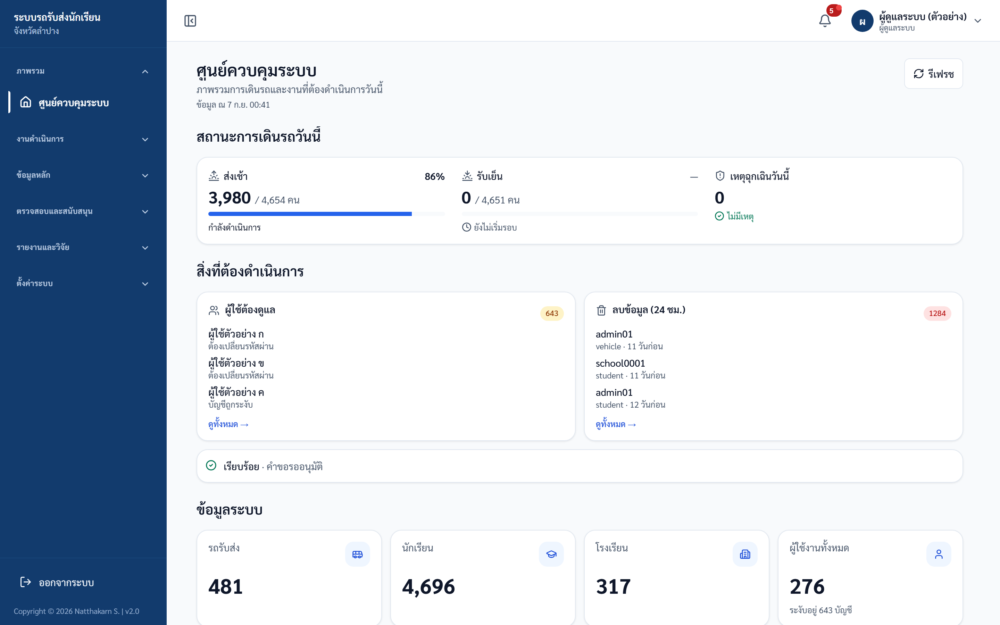
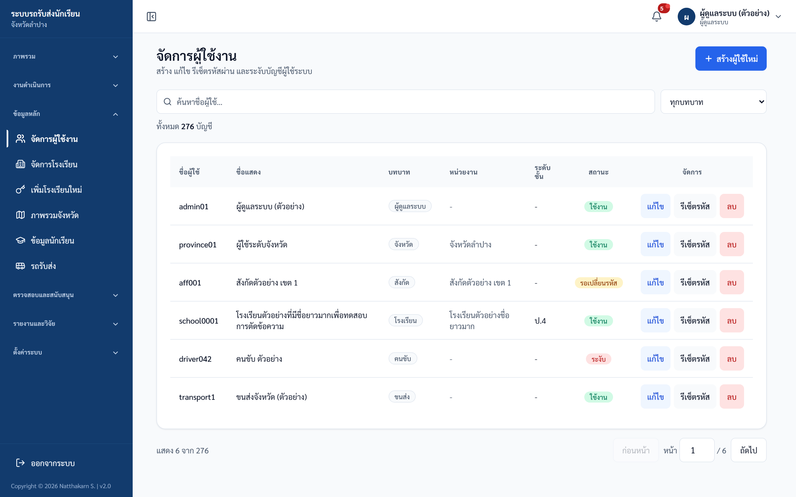
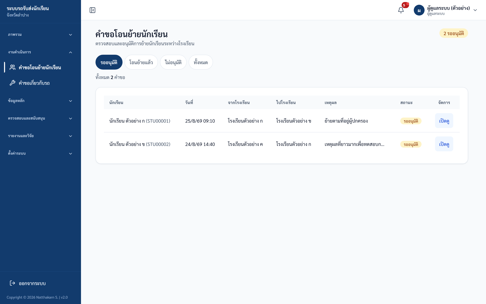
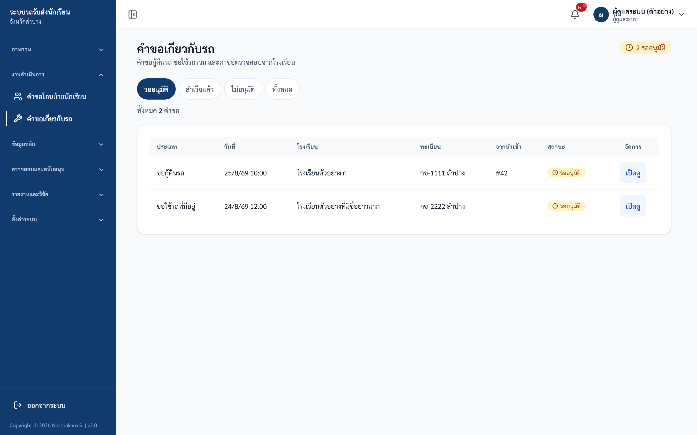
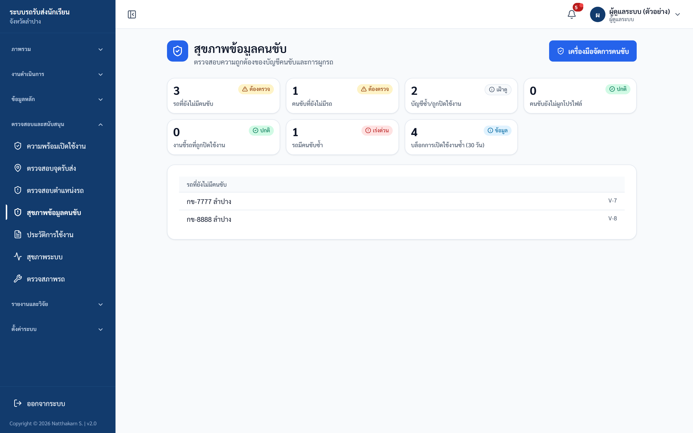
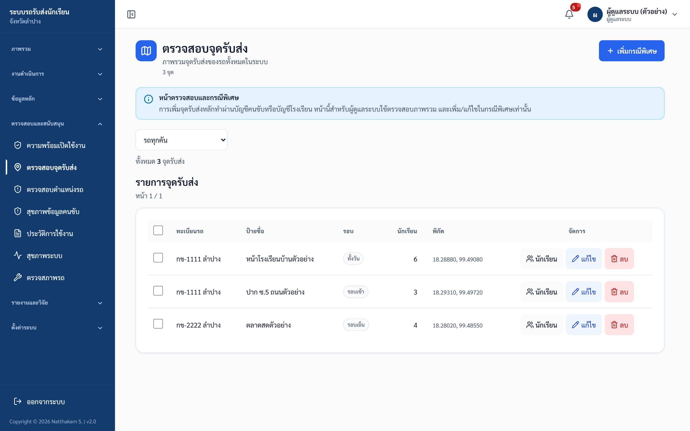
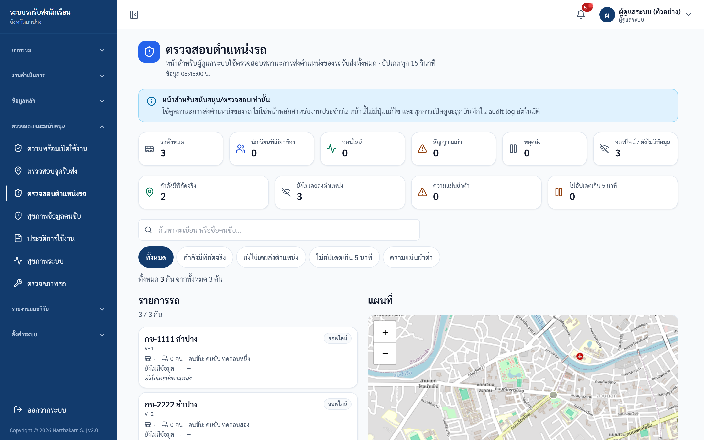
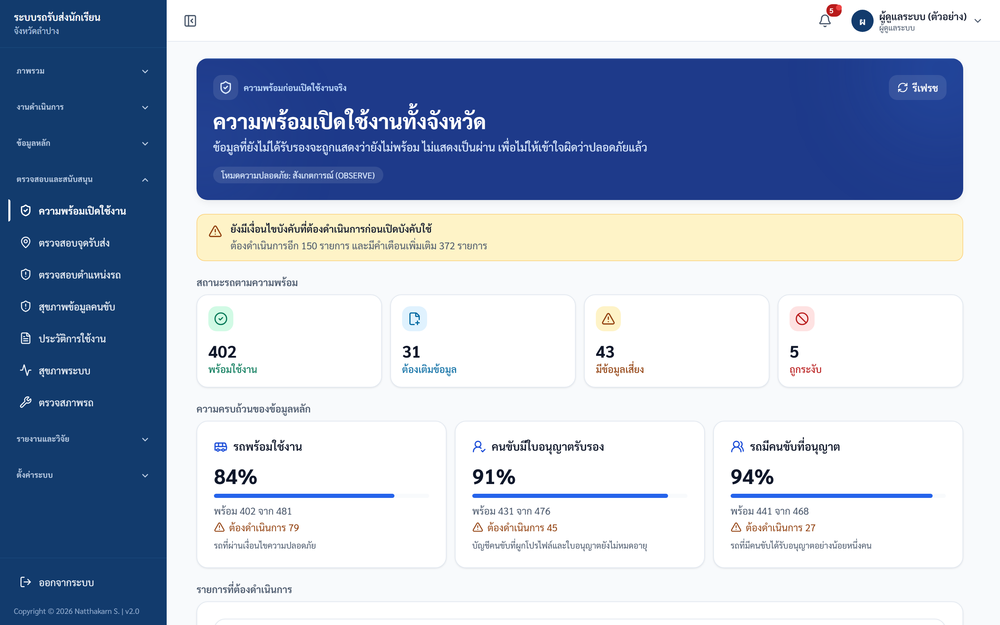
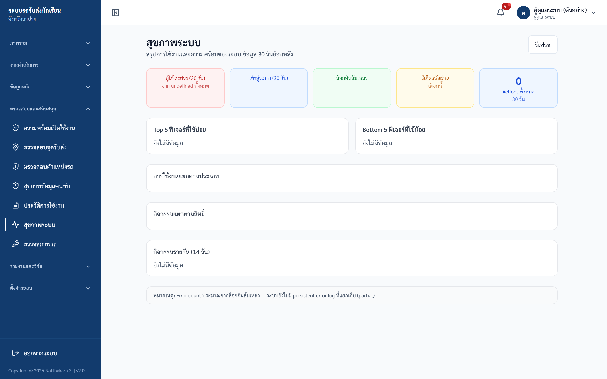
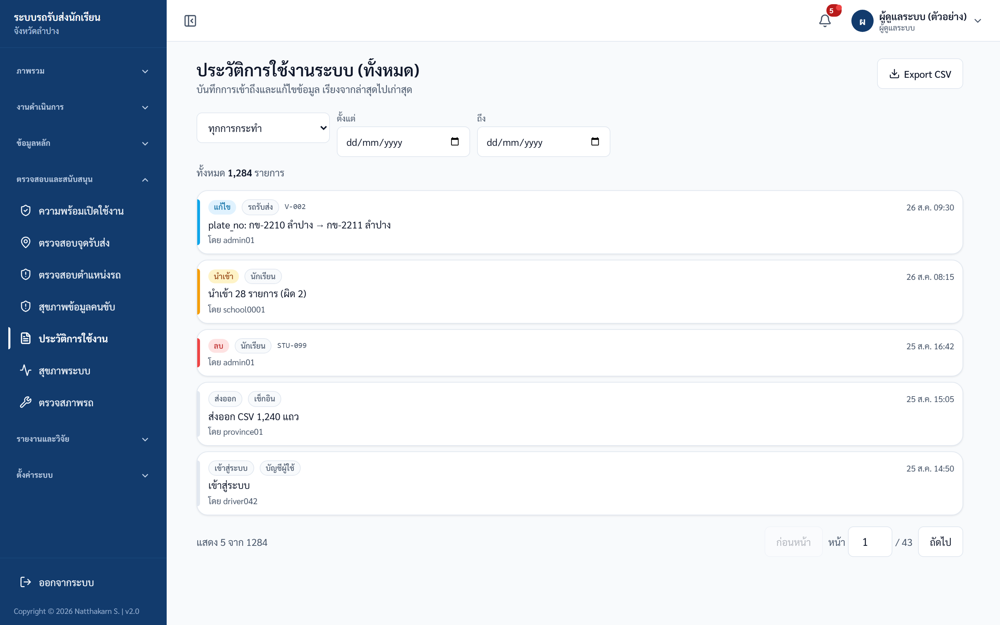

# คู่มือผู้ดูแลระบบ (Admin)

ปรับปรุงล่าสุด 6 กันยายน 2569 (ตรวจกับระบบจริง commit 14caf5b)

## ขอบเขตสิทธิ์

Admin เป็นสิทธิ์สูงสุดของระบบ ใช้สำหรับจัดการบัญชีผู้ใช้ ตรวจสอบ audit log ดู health/readiness และอนุมัติงานสำคัญที่กระทบข้อมูลทั้งระบบ

## เมนูหลัก

| หมวดในแถบเมนู | เมนู | ใช้ทำอะไร |
|---|---|---|
| ภาพรวม | ศูนย์ควบคุมระบบ | สถานะการเดินรถวันนี้ สิ่งที่ต้องดำเนินการ และ KPI ระบบ |
| งานดำเนินการ | คำขอโอนย้ายนักเรียน | อนุมัติ/ไม่อนุมัติคำขอย้ายโรงเรียน |
| งานดำเนินการ | คำขอเกี่ยวกับรถ | ตรวจคำขอกู้คืนรถ / ขอใช้รถที่มีอยู่ (ใช้รถร่วม) / ขอเพิ่มรถ / ขอตรวจสอบ |
| ข้อมูลหลัก | จัดการผู้ใช้งาน | สร้าง แก้ไข รีเซ็ตรหัส ระงับ/ลบบัญชีทุกบทบาท |
| ข้อมูลหลัก | จัดการโรงเรียน | เข้าโมดูลโรงเรียน (ต้องเลือกโรงเรียนจากเมนูด้านบนก่อน) |
| ข้อมูลหลัก | เพิ่มโรงเรียนใหม่ | เข้าโมดูลสังกัดเพื่อสร้างบัญชีโรงเรียน (ต้องเลือกสังกัดจากเมนูด้านบนก่อน) |
| ข้อมูลหลัก | ภาพรวมจังหวัด · ข้อมูลนักเรียน · รถรับส่ง | ดูข้อมูลระดับจังหวัด |
| ตรวจสอบและสนับสนุน | ความพร้อมเปิดใช้งาน | ดูว่าข้อมูลรถและคนขับพร้อมบังคับใช้นโยบายแค่ไหน |
| ตรวจสอบและสนับสนุน | ตรวจสอบจุดรับส่ง | ตรวจภาพรวมและเพิ่ม/แก้ไขจุดกรณีพิเศษ |
| ตรวจสอบและสนับสนุน | ตรวจสอบตำแหน่งรถ | ดูสถานะการส่งตำแหน่งของรถ (หน้าสำหรับตรวจสอบเท่านั้น ไม่แก้ไขข้อมูล) |
| ตรวจสอบและสนับสนุน | สุขภาพข้อมูลคนขับ | ตรวจข้อมูลซ้ำ/ย้าย/กู้คืน/ปิดคนขับ |
| ตรวจสอบและสนับสนุน | ประวัติการใช้งาน | ตรวจ audit log ทั้งระบบและส่งออก CSV |
| ตรวจสอบและสนับสนุน | สุขภาพระบบ | สถิติการใช้งานย้อนหลัง 30 วัน (ไม่ใช่สถานะเซิร์ฟเวอร์หรือฐานข้อมูล) |
| ตรวจสอบและสนับสนุน | ตรวจสภาพรถ | เข้าโมดูลขนส่ง |
| รายงานและวิจัย | กรอบวัดผลระบบ · เปรียบเทียบ Baseline · ส่งออกข้อมูลวิจัย · ประเมินผลแยก Role · สรุปผู้บริหาร · รายงาน | งานวัดผล/วิจัยและรายงานทั้งหมด |
| ตั้งค่าระบบ | ภาคเรียนปัจจุบัน | ตั้งภาคเรียนที่ระบบจะใช้บันทึกการเช็กอิน/การนำเข้า |

> เมนู **จุดเตือนภัย (Geofences)**, **การเบี่ยงเส้นทาง** และ **เรื่องที่ต้องมีส่วนร่วม** ยังไม่เปิดใช้งานบนระบบจริง จึงถูกซ่อนจากแถบเมนู

## 1. ดูศูนย์ควบคุมระบบ

1. เข้าสู่ระบบด้วยบัญชี Admin
2. ระบบเปิดหน้า "ศูนย์ควบคุมระบบ"
3. ดูแถบ "สถานะการเดินรถวันนี้" — ช่อง "ส่งเช้า" และ "รับเย็น" บอกจำนวนที่ทำแล้ว/ทั้งหมด พร้อมแถบความคืบหน้าและคำสถานะ (เช่น "ยังไม่เริ่มรอบ", "กำลังดำเนินการ", "ครบแล้ว") และช่อง "เหตุฉุกเฉินวันนี้"
4. ดูแถบ "สิ่งที่ต้องดำเนินการ" — เรื่องที่มีงานค้างจะขึ้นเป็นการ์ด ("ผู้ใช้ต้องดูแล" / "คำขอรออนุมัติ" / "ลบข้อมูล (24 ชม.)") เรื่องที่ไม่มีงานค้างจะยุบรวมเป็นบรรทัด "เรียบร้อย · …" ส่วนเรื่องที่โหลดข้อมูลไม่สำเร็จจะขึ้นบรรทัด "ไม่ทราบสถานะ · …"
5. ดูแถบ "ข้อมูลระบบ" — KPI 4 ใบ: รถรับส่ง / นักเรียน / โรงเรียน / ผู้ใช้งานทั้งหมด (ถ้ามีบัญชีถูกระงับ จะมีบรรทัด "ระงับอยู่ … บัญชี" ใต้ตัวเลข) แล้วใช้ "ทางลัดบริหาร" ด้านล่างไปยังงานที่ใช้บ่อย

ภาพประกอบ: Dashboard ผู้ดูแลระบบ

## 2. จัดการผู้ใช้งาน

1. เปิดเมนู "จัดการผู้ใช้งาน"
2. ใช้ช่องค้นหา/ตัวกรองบทบาท
3. สร้างผู้ใช้ใหม่โดยกรอก "ชื่อผู้ใช้", "รหัสผ่าน" (เป็นรหัสชั่วคราว ระบบจะบังคับให้ผู้ใช้เปลี่ยนเมื่อเข้าใช้งานครั้งแรก), "บทบาท", "หน่วยงาน" (เฉพาะบทบาทโรงเรียน สังกัด และจังหวัด), "ระดับชั้น (สำหรับครูประจำสายชั้น)" (เฉพาะบทบาทโรงเรียน เมื่อต้องการสร้างบัญชีครูประจำสายชั้น) และ "ชื่อแสดง" (ไม่บังคับ)
   - รหัสผ่านชั่วคราวต้องยาว **อย่างน้อย 8 ตัวอักษร** และไม่เกิน 128 ตัวอักษร ห้ามตรงกับชื่อผู้ใช้ ห้ามใช้รหัสเดาง่าย เช่น 12345678 หรือ password และห้ามใช้ตัวอักษรตัวเดียวซ้ำกันทั้งหมด เช่น aaaaaaaa
   - ข้อความบนหน้าจอยังเขียนว่า "อย่างน้อย 6 ตัวอักษร" (ใต้ช่องรหัสผ่านในหน้าสร้างผู้ใช้) และ "รหัสผ่านใหม่ (อย่างน้อย 6 ตัว)" (ในกล่องรีเซ็ตรหัสผ่าน) ทั้งสองจุดยังไม่ได้แก้ ให้ยึด 8 ตัวอักษรเสมอ ถ้ากรอก 6 ตัว ระบบจะไม่บันทึกและขึ้นข้อความ "รหัสผ่านต้องมีอย่างน้อย 8 ตัวอักษร"
4. รีเซ็ตรหัสผ่านเมื่อผู้ใช้ลืมรหัส
5. ปิดบัญชีเมื่อผู้ใช้พ้นหน้าที่

ภาพประกอบ: ตารางจัดการผู้ใช้งาน

ข้อควรระวัง:
- บัญชีที่สร้างใหม่ต้องเปลี่ยนรหัสผ่านครั้งแรก
- ห้ามสร้างบัญชีร่วมสำหรับหลายคน
- การลบบัญชีเป็น soft delete และมี audit log

## 3. อนุมัติคำขอโอนย้ายนักเรียน

1. เปิดเมนู "คำขอโอนย้ายนักเรียน"
2. ตรวจโรงเรียนต้นทาง/ปลายทางและเหตุผล
3. อนุมัติเฉพาะคำขอที่มีหลักฐานครบ
4. ปฏิเสธพร้อมหมายเหตุเมื่อข้อมูลไม่ชัดเจน

ภาพประกอบ: หน้าคำขอโอนย้ายนักเรียน

## 4. ตรวจคำขอเกี่ยวกับรถ

1. เปิดเมนู "คำขอเกี่ยวกับรถ"
2. ตรวจประเภทคำขอ เช่น กู้คืนรถหรือใช้รถร่วม
3. ตรวจทะเบียนรถ โรงเรียน และสถานะเดิมก่อนอนุมัติ

ภาพประกอบ: หน้าคำขอเกี่ยวกับรถ

## 5. สุขภาพข้อมูลคนขับ

ใช้เมื่อพบข้อมูลคนขับซ้ำ บัญชีคนขับผิดพลาด หรือรถผูกคนขับไม่ถูกต้อง

ภาพประกอบ: หน้าตรวจสุขภาพข้อมูลคนขับ

## 6. ตรวจตำแหน่งรถและจุดรับส่ง

ภาพประกอบ: หน้าจัดการจุดรับส่ง

ภาพประกอบ: หน้าตำแหน่งรถทั้งระบบ

## 7. ตรวจ readiness และ health

ภาพประกอบ: หน้าความพร้อมเปิดใช้งาน

ภาพประกอบ: หน้าสุขภาพระบบ — ภาพนี้ถ่ายตอนข้อมูลตัวอย่างยังโหลดไม่ขึ้น ตัวเลขจึงว่างและมีคำว่า "undefined" บนระบบจริงจะมีตัวเลขครบทุกใบ

## 8. Audit log

1. เปิดเมนู "ประวัติการใช้งาน"
2. กรองด้วยช่องเลือกประเภทการกระทำ (ปกติแสดง "ทุกการกระทำ" เลือกได้เป็น สร้าง / แก้ไข / ลบ / นำเข้า / อนุมัติ / ส่งออก / เข้าสู่ระบบ) และช่วงวันที่ "ตั้งแต่" – "ถึง" — หน้านี้ไม่มีตัวกรองบทบาทหรือรายชื่อผู้ใช้ ให้ดูชื่อผู้ทำรายการจากบรรทัด "โดย …" ที่อยู่ท้ายแต่ละรายการแทน
3. ส่งออก CSV เมื่อมีเหตุผลทางราชการ/การตรวจสอบ

ภาพประกอบ: หน้าประวัติการใช้งาน

## ตรวจรับหลังอบรม Admin

| ข้อ | งานทดสอบ | ผลที่ต้องได้ |
|---|---|---|
| 1 | เปิด dashboard | เห็น KPI ระบบ |
| 2 | ค้นหาผู้ใช้ | ตารางกรองได้ |
| 3 | เปิด transfer requests | เห็นคิว/สถานะ |
| 4 | เปิด vehicle requests | เห็นคิว/สถานะ |
| 5 | เปิด audit log | กรองและ export ได้ตามสิทธิ์ |
| 6 | เปิด "สุขภาพระบบ" | เห็นตัวเลข 5 ใบ (ผู้ใช้ active / เข้าสู่ระบบ / ล็อกอินล้มเหลว / รีเซ็ตรหัสผ่าน / Actions ทั้งหมด) และกด "รีเฟรช" แล้วหน้าโหลดข้อมูลใหม่ได้ — หน้านี้เป็นสถิติการใช้งานย้อนหลัง (ส่วนใหญ่ 30 วัน) ไม่ใช่สถานะเซิร์ฟเวอร์หรือฐานข้อมูล |

