# คู่มือจังหวัด (Province)

ปรับปรุงล่าสุด 6 กันยายน 2569 (ตรวจกับระบบจริง commit 14caf5b)

## ขอบเขตสิทธิ์

จังหวัดเห็นข้อมูลภาพรวมทั้งจังหวัดเป็นหลัก ใช้เพื่อกำกับนโยบาย ติดตามความปลอดภัย ดูรายงาน และตรวจสอบย้อนหลัง แต่ไม่ใช่บทบาทสำหรับแก้ไขข้อมูลรายโรงเรียนโดยตรง

## งานหลัก

| งาน | เมนู/หน้า |
|---|---|
| ดูภาพรวมจังหวัด | `/province` |
| ดูสังกัด | `/province/affiliations` |
| ดูโรงเรียน | `/province/schools` |
| ค้นหานักเรียน | `/province/students` |
| ดูรถรับส่ง | `/province/vehicles` |
| ดูสถานะวันนี้ | `/province/status` — ไม่มีในเมนู ต้องพิมพ์ URL เอง |
| ดูตำแหน่งรถ | `/province/live-vehicles` |
| ดูแผนที่จุดรับส่ง | `/province/pickup-map` |
| ดูเหตุฉุกเฉิน | `/province/emergencies` |
| ดู audit log | `/province/audit-log` |
| ดูความพร้อมเปิดใช้งาน | `/province/readiness` — เมนู "ความพร้อมเปิดใช้งาน" ในกลุ่ม "ตรวจสอบและสนับสนุน" |
| ดู/ส่งออกรายงาน | `/reports/daily` — เมนู "รายงาน" ในกลุ่ม "รายงานและวิจัย" มีแท็บ รายวัน / รายเดือน / สรุปภาพรวม / เชิงนโยบาย (บัญชีจังหวัดเห็นครบทั้ง 4 แท็บ) |

## 1. ภาพรวมจังหวัด

1. เข้าสู่ระบบด้วยบัญชีจังหวัด
2. ตรวจ KPI โรงเรียน นักเรียน รถ และสถานะเช็กชื่อวันนี้
3. ดูโรงเรียนเสี่ยง เหตุฉุกเฉิน และรถที่ต้องติดตาม

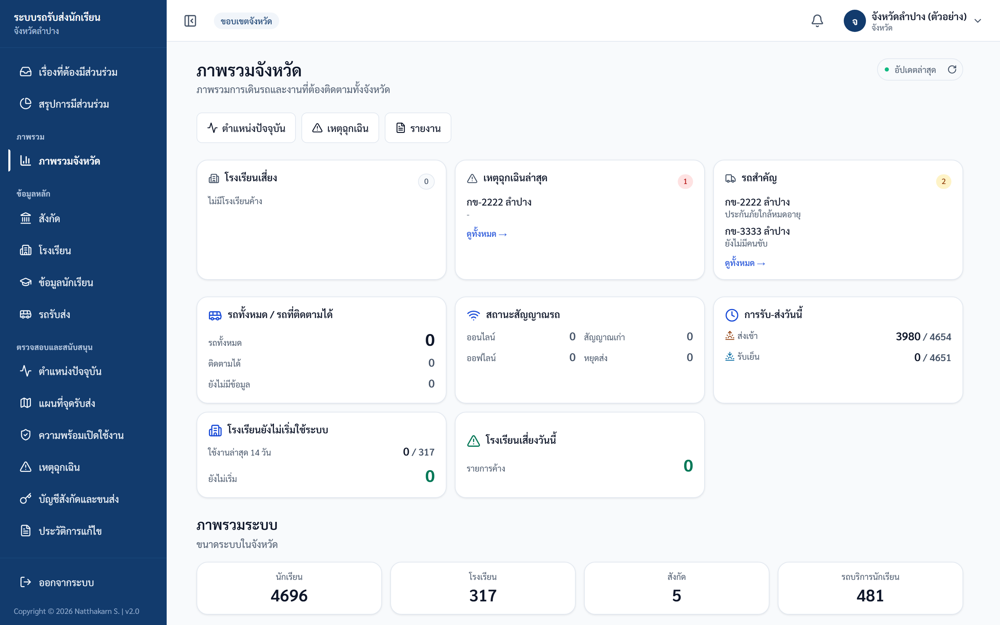

ภาพประกอบ: Dashboard จังหวัด

## 2. ดูสังกัดและโรงเรียน

ใช้ดูความพร้อมและผลการดำเนินงานแยกตามเขต/สังกัด

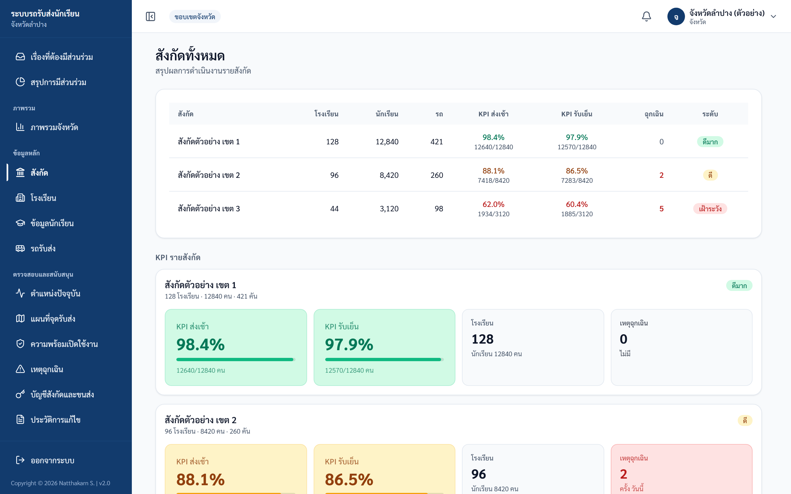

ภาพประกอบ: รายการสังกัด

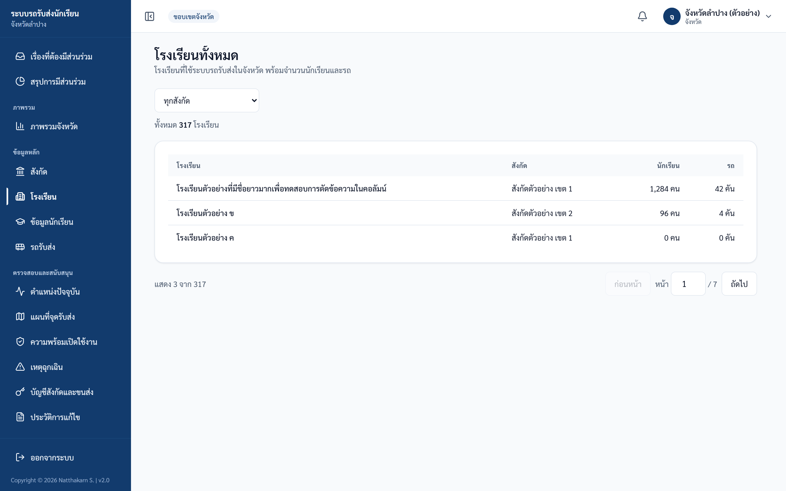

ภาพประกอบ: รายการโรงเรียนทั้งจังหวัด

## 3. ค้นหานักเรียนและรถ

ใช้ค้นหาเพื่อช่วยติดตามสถานการณ์ แต่ต้องเปิดดูเท่าที่จำเป็นตามหน้าที่

หน้า `/province/students` (ข้อมูลนักเรียน)

- ช่องค้นหา: พิมพ์ชื่อ นามสกุล หรือรหัสนักเรียน ระบบจะค้นให้เองหลังหยุดพิมพ์ครู่หนึ่ง ไม่ต้องกดปุ่มค้นหา
- ตัวกรอง 4 ช่อง ใช้ร่วมกันได้: ทุกสถานะการผูกรถ (เลือก ยังไม่ผูกรถ หรือ ผูกรถแล้ว ได้) · ทุกชั้น · ทุกสังกัด · ทุกโรงเรียน เมื่อเลือกสังกัดแล้ว ช่องโรงเรียนจะเหลือเฉพาะโรงเรียนในสังกัดนั้น
- คอลัมน์ที่เห็น: ชื่อ-นามสกุล / ชั้น/ห้อง (แสดงแบบย่อ เช่น ป.4/2) / รหัส / โรงเรียน / สังกัด / ทะเบียนรถ / รอบที่ใช้
- กดที่ทะเบียนรถเพื่อข้ามไปดูรถคันนั้นได้ ถ้านักเรียนยังไม่ผูกรถจะขึ้นว่า ไม่มีรถ ส่วนช่อง รอบที่ใช้ จะขึ้นว่า เช้า · เย็น ตามรอบที่เด็กใช้จริง หรือขึ้นว่า ไม่ใช้บริการ
- บทบาทจังหวัดไม่เห็นชื่อและเบอร์ผู้ปกครองในหน้านี้ เป็นการตั้งใจตามหลักลดการเปิดเผยข้อมูลส่วนบุคคล ถ้าจำเป็นต้องใช้ให้ประสานโรงเรียน

หน้า `/province/vehicles` (รถรับส่งทั้งจังหวัด)

- เห็นชื่อคนขับ ผู้ดูแล และเจ้าของรถ แต่ไม่เห็นเบอร์โทรของทั้งสามคน ด้วยเหตุผลเดียวกัน
- ถ้ากดขยายดูรายชื่อเด็กในรถ ช่อง ผู้ปกครอง และ เบอร์โทร จะว่างเป็น - เสมอสำหรับบัญชีจังหวัด ไม่ใช่ข้อมูลหาย
- หน้านี้แสดงเฉพาะรถที่มีนักเรียนผูกอยู่อย่างน้อย 1 คน ตัวเลข "ทั้งหมด … คัน" จึงเป็นจำนวนรถบริการนักเรียน ไม่ใช่รถทั้งหมดในระบบ

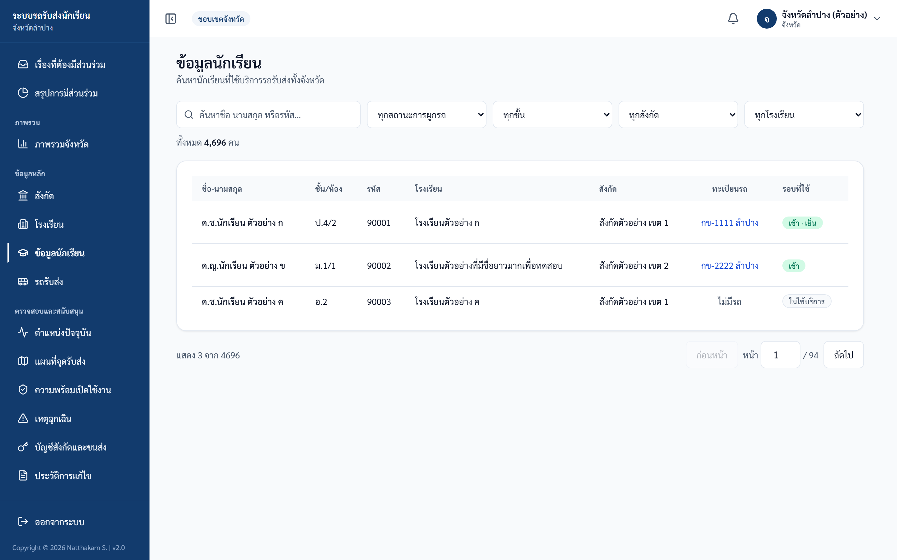

ภาพประกอบ: ค้นหานักเรียนระดับจังหวัด

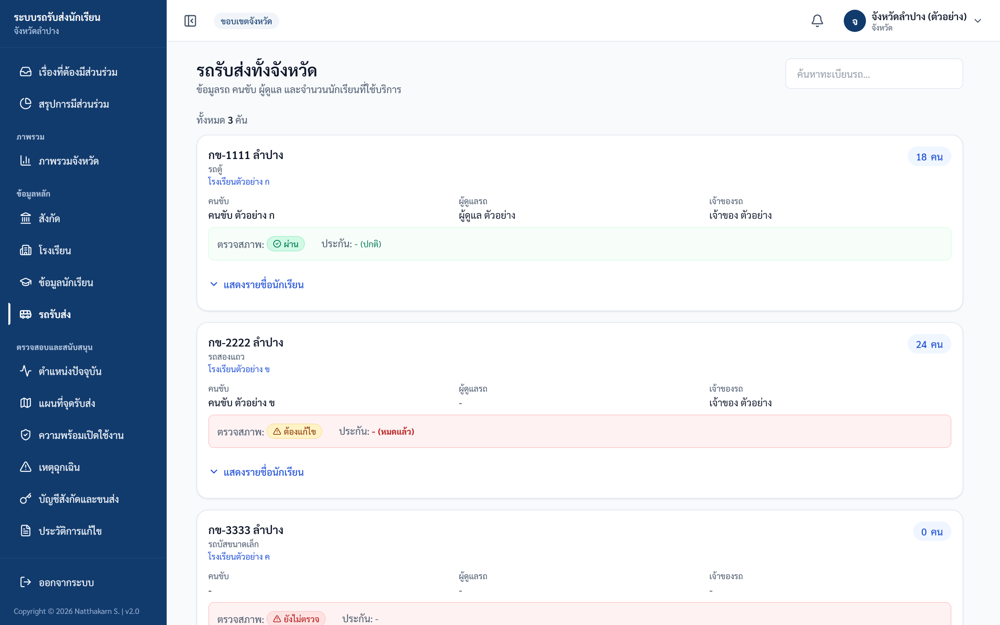

ภาพประกอบ: รายการรถรับส่ง

## 4. สถานะวันนี้

1. เปิดหน้า `/province/status`
2. ขยายจากสังกัดไปโรงเรียน รถ และรายชื่อนักเรียน
3. ใช้เพื่อติดตามรอบเช้า/เย็น

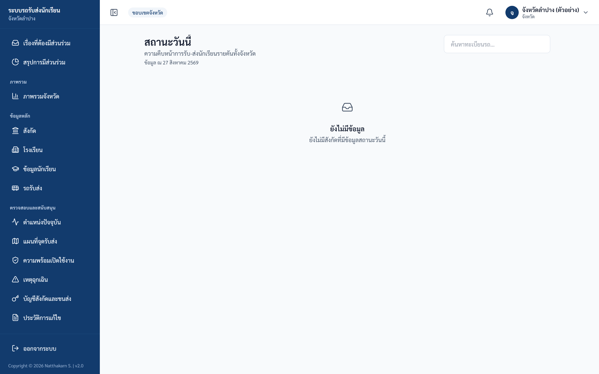

ภาพประกอบ: สถานะรับส่งวันนี้ — กางจากสังกัด ไปโรงเรียน รถ จนถึงรายชื่อนักเรียนและเวลาที่เช็ก (แต่ละรอบแสดงเป็นป้ายข้อความ เรียบร้อย พร้อมเวลา, รอดำเนินการ หรือ ไม่ใช้บริการ) ภาพตัวอย่างนี้ถ่ายในวันที่ยังไม่มีข้อมูล จึงขึ้นว่า ยังไม่มีข้อมูล

## 5. ตำแหน่งรถและจุดรับส่ง

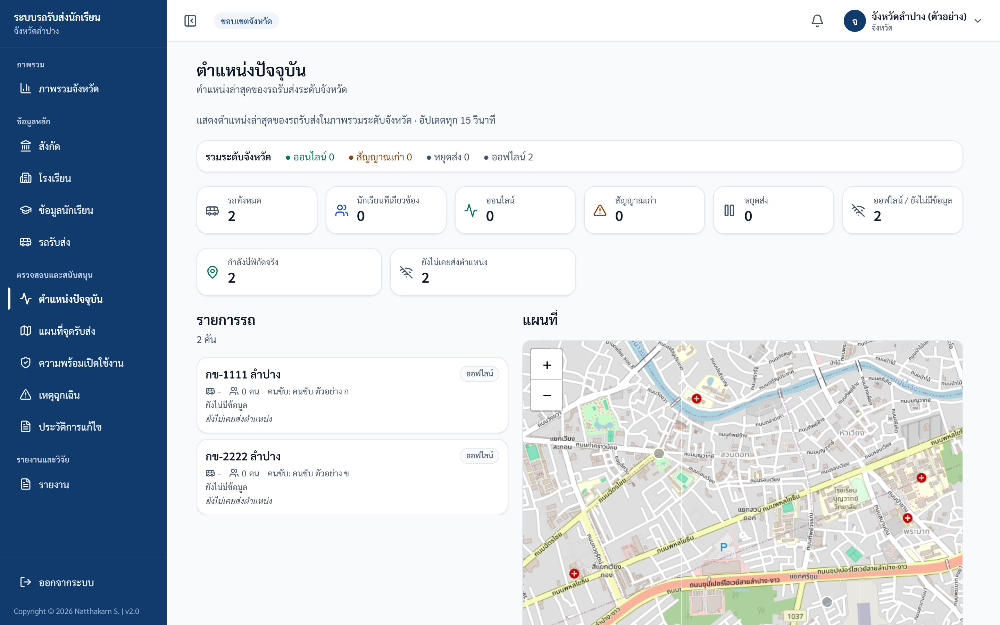

ภาพประกอบ: ตำแหน่งรถปัจจุบัน

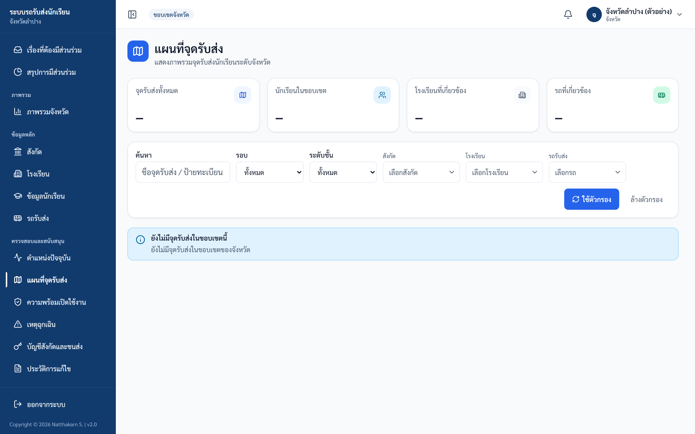

ภาพประกอบ: แผนที่จุดรับส่ง — KPI ภาพรวมและแถบตัวกรอง (ต้องกดปุ่ม ใช้ตัวกรอง จึงจะกรอง) ภาพตัวอย่างนี้ถ่ายจากขอบเขตที่ยังไม่มีจุดรับส่ง จึงยังไม่มีแผนที่ และ KPI แสดงเป็นขีด (—)

## 6. ความพร้อมและเหตุฉุกเฉิน

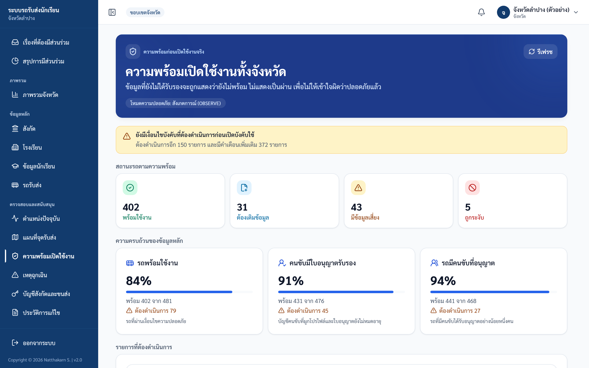

ภาพประกอบ: ความพร้อมเปิดใช้งาน — โหมดความปลอดภัย, 4 ถังสรุป, ความครบถ้วน 3 หมวด และตารางรายการที่ต้องดำเนินการ

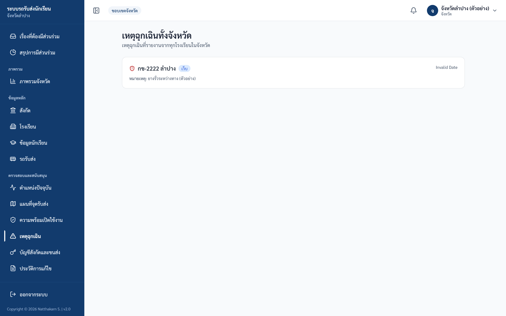

ภาพประกอบ: เหตุฉุกเฉินทั้งจังหวัด — รายการเรียงจากใหม่ไปเก่า (ดูได้อย่างเดียว) ภาพตัวอย่างนี้ช่องวันที่ขึ้นว่า "Invalid Date" เพราะเป็นข้อมูลจำลอง บนระบบจริงจะแสดงวันเวลาที่แจ้งเหตุ

## 7. Audit log

ใช้ตรวจสอบย้อนหลังระดับจังหวัด เมื่อมีการร้องเรียน ตรวจราชการ หรือทบทวนความถูกต้องของข้อมูล

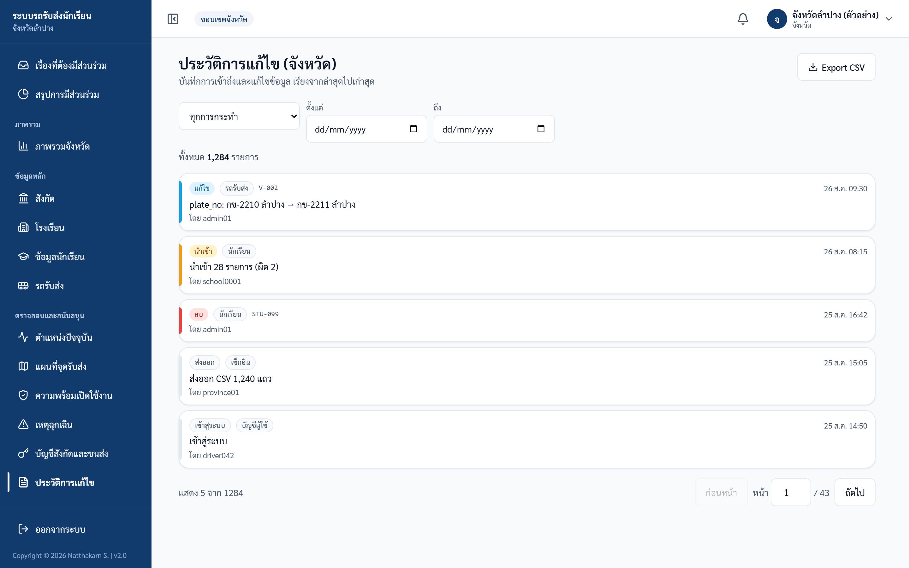

ภาพประกอบ: Audit log จังหวัด

## ตรวจรับหลังอบรม Province

| ข้อ | งานทดสอบ | ผลที่ต้องได้ |
|---|---|---|
| 1 | เปิด dashboard | เห็น KPI จังหวัด |
| 2 | เปิดรายการสังกัด | เห็นสังกัดทั้งหมด |
| 3 | เปิดสถานะวันนี้ | ขยายข้อมูลได้ |
| 4 | เปิด live vehicles | เห็นแผนที่/สถานะสัญญาณ |
| 5 | เปิด audit log | เห็นประวัติและตัวกรอง |

