# คู่มือจังหวัด (Province)

ปรับปรุงล่าสุด 2 ตุลาคม 2569 (ตรวจกับระบบจริง commit fd5d3f9)

## ขอบเขตสิทธิ์

จังหวัดเห็นข้อมูลภาพรวมทั้งจังหวัดเป็นหลัก ใช้เพื่อกำกับนโยบาย ติดตามความปลอดภัย ดูรายงาน และตรวจสอบย้อนหลัง แต่ไม่ใช่บทบาทสำหรับแก้ไขข้อมูลรายโรงเรียนโดยตรง

## งานหลัก

| งาน | เมนู/หน้า |
|---|---|
| ดูภาพรวมจังหวัด | `/province` |
| ดูสังกัด | `/province/affiliations` |
| ดูโรงเรียน | `/province/schools` |
| ค้นหานักเรียน | `/province/students` |
| ดูรถรับส่ง | `/province/vehicles` |
| ดูสถานะวันนี้ | `/province/status` — ไม่มีในเมนู ต้องพิมพ์ URL เอง |
| ดูตำแหน่งรถ | `/province/live-vehicles` |
| ดูแผนที่จุดรับส่ง | `/province/pickup-map` |
| ดูเหตุฉุกเฉิน | `/province/emergencies` |
| ดู audit log | `/province/audit-log` — เมนู เพิ่มเติม › "ประวัติการแก้ไข" |
| ดูความพร้อมเปิดใช้งาน | `/province/readiness` — เมนู เพิ่มเติม › "ความพร้อมเปิดใช้งาน" |
| **ดูเรื่องที่ต้องมีส่วนร่วม** | `/participation` — เมนู เพิ่มเติม › "เรื่องที่ต้องมีส่วนร่วม" **เปิดใช้งานแล้วตั้งแต่ 7 กันยายน 2569** |
| **รีเซ็ตรหัสผ่านบัญชีสังกัดและขนส่ง** | `/province/unit-accounts` — เมนู เพิ่มเติม › "บัญชีสังกัดและขนส่ง" **ใช้ได้ตั้งแต่ 7 กันยายน 2569** |
| ดูความปลอดภัยบัญชีของตนเอง | `/account/security` — เมนู "ความปลอดภัยบัญชี" (ดูข้อ 10) |
| ดู/ส่งออกรายงาน | `/reports/daily` — เมนู "รายงาน" มีแท็บ รายวัน / รายเดือน / สรุปภาพรวม / เชิงนโยบาย (บัญชีจังหวัดเห็นครบทั้ง 4 แท็บ) |

> **แถบเมนูด้านข้าง (ปรับใหม่ 2 ต.ค. 2569):** เมนูที่ใช้ทุกวันอยู่ด้านบน — ภาพรวมจังหวัด, สังกัด, โรงเรียน, ข้อมูลนักเรียน, รถรับส่ง, ตำแหน่งปัจจุบัน, แผนที่จุดรับส่ง, เหตุฉุกเฉิน, รายงาน ส่วนเมนูอื่นพับไว้ใต้ "เพิ่มเติม" — ความพร้อมเปิดใช้งาน, การเบี่ยงเส้นทาง (เมื่อเปิดใช้), บัญชีสังกัดและขนส่ง, ประวัติการแก้ไข, เรื่องที่ต้องมีส่วนร่วม, สรุปการมีส่วนร่วม

> **ภาคเรียนที่ 2 (ตั้งแต่ 12 ต.ค. 2569):** ครูประจำสายชั้นเช็กชื่อขึ้น-ลงรถเองได้ (เช้า = ถึงโรงเรียน, เย็น = ขึ้นรถกลับบ้าน) ควบคู่กับคนขับ ใครบันทึกก่อนนับก่อน ตัวเลขที่เห็นจึงรวมรายการที่ครูบันทึกด้วย

## 1. ภาพรวมจังหวัด

1. เข้าสู่ระบบด้วยบัญชีจังหวัด
2. แถวตัวเลขขนาดระบบด้านบน: นักเรียน · โรงเรียน · สังกัด · รถรับส่ง
3. **แถบสรุปวันนี้** — ประโยคเดียว เช่น "ภาพรวมวันนี้ปกติ" หรือ "ยังรอส่ง-รับอีก N คน" พร้อมปุ่มไปหน้าที่เกี่ยวข้อง
4. **ต้องทำวันนี้** — การ์ดไม่เกิน 3 ใบ เช่น รถต้องแก้เอกสาร เรื่องใหม่จากการมีส่วนร่วม โรงเรียนยังไม่เริ่มใช้ระบบ
5. **ตัวชี้วัด 4 ช่อง** — ส่งเช้า, รับเย็น, โรงเรียนที่ใช้งาน (14 วัน), เหตุฉุกเฉิน 7 วัน พร้อมป้ายคำ เรียบร้อย (≥95%) / รอติดตาม (85–94%) / ต้องรีบ (<85%) / ข้อมูล / ยังไม่เริ่ม
6. **กราฟ** — การรับส่งทั้งจังหวัด 7 วันล่าสุด และส่งเช้าแยกตามสังกัด (เรียงจากน้อยไปมาก)
7. **รายละเอียด (พับไว้)** — สัญญาณรถ (GPS), โรงเรียนที่ยังรอรับส่ง, สรุปรายสังกัด, รถที่ต้องติดตาม, เหตุฉุกเฉินล่าสุด

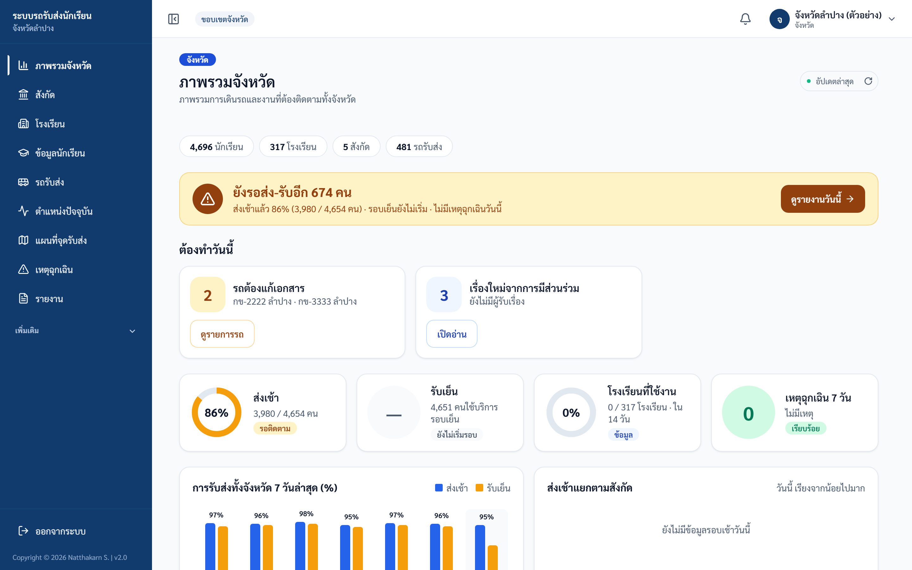

ภาพประกอบ: Dashboard จังหวัด

## 2. ดูสังกัดและโรงเรียน

ใช้ดูความพร้อมและผลการดำเนินงานแยกตามเขต/สังกัด

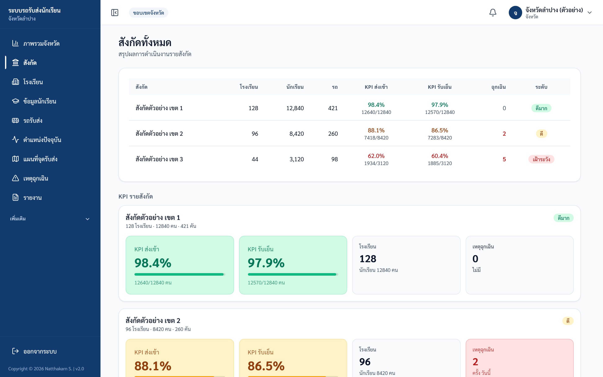

ภาพประกอบ: รายการสังกัด

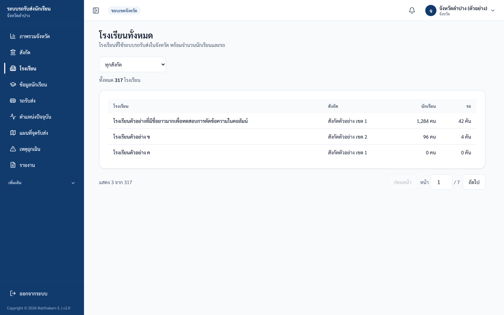

ภาพประกอบ: รายการโรงเรียนทั้งจังหวัด

## 3. ค้นหานักเรียนและรถ

ใช้ค้นหาเพื่อช่วยติดตามสถานการณ์ แต่ต้องเปิดดูเท่าที่จำเป็นตามหน้าที่

หน้า `/province/students` (ข้อมูลนักเรียน)

- ช่องค้นหา: พิมพ์ชื่อ นามสกุล หรือรหัสนักเรียน ระบบจะค้นให้เองหลังหยุดพิมพ์ครู่หนึ่ง ไม่ต้องกดปุ่มค้นหา
- ตัวกรอง 4 ช่อง ใช้ร่วมกันได้: ทุกสถานะการผูกรถ (เลือก ยังไม่ผูกรถ หรือ ผูกรถแล้ว ได้) · ทุกชั้น · ทุกสังกัด · ทุกโรงเรียน เมื่อเลือกสังกัดแล้ว ช่องโรงเรียนจะเหลือเฉพาะโรงเรียนในสังกัดนั้น
- คอลัมน์ที่เห็น: ชื่อ-นามสกุล / ชั้น/ห้อง (แสดงแบบย่อ เช่น ป.4/2) / รหัส / โรงเรียน / สังกัด / ทะเบียนรถ / รอบที่ใช้
- กดที่ทะเบียนรถเพื่อข้ามไปดูรถคันนั้นได้ ถ้านักเรียนยังไม่ผูกรถจะขึ้นว่า ไม่มีรถ ส่วนช่อง รอบที่ใช้ จะขึ้นว่า เช้า · เย็น ตามรอบที่เด็กใช้จริง หรือขึ้นว่า ไม่ใช้บริการ
- บทบาทจังหวัดไม่เห็นชื่อและเบอร์ผู้ปกครองในหน้านี้ เป็นการตั้งใจตามหลักลดการเปิดเผยข้อมูลส่วนบุคคล ถ้าจำเป็นต้องใช้ให้ประสานโรงเรียน

หน้า `/province/vehicles` (รถรับส่งทั้งจังหวัด)

- เห็นชื่อคนขับ ผู้ดูแล และเจ้าของรถ แต่ไม่เห็นเบอร์โทรของทั้งสามคน ด้วยเหตุผลเดียวกัน
- ถ้ากดขยายดูรายชื่อเด็กในรถ ช่อง ผู้ปกครอง และ เบอร์โทร จะว่างเป็น - เสมอสำหรับบัญชีจังหวัด ไม่ใช่ข้อมูลหาย
- หน้านี้แสดงเฉพาะรถที่มีนักเรียนผูกอยู่อย่างน้อย 1 คน ตัวเลข "ทั้งหมด … คัน" จึงเป็นจำนวนรถบริการนักเรียน ไม่ใช่รถทั้งหมดในระบบ

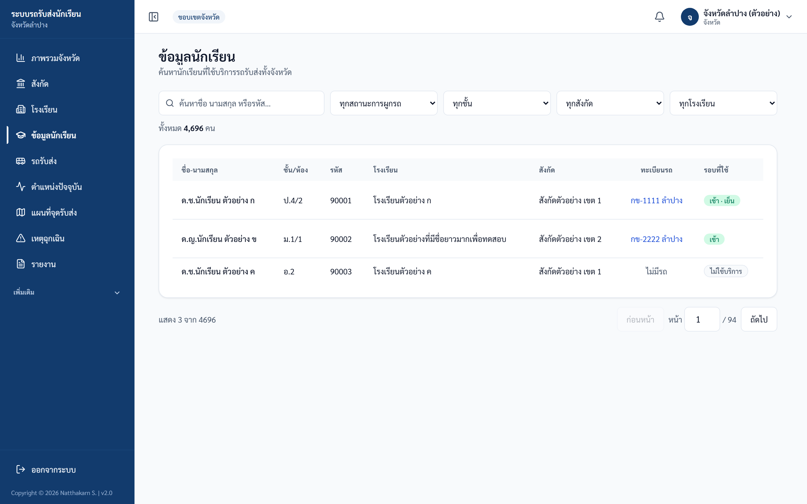

ภาพประกอบ: ค้นหานักเรียนระดับจังหวัด

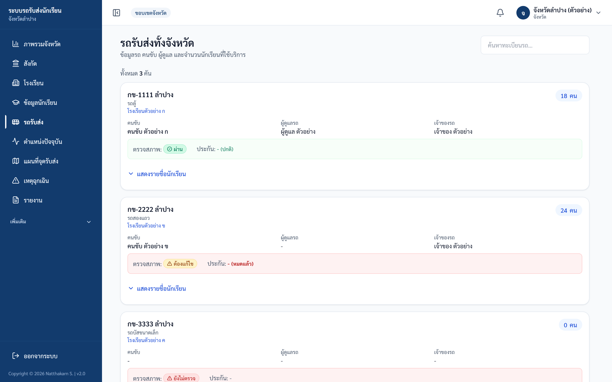

ภาพประกอบ: รายการรถรับส่ง

## 4. สถานะวันนี้

1. เปิดหน้า `/province/status`
2. ขยายจากสังกัดไปโรงเรียน รถ และรายชื่อนักเรียน
3. ใช้เพื่อติดตามรอบเช้า/เย็น

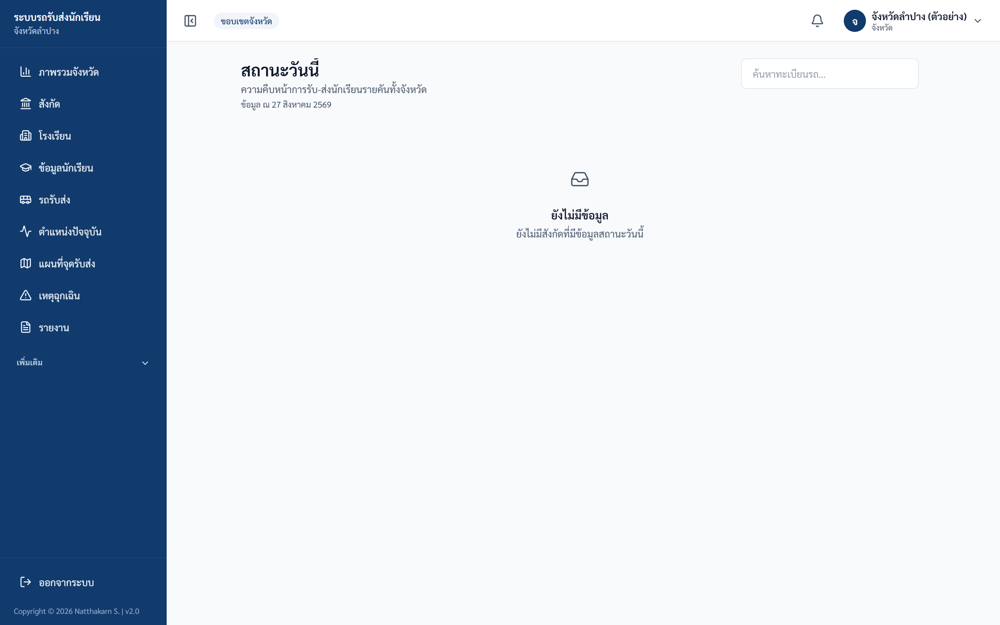

ภาพประกอบ: สถานะรับส่งวันนี้ — กางจากสังกัด ไปโรงเรียน รถ จนถึงรายชื่อนักเรียนและเวลาที่เช็ก (แต่ละรอบแสดงเป็นป้ายข้อความ เรียบร้อย พร้อมเวลา, รอดำเนินการ หรือ ไม่ใช้บริการ) ภาพตัวอย่างนี้ถ่ายในวันที่ยังไม่มีข้อมูล จึงขึ้นว่า ยังไม่มีข้อมูล

## 5. ตำแหน่งรถและจุดรับส่ง

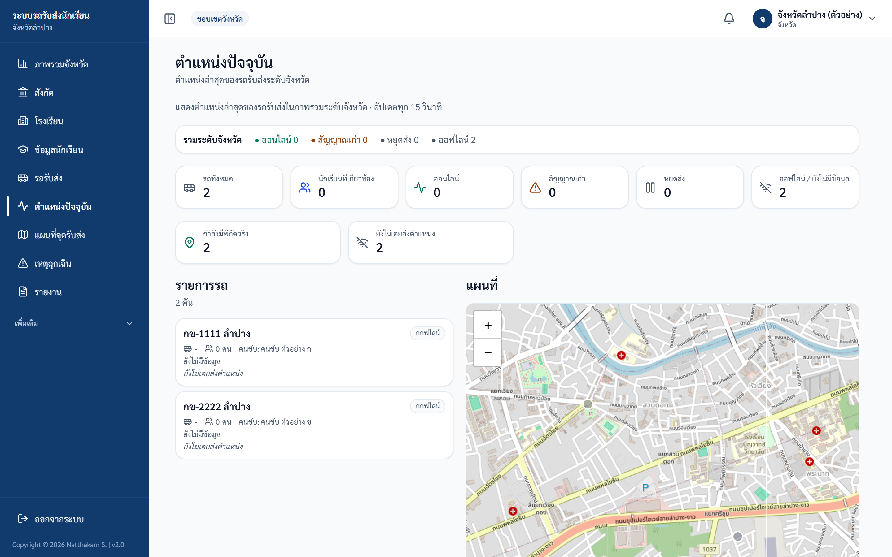

ภาพประกอบ: ตำแหน่งรถปัจจุบัน

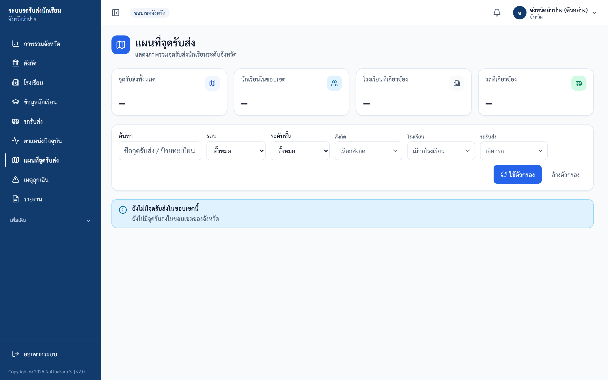

ภาพประกอบ: แผนที่จุดรับส่ง — KPI ภาพรวมและแถบตัวกรอง (ต้องกดปุ่ม ใช้ตัวกรอง จึงจะกรอง) ภาพตัวอย่างนี้ถ่ายจากขอบเขตที่ยังไม่มีจุดรับส่ง จึงยังไม่มีแผนที่ และ KPI แสดงเป็นขีด (—)

## 6. ความพร้อมและเหตุฉุกเฉิน

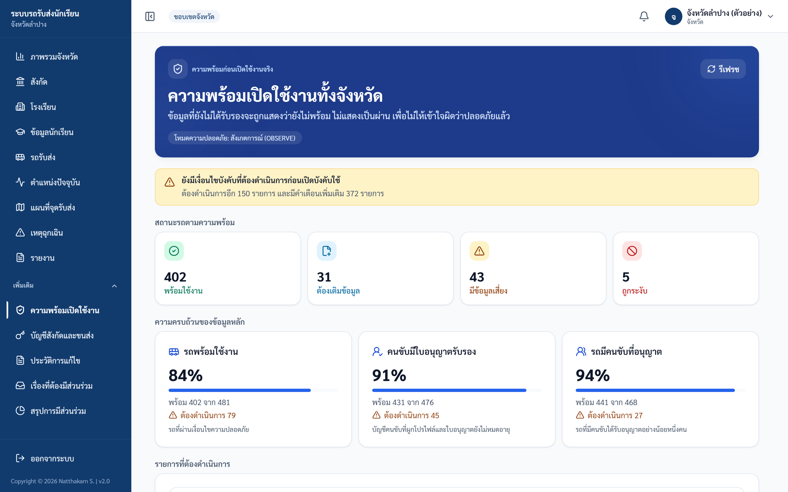

ภาพประกอบ: ความพร้อมเปิดใช้งาน — โหมดความปลอดภัย, 4 ถังสรุป, ความครบถ้วน 3 หมวด และตารางรายการที่ต้องดำเนินการ

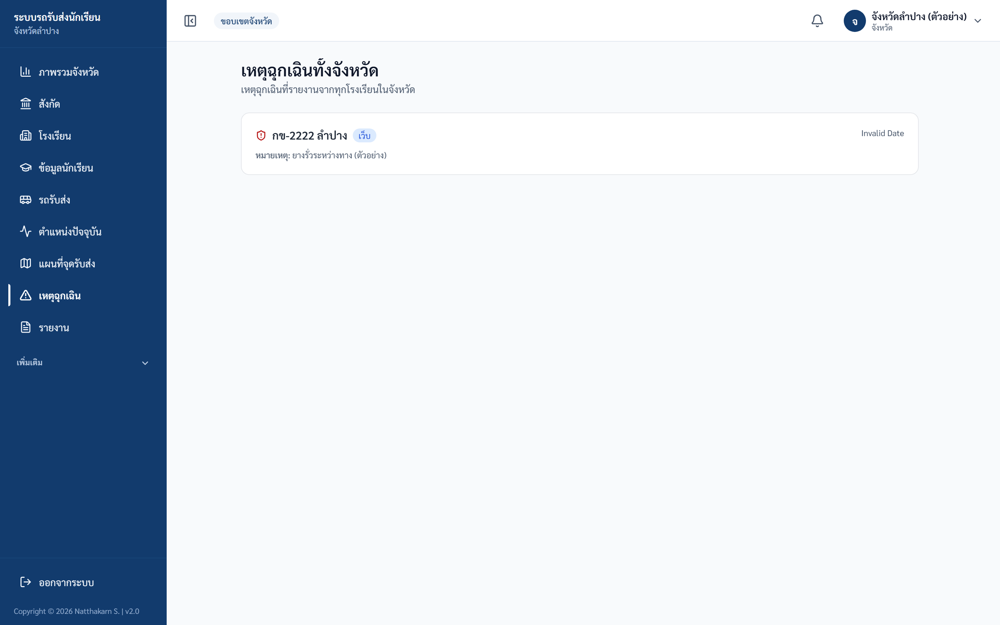

ภาพประกอบ: เหตุฉุกเฉินทั้งจังหวัด — รายการเรียงจากใหม่ไปเก่า (ดูได้อย่างเดียว) ภาพตัวอย่างนี้ช่องวันที่ขึ้นว่า "Invalid Date" เพราะเป็นข้อมูลจำลอง บนระบบจริงจะแสดงวันเวลาที่แจ้งเหตุ

## 7. Audit log

ใช้ตรวจสอบย้อนหลังระดับจังหวัด เมื่อมีการร้องเรียน ตรวจราชการ หรือทบทวนความถูกต้องของข้อมูล

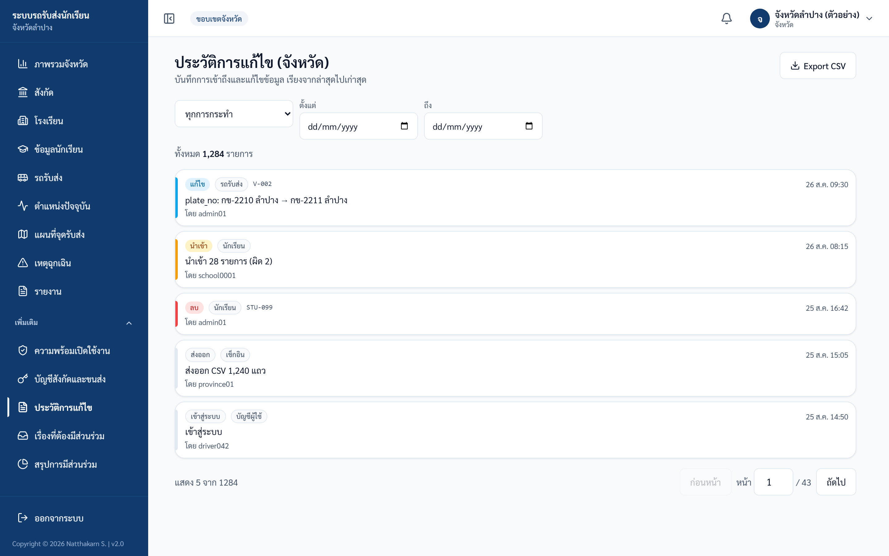

ภาพประกอบ: Audit log จังหวัด

## 8. เรื่องที่ต้องมีส่วนร่วม (เปิดใช้ 7 กันยายน 2569)

**บัญชีจังหวัดเห็นทุกเรื่องทั้งจังหวัด** ไม่ใช่เฉพาะเรื่องที่ส่งถึงตน ผู้เสนอเรื่องอาจเป็นโรงเรียน สังกัด ขนส่ง หรือคนขับ

เจ้าของโครงการกำหนดให้สภาองค์กรของผู้บริโภค ซึ่งถือบัญชีระดับจังหวัด เป็นผู้รับเรื่อง **เป็นข้อตกลงของหน่วยงาน ไม่ใช่สิ่งที่โปรแกรมบังคับ** ระบบไม่ได้กำหนดผู้รับเรื่องไว้ในโค้ด ทุกบทบาทที่เห็นเรื่องนั้นกดรับเรื่องได้เหมือนกัน

> **ข้อสำคัญที่สุดของหัวข้อนี้ — ระบบไม่แจ้งเตือนเมื่อมีเรื่องใหม่**
> ไม่มีอีเมล ไม่มีข้อความ LINE ไม่มีตัวเลขแดงบนเมนู ผู้รับเรื่องต้องเข้ามาเปิดดูเอง
> จึงควรตกลงกันว่าจะเปิดดูสัปดาห์ละกี่ครั้ง และใครเป็นผู้เปิด แล้วทำตามนั้นจริง

### 8.1 เปิดดูและคัดกรอง

1. เปิดเมนู **"เรื่องที่ต้องมีส่วนร่วม"** ระบบเปิดที่ตัวกรอง **"ที่ยังไม่จบ"** ให้อัตโนมัติ คือเรื่องที่ยังมีคนต้องทำอะไรต่อ
2. เลือกตัวกรอง **ประเภท** ได้ 6 แบบ คือ ข้อเสนอเชิงนโยบาย · ปัญหาการให้บริการ · ข้อกังวลด้านความปลอดภัย · คุณภาพข้อมูล · ขอทรัพยากรสนับสนุน · อื่น ๆ
3. คลิกที่แถวเพื่อเปิดรายละเอียดและประวัติของเรื่องนั้น

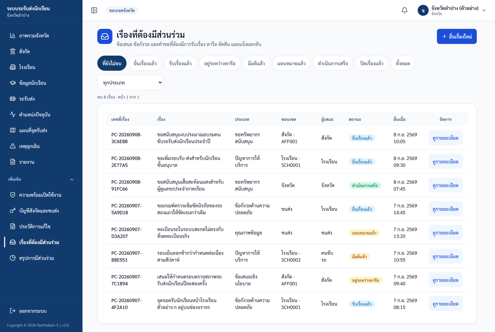

ภาพประกอบ: รายการเรื่องของบัญชีจังหวัด — เห็นทุกขอบเขต ทั้งโรงเรียน สังกัด จังหวัด และขนส่ง ตัวกรองตั้งต้นคือ "ที่ยังไม่จบ" ซึ่งซ่อนเรื่องที่ปิดและถอนแล้ว

### 8.2 สถานะของเรื่อง อ่านอย่างไร

| สถานะบนหน้าจอ | หมายความว่า |
|---|---|
| ยื่นเรื่องแล้ว | ยังไม่มีใครรับ — **นี่คือสถานะที่ต้องรีบดูที่สุด** |
| รับเรื่องแล้ว | มีผู้รับแล้ว แต่ยังไม่ได้หารือหรือมีมติ |
| อยู่ระหว่างหารือ | เปิดหารือแล้ว |
| มีมติแล้ว | ตัดสินแล้ว แต่ยังไม่ได้มอบหมายหรือยังไม่เสร็จ |
| มอบหมายแล้ว | มีผู้รับผิดชอบแล้ว |
| ดำเนินการเสร็จ | ทำเสร็จแล้ว แต่ **ยังไม่ได้แจ้งผู้เสนอ** |
| ปิดเรื่องแล้ว | แจ้งผลกลับผู้เสนอเรียบร้อย จบกระบวนการ |
| ถอนเรื่อง | ยุติเรื่องโดยไม่ดำเนินการต่อ · **ไม่ใช่เฉพาะผู้เสนอที่ถอนได้** ทุกบทบาทที่เห็นเรื่องนั้นถอนได้ และถอนแล้วย้อนกลับไม่ได้ |

### 8.3 ลำดับของเรื่อง และข้อที่ระบบบังคับจริง

ลำดับที่ **ควร** เป็นคือ

**ยื่นเรื่อง → รับเรื่อง → (ให้ความเห็น / เปิดหารือ) → บันทึกมติ → มอบหมายผู้รับผิดชอบ → ดำเนินการเสร็จ → แจ้งผลกลับผู้เสนอ**

แต่ต้องเข้าใจให้ตรงว่า **ระบบไม่ได้บังคับทุกขั้น** สิ่งที่ระบบบังคับจริงมีข้อเดียว คือ

> **"แจ้งผลกลับผู้เสนอ" กดได้ก็ต่อเมื่อสถานะเป็น "ดำเนินการเสร็จ" แล้วเท่านั้น**

นอกจากข้อนั้น ระบบยอมให้ข้ามขั้นได้ เช่น จากยื่นเรื่องไปบันทึกมติเลยโดยไม่ต้องรับเรื่องก่อน จากรับเรื่องไปมอบหมายเลยโดยไม่ต้องมีมติ หรือจากมีมติไปดำเนินการเสร็จเลยโดยไม่ต้องมอบหมาย เรื่องหนึ่งจึงปิดได้โดยไม่เคยผ่านขั้น "รับเรื่อง" หรือ "มอบหมาย" เลย **การเดินให้ครบขั้นเป็นวินัยของผู้ใช้ ไม่ใช่สิ่งที่โปรแกรมกำกับให้**

- **บันทึกมติ** ต้องเลือกผลอย่างใดอย่างหนึ่ง คือ เห็นชอบ / ไม่เห็นชอบ / ชะลอไว้ก่อน / ไม่ต้องดำเนินการ **และต้องพิมพ์เหตุผลเสมอ** ระบบไม่ให้บันทึกมติที่ไม่มีเหตุผล
- **ให้ความเห็น ไม่เปลี่ยนสถานะของเรื่อง** ใช้บันทึกความเห็นระหว่างทางเท่านั้น ถ้ากดแล้วสถานะไม่ขยับ นั่นคือทำงานถูกต้องแล้ว ส่วน **เปิดหารือ** จะเปลี่ยนสถานะเป็น "อยู่ระหว่างหารือ"
- **แจ้งผลกลับผู้เสนอ** ต้องพิมพ์ว่าแจ้งอะไรกลับไป ข้อนี้เป็นหัวใจของทั้งเรื่อง เพราะเป็นร่องรอยว่ามีการตอบกลับผู้เสนอ **แต่เป็นข้อความที่ผู้บันทึกพิมพ์เอง ระบบไม่ได้ตรวจสอบว่าแจ้งไปจริงหรือไม่**

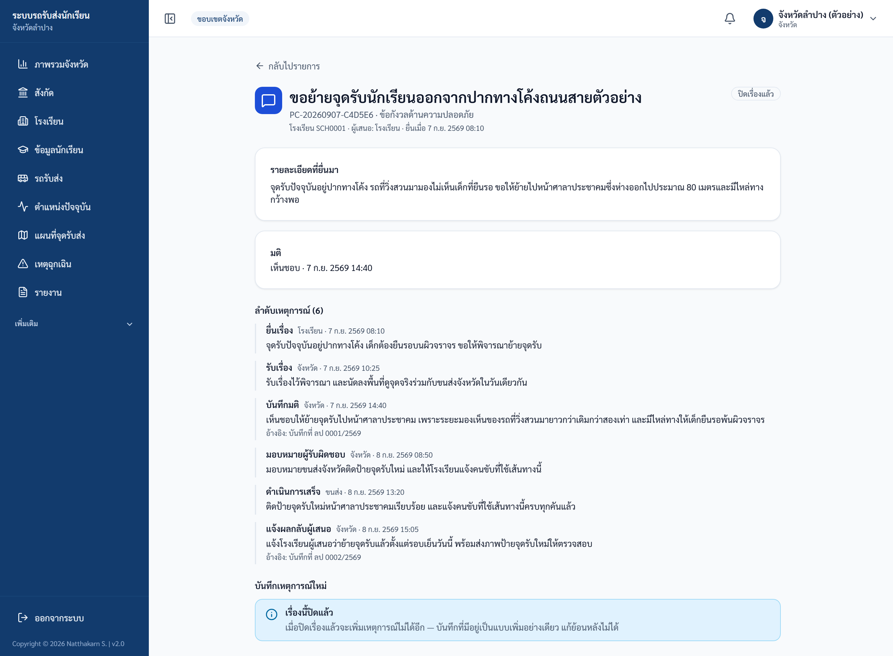

ภาพประกอบ: หน้ารายละเอียดของเรื่องที่เดินครบทั้งวง — ยื่นเรื่อง / รับเรื่อง / บันทึกมติพร้อมเหตุผล / มอบหมายผู้รับผิดชอบ / ดำเนินการเสร็จ / แจ้งผลกลับผู้เสนอ เมื่อแจ้งผลกลับแล้วสถานะเป็น "ปิดเรื่องแล้ว" และเพิ่มเหตุการณ์ไม่ได้อีก

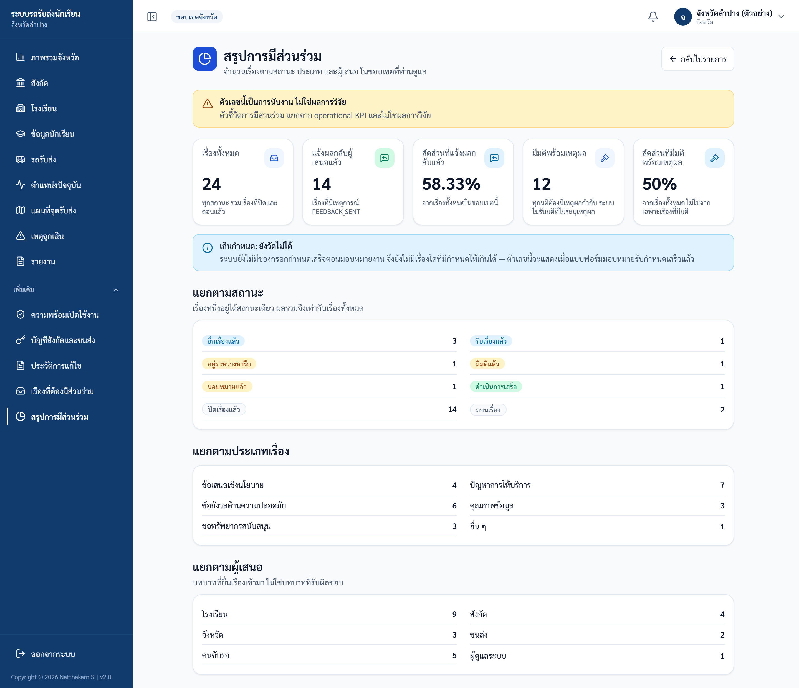

ภาพประกอบ: หน้า "สรุปการมีส่วนร่วม" — ตัวเลขนับงาน ไม่ใช่ผลการวิจัย และช่อง "เกินกำหนด" บอกตรง ๆ ว่ายังวัดไม่ได้ เพราะฟอร์มมอบหมายงานไม่มีช่องกรอกกำหนดเสร็จ

### 8.4 ข้อจำกัดที่ต้องรู้ก่อนใช้งานจริง

- **ทุกเหตุการณ์ลบไม่ได้และแก้ไม่ได้** ระบบออกแบบให้บันทึกเพิ่มได้อย่างเดียว พิมพ์ผิดต้องเพิ่มความเห็นใหม่เพื่อแก้ ไม่ใช่ลบของเดิม
- **เรื่องที่มอบหมายไปแล้ว เปลี่ยนตัวผู้รับผิดชอบไม่ได้** ยังไม่รองรับในรุ่นนี้
- **ตัวกรองไม่มีชิป "ถอนเรื่อง"** เรื่องที่ถูกถอนจะเห็นได้ที่ตัวกรอง "ทั้งหมด" เท่านั้น
- **ยื่นเรื่องเดียวกันสองครั้งจะได้สองเรื่อง** ระบบยังไม่มีการกันยื่นซ้ำ
- **ผู้ปกครองยื่นเรื่องเองไม่ได้** ยังไม่เปิดช่องทางนี้ ต้องแจ้งผ่านโรงเรียนหรือคนขับ
- **ห้ามพิมพ์ชื่อนักเรียน เลขบัตรประชาชน หรือเบอร์โทรลงในช่องข้อความ** ระบบไม่มีช่องสำหรับข้อมูลเหล่านี้โดยตั้งใจ และผู้ใช้หลายบทบาทเห็นข้อความที่พิมพ์ไว้

## 9. บัญชีสังกัดและขนส่ง (ใช้ได้ตั้งแต่ 7 กันยายน 2569)

จังหวัดตั้งรหัสผ่านใหม่ให้ **บัญชีสังกัดและบัญชีขนส่ง** ได้เอง เมื่อผู้ถือบัญชีลืมรหัสผ่าน โดยไม่ต้องรอผู้ดูแลระบบ

1. เปิดเมนู **"บัญชีสังกัดและขนส่ง"**
2. ตารางแสดง ชื่อบัญชี · ประเภท (สังกัด/ขนส่ง) · ชื่อผู้ใช้ · วันที่เข้าใช้ล่าสุด (หรือ "ยังไม่เคยเข้าระบบ") · สถานะใช้งาน
3. กดปุ่ม **"รีเซ็ตรหัส"** ที่แถวของบัญชีนั้น
4. กรอกรหัสผ่านใหม่และยืนยันให้ตรงกัน **อย่างน้อย 8 ตัวอักษร** และต้องไม่ซ้ำกับชื่อผู้ใช้
5. เมื่อสำเร็จ ระบบขึ้นข้อความว่า *"รีเซ็ตรหัสผ่านสำเร็จ — ผู้ใช้ต้องตั้งรหัสใหม่เมื่อเข้าสู่ระบบครั้งถัดไป"*

**สิ่งที่ต้องระวัง**

- ผู้ที่กำลังใช้งานบัญชีนั้นอยู่จะหลุดออกจากระบบทันที
- ส่งรหัสชั่วคราวให้เจ้าตัวผ่านช่องทางที่ยืนยันตัวตนได้ **ห้ามส่งในกลุ่มแชตรวม**
- ทุกครั้งที่รีเซ็ต ระบบบันทึกไว้ใน audit log ว่าใครรีเซ็ตให้บัญชีใด เมื่อไร
- จังหวัดรีเซ็ตให้ **บัญชีโรงเรียน** ไม่ได้ เรื่องนั้นเป็นหน้าที่ของสังกัดต้นสังกัดของโรงเรียนนั้น

## 10. ความปลอดภัยบัญชีของตนเอง

เมนู **"ความปลอดภัยบัญชี"** เปิดให้บัญชีจังหวัดเข้าดูได้แล้ว แต่ **การกู้รหัสผ่านผ่าน LINE ยังไม่เปิดใช้สำหรับบทบาทจังหวัด**
หน้าจอจะขึ้นข้อความบอกว่ายังไม่เปิด ซึ่งเป็น**การรอการตัดสินใจเชิงนโยบาย ไม่ใช่ระบบขัดข้อง**

เรื่องที่ต้องตัดสินก่อนเปิดคือ บัญชีจังหวัดเป็นของบุคคลหรือของหน่วยงาน ใครมีอำนาจนำ LINE ส่วนตัวมาผูก และเมื่อเปลี่ยนตัวผู้รับผิดชอบต้องถอด LINE เดิมเมื่อใด

ระหว่างที่ยังไม่เปิด ถ้าลืมรหัสผ่านให้ติดต่อผู้ดูแลระบบเพื่อรีเซ็ตให้

## ตรวจรับหลังอบรม Province

| ข้อ | งานทดสอบ | ผลที่ต้องได้ |
|---|---|---|
| 1 | เปิด dashboard | เห็นแถบสรุปวันนี้ ตัวชี้วัด 4 ช่อง และกราฟ 7 วัน |
| 2 | เปิดรายการสังกัด | เห็นสังกัดทั้งหมด |
| 3 | เปิดสถานะวันนี้ | ขยายข้อมูลได้ |
| 4 | เปิด live vehicles | เห็นแผนที่/สถานะสัญญาณ |
| 5 | เปิด audit log | เห็นประวัติและตัวกรอง |
| 6 | เปิดเมนู "เรื่องที่ต้องมีส่วนร่วม" | เห็นรายการ และรู้ว่าระบบไม่แจ้งเตือนเมื่อมีเรื่องใหม่ |
| 7 | เปิดเรื่องหนึ่งเรื่องแล้วอ่านประวัติ | บอกได้ว่าเรื่องอยู่ขั้นใด และขั้นถัดไปคืออะไร |
| 8 | เปิดเมนู "บัญชีสังกัดและขนส่ง" | เห็นรายการบัญชี และรู้ว่ารีเซ็ตแล้วผู้ใช้จะหลุดจากระบบ |

