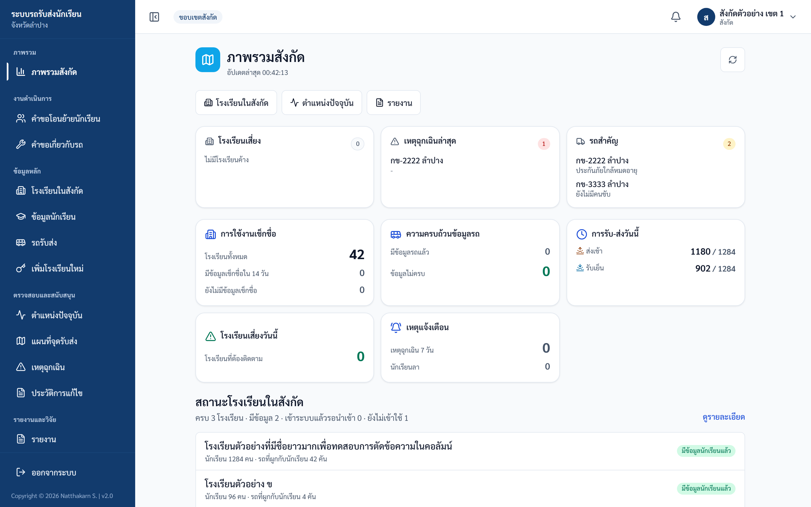
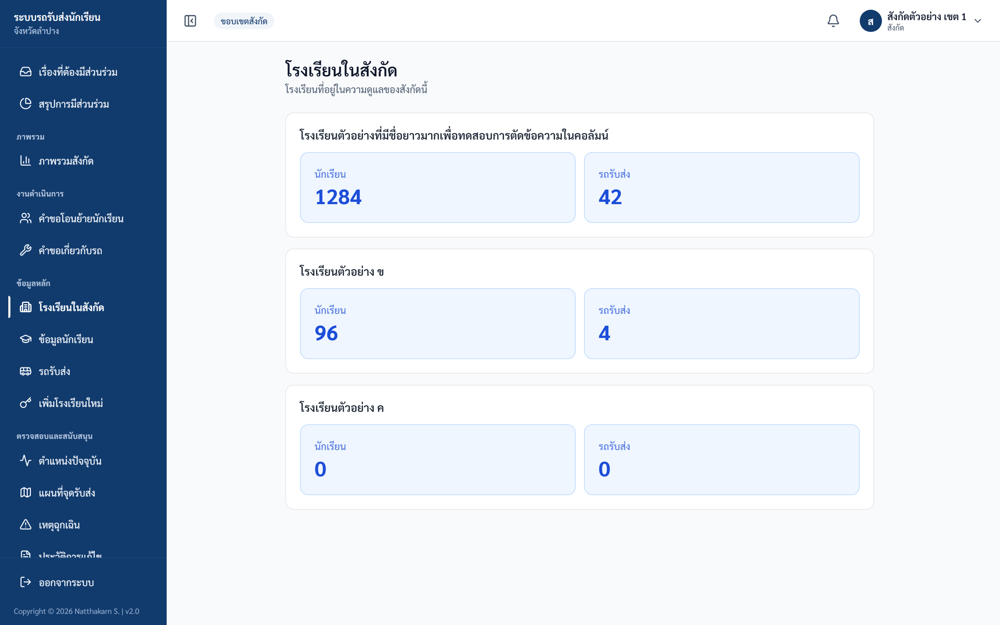
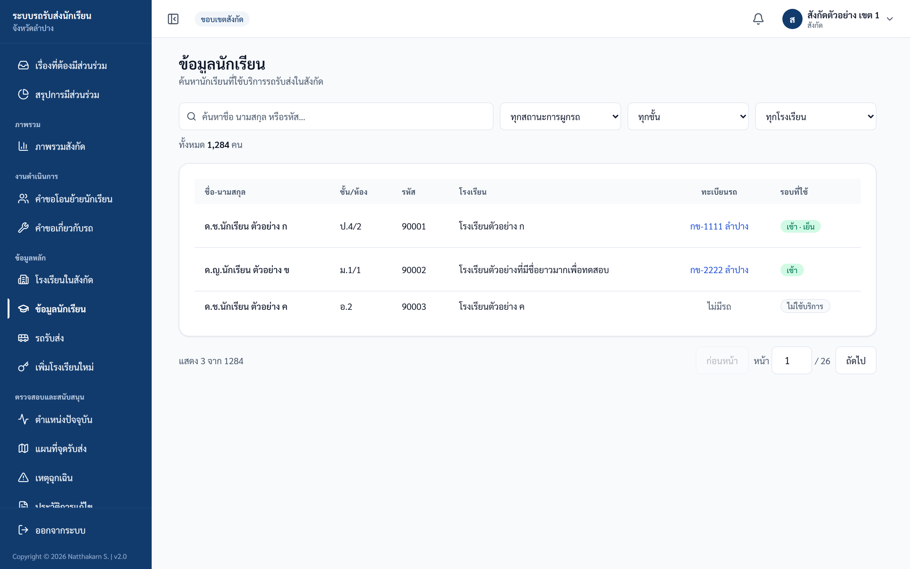
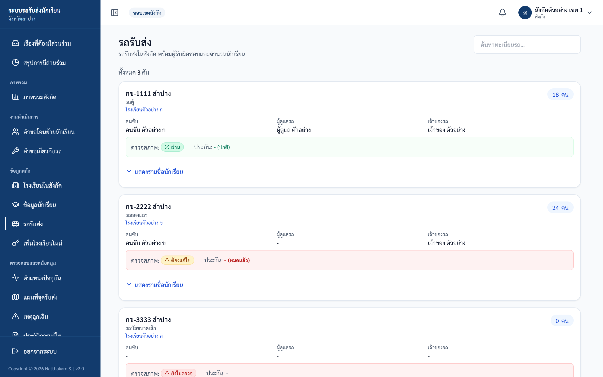
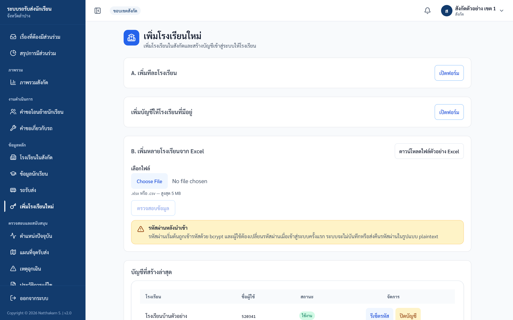
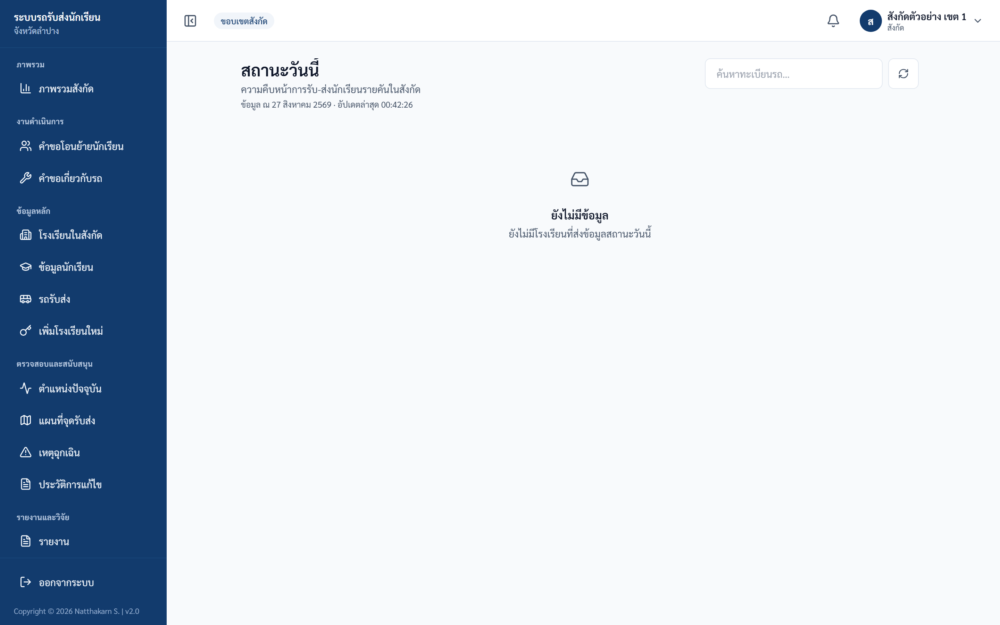
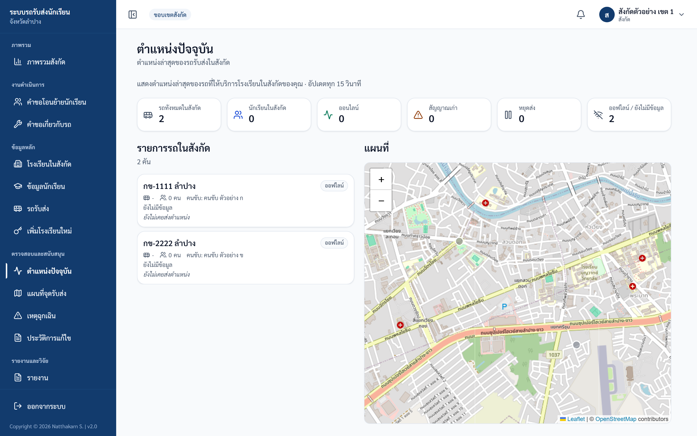
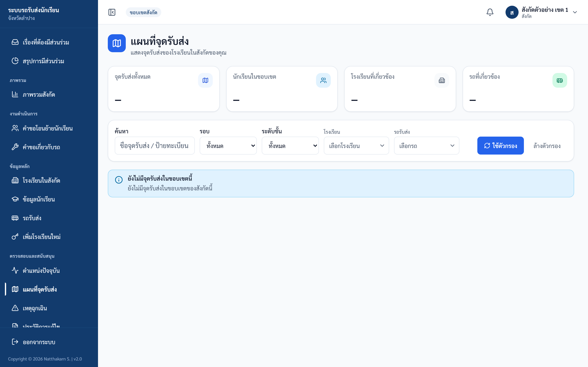
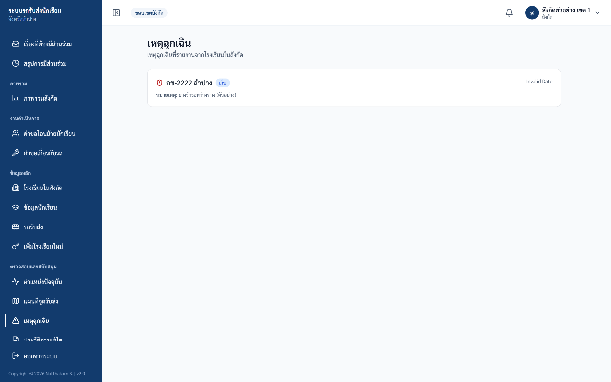
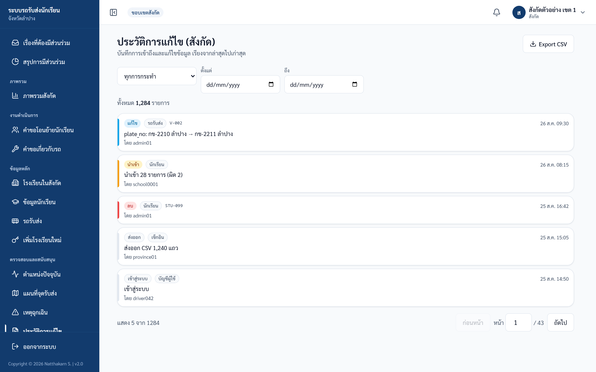

# คู่มือสังกัด/เขต (Affiliation)

ปรับปรุงล่าสุด 6 กันยายน 2569 (ตรวจกับระบบจริง commit 14caf5b)

## ขอบเขตสิทธิ์

สังกัดเห็นข้อมูลเฉพาะโรงเรียนในสังกัดของตน ใช้ติดตามผลการดำเนินงาน สร้าง/นำเข้าบัญชีโรงเรียน และดูรายงานในขอบเขตสังกัด

## เมนูหลัก

| กลุ่มเมนู | เมนู | งาน |
|---|---|---|
| ภาพรวม | ภาพรวมสังกัด | KPI, สถานะโรงเรียนในสังกัด และโรงเรียนเสี่ยงวันนี้ |
| งานดำเนินการ | คำขอโอนย้ายนักเรียน | อนุมัติ/ไม่อนุมัติคำขอย้ายนักเรียนระหว่างโรงเรียนในสังกัด |
| งานดำเนินการ | คำขอเกี่ยวกับรถ | อนุมัติ/ไม่อนุมัติคำขอ 4 ประเภท: กู้คืนรถที่ลบ ใช้รถร่วม เพิ่มรถใหม่ ตรวจสอบรถซ้ำ |
| ข้อมูลหลัก | โรงเรียนในสังกัด | รายชื่อโรงเรียน พร้อมจำนวนนักเรียนและรถ |
| ข้อมูลหลัก | ข้อมูลนักเรียน | ค้นหานักเรียนในสังกัด (กรองตามการผูกรถ ระดับชั้น และโรงเรียน) |
| ข้อมูลหลัก | รถรับส่ง | ดูรถในสังกัด ผู้รับผิดชอบ และสถานะตรวจสภาพ/ประกัน |
| ข้อมูลหลัก | เพิ่มโรงเรียนใหม่ | เพิ่มโรงเรียน/สร้าง-รีเซ็ต-ปิดบัญชีโรงเรียน/นำเข้าจาก Excel |
| ตรวจสอบและสนับสนุน | ตำแหน่งปัจจุบัน | ดูตำแหน่งรถแบบเรียลไทม์ |
| ตรวจสอบและสนับสนุน | แผนที่จุดรับส่ง | ดูจุดรับ-ส่งแบบรวม (ไม่แสดงชื่อ เบอร์โทร หรือที่อยู่นักเรียน) |
| ตรวจสอบและสนับสนุน | เหตุฉุกเฉิน | ดูเหตุที่แจ้งจากรถในสังกัด |
| ตรวจสอบและสนับสนุน | ประวัติการแก้ไข | ตรวจย้อนหลังและส่งออก CSV |
| รายงานและวิจัย | รายงาน | รายวัน / รายเดือน / สรุปภาพรวม ส่งออก CSV, Excel, PDF |

> หน้า "สถานะวันนี้" (`/affiliation/status`) ใช้ติดตามการเช็กชื่อรายวัน แต่ไม่มีลิงก์ในแถบเมนู ต้องพิมพ์ URL เข้าเอง

## 1. ภาพรวมสังกัด

ภาพประกอบ: Dashboard สังกัด

## 2. โรงเรียน นักเรียน และรถ

ภาพประกอบ: รายชื่อโรงเรียนในสังกัด

ภาพประกอบ: ค้นหานักเรียนในสังกัด

ภาพประกอบ: รถรับส่งในสังกัด

## 3. เพิ่มโรงเรียนใหม่ และจัดการบัญชีโรงเรียน

เมนู "เพิ่มโรงเรียนใหม่" รวม 4 งานไว้ในหน้าเดียว เลือกทำเฉพาะงานที่ต้องการ ไม่ต้องทำเรียงตามลำดับ

1. **A. เพิ่มทีละโรงเรียน** — กด "เปิดฟอร์ม" → กรอก "รหัสโรงเรียน" (ตัวเลข 6-10 หลัก) "ชื่อโรงเรียน" และ "ชื่อผู้ใช้" (รหัส OBEC 6 หลัก) → กด "เพิ่มโรงเรียนและสร้างบัญชี" ระบบตั้งรหัสผ่านเริ่มต้นเป็นรหัสโรงเรียนให้อัตโนมัติ
2. **เพิ่มบัญชีให้โรงเรียนที่มีอยู่** — ใช้เมื่อโรงเรียนอยู่ในระบบแล้วแต่ยังไม่มีบัญชี หรือต้องการบัญชีเพิ่ม กด "เปิดฟอร์ม" → เลือกโรงเรียนในสังกัด กรอก "ชื่อผู้ใช้" (รหัส OBEC 6 หลัก) และ "ชื่อที่แสดง" ถ้าต้องการ → กด "เพิ่มบัญชี" (รหัสผ่านเริ่มต้นคือรหัสโรงเรียน)
3. **B. เพิ่มหลายโรงเรียนจาก Excel** — กด "ดาวน์โหลดไฟล์ตัวอย่าง Excel" → กรอกข้อมูลลงไฟล์ → เลือกไฟล์ (.xlsx หรือ .csv ไม่เกิน 5 MB) → กด "ตรวจสอบข้อมูล" ขั้นนี้ยังไม่บันทึกลงระบบ → ดูการ์ดสรุป "จำนวนทั้งหมด" "ผ่าน" "ไม่ผ่าน" และตารางตัวอย่างว่าแถวไหนไม่ผ่านเพราะอะไร → แก้ไฟล์แล้วตรวจใหม่ หรือกด "ยืนยันนำเข้าเฉพาะรายการที่ผ่าน (จำนวน)" แล้วยืนยันในกล่อง "ยืนยันนำเข้าบัญชีโรงเรียน?" (แถวที่ไม่ผ่านจะถูกข้าม ไม่ถูกนำเข้า) หากต้องการเริ่มใหม่ทั้งหมด กด "เริ่มใหม่"
4. **ตาราง "บัญชีที่สร้างล่าสุด"** — แสดงบัญชีโรงเรียนทั้งหมดในสังกัด หน้าละ 10 รายการ มีคอลัมน์ โรงเรียน / ชื่อผู้ใช้ / สถานะ / จัดการ ปุ่มในคอลัมน์ "จัดการ" มี 2 ปุ่ม
   - "รีเซ็ตรหัส" — ตั้งรหัสผ่านใหม่ให้โรงเรียนเมื่อโรงเรียนลืมรหัส ต้องกรอกรหัสใหม่และยืนยันให้ตรงกัน รหัสต้องยาวอย่างน้อย 8 ตัวอักษร ไม่ตรงกับชื่อผู้ใช้ และไม่เป็นรหัสที่คาดเดาง่าย เมื่อรีเซ็ตแล้วโรงเรียนที่กำลังใช้งานอยู่จะหลุดออกจากระบบ และต้องตั้งรหัสใหม่อีกครั้งเมื่อเข้าสู่ระบบครั้งถัดไป
   - "ปิดบัญชี" / "เปิดบัญชี" — ระงับหรือคืนสิทธิ์เข้าสู่ระบบของบัญชีนั้น ข้อมูลของโรงเรียนไม่ถูกลบ

หลังสร้างบัญชีหรือรีเซ็ตรหัสผ่านแล้ว ให้แจ้งโรงเรียนเข้าสู่ระบบและเปลี่ยนรหัสผ่านครั้งแรกทันที

ภาพประกอบ: หน้าเพิ่มโรงเรียนใหม่ — การ์ด A, การ์ดเพิ่มบัญชีให้โรงเรียนที่มีอยู่, การ์ด B และตารางบัญชีที่สร้างล่าสุด

ข้อควรระวัง:
- ตรวจรหัสโรงเรียนและชื่อโรงเรียนให้ถูกต้องตั้งแต่ตอนกดปุ่ม "ตรวจสอบข้อมูล" ก่อนกด "ยืนยันนำเข้าเฉพาะรายการที่ผ่าน" (รหัสโรงเรียนต้องไม่ซ้ำกับที่มีอยู่ในระบบ และต้องไม่ซ้ำกันเองภายในไฟล์เดียวกัน)
- คอลัมน์ initial_password ต้องกรอกทุกแถว เว้นว่างไม่ได้ ถ้าเว้นว่างระบบจะขึ้นว่า "กรุณาระบุรหัสผ่านเริ่มต้น" และข้ามแถวนั้น รหัสผ่านต้องยาวอย่างน้อย 8 ตัวอักษร ไม่ใช่รหัสที่คาดเดาง่าย และไม่ตรงกับชื่อผู้ใช้
- ให้ใส่เป็นรหัสชั่วคราวสำหรับเข้าครั้งแรกเท่านั้น (ระบบบังคับให้โรงเรียนเปลี่ยนรหัสผ่านทันทีที่เข้าสู่ระบบครั้งแรก) เมื่อนำเข้าเสร็จให้ลบไฟล์ทิ้ง ห้ามส่งไฟล์ต่อทางแชทหรืออีเมล
- 1 ไฟล์นำเข้าได้ไม่เกิน 5,000 แถว และขนาดไฟล์ไม่เกิน 5 MB หากมากกว่านี้ให้แบ่งไฟล์
- หากต้องแก้โรงเรียนที่มีข้อมูลจริง ให้ประสานผู้ดูแลระบบก่อน

## 4. สถานะวันนี้ ตำแหน่งรถ และจุดรับส่ง

ภาพประกอบ: สถานะวันนี้ในสังกัด

ภาพประกอบ: ตำแหน่งรถในสังกัด

ภาพประกอบ: จุดรับส่งในสังกัด

## 5. เหตุฉุกเฉินและ Audit log

ภาพประกอบ: เหตุฉุกเฉินในสังกัด

ภาพประกอบ: Audit log สังกัด

## ตรวจรับหลังอบรม Affiliation

| ข้อ | งานทดสอบ | ผลที่ต้องได้ |
|---|---|---|
| 1 | เปิด dashboard | เห็นข้อมูลเฉพาะสังกัด |
| 2 | ค้นหาโรงเรียน | เห็นเฉพาะโรงเรียนในสังกัด |
| 3 | เปิดเมนู "เพิ่มโรงเรียนใหม่" | เห็นหัวข้อ "A. เพิ่มทีละโรงเรียน" พร้อมปุ่ม "เปิดฟอร์ม" และตาราง "บัญชีที่สร้างล่าสุด" (ถ้ามีบัญชีอยู่แล้ว แต่ละแถวจะมีปุ่ม "รีเซ็ตรหัส" และ "ปิดบัญชี" ถ้ายังไม่มีจะขึ้น "ยังไม่มีบัญชีโรงเรียน") |
| 4 | เปิดเมนู "คำขอโอนย้ายนักเรียน" และ "คำขอเกี่ยวกับรถ" | เห็นเฉพาะคำขอของโรงเรียนในสังกัด ถ้ามีคำขอจะมีปุ่ม "รายละเอียด" ถ้ายังไม่มีจะขึ้น "ไม่มีคำขอ" |
| 5 | เปิด live vehicles | เห็นเฉพาะรถในสังกัด |
| 6 | เปิด audit log | ตรวจย้อนหลังได้ |

