# คู่มือโรงเรียนเต็มสิทธิ์ (School Full)

## ขอบเขตสิทธิ์

โรงเรียนเต็มสิทธิ์ใช้ดูแลข้อมูลนักเรียน รถ คนขับ ผู้ปกครอง จุดรับส่ง รายงาน และบัญชีครูประจำสายชั้นในโรงเรียนของตน

## เมนูหลัก

| เมนู | งาน |
|---|---|
| ภาพรวมโรงเรียน | KPI และสถานะวันนี้ |
| ข้อมูลนักเรียน | ค้นหา เพิ่ม แก้ไข นำเข้า ส่งออก |
| รถรับส่ง | ตรวจรถ/จำนวนนักเรียน/คนขับ |
| เพิ่มรถรับส่ง | นำเข้ารถหลายคัน |
| แผนที่จุดรับส่ง | จัดจุดรับส่งและผูกนักเรียน |
| ตำแหน่งปัจจุบัน | ดูตำแหน่งรถของโรงเรียน |
| คำขอรายชื่อ | อนุมัติ/ปฏิเสธคำขอจากคนขับ |
| บัญชีครูประจำสายชั้น | สร้างบัญชีจำกัดระดับชั้น |
| เหตุฉุกเฉิน | ดูเหตุของโรงเรียน |
| Audit log | ตรวจย้อนหลัง |
| รายงาน | รายวัน รายเดือน สรุป |

## 1. ภาพรวมโรงเรียน

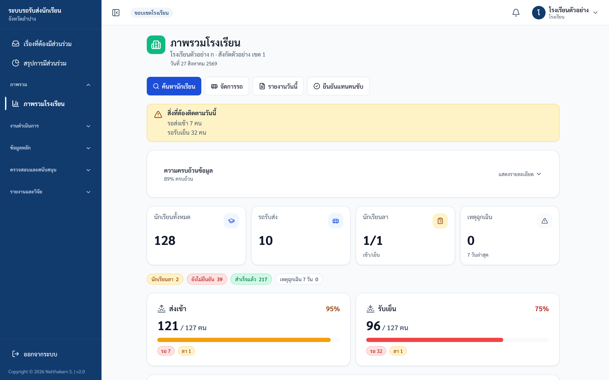

ภาพประกอบ: Dashboard โรงเรียน

## 2. จัดการนักเรียน

1. เปิดเมนู "ข้อมูลนักเรียน"
2. ค้นหาจากชื่อ รหัสนักเรียน ชั้น ห้อง หรือรถ
3. ตรวจข้อมูลก่อนแก้ไข
4. ใช้ export เฉพาะเมื่อจำเป็นตามหน้าที่

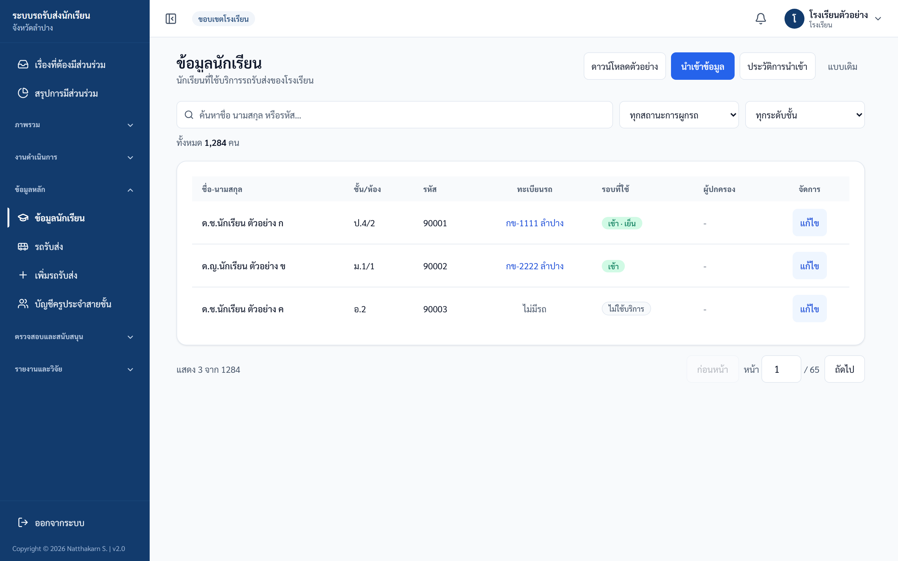

ภาพประกอบ: หน้าข้อมูลนักเรียน

## 3. Import ข้อมูล

1. ดาวน์โหลด template
2. กรอกข้อมูลตามคอลัมน์ที่กำหนด
3. อัปโหลดเพื่อ preview
4. ตรวจรายการผิดพลาด/เตือน
5. commit เมื่อมั่นใจว่า preview ถูกต้อง

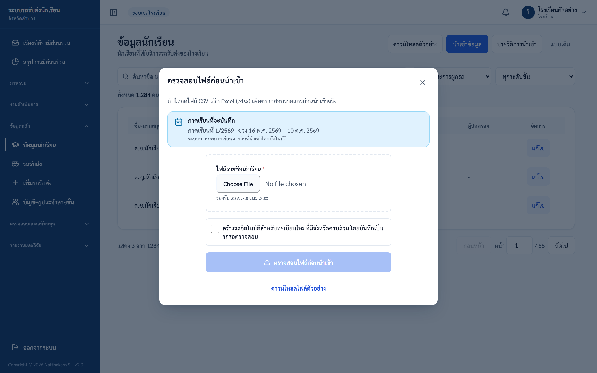

ภาพประกอบ: หน้าตรวจ preview ก่อนนำเข้า

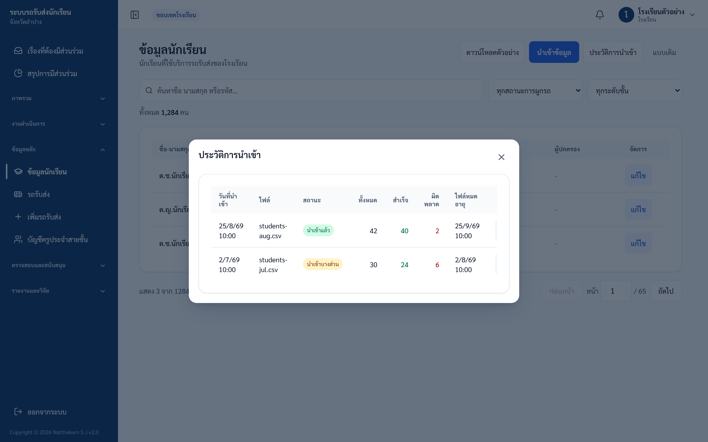

ภาพประกอบ: ประวัติการนำเข้า

## 4. รถรับส่งและการส่งตรวจรับรอง

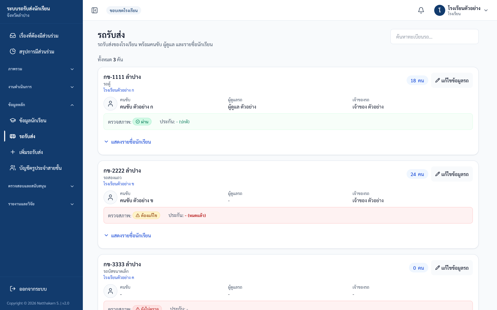

ภาพประกอบ: รายการรถรับส่ง

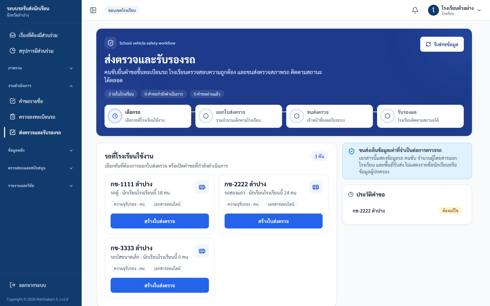

ภาพประกอบ: ส่งตรวจรับรองรถ

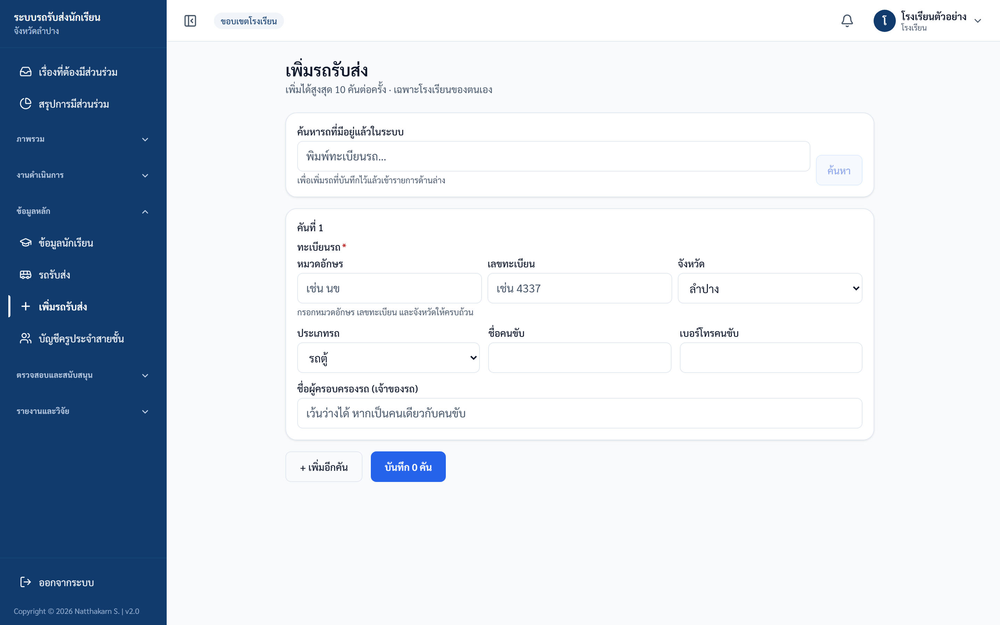

ภาพประกอบ: นำเข้ารถหลายคัน

## 5. จุดรับส่งและตำแหน่งรถ

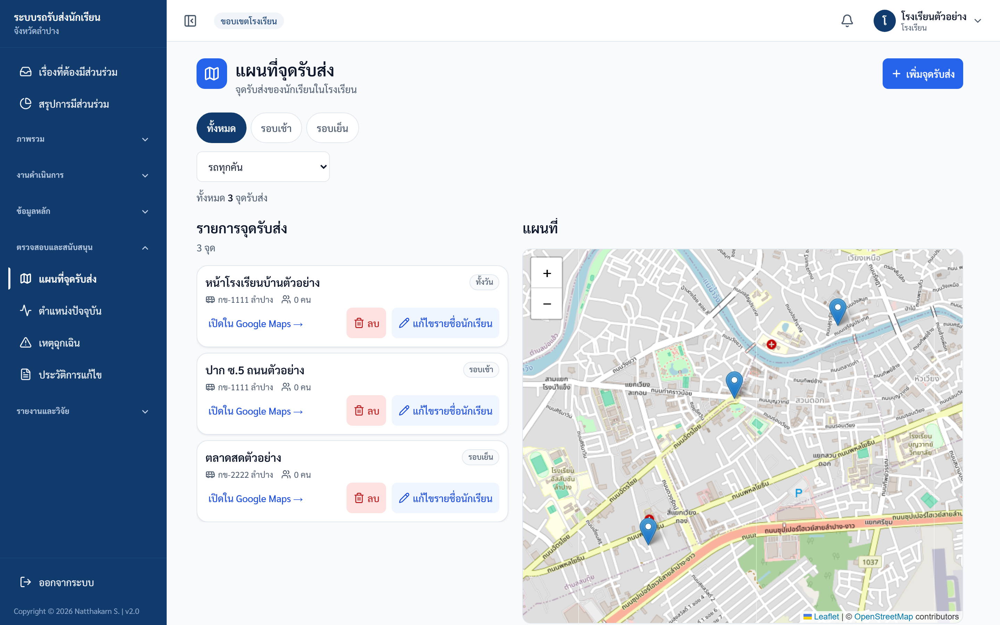

ภาพประกอบ: แผนที่จุดรับส่งของโรงเรียน

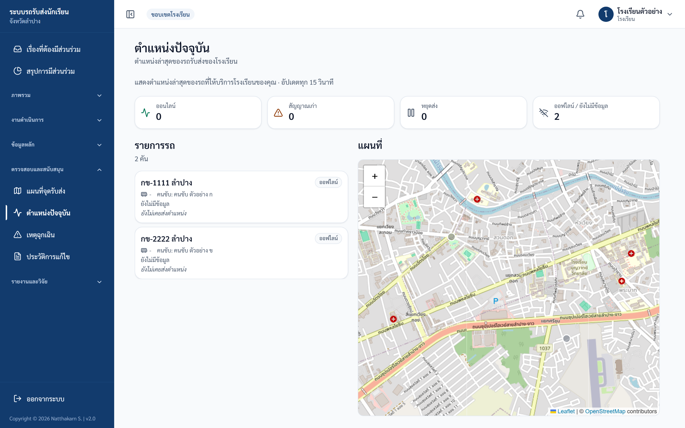

ภาพประกอบ: ตำแหน่งรถของโรงเรียน

## 6. คำขอรายชื่อและครูประจำสายชั้น

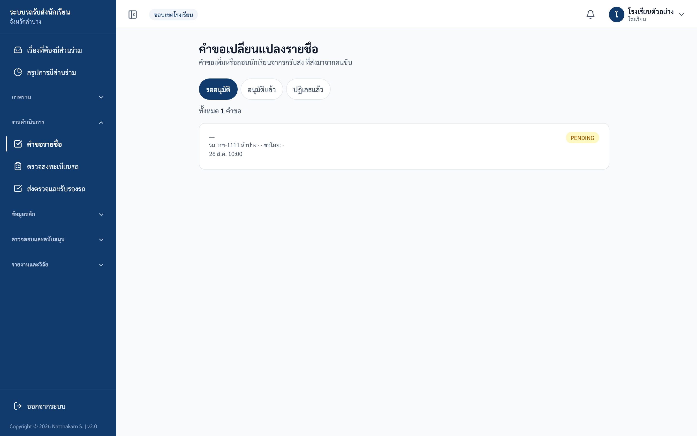

ภาพประกอบ: คำขอรายชื่อจากคนขับ

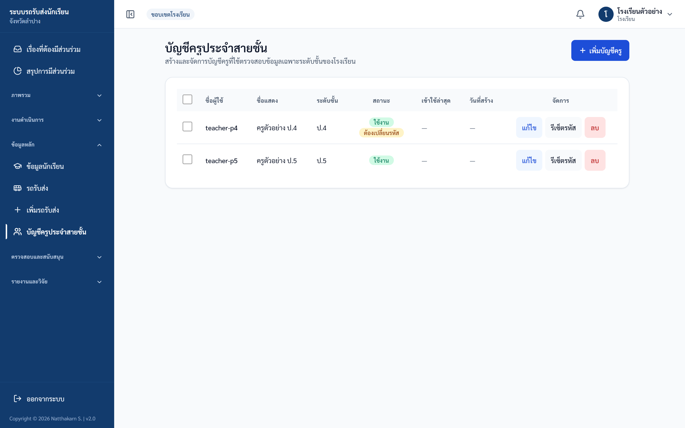

ภาพประกอบ: สร้างบัญชีครูประจำสายชั้น

## 7. เหตุฉุกเฉิน Audit log และรายงาน

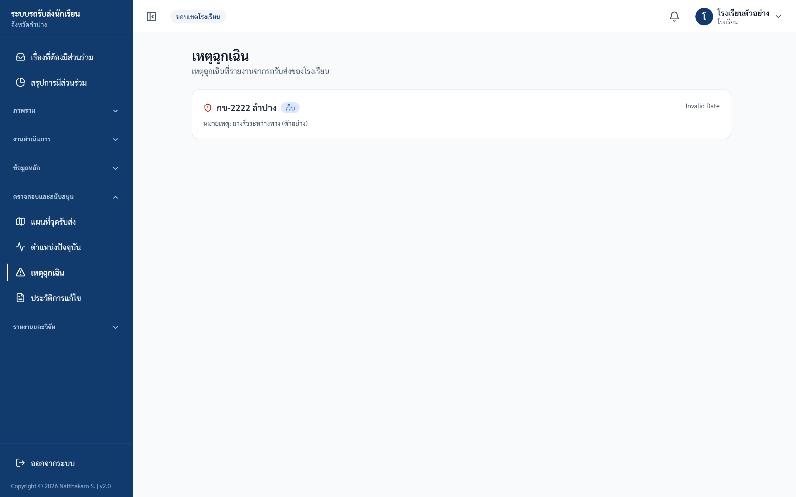

ภาพประกอบ: เหตุฉุกเฉินของโรงเรียน

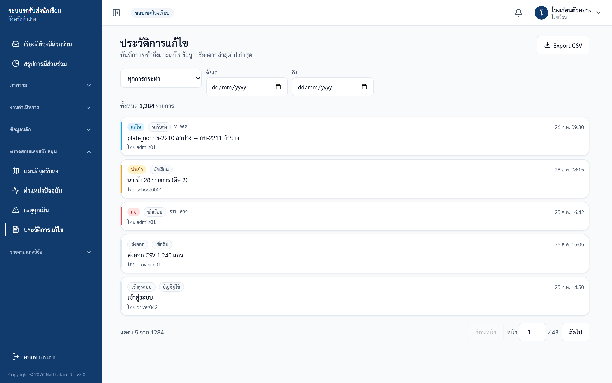

ภาพประกอบ: Audit log โรงเรียน

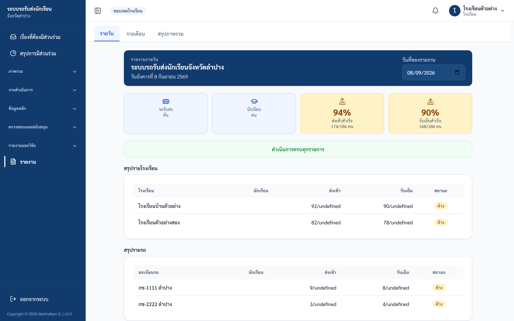

ภาพประกอบ: รายงานรายวัน

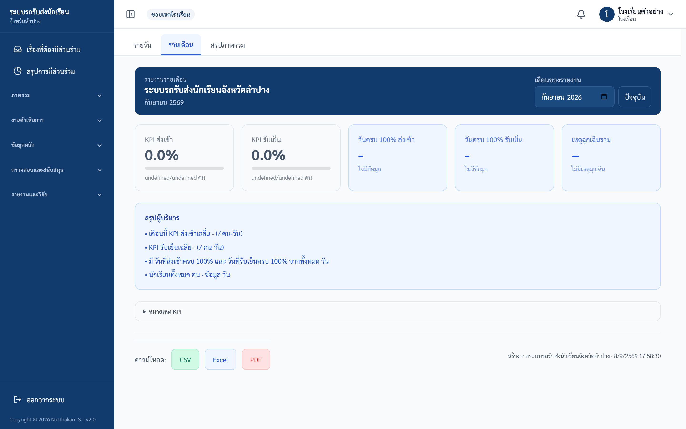

ภาพประกอบ: รายงานรายเดือน

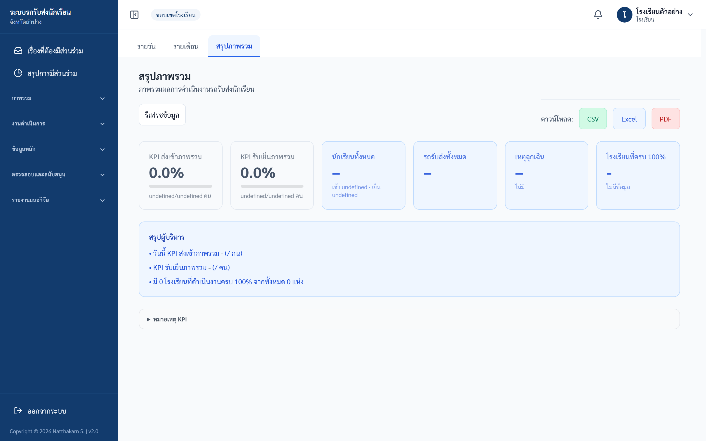

ภาพประกอบ: รายงานสรุป

## ตรวจรับหลังอบรม School Full

| ข้อ | งานทดสอบ | ผลที่ต้องได้ |
|---|---|---|
| 1 | เปิด dashboard | เห็น KPI โรงเรียน |
| 2 | ค้นหานักเรียน | เห็นเฉพาะนักเรียนโรงเรียนตน |
| 3 | เปิด import preview | ตรวจไฟล์ก่อน commit ได้ |
| 4 | เปิดแผนที่จุดรับส่ง | เห็นข้อมูลโรงเรียนตน |
| 5 | สร้างบัญชีครูสายชั้น | บัญชีถูกจำกัดระดับชั้น |
| 6 | เปิดรายงาน | ดู/ส่งออกตามสิทธิ์ได้ |

