# คู่มือโรงเรียนเต็มสิทธิ์ (School Full)

ปรับปรุงล่าสุด 2 ตุลาคม 2569 (ตรวจกับระบบจริง commit fd5d3f9)

## ขอบเขตสิทธิ์

โรงเรียนเต็มสิทธิ์ใช้ดูแลข้อมูลนักเรียน รถ คนขับ ผู้ปกครอง จุดรับส่ง รายงาน และบัญชีครูประจำสายชั้นในโรงเรียนของตน

## เมนูหลัก

แถบเมนูด้านข้าง (ปรับใหม่ 2 ต.ค. 2569) แสดงหน้าที่ใช้ทุกวันไว้ด้านบน ส่วนเมนูอื่นพับไว้ใต้ "เพิ่มเติม" (กดเพื่อเปิด และจะเปิดเองเมื่ออยู่ในหน้านั้น)

| ตำแหน่ง | เมนู | งาน |
|---|---|---|
| ด้านบน | ภาพรวมโรงเรียน | แถบสรุปวันนี้ งานที่ต้องทำ ตัวชี้วัด และกราฟ |
| ด้านบน | เช็กชื่อขึ้น-ลงรถ | ครูบันทึกเด็กถึงโรงเรียน (เช้า) / ขึ้นรถกลับบ้าน (เย็น) — ใหม่ภาคเรียนที่ 2 |
| ด้านบน | ข้อมูลนักเรียน | ค้นหา เพิ่ม แก้ไข นำเข้า ส่งออก |
| ด้านบน | รถรับส่ง | ดูรถ คนขับ และรายชื่อนักเรียนในรถ แก้ไขข้อมูลรถได้ |
| ด้านบน | คำขอรายชื่อ | อนุมัติ/ปฏิเสธคำขอจากคนขับ |
| ด้านบน | แผนที่จุดรับส่ง | จัดจุดรับส่งและผูกนักเรียน |
| ด้านบน | ตำแหน่งปัจจุบัน | ดูตำแหน่งรถของโรงเรียน |
| ด้านบน | เหตุฉุกเฉิน | ดูเหตุของโรงเรียน |
| ด้านบน | รายงาน | รายวัน รายเดือน สรุปภาพรวม |
| เพิ่มเติม | ตรวจลงทะเบียนรถ | ตรวจรายชื่อเด็กที่คนขับส่งมา และตรวจเอกสารรถ/คนขับ แล้วอนุมัติ |
| เพิ่มเติม | ส่งตรวจและรับรองรถ | ออกใบส่งตรวจให้ขนส่ง และติดตามสถานะ |
| เพิ่มเติม | เพิ่มรถรับส่ง | เพิ่มรถใหม่ได้สูงสุด 10 คันต่อครั้ง |
| เพิ่มเติม | บัญชีครูประจำสายชั้น | สร้างบัญชีจำกัดระดับชั้น |
| เพิ่มเติม | ประวัติการแก้ไข | ตรวจย้อนหลังว่าใครแก้ข้อมูลอะไร (audit log) |
| เพิ่มเติม | เรื่องที่ต้องมีส่วนร่วม / สรุปการมีส่วนร่วม | ยื่นและติดตามเรื่อง |

บนมือถือ แท็บด้านล่างคือ หน้าแรก / ค้นหา / เช็กชื่อ / รายงาน

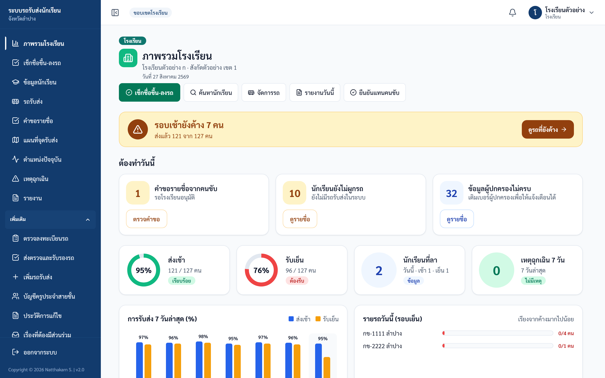

ภาพประกอบ: เมนูด้านข้าง หน้าที่ใช้ทุกวันอยู่บน ที่เหลืออยู่ใต้ "เพิ่มเติม"

> เมนู "ตรวจลงทะเบียนรถ" แสดงอยู่จริงในแถบด้านข้าง เพราะฟีเจอร์นี้เปิดใช้งานแล้วบนระบบจริง (feature flag `FEATURE_DRIVER_REGISTRATION` — ตรวจสถานะเมื่อ 6 ก.ย. 2569)
> ส่วนเมนู "เรื่องที่ต้องมีส่วนร่วม" **เปิดใช้งานแล้วตั้งแต่ 7 กันยายน 2569** อยู่ใต้ "เพิ่มเติม" ในแถบด้านข้าง ใช้ยื่นเรื่องที่ต้องการให้หน่วยงานพิจารณา เจ้าของโครงการกำหนดให้สภาองค์กรของผู้บริโภค ซึ่งถือบัญชีระดับจังหวัด เป็นผู้รับเรื่อง — **เป็นข้อตกลงของหน่วยงาน ไม่ใช่สิ่งที่โปรแกรมบังคับ** ระบบไม่ได้กำหนดผู้รับเรื่องไว้ และไม่แจ้งเตือนใครเมื่อมีเรื่องใหม่

## 1. ภาพรวมโรงเรียน

หน้าภาพรวมอ่านจากบนลงล่าง:
1. ปุ่มด่วน — "เช็กชื่อขึ้น-ลงรถ" (สีเขียว) ค้นหานักเรียน จัดการรถ รายงานวันนี้ ยืนยันแทนคนขับ
2. **แถบสรุปวันนี้** — ประโยคเดียว เช่น "รอบเช้ายังค้าง 7 คน" พร้อมปุ่ม "ดูรถที่ยังค้าง"
3. **ต้องทำวันนี้** — การ์ดไม่เกิน 3 ใบ เช่น คำขอรายชื่อจากคนขับ นักเรียนยังไม่ผูกรถ ข้อมูลผู้ปกครองไม่ครบ
4. **ตัวชี้วัด 4 ช่อง** — ส่งเช้า, รับเย็น (วงแหวน %), นักเรียนที่ลา, เหตุฉุกเฉิน 7 วัน แต่ละช่องมีป้ายคำ: เรียบร้อย (เขียว ≥95%), รอติดตาม (เหลือง 85–94%), ต้องรีบ (แดง <85%), ข้อมูล (ฟ้า), ยังไม่เริ่ม (เทา)
5. **กราฟ** — การรับส่ง 7 วันล่าสุด และรายรถวันนี้ (เรียงจากค้างมากไปน้อย)
6. **รายละเอียด (พับไว้)** — สถานะรถแต่ละคัน (ค้นทะเบียนได้) รายการลา ความครบถ้วนข้อมูล

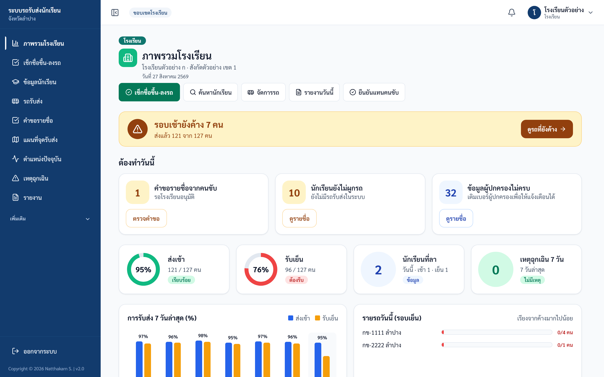

ภาพประกอบ: Dashboard โรงเรียน

## 1A. เช็กชื่อขึ้น-ลงรถ (ภาคเรียนที่ 2 — ครูบันทึกเอง)

ตั้งแต่ 12 ต.ค. 2569 ครูเป็นผู้บันทึกเด็ก **ถึงโรงเรียน** (เช้า) และ **ขึ้นรถกลับบ้าน** (เย็น) ที่หน้า "เช็กชื่อขึ้น-ลงรถ"
- ครูประจำสายชั้นเห็นเฉพาะชั้นตน บัญชีโรงเรียนหลักเห็นทั้งโรงเรียน
- แตะชื่อทีละคน หรือกด "…ทั้งคัน" แล้วยืนยัน ไม่ต้องใส่เหตุผล ยกเลิกได้เฉพาะรายการที่ตนเองกดในวันนั้น
- คนขับยังเช็กชื่อในแอปได้ ใครบันทึกก่อนนับก่อน
- **สร้างบัญชีครูประจำสายชั้นให้ครบก่อน 12 ต.ค. 2569** (เพิ่มเติม › บัญชีครูประจำสายชั้น)
- ปุ่ม "ยืนยันแทนคนขับ" เดิมยังอยู่ ใช้เฉพาะ **กรณีพิเศษ** ที่ทั้งคนขับและครูไม่ได้บันทึก และต้องใส่เหตุผลทุกครั้ง

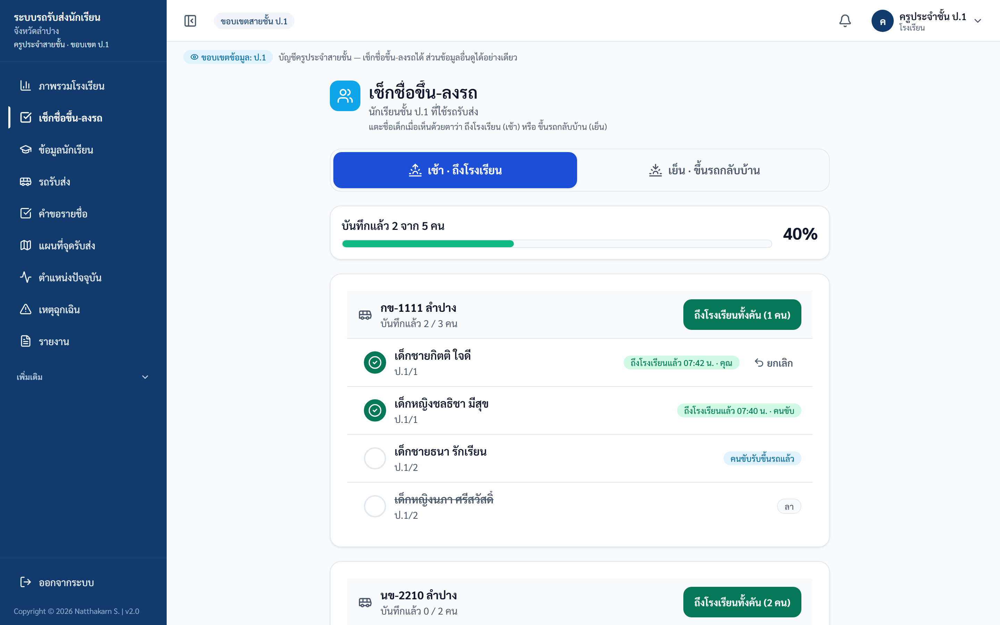

ภาพประกอบ: หน้าเช็กชื่อขึ้น-ลงรถ (รายละเอียดเต็มดูคู่มือครู https://schoolbuslampang.com/manual/user-guide-teacher.html)

## 2. จัดการนักเรียน

1. เปิดเมนู "ข้อมูลนักเรียน"
2. ค้นหาจากชื่อ รหัสนักเรียน ชั้น ห้อง หรือรถ
3. ตรวจข้อมูลก่อนแก้ไข
4. ใช้ export เฉพาะเมื่อจำเป็นตามหน้าที่

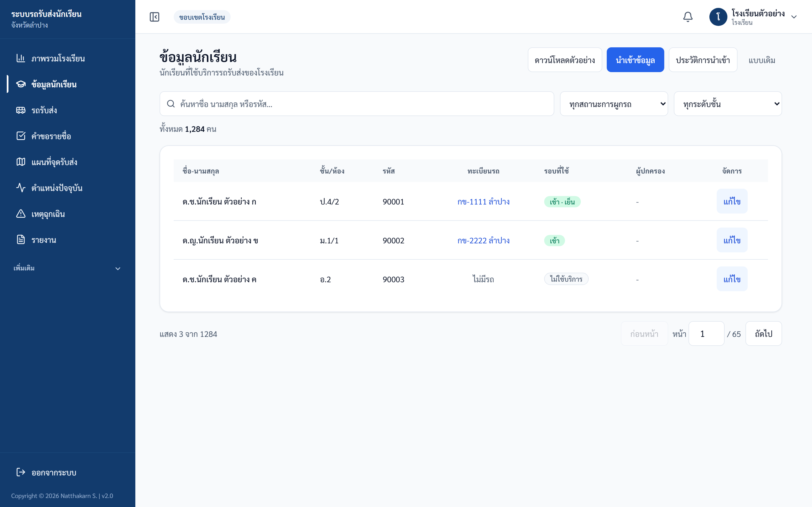

ภาพประกอบ: หน้าข้อมูลนักเรียน

## 3. Import ข้อมูล

1. กดปุ่ม "ดาวน์โหลดตัวอย่าง" ที่หน้า "ข้อมูลนักเรียน" จะได้ไฟล์แบบฟอร์ม "แบบฟอร์มนำเข้านักเรียน.csv"
2. กรอกข้อมูลตามคอลัมน์ที่กำหนด แล้วบันทึกเป็น .csv หรือ .xlsx (หน้าจอเขียนว่ารองรับ .xls ด้วย แต่ไฟล์ .xls รุ่นเก่าจะถูกปฏิเสธพร้อมข้อความ "ไฟล์ .xls (รุ่นเก่า) ไม่รองรับ กรุณาบันทึกเป็น .xlsx หรือ .csv")
3. กดปุ่ม "นำเข้าข้อมูล" ระบบจะเปิดหน้าต่าง "ตรวจสอบไฟล์ก่อนนำเข้า" ดูแถบ "ภาคเรียนที่จะบันทึก" เพื่อทราบว่าข้อมูลชุดนี้จะถูกบันทึกเป็นภาคเรียนใด (ระบบกำหนดจากวันที่นำเข้าโดยอัตโนมัติ แก้เองไม่ได้) แล้วเลือกไฟล์
4. ถ้าต้องการให้ระบบสร้างรถให้เองสำหรับทะเบียนใหม่ที่ระบุจังหวัดครบถ้วน ให้ติ๊ก "สร้างรถอัตโนมัติสำหรับทะเบียนใหม่ที่มีจังหวัดครบถ้วน โดยบันทึกเป็นรถรอตรวจสอบ" (ถ้าไม่ติ๊ก แถวที่ไม่พบทะเบียนรถในระบบจะนำเข้าไม่ได้)
5. กด "ตรวจสอบไฟล์ก่อนนำเข้า" ขั้นนี้เป็นการตรวจสอบเท่านั้น ระบบยังไม่บันทึกข้อมูลนักเรียน
6. ตรวจการ์ดสรุป (ทั้งหมด / พร้อมนำเข้า / ซ้ำในโรงเรียน / คำเตือน / ข้อผิดพลาด / รถมีปัญหา) และติ๊กยืนยันรายแถวสำหรับรายการที่ต้องตัดสินใจ คือ "อัปเดตผู้ปกครอง" และ "กู้คืนนักเรียน"
7. กด "ยืนยันนำเข้า" เมื่อมั่นใจว่าผลตรวจถูกต้อง แล้วยืนยันอีกครั้งในหน้าต่าง "ยืนยันการนำเข้า"

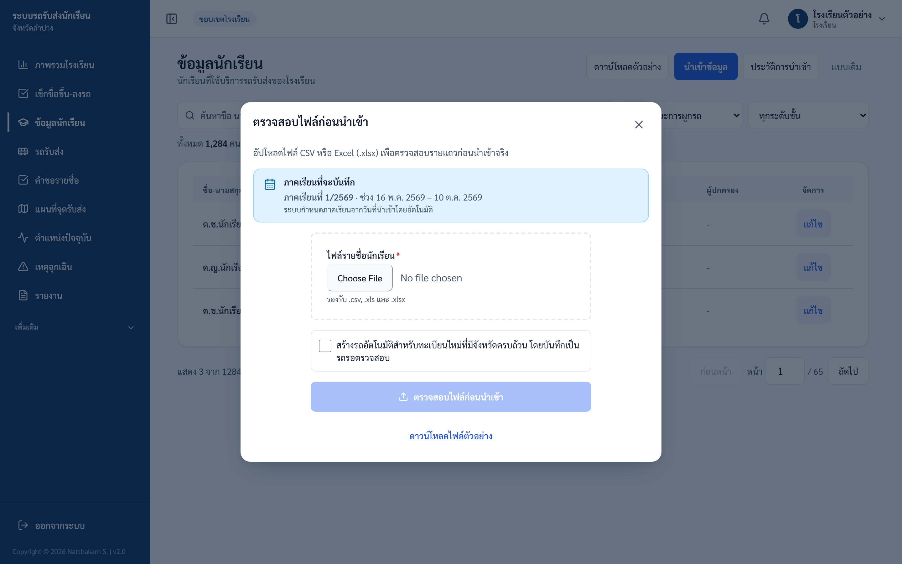

ภาพประกอบ: หน้าตรวจ preview ก่อนนำเข้า

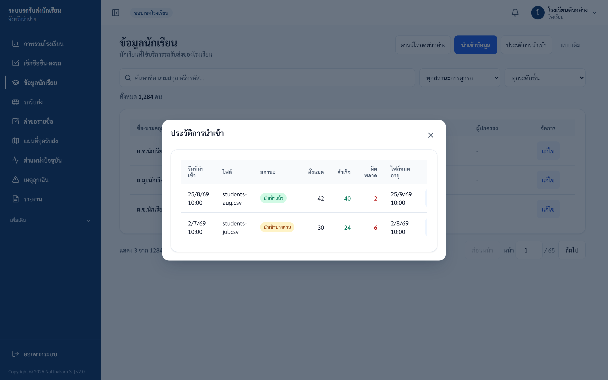

ภาพประกอบ: ประวัติการนำเข้า

## 4. รถรับส่งและการส่งตรวจรับรอง

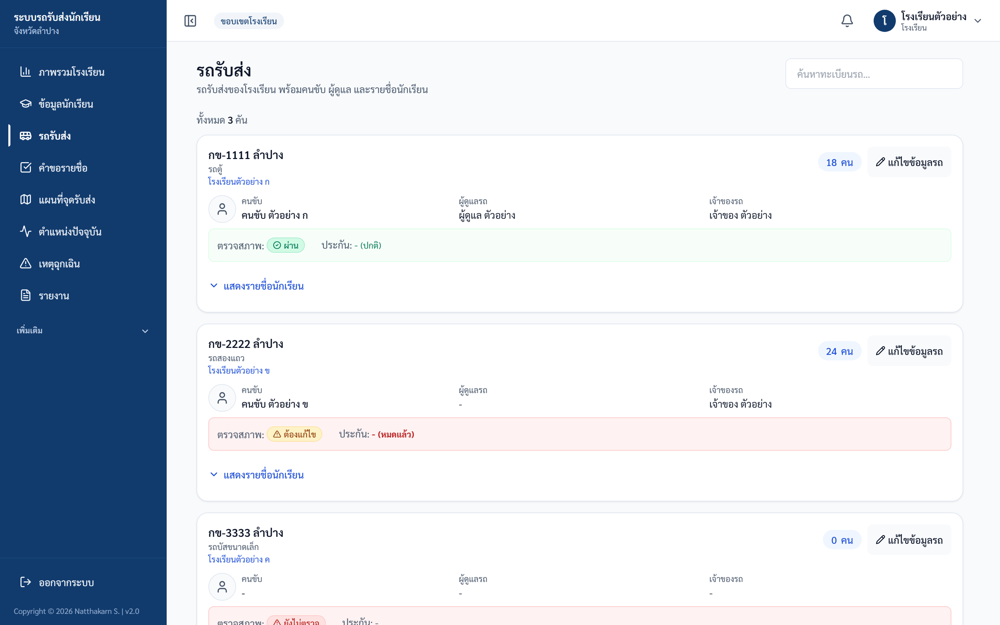

ภาพประกอบ: รายการรถรับส่ง

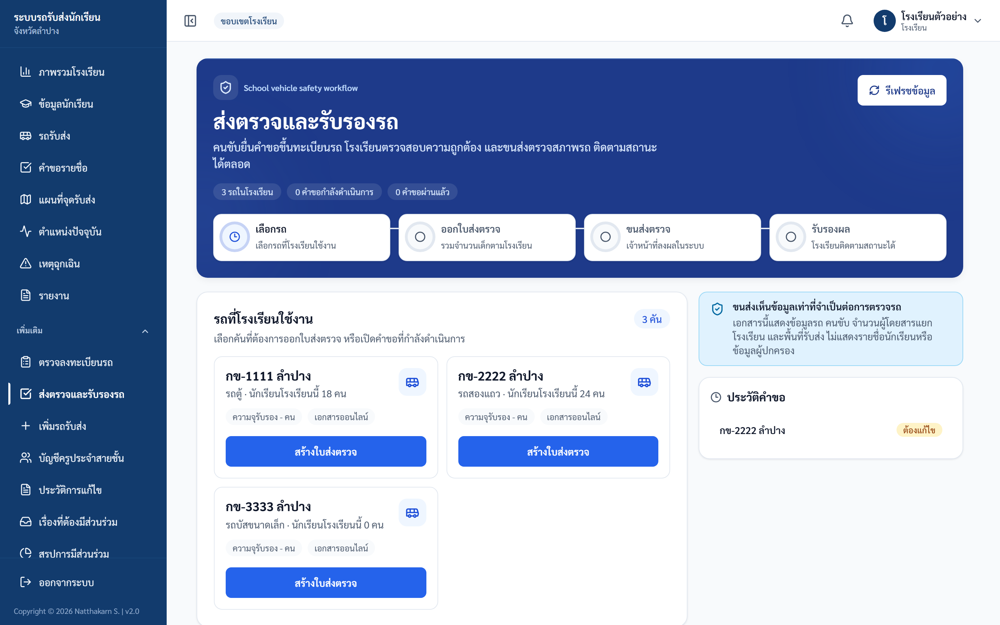

ภาพประกอบ: ส่งตรวจรับรองรถ

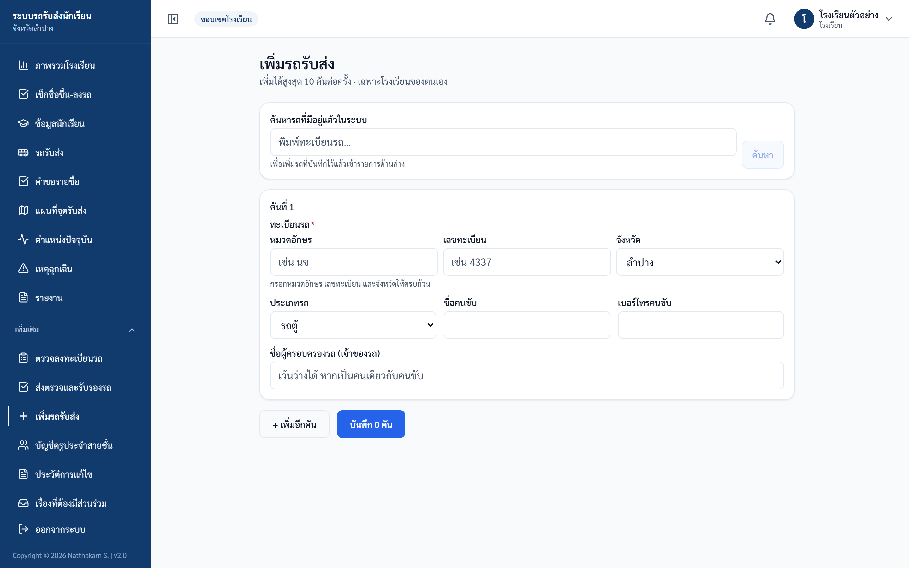

ภาพประกอบ: นำเข้ารถหลายคัน

## 5. จุดรับส่งและตำแหน่งรถ

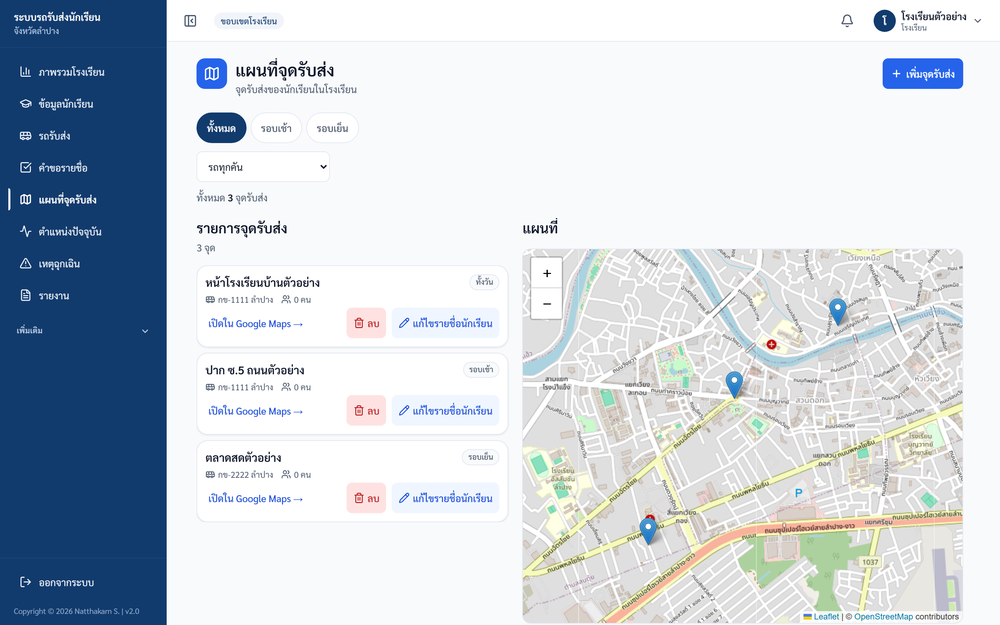

ภาพประกอบ: แผนที่จุดรับส่งของโรงเรียน

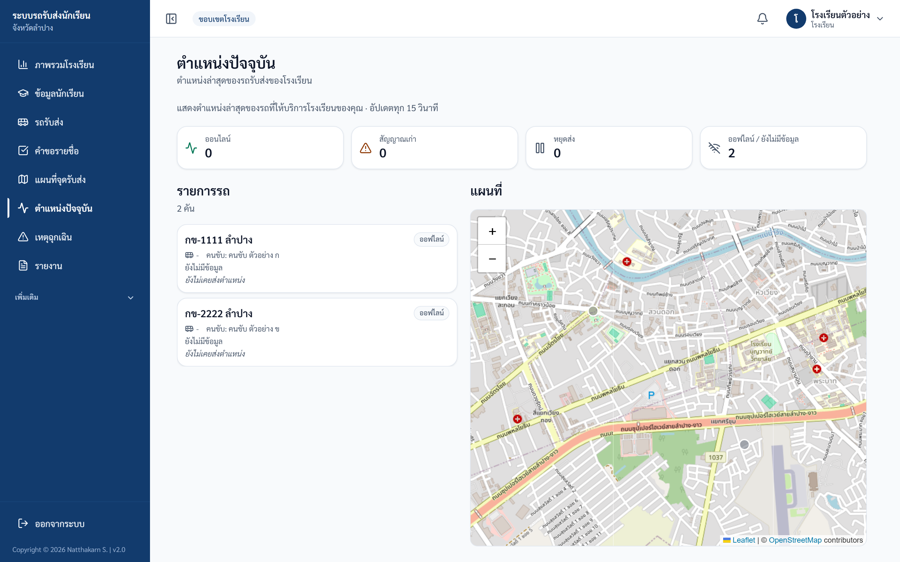

ภาพประกอบ: ตำแหน่งรถของโรงเรียน

## 6. คำขอรายชื่อและครูประจำสายชั้น

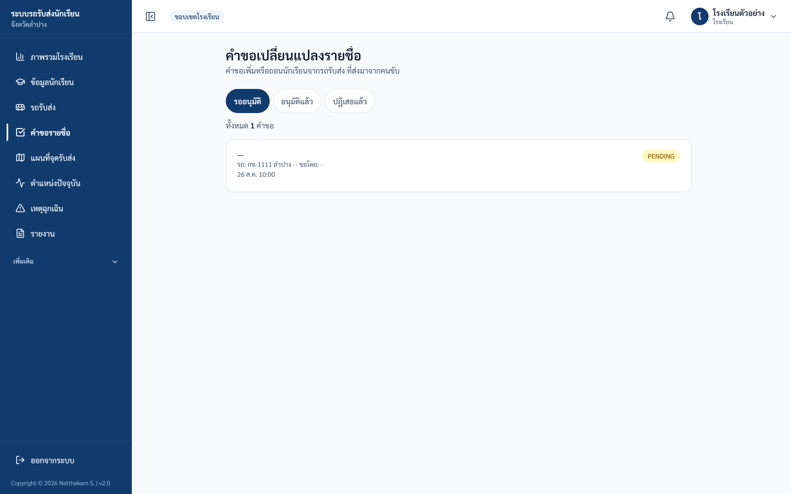

ภาพประกอบ: คำขอรายชื่อจากคนขับ

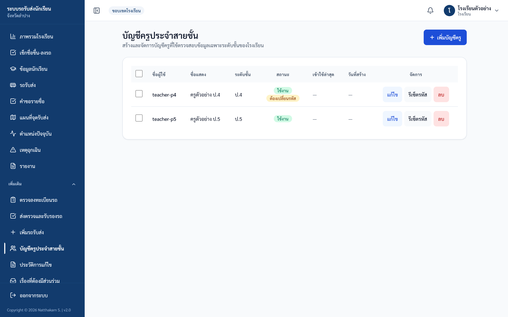

ภาพประกอบ: สร้างบัญชีครูประจำสายชั้น

## 7. เหตุฉุกเฉิน Audit log และรายงาน

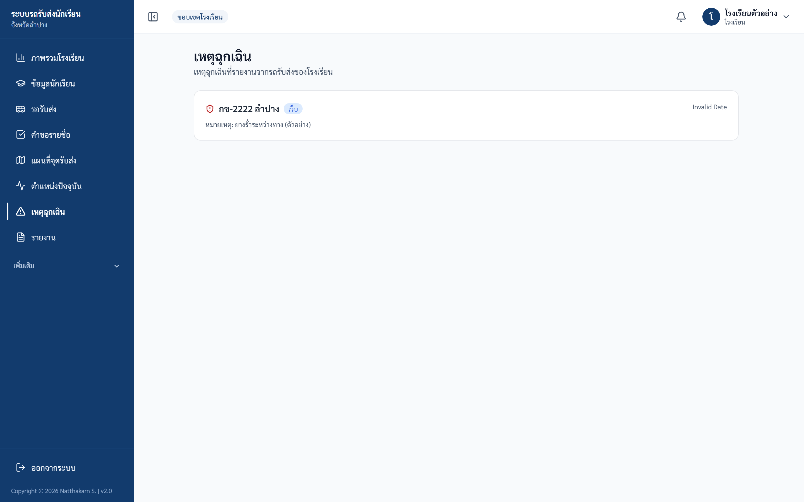

ภาพประกอบ: เหตุฉุกเฉินของโรงเรียน

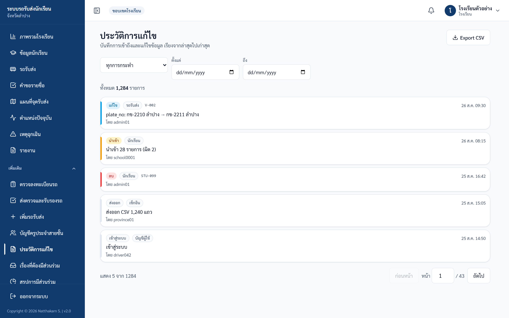

ภาพประกอบ: Audit log โรงเรียน

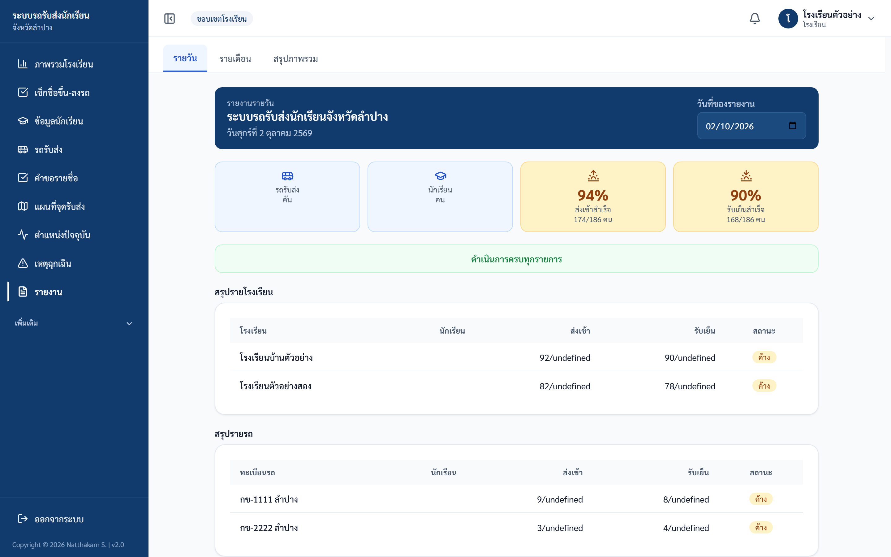

ภาพประกอบ: รายงานรายวัน

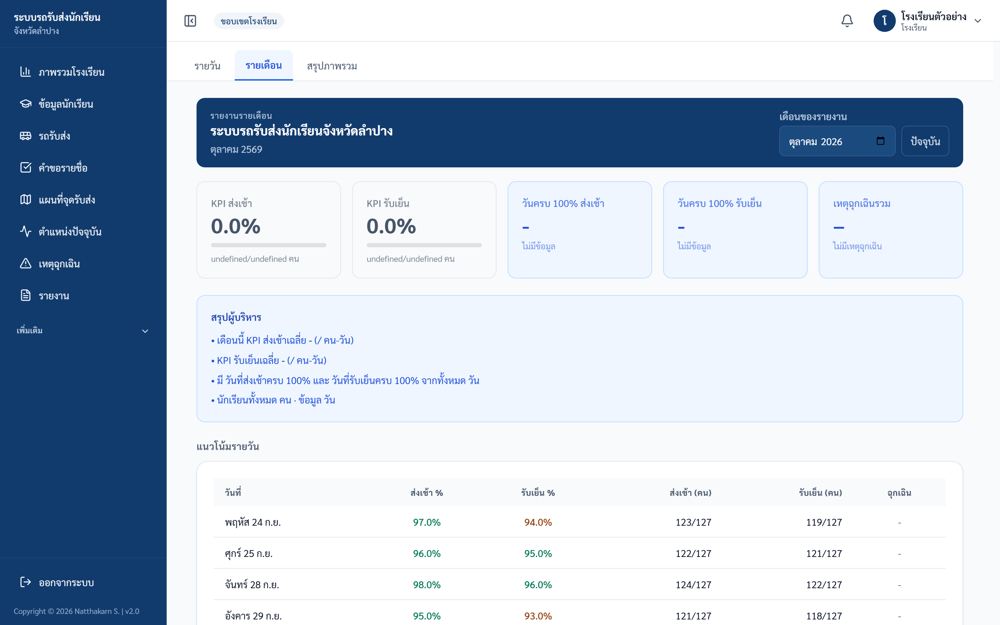

ภาพประกอบ: รายงานรายเดือน

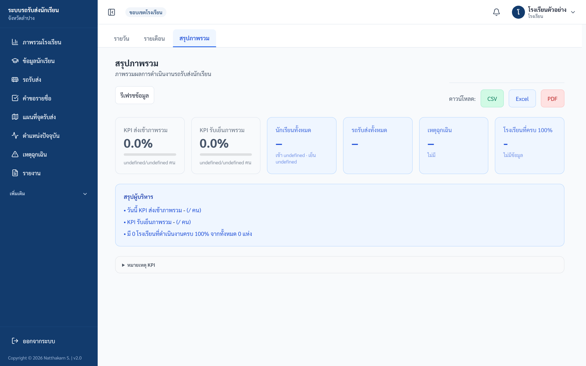

ภาพประกอบ: รายงานสรุป

## ตรวจรับหลังอบรม School Full

| ข้อ | งานทดสอบ | ผลที่ต้องได้ |
|---|---|---|
| 1 | เปิด dashboard | เห็นแถบสรุปวันนี้ งานที่ต้องทำ และตัวชี้วัด 4 ช่อง |
| 1a | เปิดหน้าเช็กชื่อขึ้น-ลงรถ แตะชื่อเด็ก แล้วกดยกเลิก | บันทึกและยกเลิกได้ |
| 2 | ค้นหานักเรียน | เห็นเฉพาะนักเรียนโรงเรียนตน |
| 3 | เปิด import preview | ตรวจไฟล์ก่อน commit ได้ |
| 4 | เปิดแผนที่จุดรับส่ง | เห็นข้อมูลโรงเรียนตน |
| 5 | สร้างบัญชีครูสายชั้น | บัญชีถูกจำกัดระดับชั้น |
| 6 | เปิดรายงาน | ดู/ส่งออกตามสิทธิ์ได้ |

