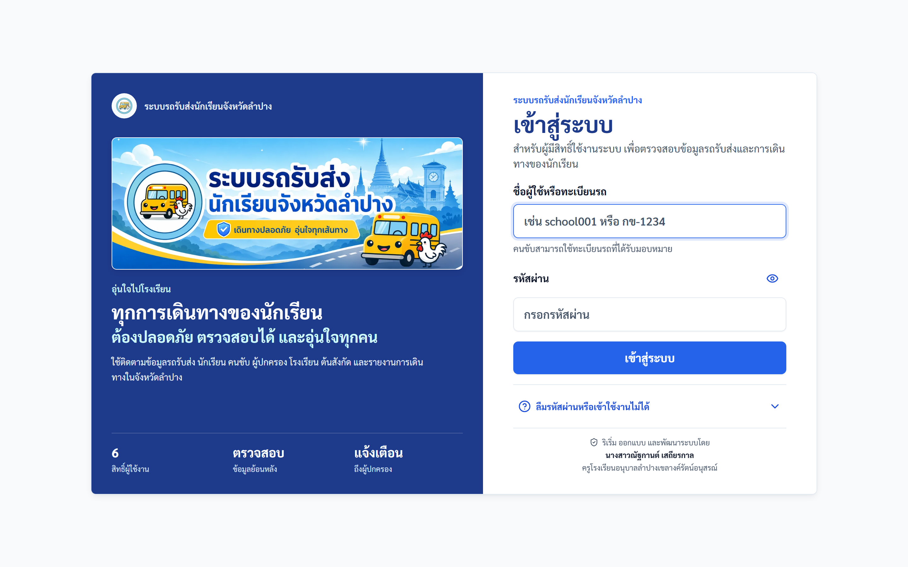
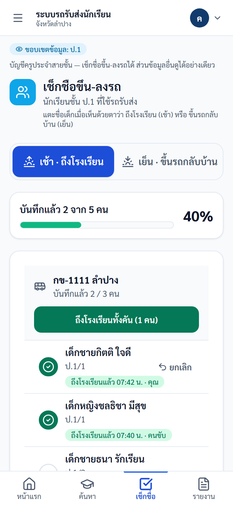
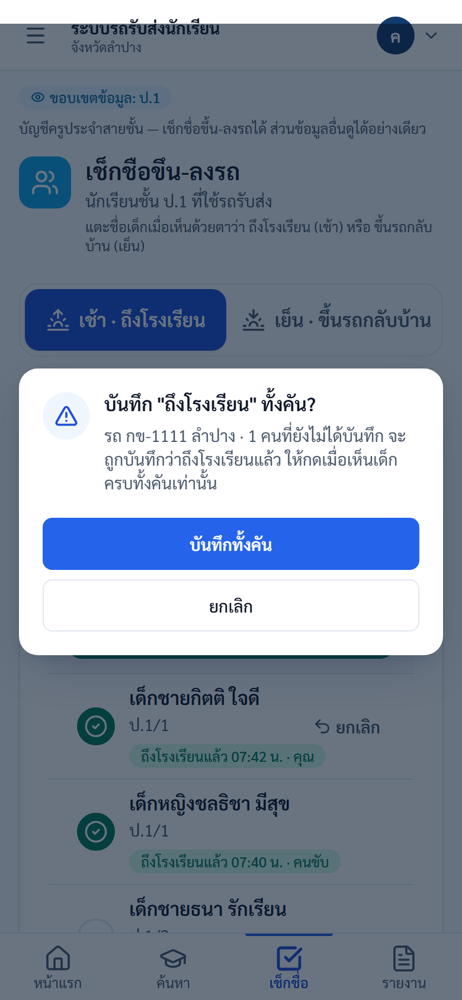
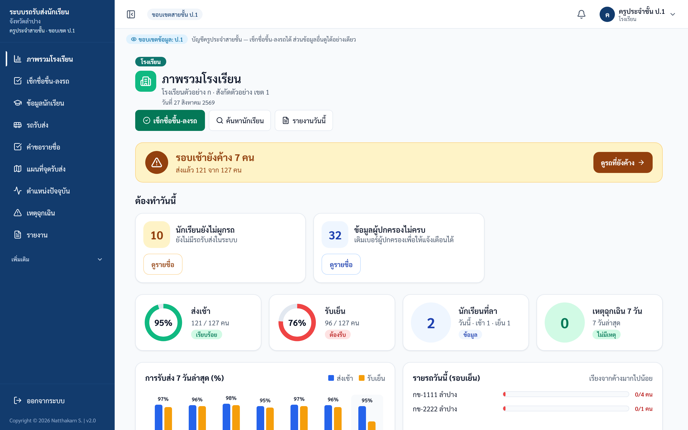

# คู่มือครูประจำสายชั้น (School Teacher / Grade Scope)

ปรับปรุงล่าสุด 2 ตุลาคม 2569 (ตรวจกับระบบจริง commit fd5d3f9)

> **ใหม่ตั้งแต่ภาคเรียนที่ 2 (12 ต.ค. 2569):** ครูประจำสายชั้น **เช็กชื่อขึ้น-ลงรถ** ของเด็กในชั้นตนเองได้ ดูหัวข้อ 2 และคู่มือฉบับเต็มพร้อมภาพหน้าจอมือถือที่ https://schoolbuslampang.com/manual/user-guide-teacher.html

## ขอบเขตสิทธิ์

บัญชีครูประจำสายชั้นเป็นบัญชี `school` ที่ถูกจำกัด `grade_scope` เห็นเฉพาะข้อมูลของระดับชั้นที่ได้รับมอบหมาย เหมาะสำหรับครูประจำชั้น/ครูเวรที่ต้องติดตามนักเรียนในชั้นของตน

## สิ่งที่ทำได้

| งาน | สถานะ |
|---|---|
| เช็กชื่อขึ้น-ลงรถ (เช้า = ถึงโรงเรียน, เย็น = ขึ้นรถกลับบ้าน) | ทำได้ — เฉพาะเด็กในชั้นของตน ไม่ต้องใส่เหตุผล |
| ยกเลิกรายการเช็กชื่อที่กดผิด | ทำได้ — เฉพาะรายการที่ตนเองกดในวันนั้น |
| ดูภาพรวมโรงเรียนแบบจำกัด | ทำได้ |
| ค้นหานักเรียนในระดับชั้นที่ได้รับสิทธิ์ | ทำได้ |
| ดูรถ/จุดรับส่ง/สถานะที่เกี่ยวข้อง | ทำได้ตามขอบเขต |
| ดูรายงานที่อนุญาต | ทำได้ — ตัวเลขและไฟล์ส่งออกจำกัดเฉพาะระดับชั้นของตน |
| Import นักเรียน | ถูกบล็อก — ไม่มีปุ่มนำเข้า และระบบปฏิเสธแม้เปิด URL ตรง |
| ตรวจลงทะเบียนรถ | ถูกบล็อก — เมนูไม่แสดง และระบบปฏิเสธแม้เปิด URL ตรง |
| จัดการบัญชีครู | ทำไม่ได้ |
| Audit log โรงเรียน | ถูกบล็อก |
| Bulk vehicles | ถูกบล็อก |
| ยืนยันแทนคนขับ (กรณีพิเศษ ต้องใส่เหตุผล) | ทำไม่ได้ — เป็นงานของบัญชีโรงเรียนหลัก |

นอกจากการเช็กชื่อขึ้น-ลงรถแล้ว ทุกอย่างยังเป็นการดูอย่างเดียว ป้ายด้านบนของหน้าจอจะเขียนว่า "บัญชีครูประจำสายชั้น — เช็กชื่อขึ้น-ลงรถได้ ส่วนข้อมูลอื่นดูได้อย่างเดียว"

> **หมายเหตุเรื่องหน้ารายงาน (ตรวจกับระบบจริง 6 ก.ย. 2569)**
>
> การจำกัดตาม `grade_scope` มีผลกับทุกหน้าในกลุ่มโรงเรียน **รวมถึงหน้ารายงานแล้ว**
> ทั้งตัวเลขบนหน้าจอและไฟล์ที่ส่งออก (CSV / Excel / PDF) นับเฉพาะนักเรียนใน
> ระดับชั้นที่ท่านได้รับมอบหมาย ไฟล์ที่ดาวน์โหลดจะไม่มีชื่อนักเรียนสายชั้นอื่น
> ด้านบนของหน้ารายงานจะมีป้าย "ขอบเขตข้อมูล:" ตามด้วยระดับชั้นของท่าน
> (เช่น "ขอบเขตข้อมูล: ป.4") พร้อมข้อความ "ตัวเลขทุกส่วนในหน้านี้นับเฉพาะสายชั้นของคุณ"
> กำกับไว้ เพื่อให้ท่านแยกออกว่าตัวเลขที่เห็นเป็นของสายชั้นตน ไม่ใช่ทั้งโรงเรียน

## 1. เข้าสู่ระบบ

ใช้ username ที่โรงเรียนหรือ Admin สร้างให้ จากนั้นเปลี่ยนรหัสผ่านครั้งแรกหากระบบบังคับ

ภาพประกอบ: หน้าเข้าสู่ระบบ

## 2. เช็กชื่อขึ้น-ลงรถ (ภาคเรียนที่ 2)

ครูยืนอยู่ที่โรงเรียน จึงบันทึกเฉพาะสิ่งที่เห็นที่โรงเรียน:
- **เช้า · ถึงโรงเรียน** — เด็กลงจากรถมาถึงโรงเรียนแล้ว
- **เย็น · ขึ้นรถกลับบ้าน** — เด็กขึ้นรถออกจากโรงเรียนแล้ว

ขั้นตอน:
1. เปิดหน้า "เช็กชื่อขึ้น-ลงรถ" จากแท็บ "เช็กชื่อ" ด้านล่างจอมือถือ ปุ่มสีเขียวในหน้าภาพรวม หรือเมนูด้านข้าง
2. ระบบเลือกรอบให้ตามเวลา (ก่อนเที่ยง = เช้า) เปลี่ยนได้ที่ปุ่มด้านบน
3. รายชื่อแยกตามคันรถ แตะชื่อเด็กเมื่อเห็นด้วยตาว่าถึงโรงเรียน/ขึ้นรถแล้ว
4. ถ้าเห็นครบทั้งคัน กดปุ่ม "ถึงโรงเรียนทั้งคัน (n คน)" หรือ "ขึ้นรถกลับบ้านทั้งคัน (n คน)" แล้วกด "บันทึกทั้งคัน" ในหน้าต่างยืนยัน
5. กดผิด: กด "ยกเลิก" ที่แถวนั้น (ยกเลิกได้เฉพาะรายการที่ตนเองกด ในวันนั้น)

ข้อควรรู้:
- คนขับยังเช็กชื่อในแอปได้ตามเดิม ใครบันทึกก่อนนับก่อน ถ้าขึ้นว่า "มีการบันทึกไว้แล้ว" แปลว่าคนขับหรือครูท่านอื่นบันทึกไปก่อน เป็นเรื่องปกติ
- ไม่ต้องใส่เหตุผล ระบบบันทึกเองว่าใครกด เวลาใด
- เด็กที่ลาจะขีดฆ่าชื่อพร้อมป้าย "ลา" และกดไม่ได้
- ผู้ปกครองจะเห็นสถานะใน LINE ว่า "ถึงโรงเรียนแล้ว" (เช้า) หรือ "ขึ้นรถกลับบ้านแล้ว" (เย็น)

ภาพประกอบ: หน้าเช็กชื่อขึ้น-ลงรถบนมือถือ

ภาพประกอบ: หน้าต่างยืนยันก่อนบันทึกทั้งคัน

## 3. ดูภาพรวมและข้อมูลนักเรียน

ภาพประกอบ: ภาพรวมที่ครูประจำสายชั้นเห็น — แถบสรุปวันนี้ งานที่ต้องทำ ตัวชี้วัด 4 ช่อง และกราฟ 7 วัน (ไม่มีปุ่ม "จัดการรถ" และ "ยืนยันแทนคนขับ")

ภาพประกอบ: รายชื่อนักเรียน โดยระบบจำกัดตามระดับชั้น

ข้อควรย้ำ:
- หากค้นหาไม่เจอนักเรียน อาจเป็นเพราะอยู่นอกระดับชั้นที่ได้รับสิทธิ์
- ครูสายชั้นไม่ควรใช้บัญชีโรงเรียนเต็มสิทธิ์แทน

## 4. ดูจุดรับส่งและตำแหน่งรถ

ภาพประกอบ: แผนที่จุดรับส่ง

ภาพประกอบ: ตำแหน่งรถ (บนมือถือเปิดจากเมนู ☰ เพราะแท็บล่างเปลี่ยนเป็น "เช็กชื่อ" แล้ว)

## 5. หน้าที่ถูกจำกัด

เมื่อเข้า URL ที่ไม่มีสิทธิ์ เช่น audit log หรือ teacher accounts ระบบต้องปฏิเสธที่ backend แม้เปิด URL ตรง

| URL/เมนู | เหตุผลที่ถูกจำกัด |
|---|---|
| `/school/audit-log` | เป็นข้อมูลตรวจสอบย้อนหลังของโรงเรียนเต็มสิทธิ์ |
| `/school/teacher-accounts` | เฉพาะโรงเรียนเต็มสิทธิ์เท่านั้น |
| `/school/bulk-vehicles` | กระทบข้อมูลรถของโรงเรียน |
| `/school/registration-review` (เมนู "ตรวจลงทะเบียนรถ" ของโรงเรียนเต็มสิทธิ์) | คำขอจดทะเบียนรถหนึ่งคำขอคือรายชื่อผู้โดยสารทั้งคันของคนขับ ซึ่งรวมนักเรียนทุกสายชั้น จึงแยกตามสายชั้นไม่ได้ หากเปิด URL ตรงจะเห็นการ์ด "หน้านี้เป็นงานระดับโรงเรียน" แทนรายการคำขอ |

## ตรวจรับหลังอบรม School Teacher

| ข้อ | งานทดสอบ | ผลที่ต้องได้ |
|---|---|---|
| 1 | Login ครูสายชั้น | เข้า dashboard ได้ |
| 2 | ค้นหานักเรียนในชั้น | เห็นข้อมูล |
| 2a | เปิดหน้าเช็กชื่อขึ้น-ลงรถ แตะชื่อเด็ก 1 คน แล้วกด "ยกเลิก" | บันทึกได้ และยกเลิกรายการของตนเองได้ |
| 2b | ดูรายชื่อในหน้าเช็กชื่อ | เห็นเฉพาะเด็กในชั้นของตน |
| 3 | ค้นหานักเรียนนอกชั้น | ไม่เห็นหรือถูกจำกัด |
| 4 | เปิด `/school/audit-log` | ถูกปฏิเสธ |
| 5 | เปิด `/school/teacher-accounts` | ถูกปฏิเสธ |

