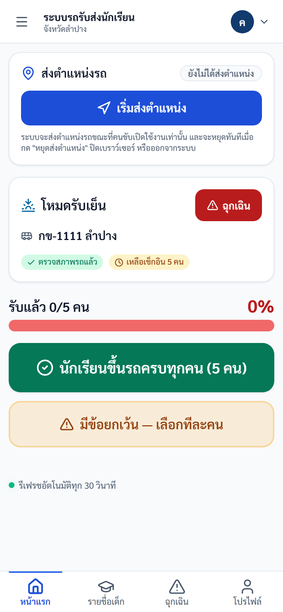

# คู่มือคนขับ (Driver)

## ขอบเขตสิทธิ์

คนขับใช้งานบนมือถือเป็นหลัก เพื่อเช็กชื่อขึ้น-ลงรถ ตรวจรถก่อนออก ส่งตำแหน่งรถ แจ้งเหตุฉุกเฉิน และส่งคำขอเปลี่ยนรายชื่อ

## งานประจำวัน

| ลำดับ | งาน |
|---|---|
| 1 | เข้าสู่ระบบด้วยทะเบียนรถ |
| 2 | ตรวจรถก่อนออก |
| 3 | ดูรายชื่อนักเรียน |
| 4 | เช็กชื่อรอบเช้า/เย็น |
| 5 | ส่งตำแหน่งรถ |
| 6 | แจ้งเหตุฉุกเฉินเมื่อจำเป็น |
| 7 | ตรวจคำขอ/โปรไฟล์ |

## 1. เข้าสู่ระบบ

1. เปิด https://schoolbuslampang.com บนมือถือ
2. กรอกทะเบียนรถในช่อง "ชื่อผู้ใช้ / ทะเบียนรถ"
3. กรอกรหัสผ่าน
4. กดเข้าสู่ระบบ

ภาพประกอบ: หน้าเข้าสู่ระบบมือถือ

### ถ้าเข้าระบบได้แล้วขึ้นว่า "บัญชีนี้ยังไม่ได้ผูกกับรถ"

หมายความว่าเข้าสู่ระบบสำเร็จแล้ว แต่ระบบยังไม่ทราบว่าคุณขับรถคันไหน
จึงยังแสดงรายชื่อนักเรียน ตรวจสภาพรถ หรือเช็กชื่อให้ไม่ได้ **ไม่ใช่รหัสผ่านผิด
และไม่ใช่ระบบเสีย** — เป็นขั้นตอนที่ยังทำไม่ครบเท่านั้น

สิ่งที่ต้องทำ

1. แจ้งโรงเรียนที่คุณรับส่งนักเรียน ว่าต้องการผูกบัญชีกับรถที่ขับ
2. แจ้งชื่อผู้ใช้ของคุณ และทะเบียนรถให้เจ้าหน้าที่โรงเรียน
3. เมื่อเจ้าหน้าที่ผูกให้เรียบร้อยแล้ว กดปุ่ม "ตรวจสอบอีกครั้ง" หรือเข้าสู่ระบบใหม่

> **สำหรับผู้จัดอบรม** ให้ตรวจสอบล่วงหน้าว่าบัญชีคนขับทุกคนที่จะเข้าอบรม
> ผูกกับรถเรียบร้อยแล้ว มิฉะนั้นผู้เข้าอบรมจะทำตามคู่มือตั้งแต่หัวข้อ 2
> เป็นต้นไปไม่ได้เลย

## 2. ตรวจรถก่อนออก

ต้องทำก่อนเริ่มเช็กชื่อ หากยังไม่ตรวจ ระบบจะล็อกการเช็กชื่อ

1. เปิดหน้าแรก
2. ตรวจรายการ เช่น ยาง ไฟ กระจก เบรก เข็มขัด ความสะอาด
3. กดบันทึกว่าปกติ หรือระบุรายการผิดปกติ

ภาพประกอบ: แบบฟอร์มตรวจรถก่อนออก

## 3. เช็กชื่อและรายชื่อนักเรียน

1. ดูรอบปัจจุบันว่าเป็นเช้าหรือเย็น
2. ตรวจรายชื่อนักเรียนที่รอดำเนินการ
3. กดเช็กทั้งคันเมื่อครบทุกคน หรือเลือกทีละคนเมื่อมีข้อยกเว้น
4. ตรวจกลุ่ม "เสร็จแล้ว" และ "ลาวันนี้"

ภาพประกอบ: หน้าแรกคนขับ

ภาพประกอบ: หน้าเช็กชื่อหลังตรวจรถ

ภาพประกอบ: รายชื่อนักเรียน

ภาพประกอบ: ฟอร์มเช็กชื่อรายคน

## 4. คำขอรายชื่อ

ใช้ส่งคำขอเพิ่ม/ถอนนักเรียนจากรายชื่อรถ โดยโรงเรียนเป็นผู้อนุมัติ

ภาพประกอบ: คำขอรายชื่อ

## 5. แผนที่จุดรับส่ง

ใช้ดูจุดรับส่งของนักเรียน และจัดการจุดรับส่งตามสิทธิ์ที่ระบบเปิดให้

ภาพประกอบ: แผนที่จุดรับส่ง

## 6. แจ้งเหตุฉุกเฉิน

ใช้เมื่อรถเสีย อุบัติเหตุ นักเรียนเจ็บป่วย หรือมีเหตุที่ต้องแจ้งโรงเรียน/หน่วยงานทันที

ภาพประกอบ: หน้าแจ้งเหตุฉุกเฉิน

## 7. โปรไฟล์

ใช้ดูข้อมูลคนขับ รถ และเปลี่ยนรหัสผ่าน

ภาพประกอบ: โปรไฟล์คนขับ

## ตรวจรับหลังอบรม Driver

| ข้อ | งานทดสอบ | ผลที่ต้องได้ |
|---|---|---|
| 1 | Login ด้วยทะเบียนรถ | เข้า driver dashboard ได้ |
| 2 | เปิด pre-trip | บันทึกตรวจรถได้ |
| 3 | เปิด roster | เห็นรายชื่อนักเรียนของรถตน |
| 4 | ทดสอบเช็กชื่อด้วยข้อมูลทดสอบ | บันทึกได้/กันกดซ้ำ |
| 5 | เปิด emergency | ส่งเหตุทดสอบได้เฉพาะเมื่อได้รับอนุมัติ |

