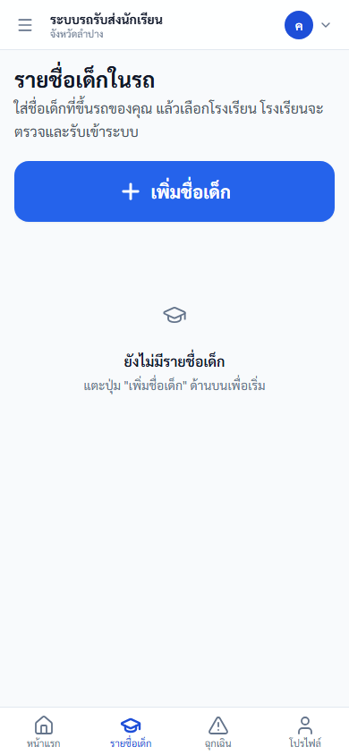

# คู่มือคนขับ (Driver)

ปรับปรุงล่าสุด 6 กันยายน 2569 (ตรวจกับระบบจริง commit 14caf5b)

## ขอบเขตสิทธิ์

คนขับใช้งานบนมือถือเป็นหลัก เพื่อเช็กชื่อขึ้น-ลงรถ ตรวจรถก่อนออก ส่งตำแหน่งรถ แจ้งเหตุฉุกเฉิน บันทึกรายชื่อเด็กที่ขึ้นรถให้โรงเรียนตรวจ และแนบเอกสารรถกับใบขับขี่ให้โรงเรียนและขนส่งตรวจ

## งานประจำวัน

| ลำดับ | งาน |
|---|---|
| 1 | เข้าสู่ระบบด้วยทะเบียนรถ |
| 2 | ตรวจรถก่อนออก |
| 3 | ดูรายชื่อนักเรียนที่ต้องรับส่งวันนี้ |
| 4 | เช็กชื่อรอบเช้า/เย็น |
| 5 | ส่งตำแหน่งรถ |
| 6 | แจ้งเหตุฉุกเฉินเมื่อจำเป็น |
| 7 | บันทึกรายชื่อเด็กที่ขึ้นรถ ที่เมนู "รายชื่อเด็กในรถ" (ทำเมื่อมีเด็กเพิ่มหรือถอนออก ไม่ต้องทำทุกวัน) |
| 8 | แนบเอกสารรถและใบขับขี่ ในหน้า "รายชื่อเด็กในรถ" หัวข้อ "เอกสารรถและคนขับ" (ทำเมื่อได้เอกสารใหม่) |
| 9 | ยื่นและติดตามการขึ้นทะเบียนรถ ที่เมนู "สถานะส่งตรวจรถ" (ไม่ต้องทำทุกวัน) |
| 10 | ตรวจข้อมูลคนขับและเปลี่ยนรหัสผ่าน ที่เมนู "ข้อมูลคนขับ" |

## 1. เข้าสู่ระบบ

1. เปิด https://schoolbuslampang.com บนมือถือ
2. กรอกทะเบียนรถในช่อง "ชื่อผู้ใช้หรือทะเบียนรถ"
3. กรอกรหัสผ่าน
4. กดเข้าสู่ระบบ

ภาพประกอบ: หน้าเข้าสู่ระบบมือถือ

### ถ้าเข้าระบบได้แล้วขึ้นว่า "บัญชีนี้ยังไม่ได้ผูกกับรถ"

หมายความว่าเข้าสู่ระบบสำเร็จแล้ว แต่ระบบยังไม่ทราบว่าคุณขับรถคันไหน
จึงยังแสดงรายชื่อนักเรียน ตรวจสภาพรถ หรือเช็กชื่อให้ไม่ได้ **ไม่ใช่รหัสผ่านผิด
และไม่ใช่ระบบเสีย** — เป็นขั้นตอนที่ยังทำไม่ครบเท่านั้น

สิ่งที่ต้องทำ

1. แจ้งโรงเรียนที่คุณรับส่งนักเรียน ว่าต้องการผูกบัญชีกับรถที่ขับ
2. แจ้งชื่อผู้ใช้ของคุณ และทะเบียนรถให้เจ้าหน้าที่โรงเรียน
3. เมื่อเจ้าหน้าที่ผูกให้เรียบร้อยแล้ว กดปุ่ม "ตรวจสอบอีกครั้ง" หรือเข้าสู่ระบบใหม่

> **สำหรับผู้จัดอบรม** ให้ตรวจสอบล่วงหน้าว่าบัญชีคนขับทุกคนที่จะเข้าอบรม
> ผูกกับรถเรียบร้อยแล้ว มิฉะนั้นผู้เข้าอบรมจะทำตามคู่มือตั้งแต่หัวข้อ 2
> เป็นต้นไปไม่ได้เลย

## 2. ตรวจรถก่อนออก

ต้องทำก่อนเริ่มเช็กชื่อ หากยังไม่ตรวจ ระบบจะล็อกการเช็กชื่อ

1. เปิดหน้าแรก
2. ตรวจรายการ เช่น ยาง ไฟ กระจก เบรก เข็มขัด ความสะอาด
3. กดบันทึกว่าปกติ หรือระบุรายการผิดปกติ

ภาพประกอบ: แบบฟอร์มตรวจรถก่อนออก

## 3. เช็กชื่อและรายชื่อนักเรียน

1. ดูรอบปัจจุบันว่าเป็นเช้าหรือเย็น
2. ตรวจรายชื่อนักเรียนที่รอดำเนินการ
3. กดเช็กทั้งคันเมื่อครบทุกคน หรือเลือกทีละคนเมื่อมีข้อยกเว้น
4. ตรวจกลุ่ม "เสร็จแล้ว" และ "ลาวันนี้"

ภาพประกอบ: หน้าแรกคนขับ

ภาพประกอบ: หน้าเช็กชื่อหลังตรวจรถ

ภาพประกอบ: หน้าเช็กชื่อหลังกด "มีข้อยกเว้น — เลือกทีละคน" จะเห็นหัวข้อ "รอดำเนินการ" และปุ่มของเด็กแต่ละคน (ภาพนี้เป็นรอบเย็น ปุ่มจึงขึ้นว่า "รับกลับบ้าน" ถ้าเป็นรอบเช้าจะขึ้นว่า "ขึ้นรถ") คู่กับปุ่ม "ลา"

## 4. รายชื่อเด็กในรถ (แท็บ "รายชื่อเด็ก")

เป็นงานที่คนขับใช้แทนการส่ง "คำขอรายชื่อ" แบบเดิม — ใส่ชื่อเด็กที่ขึ้นรถของคุณ เลือกโรงเรียน และเลือกว่าขึ้นรถรอบไหน แล้วโรงเรียนจะตรวจและรับเข้าระบบ

1. แตะแท็บ "รายชื่อเด็ก" ที่แถบล่าง (บนคอมพิวเตอร์อยู่ในแถบเมนูด้านข้าง ชื่อ "รายชื่อเด็กในรถ")
2. แตะปุ่มสีฟ้าใหญ่ "เพิ่มชื่อเด็ก"
3. กรอก 3 อย่าง: 1. ชื่อเด็ก · 2. โรงเรียน · 3. ขึ้นรถรอบไหน (เฉพาะเช้า / เฉพาะเย็น / เช้าและเย็น) แล้วแตะ "บันทึก" (ถ้าทราบชั้นหรือรหัสนักเรียน แตะ "ใส่ชั้น/รหัสนักเรียน (ถ้าทราบ)" เพิ่มได้ ไม่บังคับ)
4. เลื่อนลงล่างสุดของหน้าเดียวกัน ถึงหัวข้อ "เอกสารรถและคนขับ" แตะ "แนบเอกสาร" ระบบจะถามว่า "แนบเอกสารอะไร?" ให้เลือก เล่มทะเบียนรถ · พ.ร.บ. · ป้ายภาษีรถ · ประกันภัยรถ · ใบขับขี่ · เอกสารอื่น ๆ แล้วถ่ายรูปหรือเลือกไฟล์ PDF (ไฟล์ละไม่เกิน 5 MB)

ป้ายสถานะเด็ก: รอโรงเรียนตรวจ / โรงเรียนรับแล้ว / ต้องแก้ไข / ไม่รับ
ป้ายสถานะเอกสาร: รอตรวจ / ผ่านแล้ว / ไม่ผ่าน — แนบใหม่

ภาพประกอบ: ยังไม่มีภาพหน้าจอของหน้า "รายชื่อเด็กในรถ" เองในชุดภาพปัจจุบัน — ดูภาพแถบล่างบนมือถือในหัวข้อ 3 ซึ่งปุ่มที่สองขึ้นว่า "รายชื่อเด็ก" เมื่อฟีเจอร์นี้เปิดใช้งาน

> **หมายเหตุสำหรับผู้จัดอบรม** เมนูเดิม "คำขอรายชื่อ" ถูกซ่อนอัตโนมัติขณะที่ฟีเจอร์ "รายชื่อเด็กในรถ" เปิดใช้งาน จึงไม่ต้องสอนงานคำขอรายชื่อในรอบอบรมนี้

## 4.1 ขึ้นทะเบียนรถ (เมนู "สถานะส่งตรวจรถ")

เปิดแถบเมนูด้านข้าง (☰) → "สถานะส่งตรวจรถ" → ปุ่ม "ยื่นคำขอ" → เลือกรถ → "ยื่นคำขอ"
ติดตามผลได้ที่ "คำขอที่ดำเนินการอยู่" และ "ประวัติ" สถานะเริ่มต้นคือ "รอโรงเรียนตรวจสอบ"

ถ้าหน้านี้ขึ้นว่า "ยังไม่มีคำขอขึ้นทะเบียน" และไม่เห็นปุ่ม "ยื่นคำขอ" แปลว่าบัญชีของคุณยังไม่มีรถที่ได้รับอนุญาต ให้ติดต่อโรงเรียนหรือสังกัดก่อน

## 5. แผนที่จุดรับส่ง

ใช้ดูจุดรับส่งของนักเรียน และจัดการจุดรับส่งตามสิทธิ์ที่ระบบเปิดให้

ภาพประกอบ: แผนที่จุดรับส่ง

## 6. แจ้งเหตุฉุกเฉิน

ใช้เมื่อรถเสีย อุบัติเหตุ นักเรียนเจ็บป่วย หรือมีเหตุที่ต้องแจ้งโรงเรียน/หน่วยงานทันที

ภาพประกอบ: หน้าแจ้งเหตุฉุกเฉิน

## 7. โปรไฟล์

ใช้ดูข้อมูลคนขับ รถ และเปลี่ยนรหัสผ่าน

ภาพประกอบ: โปรไฟล์คนขับ

## ตรวจรับหลังอบรม Driver

| ข้อ | งานทดสอบ | ผลที่ต้องได้ |
|---|---|---|
| 1 | Login ด้วยทะเบียนรถ | เข้า driver dashboard ได้ |
| 2 | เปิด pre-trip | บันทึกตรวจรถได้ |
| 3 | เปิด roster | เห็นรายชื่อนักเรียนของรถตน |
| 4 | ทดสอบเช็กชื่อด้วยข้อมูลทดสอบ | บันทึกได้/กันกดซ้ำ |
| 5 | เปิด emergency | ส่งเหตุทดสอบได้เฉพาะเมื่อได้รับอนุมัติ |

