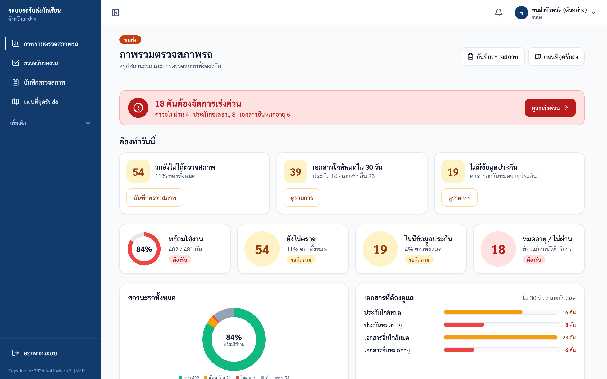
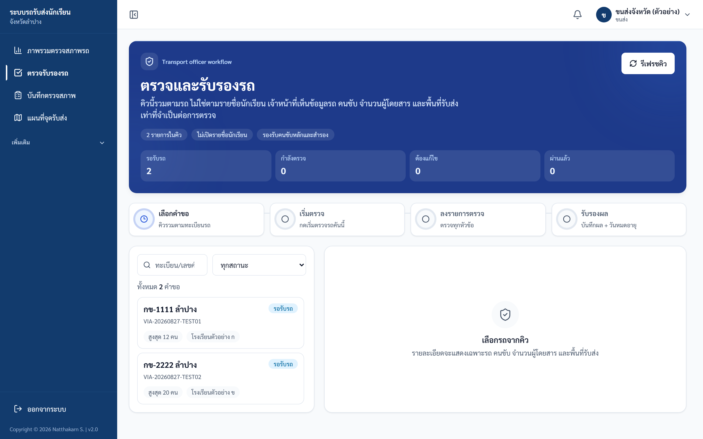
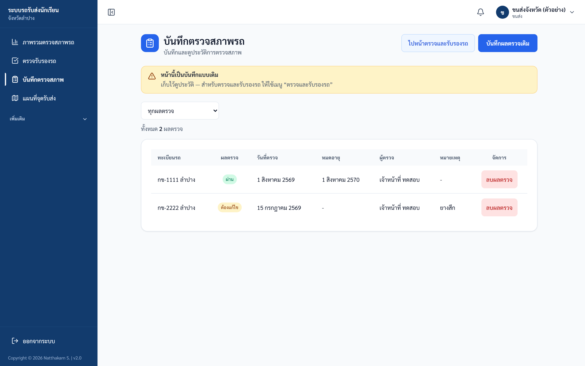
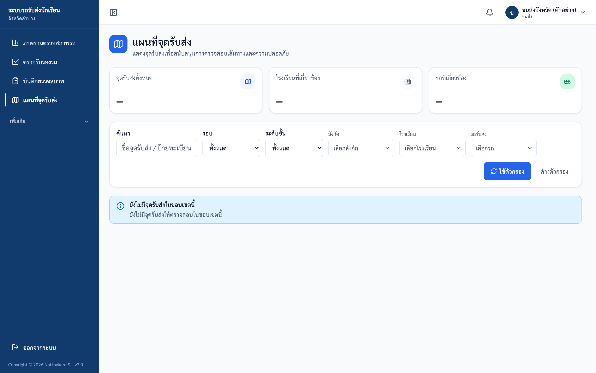

# คู่มือขนส่ง (Transport)

ปรับปรุงล่าสุด 2 ตุลาคม 2569 (ตรวจกับระบบจริง commit fd5d3f9)

## ขอบเขตสิทธิ์

Transport ใช้ตรวจข้อมูลรถ ตรวจสภาพรถ และดำเนินการคิวตรวจรับรองรถ โดยไม่ควรเห็นข้อมูลส่วนบุคคลของนักเรียนเกินจำเป็น

## เมนูหลัก

| เมนู (ตามที่เห็นในแถบเมนูซ้าย) | งาน |
|---|---|
| ภาพรวมตรวจสภาพรถ | แถบสรุป งานที่ต้องทำ ตัวชี้วัด กราฟสถานะรถ และรายการรถที่เรียงตามความเสี่ยง |
| ตรวจรับรองรถ | คิวคำขอส่งตรวจ — ตรวจเอกสาร ลงรายการตรวจทีละหัวข้อ แล้วรับรองผล (ชื่อหัวข้อในหน้าคือ "ตรวจและรับรองรถ") |
| บันทึกตรวจสภาพ | ฟอร์มบันทึกผลตรวจแบบเดิม และดูประวัติการตรวจย้อนหลัง |
| แผนที่จุดรับส่ง | ดูภาพรวมจุดรับส่ง (ไม่แสดงรายชื่อนักเรียน) |

> **หมายเหตุเรื่องเมนู (ตรวจกับระบบจริง 6 ก.ย. 2569)**
> แถบเมนูซ้ายของขนส่งมี 4 รายการตามตารางข้างต้น และหมวด "เพิ่มเติม" ที่พับไว้ (เรื่องที่ต้องมีส่วนร่วม · สรุปการมีส่วนร่วม) ไม่มีเมนู "รายการรถ"
> หน้ารายการรถทั้งหมดยังเปิดได้จากที่อยู่เว็บ https://schoolbuslampang.com/transport/vehicles โดยตรง แต่ไม่มีลิงก์ในเมนูและไม่ได้ใช้ในการอบรม
> เมนู "เรื่องที่ต้องมีส่วนร่วม" เปิดใช้งานแล้วตั้งแต่ 7 กันยายน 2569 อยู่ใต้ "เพิ่มเติม" ขนส่งจะเห็นเฉพาะเรื่องที่ผู้ยื่น**เลือกขอบเขตเป็น "ขนส่ง"** ตอนยื่น ไม่ได้แบ่งตามว่าเนื้อหาเกี่ยวกับการตรวจสภาพรถหรือไม่ เรื่องเกี่ยวกับรถที่ยื่นในขอบเขตโรงเรียนจะไม่ปรากฏให้ขนส่งเห็น
> เมื่อเปิดบนมือถือ แถบปุ่มด้านล่างจะใช้ชื่อย่อ 4 ปุ่ม คือ หน้าแรก / ตรวจเอกสาร / ตรวจรถ / แผนที่

## 1. ภาพรวมตรวจสภาพรถ

หน้าภาพรวมอ่านจากบนลงล่าง:
1. **แถบสรุป** — เช่น "N คันต้องจัดการเร่งด่วน" (แดง) พร้อมรายละเอียดและปุ่ม "ดูรถเร่งด่วน" (รถคันเดียวอาจนับซ้ำได้ถ้ามีหลายปัญหา)
2. **ต้องทำวันนี้** — รถยังไม่ได้ตรวจสภาพ, เอกสารใกล้หมดใน 30 วัน, ไม่มีข้อมูลประกัน
3. **ตัวชี้วัด 4 ช่อง** — พร้อมใช้งาน (วงแหวน %), ยังไม่ตรวจ, ไม่มีข้อมูลประกัน, หมดอายุ / ไม่ผ่าน
4. **กราฟ** — สถานะรถทั้งหมด (ผ่าน / ต้องแก้ไข / ไม่ผ่าน / ยังไม่ตรวจ) และเอกสารที่ต้องดูแล (ประกันใกล้หมด/หมดอายุ · เอกสารอื่นใกล้หมด/หมดอายุ — ยังไม่มีตัวเลขแยกทะเบียน พ.ร.บ. ภาษี)
5. **รายการรถ** — ตัวกรอง 5 กลุ่ม: ทั้งหมด · เร่งด่วน · รอตรวจ · ใกล้หมด · พร้อมใช้ และช่องค้นหาทะเบียน

> รายการรถแสดงได้สูงสุด 100 คัน ถ้ามีรถมากกว่านั้น หัวรายการจะเขียน "แสดง X คันจากทั้งหมด Y คัน" และตัวเลขบนปุ่มกรองนับเฉพาะรถที่แสดงอยู่ ตัวเลขรวมทั้งจังหวัดให้ดูจากการ์ดตัวชี้วัดด้านบน

ภาพประกอบ: Dashboard ขนส่ง

## 2. ตรวจรับรองรถ

1. เปิดเมนู "ตรวจรับรองรถ" แล้วเลือกคำขอจากคิว (ค้นหาด้วยทะเบียนรถ เลขคำขอ หรือชื่อโรงเรียน)
2. แท็บ "ตรวจรถ" ดูข้อมูลรถ ความจุ จำนวนผู้โดยสารแยกตามโรงเรียน และพื้นที่รับส่ง
3. แท็บ "คนขับของรถ" เพิ่มสิทธิ์คนขับหลัก/คนขับสำรอง และรับรองใบอนุญาตคนขับ
4. ตรวจไฟล์ในกล่อง "เอกสารรถและคนขับ (หลักฐานประกอบ)" แล้วกด "ผ่าน" หรือ "ไม่ผ่าน" (ถ้ากด "ไม่ผ่าน" ต้องระบุเหตุผลที่ไม่ผ่าน)
5. กดปุ่ม "เริ่มตรวจรถคันนี้" แล้วลงผลให้ครบทุกหัวข้อ หัวข้อที่ไม่ผ่านต้องระบุรายละเอียด
6. เลือกผลรวม "ผ่าน" / "ต้องแก้ไข" / "ไม่ผ่าน" / "รอข้อมูลเพิ่ม" ถ้าเลือก "ผ่าน" ต้องระบุวันหมดอายุ แล้วกด "ยืนยันผลตรวจ"

ข้อควรรู้

- ถ้ามีหัวข้อที่ตรวจไม่ผ่าน แต่เลือกผลรวมเป็น "ผ่าน" ระบบจะไม่บันทึกให้ และขึ้นข้อความ "ไม่สามารถรับรองว่าผ่านเมื่อมีหัวข้อตรวจไม่ผ่าน"
- การตรวจแต่ละครั้ง เจ้าหน้าที่ขนส่งที่กด "เริ่มตรวจรถคันนี้" เป็นผู้สรุปผลหรือกด "ยกเลิกการตรวจ" ครั้งนั้น เจ้าหน้าที่คนอื่นทำแทนไม่ได้ (ผู้ดูแลระบบยกเลิกให้ได้)

ภาพประกอบ: หน้าตรวจและรับรองรถ (คิวคำขอส่งตรวจ)

## 3. บันทึกตรวจสภาพ

1. เปิดเมนู "บันทึกตรวจสภาพ" หน้านี้จะขึ้นแถบเตือน "หน้านี้เป็นบันทึกแบบเดิม" (ใช้เก็บและดูประวัติผลตรวจ)
2. กดปุ่ม "บันทึกผลตรวจเดิม" เพื่อเปิดฟอร์ม แล้วเลือกรถในช่อง "เลือกรถ" (พิมพ์ในช่อง "ค้นหาทะเบียนรถ" เพื่อกรองรายการได้ ถ้ายังไม่มีรถคันนั้นให้เลือก "อื่นๆ (เพิ่มทะเบียนรถใหม่)")
3. เลือก "ผลตรวจ" และตรวจ "วันที่ตรวจ" — ระบบใส่วันที่ของวันนี้ตามเวลาประเทศไทยให้แล้ว และใส่วันในอนาคตไม่ได้
4. ถ้าผลตรวจเป็น "ผ่าน" ต้องใส่ "วันหมดอายุผลตรวจ" ด้วย ถ้าไม่ใส่ระบบจะบันทึกไม่ได้
5. ใส่ "โรงเรียนที่ออกใบรับรอง" และ "หมายเหตุ" ถ้ามี แล้วกด "บันทึกผลตรวจ"
6. ตารางประวัติการตรวจสภาพรถด้านล่างมีปุ่ม "ลบผลตรวจ" ทุกแถว ลบได้เฉพาะผลตรวจที่ตนเองเป็นผู้บันทึก

ภาพประกอบ: บันทึกตรวจสภาพรถ

## 4. แผนที่จุดรับส่ง

ภาพประกอบ: แผนที่จุดรับส่งสำหรับขนส่ง (ตัวอย่างขณะยังไม่มีข้อมูลในขอบเขตที่กรอง — เมื่อมีข้อมูลจะแสดงแผนที่พร้อมหมุดให้กดดูรายละเอียด)

## ตรวจรับหลังอบรม Transport

| ข้อ | งานทดสอบ | ผลที่ต้องได้ |
|---|---|---|
| 1 | เปิด dashboard | เห็นแถบสรุป ตัวชี้วัด 4 ช่อง และตัวกรอง 5 กลุ่ม |
| 2 | เปิดรายการตรวจรับรอง | เห็นคิวตรวจ |
| 3 | เปิดฟอร์มตรวจสภาพ | กรอกข้อมูลได้ |
| 4 | เปิด pickup map | เห็นภาพรวมโดยไม่เปิดเผย PII เกินจำเป็น |

