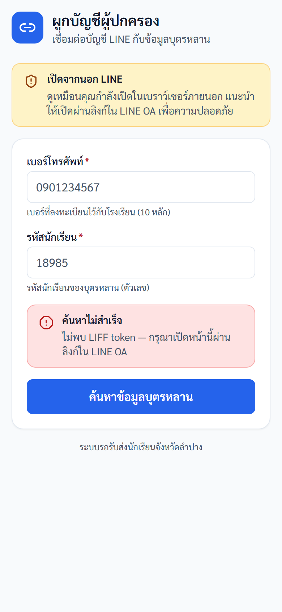
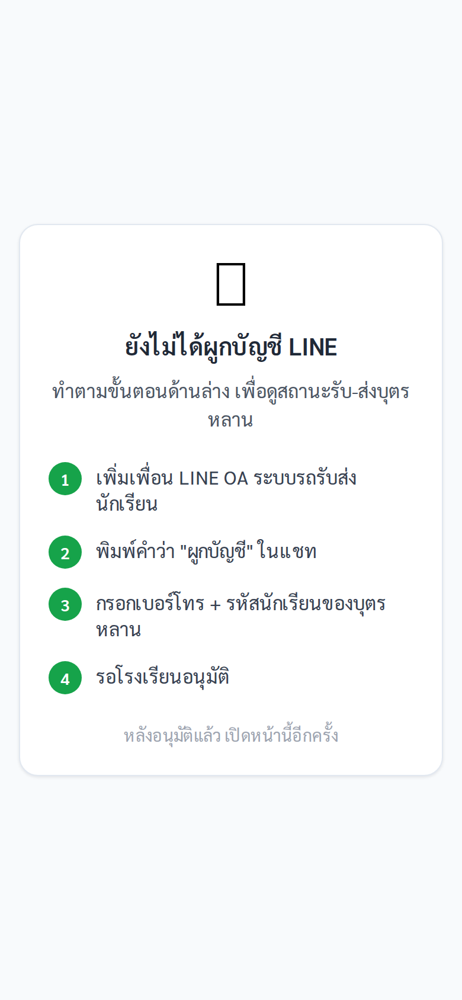
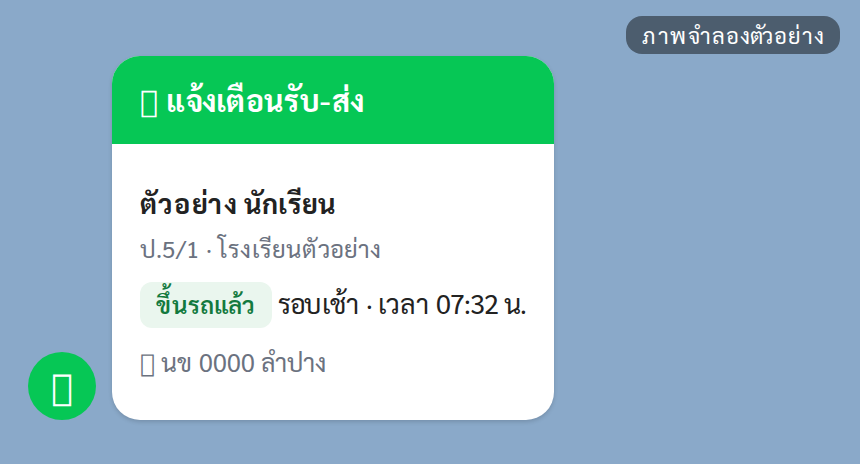
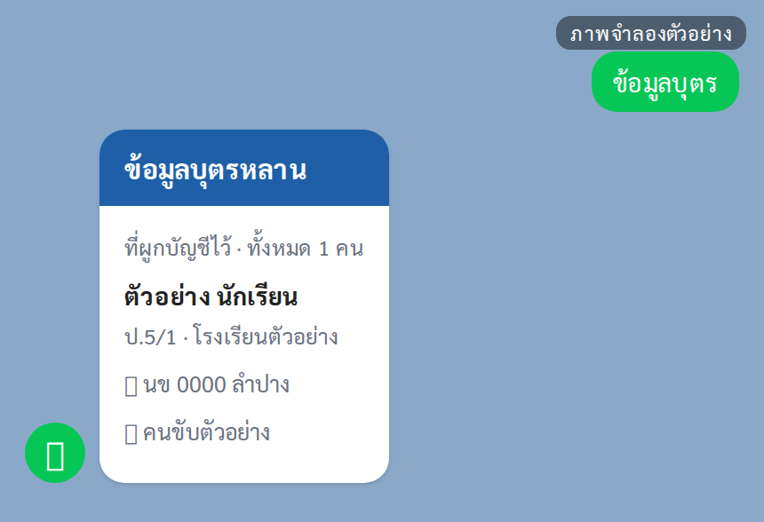
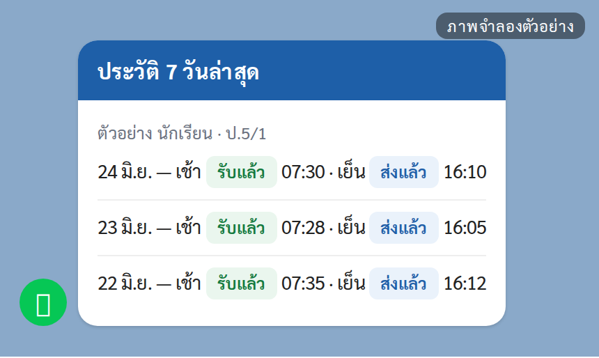
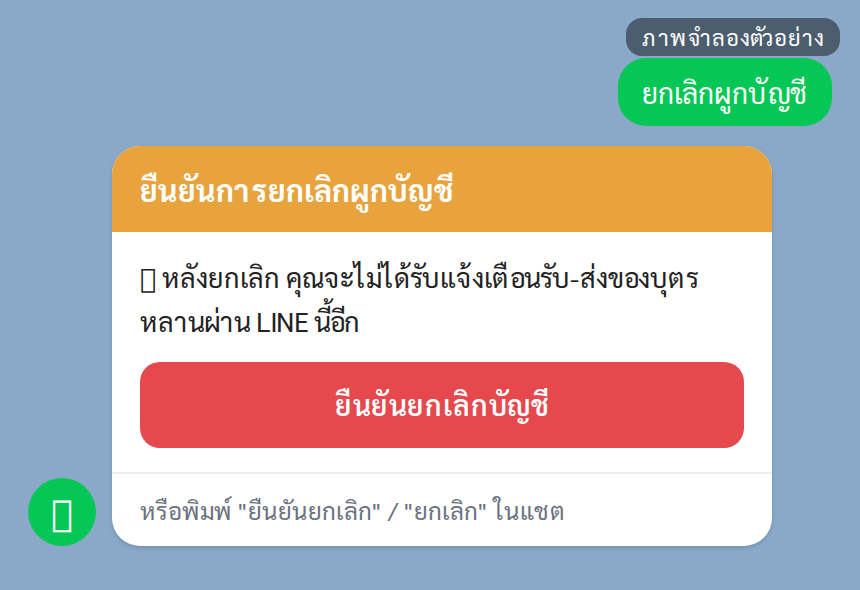
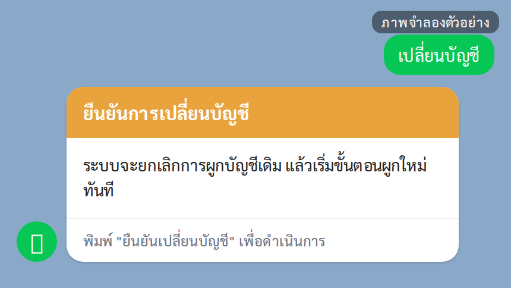

# คู่มือผู้ปกครองและ LINE OA (Parent/LINE)

ปรับปรุงล่าสุด 6 กันยายน 2569 (ตรวจกับระบบจริง commit 14caf5b)

## ขอบเขตสิทธิ์

ผู้ปกครองใช้งานผ่าน LINE Official Account และหน้า LIFF เพื่อผูกบัญชี ดูสถานะรับส่งบุตรหลาน รับแจ้งเตือน และดูประวัติย้อนหลัง เฉพาะบุตรหลานที่ผูกบัญชีและได้รับอนุมัติเท่านั้น

## สิ่งที่ผู้ปกครองทำได้

| งาน | ช่องทาง |
|---|---|
| ผูกบัญชี | LINE chat หรือ LIFF |
| ดูสถานะวันนี้ | LINE chat หรือ LIFF |
| รับแจ้งเตือน | LINE chat |
| ดูข้อมูลบุตรหลาน | LINE chat หรือ LIFF |
| ดูประวัติย้อนหลัง | LIFF |
| ยกเลิก/เปลี่ยนบัญชี | LINE chat |

## 1. ผูกบัญชี

ข้อมูลที่ต้องใช้:
- เบอร์โทรผู้ปกครอง 10 หลัก
- รหัสนักเรียน
- โรงเรียนต้องมีข้อมูลผู้ปกครองในระบบแล้ว

ขั้นตอนผ่าน LIFF:
1. เปิดลิงก์ผูกบัญชีจาก LINE OA
2. กรอกเบอร์โทรและรหัสนักเรียน
3. กดค้นหาข้อมูล
4. ตรวจชื่อนักเรียน/โรงเรียน
5. กดยืนยันผูกบัญชี

ภาพประกอบ: หน้า LIFF ผูกบัญชี (ภาพนี้ถ่ายนอกแอป LINE จึงมีแถบ "เปิดจากนอก LINE" และข้อความ "ไม่พบ LIFF token" ติดมาด้วย — เมื่อเปิดจากลิงก์ในแชต LINE จะไม่มีสองแถบนี้)

## 2. ดูสถานะรับส่งวันนี้

ขั้นตอนผ่าน LINE chat:
1. พิมพ์ "สถานะ" ในห้องแชต
2. ระบบส่งการ์ด "สถานะรับ-ส่งวันนี้" ของบุตรหลานที่ผูกบัญชีไว้ทุกคนมาในใบเดียว ไม่ต้องเลือกทีละคน (แสดงได้สูงสุด 3 คน ถ้ามีมากกว่านั้นจะมีบรรทัด "แสดง 3 จาก N คน · มีข้อมูลเพิ่มเติม กรุณาติดต่อโรงเรียน")
3. ในการ์ดมีช่อง "รอบเช้า" และ "รอบเย็น" — เมื่อเช็กชื่อแล้วจะขึ้น "ขึ้นรถแล้ว" / "ส่งถึงจุดรับแล้ว" พร้อมเวลา ถ้ายังไม่เช็กจะขึ้น "ยังไม่ขึ้นรถ" / "ยังไม่ส่งถึงจุดรับ"

ขั้นตอนผ่าน LIFF:
1. เปิดหน้า LIFF ผู้ปกครองจาก LINE OA
2. กดปุ่ม "สถานะวันนี้" บนการ์ดของบุตรหลานที่ต้องการ
3. ดูการ์ด "ส่งเช้า" และ "รับเย็น" — เมื่อเช็กชื่อแล้วจะขึ้นเวลา ถ้ายังไม่เช็กจะขึ้น "ยังไม่ส่ง" / "ยังไม่รับ"

ภาพประกอบ: หน้าจอเมื่อระบบยังอ่านบัญชี LINE ไม่ได้ หรือยังไม่ได้ผูกบัญชี — ยังไม่ใช่หน้าสถานะ (ถ้าเปิดจากลิงก์ในแชต LINE จะเข้าหน้ารายชื่อบุตรหลานและหน้าสถานะได้ตามปกติ)

## 3. รับแจ้งเตือน

เมื่อคนขับเช็กชื่อ ระบบจะส่งข้อความแจ้งเตือนให้ผู้ปกครองที่ผูกบัญชีแล้ว

ภาพประกอบ: ภาพจำลองแนวคิดการแจ้งเตือน — ของจริงมาเป็นข้อความธรรมดา 5 บรรทัด ขึ้นต้นด้วย "📢 แจ้งเตือน: ส่งเช้า" แล้วตามด้วย "นักเรียน: …", "สถานะ: CHECKED_IN", "รอบ: เช้า" และ "เวลา: …" (ไม่ใช่การ์ดสีเขียวอย่างในภาพ)

## 4. ดูข้อมูลบุตรหลานและประวัติ

ภาพประกอบ: ภาพจำลองการ์ด "ข้อมูลบุตรหลาน" — การ์ดจริงจะขึ้นหัวข้อรองว่า "ที่ผูกบัญชีไว้" เมื่อมีบุตรหลานคนเดียว หรือ "ทั้งหมด N คน" เมื่อมีหลายคน

ภาพประกอบ: ภาพจำลองประวัติย้อนหลัง — หน้าจอจริงแสดงเป็นรายการ 1 บรรทัดต่อ 1 รอบ (วันที่ · "ส่งเช้า"/"รับเย็น" · สถานะ · เวลา)

## 5. ยกเลิกหรือเปลี่ยนบัญชี

ใช้เมื่อเปลี่ยนเครื่อง เปลี่ยน LINE หรือผูกผิดคน

ภาพประกอบ: ภาพจำลองการ์ดยืนยันยกเลิกผูกบัญชี — การ์ดจริงจะแสดงรายชื่อบุตรหลานที่ผูกอยู่ และมีปุ่ม "ไม่ยกเลิก" อยู่ใต้ปุ่มสีแดงด้วย

ภาพประกอบ: เปลี่ยนบัญชี

## ข้อจำกัดที่ต้องแจ้งผู้ปกครอง

| เรื่อง | คำอธิบาย |
|---|---|
| เปิดใน browser ภายนอก | อาจยืนยันตัวตน LINE ไม่ได้ ควรเปิดจาก LINE |
| ข้อมูลไม่พบ | ให้ตรวจเบอร์โทร/รหัสนักเรียนกับโรงเรียน |
| พี่น้องหลายคน | ต้องให้โรงเรียนตรวจการผูกข้อมูลให้ครบ |
| รายงาน | ผู้ปกครองไม่มีสิทธิ์ export รายงาน |
| ETA/QR | ยังไม่เปิดใช้งานบนระบบจริง (FEATURE_ETA และ FEATURE_VEHICLE_QR ปิดอยู่) — ปุ่ม "ETA" ยังกดได้แต่การ์ดจะไม่มีข้อมูล ส่วน QR ที่รถยังเปิดหน้าไม่ได้ |

## ตรวจรับหลังอบรม Parent/LINE

| ข้อ | งานทดสอบ | ผลที่ต้องได้ |
|---|---|---|
| 1 | เปิด LIFF `/parent/link` จากลิงก์ใน LINE OA | เห็นหัวข้อ "ผูกบัญชีผู้ปกครอง" พร้อมช่อง "เบอร์โทรศัพท์" และ "รหัสนักเรียน" โดยไม่มีแถบ "เปิดจากนอก LINE" และไม่มีกล่องแดง "ค้นหาไม่สำเร็จ" |
| 2 | เปิด LIFF `/parent` จากลิงก์ใน LINE OA | เห็นข้อความ "บุตรหลานของคุณ (… คน)" และรายชื่อนักเรียนทดสอบ (ถ้าขึ้น "ยังไม่ได้ผูกบัญชี LINE" แปลว่ายังไม่ผูก หรือไม่ได้เปิดจาก LINE) |
| 3 | ผูกบัญชีด้วย test identity | เห็นหน้า "ผูกบัญชีสำเร็จ" ใน LIFF และได้การ์ด "ผูกบัญชีสำเร็จ" ในแชต LINE OA |
| 4 | พิมพ์ "สถานะ" | ได้การ์ด "สถานะรับ-ส่งวันนี้" แสดง "รอบเช้า" และ "รอบเย็น" ของนักเรียนทดสอบ |
| 5 | พิมพ์ "ยกเลิกผูกบัญชี" แล้วกด "ยืนยันยกเลิกบัญชี" | ได้การ์ด "ยืนยันการยกเลิกผูกบัญชี" ก่อน แล้วจึงได้การ์ด "ยกเลิกผูกบัญชีสำเร็จ" (ถ้าไม่ต้องการยกเลิกจริง ให้กด "ไม่ยกเลิก") |

