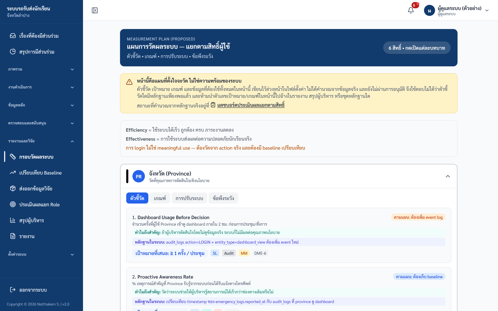
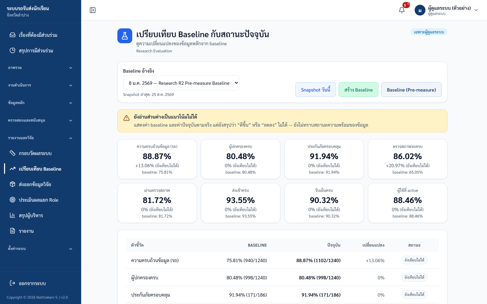
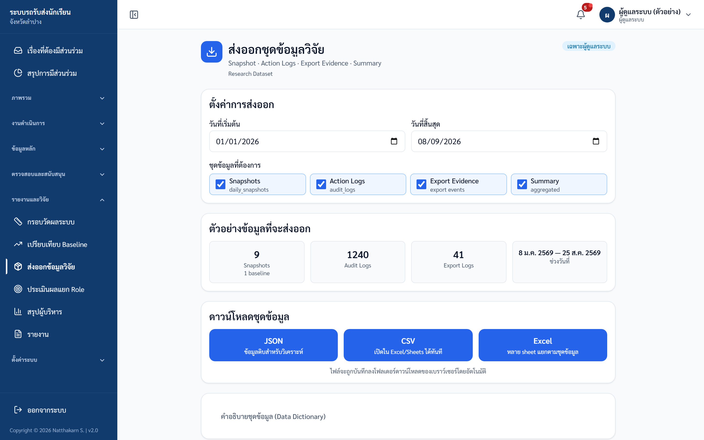
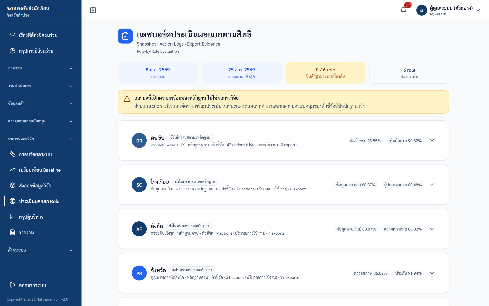
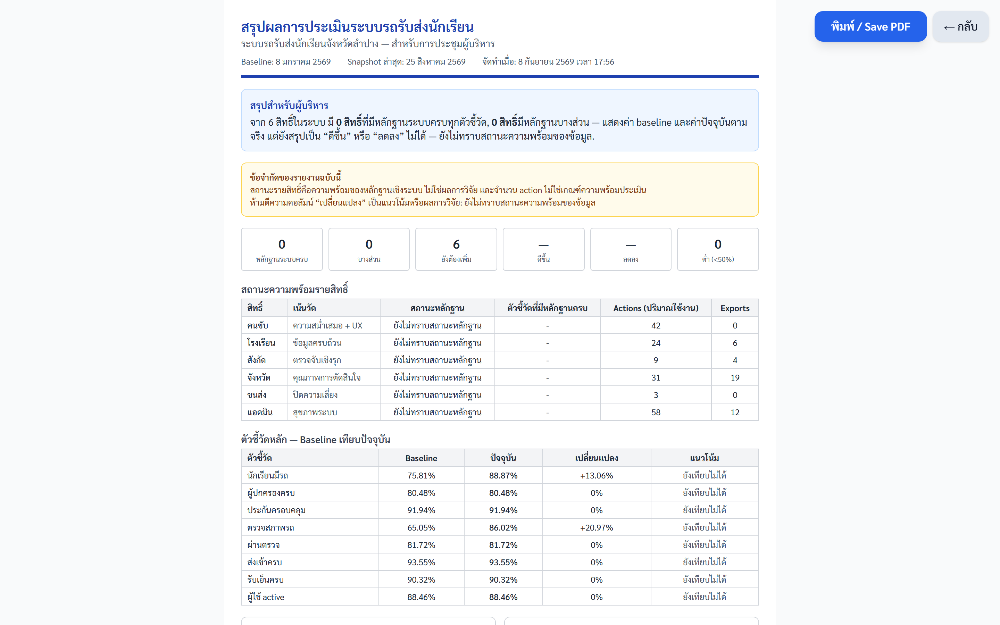
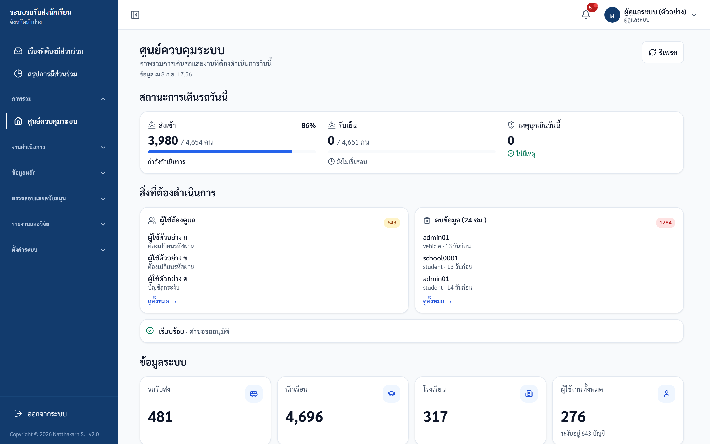

# คู่มือปฏิบัติงาน — ผู้ดูแลระบบ (Admin)
> ระบบรถรับส่งนักเรียนจังหวัดลำปาง — https://schoolbuslampang.com
> เวอร์ชัน Phase 10.13C • อัปเดต 2026-06-24

> 📷 **หมายเหตุภาพหน้าจอ:** ข้อมูลส่วนบุคคล (ชื่อนักเรียน/ผู้ปกครอง เบอร์โทร) ในภาพถูกเบลอเพื่อความเป็นส่วนตัว — เมื่อใช้งานจริงจะแสดงข้อมูลตามปกติ

## ภาพรวม 30 วินาที
- **บทบาทนี้ทำอะไรได้:**
  - จัดการบัญชีผู้ใช้ทุกบทบาท (คนขับ/โรงเรียน/สังกัด/จังหวัด/ขนส่ง/ผู้ดูแลระบบ) — สร้าง แก้ไข รีเซ็ตรหัส เปิด/ปิด
  - ดูประวัติการใช้งานทั้งระบบ (audit log) + ส่งออก CSV
  - อนุมัติคำขอโอนย้ายนักเรียน และคำขอเกี่ยวกับรถ (กู้คืน/เพิ่ม/ตรวจสอบ)
  - ดูแลสุขภาพข้อมูลคนขับ + ใช้ wizard กู้คืน/ย้าย/ปิดคนขับ
  - ตรวจสอบจุดรับส่งและตำแหน่งรถ (GPS) ทั้งระบบ, ดูความพร้อมเปิดใช้งาน + สุขภาพระบบ
  - เข้าใช้ทุกโมดูล (โรงเรียน/สังกัด/จังหวัด/ขนส่ง/รายงาน) + หน้างานวิจัย/ประเมินผล (เป็นสิทธิ์สูงสุดของระบบ)
- **เข้าระบบด้วย:** ชื่อผู้ใช้ (username) ของบัญชี admin (ไม่ใช่ทะเบียนรถ) — บัญชีสร้างโดยระบบติดตั้งครั้งแรก หรือ admin อีกคน
- **อุปกรณ์ที่แนะนำ:** คอมพิวเตอร์ (desktop) เป็นหลัก เพราะมีตาราง/ฟอร์ม/รายงานเยอะ และเห็นแถบเมนูด้านข้างครบ — มือถือ/แท็บเล็ตใช้ดูข้อมูลเร่งด่วนได้แต่ไม่เหมาะกับงานจัดการซับซ้อน

## สารบัญงาน
| # | งาน | ใช้เมื่อ |
|---|-----|---------|
| 1 | เข้าสู่ระบบ + เปลี่ยนรหัสครั้งแรก | ทุกครั้งที่เริ่มใช้งาน / บัญชีถูกสร้างใหม่หรือถูกรีเซ็ต |
| 2 | ดูศูนย์ควบคุมระบบ (หน้าแรก) | ตรวจภาพรวม + การเตือนประจำวัน |
| 3 | จัดการผู้ใช้งาน (สร้าง/แก้ไข/รีเซ็ต/ลบ) | สร้างหรือดูแลบัญชีทุกบทบาท |
| 4 | อนุมัติคำขอโอนย้ายนักเรียน | มีคำขอย้าย/แก้โรงเรียนที่ผิด |
| 5 | อนุมัติคำขอเกี่ยวกับรถ | มีคำขอกู้คืน/เพิ่ม/ใช้รถ/ตรวจสอบ |
| 6 | ดูแลสุขภาพข้อมูลคนขับ + wizard | ข้อมูลคนขับผิดพลาด/ซ้ำ/ต้องย้าย-ปิด |
| 7 | ตรวจสอบจุดรับส่ง | จัดการกรณีพิเศษของจุดรับส่ง |
| 8 | ตรวจสอบตำแหน่งรถ (GPS) | ดูสถานะ GPS รถทั้งระบบ |
| 9 | ดูความพร้อมเปิดใช้งาน | ตรวจว่าข้อมูลพร้อมบังคับนโยบายแค่ไหน |
| 10 | ดูสุขภาพระบบ | ดูสถิติการใช้งานย้อนหลัง 30 วัน |
| 11 | ดูประวัติการใช้งาน (Audit Log) + ส่งออก | ตรวจสอบ/ตามรอยการกระทำในระบบ |
| 12 | งานวิจัย/ประเมินผล | สร้าง baseline, ส่งออกข้อมูลวิจัย, ประเมินผล |
| 13 | รายงานและการส่งออก | ออกรายงานรายวัน/เดือน/สรุป + export |
| 14 | เข้าใช้งานโมดูลบทบาทอื่น | ทำงานแทนโรงเรียน/สังกัด/ขนส่ง/จังหวัด |
| 15 | ฟีเจอร์ขั้นสูงที่ปิดอยู่ (Geofence/เบี่ยงเส้นทาง/QR) | อ้างอิงเมื่อถามถึงฟีเจอร์ที่ยังปิด |
| 16 | ออกจากระบบ | เลิกใช้งาน |

> 🔒 ทุกหน้าใต้ส่วน admin บังคับสิทธิ์ผู้ดูแลระบบ — บทบาทอื่นเข้าไม่ได้ และ **ทุกการกระทำถูกบันทึกใน audit log**

---

## งานที่ 1 — เข้าสู่ระบบ + เปลี่ยนรหัสครั้งแรก
**ใช้เมื่อ:** เริ่มใช้งานระบบทุกครั้ง / บัญชีถูกสร้างใหม่หรือถูกรีเซ็ตรหัส

**ขั้นตอนเข้าสู่ระบบ:**
1. เปิดเบราว์เซอร์ไปที่ **https://schoolbuslampang.com** → ระบบพาไปหน้าเข้าสู่ระบบ
2. กรอก **ชื่อผู้ใช้ (username)** ของบัญชี admin ที่ช่อง **"ชื่อผู้ใช้ / ทะเบียนรถ"** (admin ใช้ชื่อผู้ใช้ ไม่ใช่ทะเบียนรถ)
3. กรอก **รหัสผ่าน**
4. กด **เข้าสู่ระบบ**

*ภาพ: หน้าเข้าสู่ระบบ (เดสก์ท็อป)*

*ภาพ: หน้าเข้าสู่ระบบ (มือถือ)*

**ขั้นตอนเปลี่ยนรหัสครั้งแรก (เมื่อบัญชีถูกสร้างใหม่/ถูกรีเซ็ต):**
1. เข้าสู่ระบบครั้งแรก → ระบบพาไปหน้า **เปลี่ยนรหัสผ่าน** พร้อมข้อความ **"กรุณาเปลี่ยนรหัสผ่านเริ่มต้น"**
2. ตั้งรหัสใหม่ให้แข็งแรง: อย่างน้อย **8 ตัวอักษร** (ไม่เกิน 128), ห้ามตรงกับชื่อผู้ใช้, ห้ามเดาง่าย (เช่น 12345678, password), ห้ามใช้อักขระตัวเดียวซ้ำทั้งหมด
3. บันทึก แล้วจึงใช้งานเมนูอื่นได้

*ภาพ: หน้าเปลี่ยนรหัสผ่าน (บังคับเปลี่ยนครั้งแรก)*

**✅ ผลลัพธ์ที่ถูกต้อง:** เข้าสู่ "ศูนย์ควบคุมระบบ" ได้ (ถ้าต้องเปลี่ยนรหัส จะใช้งานเมนูอื่นได้หลังเปลี่ยนสำเร็จ)

**⚠️ ถ้าติดปัญหา:**
- ขึ้น **"กรุณาเปลี่ยนรหัสผ่านก่อนใช้งานระบบ"** → ต้องเปลี่ยนรหัสให้เสร็จก่อน จึงใช้เมนูอื่นได้
- **ระบบไม่มีปุ่ม "ลืมรหัสผ่าน"** และไม่มี self-service — ถ้าลืมรหัส ต้องให้ **admin อีกคน** รีเซ็ตให้ที่หน้า "จัดการผู้ใช้งาน" (ควรมี admin สำรองอย่างน้อย 2 บัญชีเสมอ; ถ้าเป็น admin คนเดียวและถูกล็อกออก ต้องพึ่งผู้ดูแลเซิร์ฟเวอร์แก้ที่ฐานข้อมูล)
- ขณะ admin สร้าง/รีเซ็ตให้ ตั้งรหัสชั่วคราวสั้นได้ (ขั้นต่ำ **6 ตัว**) แต่ผู้ใช้จะถูกบังคับตั้งใหม่ให้แข็งแรง (≥8 ตัว) ตอนล็อกอินครั้งถัดไป
- ข้อความผิดพลาดและสาเหตุ:

| ข้อความ | สาเหตุ |
|---|---|
| ชื่อผู้ใช้หรือรหัสผ่านไม่ถูกต้อง | ชื่อผู้ใช้หรือรหัสผ่านผิด (ระบบไม่ระบุว่าผิดตรงไหนเพื่อความปลอดภัย) |
| บัญชีนี้ถูกปิดการใช้งาน | บัญชีถูกระงับระหว่างใช้งานอยู่ |
| มีการพยายามเข้าสู่ระบบหลายครั้ง… | พยายามถี่เกินไป (จำกัด 20 ครั้ง/15 นาที) รอประมาณ 15 นาที |
| เซสชันหมดอายุจากการเปลี่ยนรหัสผ่าน… | มีการเปลี่ยน/รีเซ็ตรหัสบัญชีคุณ — ต้องเข้าสู่ระบบใหม่ |

> ℹ️ **เรื่องเซสชัน:** access token อายุ 24 ชั่วโมง แต่ระบบต่ออายุอัตโนมัติเบื้องหลังด้วย refresh token (อายุ 7 วัน) — ใช้งานต่อเนื่องจะไม่ถูกเด้งออกบ่อย โดยทั่วไปอยู่ได้สูงสุดราว 7 วันต่อการเข้าสู่ระบบหนึ่งครั้ง เมื่อมีการเปลี่ยน/รีเซ็ตรหัสบัญชีใด token เก่าของบัญชีนั้นจะถูกยกเลิกทันที

---

## งานที่ 2 — ดูศูนย์ควบคุมระบบ (หน้าแรก)
**ใช้เมื่อ:** เริ่มงานแต่ละวัน เพื่อดูภาพรวมและการเตือนสำคัญ

**ขั้นตอน:**
1. หลังเข้าสู่ระบบ ระบบเปิดหน้า **"ศูนย์ควบคุมระบบ"** ให้อัตโนมัติ
2. ดู **KPI 4 ตัว:** รถรับส่ง / นักเรียน / โรงเรียน / ผู้ใช้งาน
3. ดู **แบนเนอร์สถานะวันนี้:** รอส่งเช้า / รอรับเย็น / เหตุฉุกเฉิน
4. ตรวจ **Executive Attention Panel** (การ์ดที่ต้องดูแล) 3 ใบ:
   - **"ผู้ใช้ต้องดูแล"** → คลิกไป "จัดการผู้ใช้งาน" แบบกรองเฉพาะบัญชีที่ถูกปิดใช้งาน
   - **"คำขอรออนุมัติ"** → แสดงจำนวนคำขอที่รอ
   - **"ลบข้อมูล (24 ชม.)"** → คลิกไป audit log กรองเฉพาะการลบ
5. ใช้ **ทางลัด** ไปงานที่ใช้บ่อย: จัดการผู้ใช้งาน / ประวัติการใช้งาน / จัดการโรงเรียน / ตรวจสภาพรถ

*ภาพ: ศูนย์ควบคุมระบบ*

**✅ ผลลัพธ์ที่ถูกต้อง:** เห็น KPI, แบนเนอร์สถานะวันนี้, การ์ดเตือน และทางลัดครบ

> ℹ️ การ์ด "คำขอรออนุมัติ" แสดงตัวเลขรวมเพื่อเตือนเท่านั้น ยังไม่มีหน้าคำขอรายชื่อรวมของ admin — การอนุมัติคำขอเปลี่ยนรายชื่อ (roster) ทำที่ฝั่งโรงเรียน

---

## งานที่ 3 — จัดการผู้ใช้งาน (สร้าง/แก้ไข/รีเซ็ต/ลบ)
**ใช้เมื่อ:** ต้องสร้างหรือดูแลบัญชีทุกบทบาท (สิทธิ์เฉพาะ admin)

*ภาพ: จัดการผู้ใช้งาน*

**สิ่งที่เห็นบนหน้าจอ:** ปุ่ม **"+ สร้างผู้ใช้ใหม่"**, ช่องค้นหา **"ค้นหาชื่อผู้ใช้…"**, ตัวกรอง **"ทุกบทบาท"**, ตารางผู้ใช้ (ชื่อผู้ใช้ / ชื่อแสดง / บทบาท / หน่วยงาน / ระดับชั้น / สถานะ / จัดการ) แต่ละแถวมีปุ่ม **"แก้ไข"** **"รีเซ็ตรหัส"** **"ลบ"** — ป้ายสถานะ: **ระงับ** (แดง) / **รอเปลี่ยนรหัส** (เหลือง) / **ใช้งาน** (เขียว)

**ขั้นตอน — สร้างผู้ใช้ใหม่:**
1. กด **"+ สร้างผู้ใช้ใหม่"**
2. กรอก **ชื่อผู้ใช้** และ **รหัสผ่าน** (ชั่วคราว, อย่างน้อย 6 ตัว)
3. เลือก **บทบาท** — คนขับ / โรงเรียน / สังกัด / จังหวัด / ขนส่ง / ผู้ดูแลระบบ
4. ถ้าบทบาทเป็น **โรงเรียน / สังกัด / จังหวัด** เลือก **"หน่วยงาน"** (scope) ให้ถูกต้อง
5. ถ้าบทบาท **โรงเรียน** เลือก **"ระดับชั้น"** ได้ (= สร้างบัญชีครูประจำสายชั้น แบบอ่านอย่างเดียวเฉพาะชั้นนั้น)
6. กด **"สร้างผู้ใช้"**

**ขั้นตอน — แก้ไขผู้ใช้:**
1. กด **"แก้ไข"** ที่แถวของผู้ใช้
2. ปรับได้ 2 อย่าง: **ชื่อแสดง** และ **สถานะ (ใช้งาน ↔ ระงับ)**
3. กด **"บันทึก"**

**ขั้นตอน — รีเซ็ตรหัสผ่าน:**
1. กด **"รีเซ็ตรหัส"** ที่แถวของผู้ใช้
2. กรอกรหัสใหม่ (ชั่วคราว) อย่างน้อย **6 ตัว**
3. ยืนยัน → ระบบแสดง **"รีเซ็ตรหัสผ่านสำเร็จ — ผู้ใช้จะต้องเปลี่ยนรหัสผ่านเมื่อ login ครั้งถัดไป"**

**ขั้นตอน — ลบผู้ใช้:**
1. กด **"ลบ"** ที่แถวของผู้ใช้ → ยืนยันในกล่องที่เด้งขึ้น
2. ระบบลบแบบ **soft delete** (ซ่อนจากระบบแต่ยังเก็บประวัติ)

**✅ ผลลัพธ์ที่ถูกต้อง:** บัญชีใหม่ถูกตั้งเป็น "ต้องเปลี่ยนรหัส" เสมอ / การแก้ไข-รีเซ็ต-ลบ มีผลในตารางทันที

**⚠️ ถ้าติดปัญหา:**
- ชื่อผู้ใช้ซ้ำ → ขึ้น **"ชื่อผู้ใช้นี้มีอยู่ในระบบแล้ว"** ให้เลือกชื่อใหม่
- หน้าจอแก้ไข **ไม่มีช่องเปลี่ยนบทบาท/หน่วยงาน** — ถ้าต้องเปลี่ยน แนะนำให้สร้างบัญชีใหม่ให้ถูกบทบาทแล้วปิดบัญชีเดิม
- **เปิดใช้งานบัญชีคนขับซ้ำอาจถูกบล็อก** → ขึ้น **"ไม่สามารถเปิดใช้งานบัญชีคนขับนี้ได้…"** (บัญชีซ้ำ/ผูกรถที่ถูกปิด) ให้ใช้บัญชีหลัก (canonical) หรือใช้ wizard ที่ "สุขภาพข้อมูลคนขับ" (งานที่ 6)
- รีเซ็ตรหัสจะทำให้ session เดิมของผู้ใช้คนนั้นหมดอายุทันที (ต้องเข้าสู่ระบบใหม่)
- **ลบบัญชีตัวเองไม่ได้** → ขึ้น **"ไม่สามารถลบตัวเองได้"**

---

## งานที่ 4 — อนุมัติคำขอโอนย้ายนักเรียน
**ใช้เมื่อ:** มีคำขอย้าย/แก้โรงเรียนที่ผิด — ไม่มีอะไรถูกย้ายจนกว่าคุณจะกดอนุมัติ

*ภาพ: คำขอโอนย้ายนักเรียน*

**ขั้นตอน:**
1. เลือกตัวกรอง: **รออนุมัติ / โอนย้ายแล้ว / ไม่อนุมัติ / ทั้งหมด**
2. กด **"เปิดดู"** ที่คำขอ — อ่านรายละเอียดและคำเตือน (เช่น รหัสนักเรียนซ้ำที่ปลายทาง หรือนักเรียนยังมีรถผูกอยู่)
3. ใส่ **"หมายเหตุผู้ดูแล *"** (จำเป็น)
4. กด **"อนุมัติและดำเนินการโอนย้าย"** หรือ **"ไม่อนุมัติคำขอ"**

**✅ ผลลัพธ์ที่ถูกต้อง:** เมื่ออนุมัติ ระบบปิดข้อมูลนักเรียนเดิม (soft delete + ตัดรถ) แล้วสร้างนักเรียนใหม่ที่โรงเรียนปลายทาง (รหัสใหม่อัตโนมัติ, คัดลอกการผูกผู้ปกครอง, ไม่ผูกรถ) ในขั้นตอนเดียว — กดอนุมัติซ้ำปลอดภัย (ระบบจะแจ้งว่าดำเนินการไปแล้ว)

**⚠️ ถ้าติดปัญหา:**
- ผลออกมา **FAILED** = พบรหัสนักเรียนซ้ำที่ปลายทาง หรือข้อมูลไม่ครบ
- ผลออกมา **STALE_NEEDS_REVIEW** = ข้อมูลนักเรียนเปลี่ยนหลังส่งคำขอ ต้องเปิดดูและตรวจใหม่ก่อนอนุมัติ

---

## งานที่ 5 — อนุมัติคำขอเกี่ยวกับรถ
**ใช้เมื่อ:** มีคำขอ "ขอกู้คืนรถ / ขอใช้รถที่มีอยู่ / ขอเพิ่มรถ / ขอตรวจสอบ"

*ภาพ: คำขอเกี่ยวกับรถ*

**ขั้นตอน:**
1. เลือกตัวกรอง (เหมือนคำขอโอนย้าย: รออนุมัติ/อนุมัติแล้ว/ไม่อนุมัติ/ทั้งหมด)
2. กด **"เปิดดู"** เพื่อดูรายละเอียด
3. ใส่ **หมายเหตุผู้ดูแล** (จำเป็น)
4. กด **"อนุมัติและกู้คืนรถ"** / **"อนุมัติคำขอ"** หรือ **"ไม่อนุมัติ"**

**✅ ผลลัพธ์ที่ถูกต้อง:** มีเพียงคำขอ **กู้คืนรถ** เท่านั้นที่แก้ข้อมูลรถจริง (นำรถที่ถูกลบกลับมาใช้) — คำขอประเภทอื่นเป็นเพียงข้อมูลแจ้งให้ทราบ ไม่แตะข้อมูลรถ

**⚠️ ถ้าติดปัญหา:** ถ้ามีรถ **ทะเบียนเดียวกันที่ยังใช้งานอยู่** ปุ่มอนุมัติจะถูกปิด (disable) และการกู้คืนจะ **FAILED** พร้อมข้อความ "ไม่สามารถกู้คืนรถได้ เนื่องจากมีรถทะเบียนเดียวกันที่ใช้งานอยู่แล้ว" — ต้องจัดการรถที่ทะเบียนชนกันก่อน

---

## งานที่ 6 — ดูแลสุขภาพข้อมูลคนขับ + wizard
**ใช้เมื่อ:** ตรวจความถูกต้องข้อมูลคนขับ หรือต้องกู้คืน/ย้าย/ปิดคนขับ

*ภาพ: สุขภาพข้อมูลคนขับ*

**สิ่งที่เห็นบนหน้าจอ:** การ์ดสรุป 7 รายการ — **"รถที่ยังไม่มีคนขับ" / "คนขับที่ยังไม่มีรถ" / "บัญชีซ้ำ/ถูกปิดใช้งาน" / "คนขับยังไม่ผูกโปรไฟล์" / "งานชี้รถที่ถูกปิดใช้งาน" / "รถมีคนขับซ้ำ" / "บล็อกการเปิดใช้งานซ้ำ (30 วัน)"**, รายการ **"รถที่ยังไม่มีคนขับ"** (เฉพาะเมื่อมีรถค้าง), และปุ่ม **"เครื่องมือจัดการคนขับ"** ที่เปิด wizard

**ขั้นตอน — ใช้ wizard เครื่องมือจัดการคนขับ:**
1. กด **"เครื่องมือจัดการคนขับ"** เปิด wizard
2. เลือก **action**: **กู้คืนบัญชีคนขับ** / **ย้ายคนขับไปรถใหม่** / **ปิดใช้งานคนขับ**
3. กรอก **user id** ของคนขับ (และ **vehicle id** ปลายทาง ถ้าเป็นการย้าย)
4. กด **"ตรวจสอบก่อนดำเนินการ"** — ระบบแสดงผลตรวจล่วงหน้า (preflight): อนุญาต / ถูกบล็อก / คำเตือน
5. ถ้าผ่าน ใส่ **"เหตุผล *"** (จำเป็น) แล้วกด **"ยืนยันดำเนินการ"**

**✅ ผลลัพธ์ที่ถูกต้อง:** preflight แสดงผลล่วงหน้า; **ปิดใช้งานคนขับ** จะปิดบัญชีและจบงานมอบหมายที่ active ให้ในขั้นตอนเดียว

**⚠️ ถ้าติดปัญหา:**
- **กู้คืน:** ถ้าเป็นบัญชีคนขับซ้ำจะถูกบล็อก — ต้องใช้บัญชีหลัก (canonical); กรณีไม่มีรถ active เป็นเพียงคำเตือน ดำเนินการต่อได้
- **ย้ายคนขับ:** ถ้ารถปลายทางมีคนขับอยู่แล้ว ต้องติ๊ก **"ยืนยันสิ้นสุดงานคนขับเดิม"** ไม่งั้นระบบจะปฏิเสธ (กันคนขับซ้ำในรถคันเดียว)

---

## งานที่ 7 — ตรวจสอบจุดรับส่ง
**ใช้เมื่อ:** จัดการกรณีพิเศษของจุดรับส่งทั้งระบบ (การเพิ่มจุดหลักทำผ่านบัญชีคนขับ/โรงเรียน)

*ภาพ: ตรวจสอบจุดรับ-ส่ง*

**ขั้นตอน:**
1. กด **"เพิ่มกรณีพิเศษ"** เพื่อเพิ่มจุดรับส่งกรณีพิเศษ (override)
2. กรองตามรถเพื่อหารายการที่ต้องการ
3. (ถ้าลบหลายรายการ) เลือกหลายรายการแล้วกด **"ลบรายการที่เลือก"**
4. ใช้ปุ่มแถวตามต้องการ: **จัดการนักเรียน** / **แก้ไข** / **ลบ**

**✅ ผลลัพธ์ที่ถูกต้อง:** จุดกรณีพิเศษถูกบันทึก; การลบเป็น **soft delete** (ข้อมูลซ่อนแต่ยังอยู่ใน audit log)

**⚠️ ถ้าติดปัญหา:** ป้ายชื่อจุดต้องไม่เกิน 100 ตัวอักษร, พิกัดต้องอยู่ในช่วงที่ถูกต้อง, นักเรียนที่ผูกต้องเป็นของรถคันนั้นและไม่มีจุดซ้ำในรอบเดียวกัน

---

## งานที่ 8 — ตรวจสอบตำแหน่งรถ (GPS)
**ใช้เมื่อ:** ดูสถานะ GPS ของรถทั้งระบบ (อ่านอย่างเดียว — ไม่มีปุ่มแก้ไข)

*ภาพ: ตรวจสอบตำแหน่งรถ (live)*

**ขั้นตอน:**
1. เปิดเมนู **"ตรวจสอบตำแหน่งรถ"**
2. ดูตัวเลขสรุป: ออนไลน์ / สัญญาณเก่า / หยุดส่ง / ออฟไลน์ / มีพิกัดจริง / ยังไม่เคยส่ง / ความแม่นยำต่ำ / ไม่อัปเดตเกิน 5 นาที
3. ดูแผนที่และรายการรถ (หน้านี้รีเฟรชอัตโนมัติทุก 15 วินาที)

**✅ ผลลัพธ์ที่ถูกต้อง:** เห็นตัวเลขสรุป + แผนที่ + รายการรถ และข้อมูลอัปเดตเองทุก 15 วินาที

> ℹ️ แบนเนอร์ระบุ "ทุกการเปิดดูจะถูกบันทึกใน audit log" — การเข้าดูหน้านี้ถูกบันทึกเพื่อความโปร่งใส

---

## งานที่ 9 — ดูความพร้อมเปิดใช้งาน
**ใช้เมื่อ:** ตรวจว่าข้อมูลพร้อมเปิดบังคับใช้นโยบายความปลอดภัยแค่ไหน (รายงานรวม ไม่มีข้อมูลส่วนบุคคล)

*ภาพ: ความพร้อมเปิดใช้งาน*

**ขั้นตอน:**
1. เปิดเมนู **"ความพร้อมเปิดใช้งาน"**
2. ดูสถานะรถ (พร้อมใช้งาน / ต้องเติมข้อมูล / มีข้อมูลเสี่ยง / ถูกระงับ)
3. ดูสถานะคนขับ (การผูกบัญชี/ใบอนุญาต) และการมอบหมายคนขับ + คนขับสำรอง
4. ดูรายการ **"ช่องว่าง (gaps)"** พร้อมเจ้าของงานที่ต้องแก้ แล้วประสานให้แก้ไข

**✅ ผลลัพธ์ที่ถูกต้อง:** เห็นภาพรวมความพร้อมและรายการ gaps พร้อมเจ้าของงาน

> ℹ️ โหมดนโยบาย (policy_mode) ปัจจุบันเป็น **OBSERVE** (เฝ้าสังเกต ยังไม่บังคับ) — การสลับเป็นโหมดบังคับใช้ (ENFORCE) ตั้งค่าโดยผู้ดูแลเซิร์ฟเวอร์เท่านั้น ไม่สามารถสลับจากหน้าจอนี้

---

## งานที่ 10 — ดูสุขภาพระบบ
**ใช้เมื่อ:** ดูสถิติการใช้งานระบบย้อนหลัง 30 วัน

*ภาพ: สุขภาพระบบ*

**ขั้นตอน:**
1. เปิดเมนู **"สุขภาพระบบ"**
2. ดูตัวเลข: ผู้ใช้ active, จำนวน login / login ล้มเหลว, การรีเซ็ตรหัสเดือนนี้, การเข้าชมเว็บไซต์ (วันนี้ / 7 วัน / 30 วัน)
3. ดู 5 ฟีเจอร์ที่ใช้มากสุด/น้อยสุด, การใช้งานแยกตามประเภทการกระทำ, กิจกรรมแยกตามบทบาท, กิจกรรมรายวัน 14 วัน
4. กด **"รีเฟรช"** เพื่ออัปเดตตัวเลข

**✅ ผลลัพธ์ที่ถูกต้อง:** เห็นสถิติการใช้งานครบทุกส่วน

> ℹ️ ตัวเลข "Error count" เป็นค่าประมาณจากการ login ล้มเหลวเท่านั้น (ระบบยังไม่มีบันทึก error แบบถาวร) — ใช้ดูแนวโน้มคร่าว ๆ ไม่ใช่ตัวเลขแม่นยำ

---

## งานที่ 11 — ดูประวัติการใช้งาน (Audit Log) + ส่งออก
**ใช้เมื่อ:** ตรวจสอบ/ตามรอยการกระทำในระบบ — หน้า "ประวัติการใช้งานระบบ (ทั้งหมด)" แสดง audit log ทั้งระบบโดยไม่จำกัดขอบเขต

*ภาพ: ประวัติการใช้งานระบบ (Audit log)*

**ขั้นตอน:**
1. ใช้ตัวกรอง **action** (ประเภทการกระทำ), **date_from**, **date_to** เพื่อจำกัดช่วง
2. เลื่อนดูตาราง (แบ่งหน้า สูงสุด 100 รายการต่อหน้า)
3. กดส่งออกเป็น **CSV** ตามต้องการ

**✅ ผลลัพธ์ที่ถูกต้อง:** เห็นรายการ audit ตามตัวกรอง / CSV มี BOM (เปิดในภาษาไทยได้)

**⚠️ ถ้าติดปัญหา:**
- ข้อมูลส่วนบุคคล (เบอร์โทร / LINE id / ความลับ) จะถูก **ปกปิด (redact)** ก่อนแสดงและก่อนส่งออกเสมอ (เป็นพฤติกรรมปกติ)
- CSV จำกัดสูงสุด 5,000 แถว — ถ้าเกินจะมีหมายเหตุระบุว่าถูกตัด

---

## งานที่ 12 — งานวิจัย / ประเมินผล
**ใช้เมื่อ:** สร้าง baseline, ส่งออกข้อมูลวิจัย, ประเมินผลแยกบทบาท, ทำสรุปผู้บริหาร (เฉพาะ admin)

**12.1 กรอบวัดผลระบบ** — คู่มือตัวชี้วัด เกณฑ์ การปรับระบบ และข้อพึงระวัง แยกตามบทบาท (เอกสารอ้างอิง ไม่มีปุ่มสั่งงาน)

*ภาพ: กรอบวัดผลระบบ*

**12.2 เปรียบเทียบ Baseline** — เทียบ baseline กับปัจจุบัน 8 ตัวชี้วัด
**ขั้นตอน:** กด **"📸 Snapshot วันนี้"**, **"🔖 สร้าง Baseline"**, หรือ **"🔬 Baseline (Pre-measure)"** ตามต้องการ
**⚠️ ถ้าติดปัญหา:** สร้าง Baseline ซ้ำภายใน 24 ชั่วโมงไม่ได้ (กัน baseline ซ้อนกัน) — รอครบ 24 ชั่วโมงหรือใช้ baseline ที่มีอยู่

*ภาพ: เปรียบเทียบ Baseline*

**12.3 ส่งออกข้อมูลวิจัย**
**ขั้นตอน:**
1. เลือกช่วงวันที่ + ชุดข้อมูล (Snapshots / Action Logs / Export Evidence / Summary)
2. ดูหน้าตัวอย่าง (preview)
3. ดาวน์โหลดเป็น **JSON / CSV / Excel**
**✅ ผลลัพธ์ที่ถูกต้อง:** ข้อมูลส่งออกตัด IP/User Agent/ค่าก่อนแก้ไขออก และปกปิดข้อมูลส่วนบุคคลในค่าหลังแก้ไข เพื่อความเป็นส่วนตัว

*ภาพ: ส่งออกข้อมูลวิจัย*

**12.4 ประเมินผลแยก Role** — การ์ดต่อบทบาทพร้อมสถานะ "พร้อมประเมิน / ประเมินได้บางส่วน / ยังต้องเพิ่มหลักฐาน" และเทียบกับ baseline

*ภาพ: ประเมินผลแยก Role*

**12.5 สรุปผู้บริหาร** — สรุปความพร้อมรายสิทธิ์ พร้อมรายการปรับปรุง/ความเสี่ยง
**ขั้นตอน:** กด **"🖨️ พิมพ์รายงาน"** เพื่อเปิดหน้าพิมพ์สำหรับผู้บริหาร

*ภาพ: สรุปผู้บริหาร*

---

## งานที่ 13 — รายงานและการส่งออก
**ใช้เมื่อ:** ออกรายงานรายวัน/รายเดือน/สรุป — admin เห็นข้อมูลทั้งจังหวัด และส่งออกได้ทุกแบบ

**ขั้นตอน:**
1. เปิดเมนู **"รายงาน"**
2. เลือกประเภท: **รายวัน / รายเดือน / สรุป / เชิงนโยบาย** (แสดงเป็นข้อมูลบนหน้าจอ)
3. ตั้งตัวกรองที่รองรับ: วันที่ (YYYY-MM-DD), เดือน (YYYY-MM), โรงเรียน, สังกัด, ทะเบียนรถ
4. ส่งออกตามต้องการ: **CSV** (มี BOM เปิดภาษาไทยได้), **Excel** (.xlsx), **PDF**

> **แท็บ "เชิงนโยบาย"** (admin + ส่วนกลางเห็น) — สรุปภาพรวมทั้งจังหวัดสำหรับผู้บริหารในหน้าเดียว: ยอดรวมเขต/โรงเรียน/นักเรียน/รถ/คนขับ, การรับ-ส่งวันนี้ (%), เหตุฉุกเฉิน 30 วัน, ตารางสรุปรายสังกัด + กล่องสรุปผู้บริหาร (อัปเดต 2026-08-14)

**การส่งออกอื่น ๆ ของ admin:**
- **Audit CSV** — ส่งออกประวัติการใช้งานทั้งระบบ (ปกปิดข้อมูลส่วนบุคคล สูงสุด 5,000 แถว) จากหน้า "ประวัติการใช้งาน" (งานที่ 11)
- **ชุดข้อมูลวิจัย** — ส่งออก JSON/CSV/Excel จากหน้า "ส่งออกข้อมูลวิจัย" (งานที่ 12.3, เฉพาะ admin)

**✅ ผลลัพธ์ที่ถูกต้อง:** ได้ไฟล์รายงานตามรูปแบบที่เลือก / ทุกการส่งออกถูกบันทึกใน audit log (action = EXPORT) และใช้เป็น "หลักฐานการส่งออก (Export Evidence)" ในรายงานวิจัยได้

**⚠️ ถ้าติดปัญหา:** การส่งออกมีการจำกัดอัตรา (rate limit) ที่ 40 ครั้งต่อ 5 นาที — ถ้าส่งออกถี่เกินไปให้รอสักครู่

*ภาพ: หน้ารายงาน — แท็บ รายวัน/รายเดือน/สรุปภาพรวม พร้อมปุ่มส่งออก*

---

## งานที่ 14 — เข้าใช้งานโมดูลบทบาทอื่น
**ใช้เมื่อ:** ต้องทำงานแทนบทบาทอื่น (admin เข้าได้เต็มสิทธิ์ทุกโมดูล)

**ขั้นตอน:**
1. เลือกเมนูตามงาน:
   - **จัดการโรงเรียน** → โมดูลโรงเรียน (จัดการนักเรียน/นำเข้า)
   - **เพิ่มโรงเรียนใหม่** → โมดูลสังกัด (จัดการบัญชีโรงเรียน/เพิ่มโรงเรียน)
   - **ตรวจสภาพรถ** → โมดูลขนส่ง (บันทึก/ดูผลตรวจสภาพ)
   - **มุมมองจังหวัด** → ภาพรวมจังหวัด / ข้อมูลนักเรียน / รถรับส่ง
   - **รายงาน** → ดูงานที่ 13
2. ใช้งานแต่ละโมดูลตามคู่มือของบทบาทนั้น ๆ

**✅ ผลลัพธ์ที่ถูกต้อง:** เข้าทำงานในโมดูลของบทบาทอื่นได้เต็มสิทธิ์

*ภาพ: เข้าโมดูลบทบาทอื่น: แถบ "Admin — เลือกโรงเรียน" ด้านบน*

---

## งานที่ 15 — ฟีเจอร์ขั้นสูงที่ปิดอยู่ (อ้างอิง)
**ใช้เมื่อ:** มีคนถามถึงฟีเจอร์เหล่านี้ หรือเปิดเมนู/หน้าแล้วได้ 404

> ℹ️ เมนู **"จุดเตือนภัย (Geofences)"** และ **"การเบี่ยงเส้นทาง"** จะถูก **ซ่อนอัตโนมัติ** เมื่อฟีเจอร์ยังไม่เปิด — ปัจจุบันคุณจะ **ไม่เห็น** 2 เมนูนี้ ส่วน **"QR รถรับส่ง"** มีอยู่ในระบบแต่ **ไม่อยู่ในเมนู** และปัจจุบันปิดอยู่

**15.1 จุดเตือนภัย (Geofences)**
> ⚠️ **ฟีเจอร์นี้เปิดด้วย feature flag `FEATURE_GEOFENCE` — ปัจจุบันปิดอยู่ในการใช้งานจริง** เมนูถูกซ่อนและการเปิดหน้าจะได้ผล 404 ต้องให้ผู้ดูแลเซิร์ฟเวอร์เปิด flag ก่อน

หน้านี้ (เมื่อเปิดใช้) จัดการ geofence (พื้นที่เสมือนรอบโรงเรียน/จุดรับส่ง): เพิ่ม/แก้ไข/ลบ, ปุ่ม **"สร้างอัตโนมัติ"** (สร้างชุดเริ่มต้น), ดูเหตุการณ์เข้า/ออกพื้นที่ 50 รายการล่าสุด — การตั้งค่าต้องระบุประเภทเป้าหมาย (โรงเรียน/จุดรับส่ง/อู่), เงื่อนไขทริกเกอร์ (เข้า/ออก/ทั้งสอง), พิกัด, รัศมี (1–50,000 เมตร), ผู้รับการแจ้งเตือน; การลบเป็น soft delete

**15.2 การเบี่ยงเส้นทาง**
> ⚠️ **ฟีเจอร์นี้เปิดด้วย feature flag `FEATURE_ROUTE_DEVIATION` — ปัจจุบันปิดอยู่ในการใช้งานจริง** เมนูถูกซ่อนและการเปิดหน้าจะได้ผล 404

หน้านี้ (เมื่อเปิดใช้) เป็น log แบบ **อ่านอย่างเดียว** ของเหตุการณ์รถเบี่ยงเส้นทาง/ล่าช้า/หยุดนิ่งนาน กรองได้ด้วย "เฉพาะที่ยังไม่ resolved" และระดับความรุนแรง (WARN / CRITICAL / INFO)

**15.3 QR รถรับส่ง**
> ⚠️ **ฟีเจอร์นี้เปิดด้วย feature flag `FEATURE_VEHICLE_QR` — ปัจจุบันปิดอยู่ในการใช้งานจริง** หน้านี้ **ไม่มีในเมนู** และการเรียก API จะได้ผล 404 ต้องให้ผู้ดูแลเซิร์ฟเวอร์เปิด flag ก่อน

หน้านี้ (เมื่อเปิดใช้) ใช้สร้าง/หมุน/ดู QR token ของรถ + พิมพ์ QR + ดูตัวอย่างข้อมูลระดับเจ้าหน้าที่

> ℹ️ การดูข้อมูลระดับ 3 (ข้อมูลอ่อนไหว) ต้องเปิด flag เพิ่มอีกตัว (`FEATURE_QR_LEVEL3`) ซึ่งต้องผ่านการอนุมัติของผู้คุ้มครองข้อมูล (DPO) — ปิดเป็นค่าตั้งต้น

> 📷 **ไม่มีภาพหน้าจอ** — ฟีเจอร์ขั้นสูง (Geofence / การเบี่ยงเส้นทาง / QR) ถูกปิดด้วย feature flag ยังไม่เปิดใช้งานจริง จึงยังไม่มีหน้าจอให้แสดง

---

## งานที่ 16 — ออกจากระบบ
**ใช้เมื่อ:** เลิกใช้งานระบบ

**ขั้นตอน:**
1. กดปุ่ม **"ออกจากระบบ"** ที่มุมล่างของแถบเมนูด้านข้าง (Sidebar)

**✅ ผลลัพธ์ที่ถูกต้อง:** กลับไปหน้าเข้าสู่ระบบ

*ภาพ: เมนูบัญชี (มุมขวาบน) — "เปลี่ยนรหัสผ่าน" / "ออกจากระบบ"*

---

## ตารางขอบเขตสิทธิ์ (อ้างอิงด่วน)

**คุณเห็นข้อมูลได้แค่ไหน:**

| ข้อมูล | ขอบเขต |
|---|---|
| นักเรียน / รถ / โรงเรียน / สังกัด | เห็นทั้งจังหวัด (ไม่จำกัดขอบเขต) |
| บัญชีผู้ใช้ทุกบทบาท | จัดการได้ทั้งหมด |
| ประวัติการใช้งาน (audit log) | เห็นทั้งระบบ |
| ตำแหน่งรถ / จุดรับส่ง | เห็นทั้งระบบ |
| รายงาน / การส่งออก | ทุกระดับทั้งจังหวัด |

**สิทธิ์เฉพาะ admin (ไม่มีบทบาทอื่นทำได้):** จัดการบัญชีผู้ใช้ทุกบทบาท • เครื่องมือจัดการวงจรชีวิตคนขับ (กู้คืน/ย้าย/ปิด) • อนุมัติคำขอโอนย้ายนักเรียนและคำขอเกี่ยวกับรถ • จัดการ geofence (เมื่อเปิดใช้) • ตรวจสอบจุดรับส่ง/ตำแหน่งรถ (มุมมอง admin) • หน้าวิจัย/snapshot/ส่งออกข้อมูลวิจัย • สุขภาพระบบ

**สิ่งที่ทำไม่ได้ (และใครทำแทน):**

| ทำไม่ได้ | หมายเหตุ / ใครทำแทน |
|---|---|
| ลบบัญชีตัวเอง | ระบบป้องกัน (ขึ้น "ไม่สามารถลบตัวเองได้") |
| เปิดใช้งานบัญชีคนขับซ้ำ | ต้องใช้บัญชีหลัก (canonical) หรือใช้ wizard ที่ "สุขภาพข้อมูลคนขับ" |
| กู้คืนรถที่ทะเบียนชนกับรถที่ใช้งานอยู่ | ต้องจัดการรถที่ชนกันก่อน |
| รีเซ็ตรหัส admin ของตัวเองเมื่อถูกล็อก | ต้องให้ admin อีกคนทำ (ควรมี admin สำรอง) |
| สลับโหมด OBSERVE → ENFORCE จากหน้าจอ | ตั้งค่าโดยผู้ดูแลเซิร์ฟเวอร์ (env) เท่านั้น |
| อนุมัติคำขอเปลี่ยนรายชื่อ (roster) รวมศูนย์ | ทำที่ฝั่งโรงเรียน (admin เห็นแค่ตัวเลขเตือน) |

> ℹ️ ฟีเจอร์ที่แชร์กับบทบาทอื่น: **ความพร้อมเปิดใช้งาน** และ **การเบี่ยงเส้นทาง** (ใช้ร่วมกับจังหวัด); **QR token** (ใช้ร่วมกับขนส่ง)

---

## สรุปปัญหาที่พบบ่อย

| อาการ | วิธีแก้ |
|---|---|
| สร้างผู้ใช้ใส่รหัส 6 ตัวได้ แต่ผู้ใช้ login แล้วบังคับ 8 ตัว | พฤติกรรมปกติ — admin ตั้งรหัสชั่วคราว ≥6 ตัวได้ แต่ผู้ใช้ต้องตั้งใหม่ให้แข็งแรง ≥8 ตัว + ห้ามเดาง่าย ตอนเปลี่ยนเองครั้งแรก |
| เปิดใช้งานบัญชีคนขับที่ปิดไว้ไม่ได้ ("ไม่สามารถเปิดใช้งานบัญชีคนขับนี้ได้…") | บัญชีซ้ำ/ผูกรถที่ถูกปิด — ใช้บัญชีหลัก (canonical) หรือใช้ wizard ที่ "สุขภาพข้อมูลคนขับ" (งานที่ 6) |
| อนุมัติคำขอโอนย้ายแล้วได้ FAILED | มีรหัสนักเรียนซ้ำที่โรงเรียนปลายทาง หรือข้อมูลไม่ครบ — แก้ที่ปลายทางก่อน |
| อนุมัติคำขอโอนย้ายแล้วได้ STALE_NEEDS_REVIEW | ข้อมูลนักเรียนเปลี่ยนหลังส่งคำขอ — เปิดดูและตรวจสอบใหม่ก่อนอนุมัติ |
| กู้คืนรถไม่สำเร็จ ปุ่มอนุมัติเป็นสีจาง (disable) | มีรถทะเบียนเดียวกันที่ยังใช้งานอยู่ (canonical conflict) — จัดการรถที่ทะเบียนชนกันก่อน |
| ลบจุดรับส่ง/ผู้ใช้แล้ว ยังเห็นใน audit log | เป็น soft delete โดยตั้งใจ — ซ่อนจากการใช้งานแต่เก็บประวัติไว้ตรวจสอบ |
| เข้า "จุดเตือนภัย"/"การเบี่ยงเส้นทาง"/"QR รถรับส่ง" แล้ว 404 หรือไม่เห็นเมนู | ฟีเจอร์ปิดด้วย feature flag (งานที่ 15) ไม่ใช่บั๊ก — ให้ผู้ดูแลเซิร์ฟเวอร์เปิด flag ก่อน |
| ถูกเด้งออก/ถูกบังคับเปลี่ยนรหัสกะทันหัน ("เซสชันหมดอายุจากการเปลี่ยนรหัสผ่าน") | admin อีกคนรีเซ็ตรหัสคุณ หรือคุณเปลี่ยนรหัสที่เครื่องอื่น — เข้าสู่ระบบใหม่ด้วยรหัสล่าสุด |
| สร้าง Baseline ซ้ำไม่ได้ | ระบบห้ามสร้างซ้ำภายใน 24 ชั่วโมง — รอครบเวลา หรือใช้ baseline ที่มีอยู่ |
| ตัวเลข Error count ในสุขภาพระบบดูไม่ตรง | เป็นค่าประมาณจาก login ล้มเหลวเท่านั้น — ใช้ดูแนวโน้ม ไม่ใช่ตัวเลขแม่นยำ |
| "ตรวจสอบตำแหน่งรถ"/"ตรวจสอบจุดรับส่ง" แก้อะไรไม่ได้ | "ตรวจสอบตำแหน่งรถ" อ่านอย่างเดียว; "ตรวจสอบจุดรับส่ง" ใช้กรณีพิเศษ (override) — เพิ่มจุดหลักผ่านบัญชีคนขับ/โรงเรียน |

---

## การขอความช่วยเหลือ
- **admin ลืมรหัส / ถูกล็อกออก** → ให้ admin อีกคนรีเซ็ตให้ (ถ้าไม่มี admin สำรอง ต้องพึ่งผู้ดูแลเซิร์ฟเวอร์)
- **ต้องการเปิดฟีเจอร์ขั้นสูง** (Geofences / การเบี่ยงเส้นทาง / QR / โหมดบังคับใช้ความปลอดภัย) → ติดต่อผู้ดูแลเซิร์ฟเวอร์ให้เปิด feature flag
- **ปัญหาข้อมูลคนขับ/รถที่ซับซ้อน** → ใช้หน้า "สุขภาพข้อมูลคนขับ" (งานที่ 6) และ "คำขอเกี่ยวกับรถ" (งานที่ 5) เป็นเครื่องมือหลัก

**เวลาแจ้งปัญหากับทีม โปรดส่ง:** ชื่อผู้ใช้ (username) ของบัญชีที่เกี่ยวข้อง • เวลาที่เกิดปัญหา • ภาพหน้าจอ (รวมข้อความผิดพลาด) • หน้า/เมนูที่ใช้งานตอนเกิดปัญหา

---

**สิ้นสุดคู่มือปฏิบัติงานสำหรับผู้ดูแลระบบ — ดูแลระบบอย่างรอบคอบ ปกป้องข้อมูลนักเรียนและความปลอดภัยเป็นสำคัญ**
