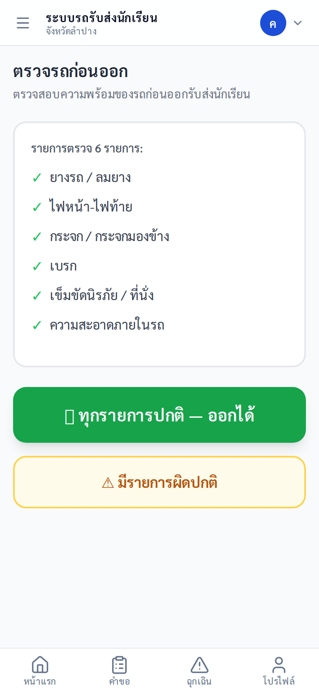
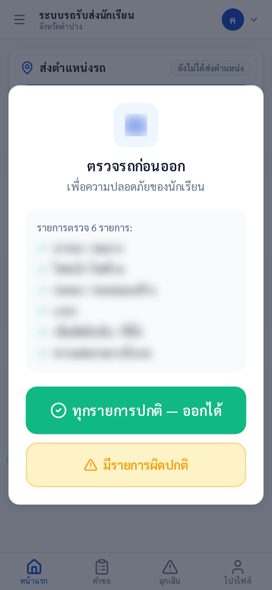
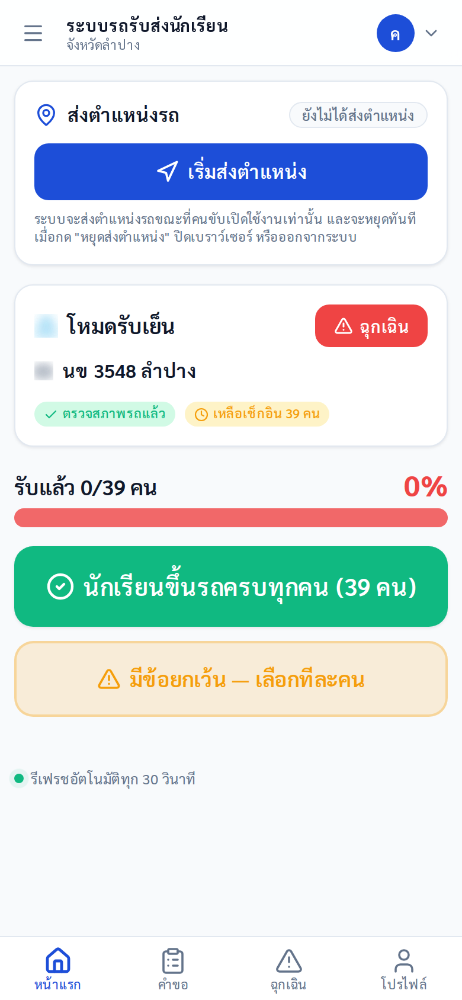
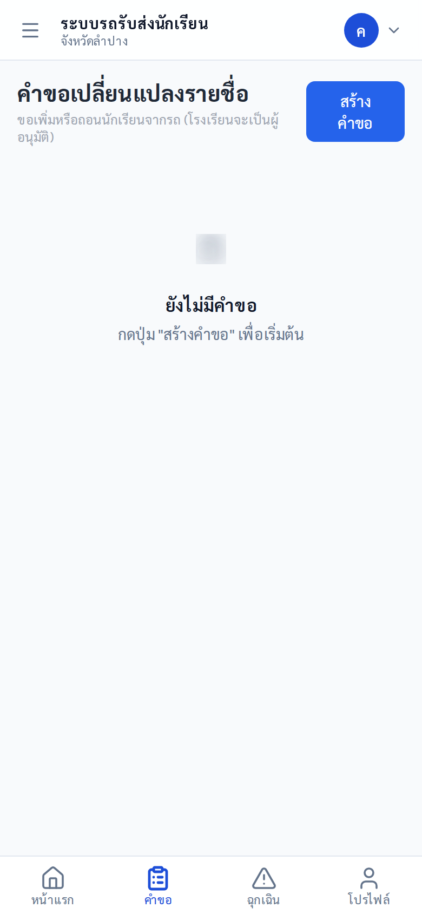
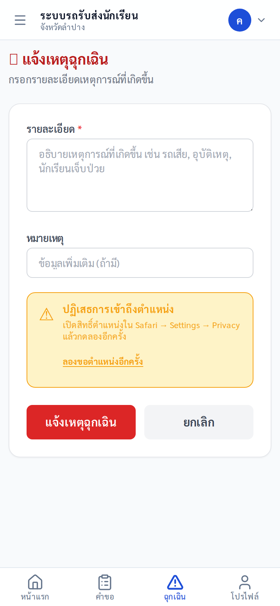
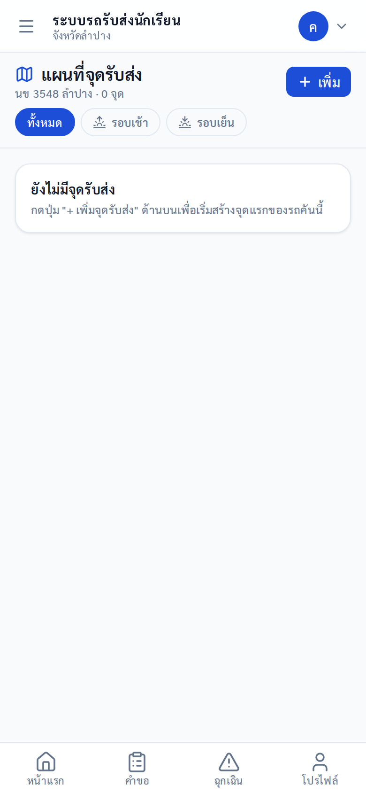
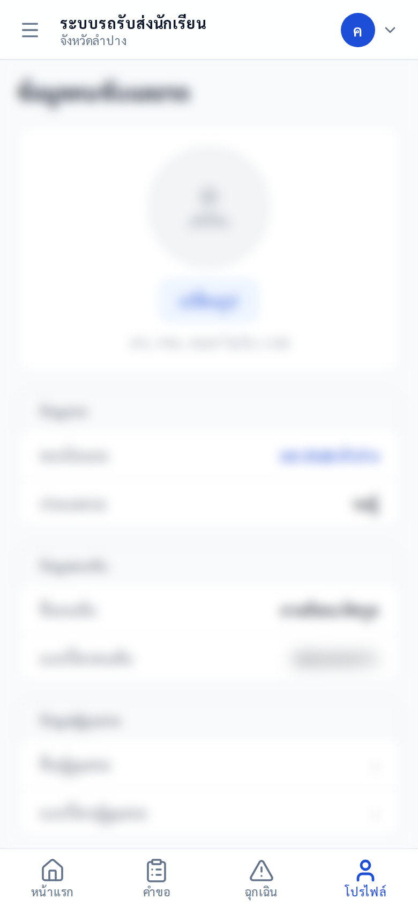

# คู่มือปฏิบัติงาน — คนขับรถ
> ระบบรถรับส่งนักเรียนจังหวัดลำปาง — https://schoolbuslampang.com
> เวอร์ชัน Phase 10.13C • อัปเดต 2026-06-24

> 📷 **หมายเหตุภาพหน้าจอ:** ข้อมูลส่วนบุคคล (ชื่อ/เบอร์) ในภาพถูกเบลอเพื่อความเป็นส่วนตัว — เมื่อใช้งานจริงจะแสดงข้อมูลตามปกติ

## ภาพรวม 30 วินาที
- **บทบาทนี้ทำอะไรได้:**
  - ตรวจรถก่อนออก (pre-trip) — บังคับก่อนเช็กชื่อ
  - ดูรายชื่อนักเรียนในรถของตัวเองประจำวัน
  - บันทึกรับ-ส่งนักเรียน (เช็กชื่อ) ทีละคนหรือทั้งคัน + บันทึกการลา
  - ส่งคำขอเพิ่ม/ถอนนักเรียนให้โรงเรียนอนุมัติ
  - แจ้งเหตุฉุกเฉิน + ส่งตำแหน่งรถ live + ดู/สร้างจุดรับส่ง
  - แก้ไขข้อมูลคนขับ/รถ + เปลี่ยนรหัสผ่าน
- **เข้าระบบด้วย:** ใช้ **ทะเบียนรถ** เป็นชื่อผู้ใช้ (เช่น `นข 2210 ลำปาง`)
- **อุปกรณ์ที่แนะนำ:** มือถือเป็นหลัก (mobile-first, มีแถบล่าง 4 แท็บ + ปุ่มเมนู ☰ มุมซ้ายบน) — แท็บเล็ต/คอมพิวเตอร์ใช้ได้ (เห็นแถบเมนูด้านข้างค้างตลอด)

> 💡 แนะนำบันทึก URL ไว้ที่หน้าจอหลักของมือถือ (Add to Home Screen) เพื่อเปิดใช้งานเหมือนแอป

## สารบัญงาน
| # | งาน | ใช้เมื่อ |
|---|-----|---------|
| 1 | เข้าสู่ระบบ | ทุกครั้งที่เริ่มใช้งาน |
| 2 | ตรวจรถก่อนออก (Pre-trip) | บังคับวันละ 1 ครั้ง ก่อนเช็กชื่อ |
| 3 | ดูหน้าแรก / ภาพรวมวันนี้ | เริ่มงานประจำวัน |
| 4 | ดูรายชื่อนักเรียน (Roster) | ตรวจรายชื่อในรถ |
| 5 | บันทึกรับ-ส่งนักเรียน (เช็กชื่อ) | ทุกรอบรับ-ส่ง |
| 6 | บันทึกการลา | นักเรียนลา |
| 7 | ส่งตำแหน่งรถ (Live) | ระหว่างเดินรถ |
| 8 | ส่งคำขอเปลี่ยนรายชื่อ | เพิ่ม/ถอนนักเรียน |
| 9 | แจ้งเหตุฉุกเฉิน | รถเสีย/อุบัติเหตุ/เจ็บป่วย |
| 10 | แผนที่จุดรับส่ง | ดู/สร้างจุดรับส่ง |
| 11 | เลือกรถและเริ่มรอบ | (ฟีเจอร์ปิดอยู่ — ครั้งคราว) |
| 12 | ข้อมูลคนขับ / โปรไฟล์ + เปลี่ยนรหัสผ่าน | แก้ข้อมูล/เปลี่ยนรหัส |
| 13 | ออกจากระบบ | เลิกใช้งาน |

---

## งานที่ 1 — เข้าสู่ระบบ
**ใช้เมื่อ:** เริ่มใช้งานระบบ

**ขั้นตอน:**
1. เปิดเบราว์เซอร์ไปที่ **https://schoolbuslampang.com**
2. กรอกช่อง **"ชื่อผู้ใช้ / ทะเบียนรถ"** ด้วยทะเบียนรถของคุณ เช่น `นข 2210 ลำปาง` (พิมพ์ไทยได้ เว้นวรรคตามทะเบียนจริง)
3. กรอก **รหัสผ่าน** (รหัสตั้งต้นคือ `1234` ใช้ได้ครั้งแรกเท่านั้น)
4. กด **เข้าสู่ระบบ**

*ภาพ: หน้าเข้าสู่ระบบ (เดสก์ท็อป)*

*ภาพ: หน้าเข้าสู่ระบบ (มือถือ)*

**✅ ผลลัพธ์ที่ถูกต้อง:** เข้าสู่หน้าแรก/ภาพรวมวันนี้ได้ (เข้าครั้งเดียวอยู่ได้ทั้งวัน — token อายุ 24 ชั่วโมง)

**⚠️ ถ้าติดปัญหา:**
- "ชื่อผู้ใช้หรือรหัสผ่านไม่ถูกต้อง" → ทะเบียนรถหรือรหัสผ่านผิด
- "บัญชีนี้ถูกปิดการใช้งาน" → ติดต่อ admin
- "มีการพยายามเข้าสู่ระบบหลายครั้งจากเครือข่ายนี้" → รอประมาณ 15 นาที
- **ลืมรหัสผ่าน:** ระบบไม่มีปุ่ม "ลืมรหัสผ่าน" และคนขับตั้งรหัสใหม่เองไม่ได้ → ติดต่อ admin หรือเจ้าหน้าที่โรงเรียนให้รีเซ็ตให้

### บังคับเปลี่ยนรหัสครั้งแรก
**ใช้เมื่อ:** บัญชีถูกตั้งให้ต้องเปลี่ยนรหัส (เพิ่งสร้าง/ถูกรีเซ็ต) — ขึ้นข้อความ "กรุณาเปลี่ยนรหัสผ่านเริ่มต้น"

**ขั้นตอน:**
1. ระบบพาไปหน้า **เปลี่ยนรหัสผ่าน** อัตโนมัติ (ใช้เมนูอื่นไม่ได้จนเปลี่ยนเสร็จ)
2. ตั้งรหัสใหม่ตามเงื่อนไข แล้วกรอกยืนยันให้ตรงกัน
3. บันทึก แล้วเข้าสู่ระบบใหม่ถ้าระบบให้

*ภาพ: หน้าเปลี่ยนรหัสผ่าน (บังคับเปลี่ยนครั้งแรก)*

> ⚠️ **เงื่อนไขรหัสผ่าน (บังคับที่เซิร์ฟเวอร์):** อย่างน้อย **8 ตัวอักษร**, ห้ามคาดเดาง่าย (เช่น `12345678`, `password`, ตัวอักษรซ้ำตัวเดียวทั้งหมด), **ห้ามตรงกับชื่อผู้ใช้ (ทะเบียนรถ)** และ **ต้องไม่ซ้ำกับรหัสผ่านเดิม** — ถ้าไม่ผ่านจะขึ้น เช่น "รหัสผ่านต้องมีอย่างน้อย 8 ตัวอักษร" หรือ "รหัสผ่านนี้คาดเดาง่ายเกินไป กรุณาใช้รหัสผ่านอื่น"
> ⚠️ หลังเปลี่ยนรหัสผ่าน เซสชันเดิม (token เก่า) ใช้ไม่ได้ทันที — อาจต้องเข้าสู่ระบบใหม่

---

## งานที่ 2 — ตรวจรถก่อนออก (Pre-trip)
**ใช้เมื่อ:** ก่อนเช็กชื่อทุกวัน — **บังคับวันละ 1 ครั้ง** (ถ้ายังไม่ตรวจ ปุ่มเช็กชื่อจะถูกล็อก)

**ขั้นตอน:**
1. เปิดหน้าแรกครั้งแรกของวัน — หน้าต่าง **"ตรวจรถก่อนออก"** จะเด้งขึ้นมา (มี 6 รายการ: ยางรถ/ลมยาง, ไฟหน้า-ไฟท้าย, กระจก/กระจกมองข้าง, เบรก, เข็มขัดนิรภัย/ที่นั่ง, ความสะอาดภายในรถ)
2. ถ้าทุกอย่างปกติ กด **"ทุกรายการปกติ — ออกได้"** (ปุ่มเขียว)
3. ถ้ามีปัญหา กด **"มีรายการผิดปกติ"** (ปุ่มเหลือง) → เลือกรายการที่ผิดปกติ → กรอก **"รายละเอียด (ถ้ามี)"** → กด **"บันทึกรายการผิดปกติ (N รายการ)"**

*ภาพ: แบบฟอร์มตรวจสภาพรถก่อนออก (6 รายการ)*

**✅ ผลลัพธ์ที่ถูกต้อง:** ป้ายสถานะการตรวจรถบนหน้าแรกเปลี่ยนเป็น "ตรวจสภาพรถแล้ว" (หรือ "ตรวจสภาพรถแล้ว · มีรายการผิดปกติ") และปุ่มเช็กชื่อใช้งานได้

**⚠️ ถ้าติดปัญหา:**
- กดเช็กชื่อแล้วขึ้น "กรุณาตรวจรถก่อนออกก่อนเช็กชื่อ" → ทำขั้นตอนตรวจรถให้เสร็จก่อน

> ℹ️ ถ้าบันทึกว่ามีรายการผิดปกติพร้อมรายละเอียด ระบบจะสร้างบันทึกเหตุฉุกเฉินให้อัตโนมัติ เพื่อแจ้งผู้เกี่ยวข้อง

---

## งานที่ 3 — ดูหน้าแรก / ภาพรวมวันนี้
**ใช้เมื่อ:** เริ่มงานประจำวัน (หน้าแรกหลังเข้าสู่ระบบ รวมงานประจำวันไว้ที่เดียว)

**ขั้นตอน:**
1. เปิดหน้าแรก — ถ้ายังไม่ตรวจรถวันนี้ ระบบจะเด้งหน้าต่างให้ตรวจรถก่อน (งานที่ 2)
2. ดูข้อมูลบนจอ: การ์ดบนสุดบอกรอบปัจจุบัน (**"โหมดส่งเช้า"** / **"โหมดรับเย็น"**) + ทะเบียนรถ + ปุ่ม **"ฉุกเฉิน"** (สีแดง มุมขวา), ป้ายสถานะตรวจรถ, ป้ายความคืบหน้า ("เหลือเช็กอิน N คน" / "เสร็จครบทุกคน"), แถบ "ส่งแล้ว/รับแล้ว X/Y คน"
3. เมื่อตรวจรถผ่านแล้ว กด **"นักเรียนขึ้นรถครบทุกคน (N คน)"** หรือ **"มีข้อยกเว้น — เลือกทีละคน"**

*ภาพ: เมื่อเปิดหน้าแรกครั้งแรกของวัน — ระบบบังคับ "ตรวจรถก่อนออก" (Pre-trip) ก่อน*

*ภาพ: หน้าเช็กชื่อนักเรียนหลังผ่าน Pre-trip — แสดงโหมด (รับเช้า/รับเย็น), ทะเบียนรถ, จำนวนที่เหลือเช็กอิน, แถบความคืบหน้า, ปุ่ม "นักเรียนขึ้นรถครบทุกคน" (เช็กทั้งคัน) และ "มีข้อยกเว้น — เลือกทีละคน" (เช็กรายคน), ปุ่มส่งตำแหน่งรถ และปุ่มฉุกเฉิน*

**✅ ผลลัพธ์ที่ถูกต้อง:** เห็นรอบปัจจุบัน ทะเบียนรถ และความคืบหน้าการเช็กชื่อครบถ้วน

> 💡 หน้านี้รีเฟรชอัตโนมัติทุก 30 วินาที (มีข้อความ "รีเฟรชอัตโนมัติทุก 30 วินาที")
> ℹ️ ระบบเลือกรอบเช้า/เย็นให้อัตโนมัติตามเวลามาตรฐานไทย (โดยปริยายหลังเที่ยงเป็น "รับเย็น") — ไม่อิงนาฬิกาในเครื่องคุณ

### เมนู / หน้าจอ (อ้างอิงด่วน)
**บนมือถือ — แถบล่าง 4 แท็บ:**
| แท็บ | ทำอะไร |
|---|---|
| **หน้าแรก** | ภาพรวมวันนี้ + ตรวจรถ + เช็กชื่อ + ส่งตำแหน่งรถ |
| **คำขอ** | สร้าง/ดูคำขอเพิ่ม-ถอนนักเรียน |
| **ฉุกเฉิน** | แจ้งเหตุฉุกเฉิน |
| **โปรไฟล์** | ข้อมูลคนขับและรถ + เปลี่ยนรหัสผ่าน |

> ℹ️ เมนู **"เลือกรถและเริ่มรอบ"** และ **"แผนที่จุดรับส่ง"** ไม่อยู่ในแถบล่าง 4 แท็บ — บนมือถือเข้าได้โดยกดปุ่ม **☰ มุมซ้ายบน** เพื่อเปิดแถบเมนูด้านข้าง (มีครบทุกหน้า)

**บนคอมพิวเตอร์ — แถบเมนูด้านข้าง (Sidebar):**
| กลุ่ม | เมนู | ทำอะไร |
|---|---|---|
| ภาพรวม | **ภาพรวมวันนี้** | หน้าแรก เช็กชื่อนักเรียน |
| งานประจำวัน | **เลือกรถและเริ่มรอบ** | เลือกรถ + เปิด/ปิดรอบงาน |
| งานประจำวัน | **แผนที่จุดรับส่ง** | ดู/สร้างจุดรับส่ง |
| งานประจำวัน | **คำขอรายชื่อ** | คำขอเพิ่ม-ถอนนักเรียน |
| งานประจำวัน | **แจ้งเหตุฉุกเฉิน** | แจ้งเหตุฉุกเฉิน |
| ข้อมูล | **ข้อมูลคนขับ** | โปรไฟล์ + เปลี่ยนรหัสผ่าน |

> ℹ️ ทุกขนาดจอมี **แถบบนสุด (Top bar)**: ปุ่ม ☰ (เฉพาะมือถือ) ทางซ้าย และ **เมนูบัญชี** (รูป/ชื่อผู้ใช้) ทางขวา ซึ่งมี **"เปลี่ยนรหัสผ่าน"** และ **"ออกจากระบบ"**

---

## งานที่ 4 — ดูรายชื่อนักเรียน (Roster)
**ใช้เมื่อ:** ต้องการตรวจรายชื่อนักเรียนในรถวันนี้

**ขั้นตอน:**
1. เปิดหน้าเช็กชื่อ — รายชื่อจัดกลุ่มตามโรงเรียน แต่ละคนแสดงคำนำหน้า + ชื่อ + นามสกุล และชั้น/ห้อง
2. ดูรายชื่อ 3 ส่วน: **"รอดำเนินการ (N)"** (ยังไม่เช็ก), **"เสร็จแล้ว (N)"** (มีป้าย "รับแล้ว"/"ส่งแล้ว"), **"ลาวันนี้ (N)"** (มีป้าย "ลาเช้า"/"ลาเย็น"/"ลาทั้งวัน")
3. สังเกตป้าย **"ครูยืนยันแทนแล้ว"** บางคน = โรงเรียนได้บันทึกสถานะแทนคุณแล้ว

**✅ ผลลัพธ์ที่ถูกต้อง:** เห็นจำนวนนักเรียนแยกตามสถานะครบถ้วน

> ℹ️ ป้าย "ครูยืนยันแทนแล้ว" เป็นข้อมูลอ่านอย่างเดียว — คุณ **ไม่ต้องทำอะไรเพิ่ม** ระบบไม่เปิดเผยเหตุผล/ผู้ที่ยืนยันแทนให้คนขับ (ตามนโยบายความเป็นส่วนตัว)

*ภาพ: หน้าเช็กชื่อ — รายชื่อนักเรียนในรถ (Roster) พร้อมปุ่มเช็ก*

---

## งานที่ 5 — บันทึกรับ-ส่งนักเรียน (เช็กชื่อ)
**ใช้เมื่อ:** ทุกรอบรับ-ส่งนักเรียน (ต้องตรวจรถก่อนออกเสร็จแล้ว)

**ขั้นตอน:**
1. ตรวจรอบที่ระบบเลือกให้ (เช้า/เย็น) — ชื่อปุ่มจะเปลี่ยนตามรอบ:
   - **รอบเช้า:** ทีละคน **"ส่งถึงโรงเรียน"** / ทั้งคัน **"ส่งเช้าทั้งหมด"**
   - **รอบเย็น:** ทีละคน **"รับกลับบ้าน"** / ทั้งคัน **"รับเย็นทั้งหมด"**
2. กด **"นักเรียนขึ้นรถครบทุกคน (N คน)"** เพื่อเช็กทุกคนพร้อมกัน หรือเลือกเช็กทีละคน
3. เมื่อส่ง/รับนักเรียนลงจากรถครบแล้ว กด **"ยืนยันส่งนักเรียนลงครบแล้ว (จบรอบ)"**

**✅ ผลลัพธ์ที่ถูกต้อง:** ระบบบันทึกประวัติพร้อมเวลา และส่งแจ้งเตือนทาง LINE ให้ผู้ปกครองที่ผูกบัญชีไว้

**⚠️ ถ้าติดปัญหา:**
- "รายการนี้ถูกบันทึกไปแล้ว" → กดสถานะเดิมซ้ำในรอบ/วันเดียวกัน (กันการกดซ้ำ) ไม่ต้องกดอีก
- "นักเรียนถูกส่งแล้วในรอบนี้ — ไม่สามารถเช็กอินซ้ำได้" → เช็กออกไปแล้ว ย้อนกลับมาไม่ได้ ถ้าจำเป็นติดต่อโรงเรียน
- "Student not found in this vehicle" → นักเรียนคนนี้ไม่ได้อยู่ในรถของคุณ

> ⚠️ **กดผิดแก้เองไม่ได้** — ระบบไม่มีปุ่มลบ/แก้สถานะ (เก็บประวัติทั้งหมดเพื่อตรวจสอบ) ถ้าต้องแก้สถานะอย่างเป็นทางการให้ติดต่อโรงเรียน
> ℹ️ คนที่บันทึกลาในรอบนั้น จะถูกตัดออกจากการเช็กทั้งคันโดยอัตโนมัติ
> ℹ️ "ส่งลงครบ" จะเลือกเฉพาะคนที่ขึ้นรถแล้วแต่ยังไม่ได้ลง

*ภาพ: เช็กชื่อรับ-ส่ง: ปุ่ม "นักเรียนขึ้นรถครบทุกคน" (ทั้งคัน) และ "มีข้อยกเว้น — เลือกทีละคน" (รายคน)*

---

## งานที่ 6 — บันทึกการลา (Leave)
**ใช้เมื่อ:** นักเรียนลา (เช้า/เย็น/ทั้งวัน)

**ขั้นตอน:**
1. กดปุ่ม **"ลา"** ที่การ์ดของนักเรียน
2. เลือกประเภท: **"ลาเช้า"** / **"ลาเย็น"** / **"ลาทั้งวัน"**
3. ถ้าต้องการยกเลิก กด **"ยกเลิกการลา"**

**✅ ผลลัพธ์ที่ถูกต้อง:** นักเรียนย้ายไปอยู่ส่วน "ลาวันนี้" และถูกตัดออกจากการเช็กทั้งคัน

**⚠️ ถ้าติดปัญหา:**
- บันทึกลารอบ/วันเดิมซ้ำไม่ได้ → จะขึ้นข้อความว่านักเรียนคนนี้ถูกบันทึกการลาในวันนี้แล้ว

> ℹ️ ยกเลิกการลาได้เฉพาะรายการของรถคุณเองเท่านั้น

*ภาพ: บันทึกการลา: เข้าจาก "มีข้อยกเว้น — เลือกทีละคน" บนหน้าเช็กชื่อ*

---

## งานที่ 7 — ส่งตำแหน่งรถ (Live Location)
**ใช้เมื่อ:** ระหว่างเดินรถ ต้องการให้ระบบเห็นตำแหน่งรถ (การ์ด "ส่งตำแหน่งรถ" บนหน้าแรก)

**ขั้นตอน:**
1. กด **"เริ่มส่งตำแหน่ง"** เพื่อเริ่มส่งพิกัดรถ
2. ดูระหว่างเปิดอยู่: "อัปเดตล่าสุด HH:MM น." และ "ความแม่นยำ ±N เมตร"
3. กด **"หยุดส่งตำแหน่ง"** เมื่อต้องการหยุด

**✅ ผลลัพธ์ที่ถูกต้อง:** การ์ดแสดงเวลาอัปเดตล่าสุดและความแม่นยำขณะส่งตำแหน่ง

**⚠️ ถ้าติดปัญหา:**
- "ส่งตำแหน่งถี่เกินไป กรุณารอสักครู่" → กดบ่อยเกินไป (ปกติไม่เกิดเพราะระบบส่งให้เองทุก ~15 วินาที)

> ℹ️ ระบบส่งตำแหน่ง **เฉพาะตอนที่คุณเปิดใช้งานเท่านั้น** และหยุดทันทีเมื่อกด "หยุดส่งตำแหน่ง" ปิดเบราว์เซอร์ หรือออกจากระบบ
> ℹ️ ทุกครั้งที่เปิดหน้าใหม่ การส่งตำแหน่งจะเริ่มที่ปิดเสมอ (ระบบไม่จำสถานะเดิม)

*ภาพ: ส่งตำแหน่งรถ: การ์ด "ส่งตำแหน่งรถ" + ปุ่ม "เริ่มส่งตำแหน่ง" ด้านบนหน้าเช็กชื่อ*

---

## งานที่ 8 — ส่งคำขอเปลี่ยนรายชื่อ (แท็บ "คำขอ")
**ใช้เมื่อ:** ต้องการเพิ่มหรือถอนนักเรียนจากรถ (โรงเรียนเป็นผู้อนุมัติ)

**ขั้นตอน:**
1. กดปุ่ม **"สร้างคำขอ"**
2. เลือกประเภท **"ถอนนักเรียนออกจากรถ"** หรือ **"เพิ่มนักเรียนเข้ารถ"**
3. **กรณีถอน:** เลือกนักเรียนจากรายการ **"เลือกนักเรียนในรถ"** (รายชื่อนักเรียนในรถคุณปัจจุบัน)
4. **กรณีเพิ่ม:** กรอกข้อมูลนักเรียนใหม่ในแบบฟอร์ม — รหัสนักเรียน [ถ้ามี], คำนำหน้า, **ชื่อ\***, **นามสกุล\***, **โรงเรียน\***, ระดับชั้น, ห้อง, และข้อมูลผู้ปกครอง (ชื่อ/เบอร์)
5. ใส่ **เหตุผล** (ไม่บังคับ) แล้วกด **"ส่งคำขอ"** — ดูสถานะได้ที่ **"รออนุมัติ (N)"** และ **"สำเร็จแล้ว (N)"**

*ภาพ: คำขอเปลี่ยนรายชื่อนักเรียน*

**✅ ผลลัพธ์ที่ถูกต้อง:** คำขอปรากฏใน "รออนุมัติ (N)" — นักเรียนจะปรากฏใน roster จริงเมื่อโรงเรียนอนุมัติแล้ว

**⚠️ ถ้าติดปัญหา:**
- เพิ่มนักเรียนแล้วยังไม่เห็นในรายชื่อ → คำขออยู่สถานะรออนุมัติจนกว่าโรงเรียนจะอนุมัติ

> ⚠️ คนขับ **สร้างคำขอได้เท่านั้น** การอนุมัติ/ปฏิเสธเป็นหน้าที่ของโรงเรียน
> ℹ️ การเพิ่มนักเรียนทำได้โดย **กรอกข้อมูลใหม่เท่านั้น** (ไม่มีช่องค้นหา/เลือกนักเรียนที่มีอยู่) โรงเรียนจะตรวจสอบตอนอนุมัติว่ามีนักเรียนนี้อยู่แล้วหรือไม่
> ℹ️ เบอร์ผู้ปกครอง (ถ้ากรอก) ต้องเป็นตัวเลข 10 หลัก

---

## งานที่ 9 — แจ้งเหตุฉุกเฉิน (แท็บ "ฉุกเฉิน")
**ใช้เมื่อ:** รถเสีย, อุบัติเหตุ, นักเรียนเจ็บป่วย หรือเหตุที่ต้องแจ้งทันที

**ขั้นตอน:**
1. ไปที่แท็บ **"ฉุกเฉิน"** (หน้าจอ "🚨 แจ้งเหตุฉุกเฉิน")
2. กรอก **"รายละเอียด \*"** (จำเป็น) เช่น "รถเสีย, อุบัติเหตุ, นักเรียนเจ็บป่วย" และ **"หมายเหตุ"** (ไม่บังคับ)
3. กด **"แจ้งเหตุฉุกเฉิน"** (ปุ่มแดง) หรือ **"ยกเลิก"** หากกดผิด

*ภาพ: แจ้งเหตุฉุกเฉิน*

**✅ ผลลัพธ์ที่ถูกต้อง:** เหตุฉุกเฉินถูกบันทึก — **ส่งได้เสมอแม้ไม่มี GPS** (ระบบรอตำแหน่ง 8 วินาที ถ้าไม่ได้ก็ส่งต่อให้) และ **ไม่ต้องเปิดรอบงานก่อน**

**⚠️ ถ้าติดปัญหา:**
- GPS ไม่ขึ้น/ถูกปฏิเสธสิทธิ์ → เปิดสิทธิ์ตำแหน่งในเบราว์เซอร์ (เช่น Safari → Settings → Privacy) แล้วกด **"ลองขอตำแหน่งอีกครั้ง"** (การ์ดสถานะ GPS)

> ℹ️ ถ้าระบบตั้งค่า LINE ไว้ จะส่งการ์ดแจ้งเตือนเข้ากลุ่ม LINE ของโรงเรียนอัตโนมัติ (ทำงานเบื้องหลัง — หากส่ง LINE ไม่สำเร็จ เหตุฉุกเฉินก็ยังถูกบันทึกในระบบอยู่ดี)

---

## งานที่ 10 — แผนที่จุดรับส่ง
**ใช้เมื่อ:** ต้องการดูหรือสร้างจุดรับส่งของรถคุณ (เข้าจากแถบเมนูด้านข้าง — บนมือถือกด **☰ มุมซ้ายบน**)

**ขั้นตอนสร้างจุดใหม่:**
1. กดปุ่ม **"เพิ่มจุดรับส่ง"** → เปิดหน้าต่าง **"เพิ่มจุดรับส่งของรถคุณ"**
2. กรอก **ป้ายชื่อจุด**, ระบุ **Latitude/Longitude** (หรือคลิกบนแผนที่เพื่อกำหนดพิกัด)
3. เลือกรอบ: **เช้า / เย็น / ทั้งวัน**
4. เลือกนักเรียนจาก checklist และใส่หมายเหตุ (ถ้ามี) → บันทึก

*ภาพ: แผนที่จุดรับ-ส่ง*

**✅ ผลลัพธ์ที่ถูกต้อง:** จุดปรากฏบนแผนที่ — ที่การ์ดของจุดมีปุ่ม **"แก้ไขรายชื่อนักเรียน"** และ **"เปิดใน Google Maps →"** และกรองตามรอบได้ด้วย **"ทั้งหมด / รอบเช้า / รอบเย็น"**

> ℹ️ สร้าง/แก้ไขจุดได้เฉพาะรถของคุณ และเลือกได้เฉพาะนักเรียนในรถคุณ — ป้ายชื่อจุดยาวไม่เกิน 100 ตัวอักษร และห้ามให้นักเรียนคนเดิมมีจุดซ้ำในรอบเดียวกัน

---

## งานที่ 11 — เลือกรถและเริ่มรอบ
**ใช้เมื่อ:** กรณีคนขับ 1 คนขับได้หลายคันและต้องเลือกรถก่อนเริ่มงาน

> ⚠️ **ฟีเจอร์นี้ปัจจุบัน "ยังไม่เปิดใช้งาน" บนระบบจริง (production)** — ควบคุมด้วย feature flag `FEATURE_DRIVER_SHIFT_SELECTION` ซึ่งขณะนี้ปิดอยู่
> เมื่อปิดอยู่: หน้านี้ยังเข้าได้ (อยู่ในแถบเมนูด้านข้างบนคอมพิวเตอร์) แต่ **ไม่จำเป็นต้องใช้** ระบบจะหารถของคุณให้อัตโนมัติจากการมอบหมาย (assignment) — คุณ **เช็กชื่อ/แจ้งเหตุได้ทันทีโดยไม่ต้องกด "เริ่มรอบ"** และจะ **ไม่เห็น** ข้อความ "กรุณาเลือกรถและเริ่มรอบก่อนปฏิบัติงาน"
> เนื้อหาด้านล่างมีผลก็ต่อเมื่อผู้ดูแลระบบเปิดฟีเจอร์ในอนาคต

**ขั้นตอน (เมื่อฟีเจอร์เปิด):**
1. เลือกรอบ: **เช้า / เย็น / อื่น ๆ**
2. ดูการ์ดรถที่ได้รับอนุญาต — แต่ละคันมีป้าย **"คนขับหลัก"** หรือ **"คนขับสำรอง"** และสถานะรถ (พร้อมเริ่มรอบ / ใกล้หมดอายุ / หมดอายุ / ยังไม่ผ่านเงื่อนไข / ต้องแก้ไข)
3. กด **"เริ่มรอบด้วยรถคันนี้"**
4. เมื่อทำงานเสร็จ กด **"สิ้นสุดรอบ"** ที่การ์ด **"กำลังปฏิบัติงาน"**

**✅ ผลลัพธ์ที่ถูกต้อง:** การ์ด "กำลังปฏิบัติงาน" แสดงรถที่เลือก และเริ่มเช็กชื่อได้

**⚠️ ถ้าติดปัญหา:**
- กล่องแดง **"ยังเริ่มรอบด้วยรถคันนี้ไม่ได้"** พร้อมเหตุผล เช่น รถยังไม่ผ่านเงื่อนไขความปลอดภัย / คุณสมบัติคนขับยังไม่รับรอง / ใบอนุญาตขับรถหมดอายุ → ติดต่อเขตพื้นที่หรือขนส่ง
- ขึ้น "กรุณาเลือกรถและเริ่มรอบก่อนปฏิบัติงาน" (เฉพาะเมื่อฟีเจอร์เปิด) → ไปหน้านี้แล้วกด "เริ่มรอบด้วยรถคันนี้" ก่อน (การแจ้งฉุกเฉินยังทำได้เสมอ)

> ℹ️ ระบบป้องกันไม่ให้คนขับเปิด 2 รอบพร้อมกัน และไม่ให้รถคันเดียวมี 2 คนขับพร้อมกัน

> 📷 **ไม่มีภาพหน้าจอ** — ฟีเจอร์ "เลือกรถและเริ่มรอบ" ถูกปิดด้วย feature flag (`FEATURE_DRIVER_SHIFT_SELECTION`) ยังไม่เปิดใช้งานจริง จึงยังไม่มีหน้าจอให้แสดง

---

## งานที่ 12 — ข้อมูลคนขับ / โปรไฟล์ + เปลี่ยนรหัสผ่าน (แท็บ "โปรไฟล์")
**ใช้เมื่อ:** ต้องการแก้ข้อมูลคนขับ/รถ หรือเปลี่ยนรหัสผ่าน

หน้า **"ข้อมูลคนขับและรถ"** แสดงข้อมูลเป็นหมวด: **ข้อมูลรถ** (ทะเบียนรถ [แก้ไม่ได้], ประเภทรถ), **ข้อมูลคนขับ** (ชื่อ, เบอร์), **ข้อมูลผู้ดูแลรถ**, **ข้อมูลผู้ครอบครองรถ**, และ **ประกันภัย** (สถานะ, ประเภท, วันหมดอายุ)

**ขั้นตอน:**
1. กด **"แก้ไขข้อมูล"** เพื่อแก้ชื่อ/เบอร์/ข้อมูลที่แก้ได้ (เบอร์โทรต้อง 9-10 หลัก)
2. กด **"เปลี่ยนรูป"** เพื่ออัปโหลดรูป JPG/PNG/WebP ขนาดไม่เกิน 2MB
3. กด **"เปลี่ยนรหัสผ่าน"** → กรอกรหัสเดิมให้ถูก → ตั้งรหัสใหม่ (อย่างน้อย **8 ตัวอักษร**, ห้ามคาดเดาง่าย, ห้ามตรงกับทะเบียนรถ) → ยืนยันให้ตรงกัน

*ภาพ: ข้อมูลคนขับ / เปลี่ยนรหัสผ่าน (ทั้งหน้าเบลอเพราะมีข้อมูลส่วนตัวคนขับ)*

**✅ ผลลัพธ์ที่ถูกต้อง:** ข้อมูลที่แก้ถูกบันทึก — หลังเปลี่ยนรหัสผ่านต้องเข้าสู่ระบบใหม่

**⚠️ ถ้าติดปัญหา:**
- ทะเบียนรถแก้จากหน้านี้ไม่ได้ → ถ้าต้องเปลี่ยนทะเบียน ติดต่อผู้ดูแลระบบ

> ℹ️ นอกจากหน้านี้ ยังเปลี่ยนรหัสผ่านได้จาก **เมนูบัญชี** (รูป/ชื่อผู้ใช้ มุมขวาบน) → **"เปลี่ยนรหัสผ่าน"** ซึ่งเมนูเดียวกันนี้มีปุ่ม **"ออกจากระบบ"** ด้วย

---

## งานที่ 13 — ออกจากระบบ
**ใช้เมื่อ:** เลิกใช้งาน

**ขั้นตอน:**
1. เปิด **เมนูบัญชี** (รูป/ชื่อผู้ใช้ มุมขวาบนของแถบบนสุด)
2. กด **"ออกจากระบบ"**

**✅ ผลลัพธ์ที่ถูกต้อง:** กลับมาที่หน้าเข้าสู่ระบบ และการส่งตำแหน่งรถจะหยุดทันที

*ภาพ: เมนูบัญชี (แตะรูป/ชื่อผู้ใช้มุมขวาบน) — มี "เปลี่ยนรหัสผ่าน" และ "ออกจากระบบ"*

---

## ตารางขอบเขตสิทธิ์ (อ้างอิงด่วน)

### คุณเห็นข้อมูลได้แค่ไหน
| ข้อมูล | ขอบเขต |
|---|---|
| นักเรียน | เฉพาะนักเรียนในรถของคุณ (ในรอบที่เปิดอยู่) |
| โปรไฟล์รถ/คนขับ/ผู้ดูแล/ประกัน | เฉพาะรถของคุณ |
| คำขอรายชื่อ / การลา / จุดรับส่ง | เฉพาะของรถคุณเท่านั้น |
| ค้นนักเรียนเพื่อ "เพิ่ม" | เฉพาะภายในโรงเรียนที่รถคุณให้บริการ |

### สิ่งที่ทำไม่ได้ (และใครทำแทน)
| ทำไม่ได้ | ใครทำแทน |
|---|---|
| แก้/ลบสถานะเช็กชื่อที่บันทึกไปแล้ว | **โรงเรียน** (ครูยืนยันแทน) |
| เพิ่ม/ถอน/ย้ายนักเรียนในรถโดยตรง | **โรงเรียน** (คนขับส่งคำขอ → โรงเรียนอนุมัติ) |
| เพิ่มนักเรียนใหม่เข้าระบบจริง | **โรงเรียน** (สร้างจริงเมื่ออนุมัติ) |
| จัดการผู้ใช้ / รีเซ็ตรหัสคนอื่น | **admin** |
| ดู dashboard เขต/จังหวัด, รายงาน/export, audit log | บทบาทอื่น (เขต/ส่วนกลาง/admin) |
| ตรวจสภาพรถอย่างเป็นทางการ | **ขนส่ง (transport)** |
| แก้ทะเบียนรถ | **admin** |

> ❌ **บทบาทคนขับไม่มีสิทธิ์เข้าถึงรายงานหรือการส่งออก (export) ใด ๆ** — ไม่มีหน้ารายงาน CSV/Excel/PDF สำหรับคนขับ สิ่งที่ใกล้เคียงที่สุดคือ **สรุปวันนี้บนหน้าจอ** (จำนวนนักเรียนทั้งหมด, ส่งเช้าแล้ว, รับเย็นแล้ว, ที่เหลือ และกิจกรรมล่าสุด) ซึ่งเป็นข้อมูลแสดงผลบนจอเท่านั้น ไม่ใช่ไฟล์ส่งออก ข้อมูลการรับ-ส่งของรถคุณจะถูกนำไปออกรายงานโดยบทบาทอื่น (โรงเรียน/เขต/ส่วนกลาง/admin)
> ℹ️ ถ้าพยายามเข้าหน้าของบทบาทอื่น (เช่น ของโรงเรียน) จะขึ้นหน้า **"ไม่มีสิทธิ์เข้าถึง"**

---

## สรุปปัญหาที่พบบ่อย

| อาการ / ข้อความ | วิธีแก้ |
|---|---|
| กดเช็กชื่อไม่ได้ "กรุณาตรวจรถก่อนออกก่อนเช็กชื่อ" | ทำขั้นตอนตรวจรถก่อนออก (pre-trip) ของวันนั้นให้เสร็จก่อน (วันละ 1 ครั้ง) |
| "รายการนี้ถูกบันทึกไปแล้ว" | กดสถานะเดิมซ้ำในรอบ/วันเดียวกัน (กันการกดซ้ำ) — ไม่ต้องกดอีก |
| "นักเรียนถูกส่งแล้วในรอบนี้ — ไม่สามารถเช็กอินซ้ำได้" | เช็กออกไปแล้ว ระบบไม่ให้ย้อนกลับมาเช็กอินซ้ำ ถ้าจำเป็นติดต่อโรงเรียน |
| กดผิด แก้เองไม่ได้ | ระบบไม่มีปุ่มลบ/แก้สถานะ — ติดต่อโรงเรียนให้ครูยืนยันแทน |
| หาเมนู "เลือกรถและเริ่มรอบ" / "แผนที่จุดรับส่ง" บนมือถือไม่เจอ | กดปุ่ม **☰ มุมซ้ายบน** เปิดแถบเมนูด้านข้าง (มีครบทุกหน้า) — desktop เห็นค้างอยู่แล้ว |
| แจ้งฉุกเฉินแล้ว GPS ไม่ขึ้น | ส่งได้แม้ไม่มี GPS (รอ 8 วินาทีแล้วส่งต่อ) ถ้าถูกปฏิเสธสิทธิ์ ให้เปิดสิทธิ์ตำแหน่งในเบราว์เซอร์แล้วกด "ลองขอตำแหน่งอีกครั้ง" |
| ผู้ปกครองบ่นว่าไม่ได้รับแจ้งเตือนทาง LINE | ผู้ปกครองจะได้รับเฉพาะคนที่ผูกบัญชี LINE และได้รับการยืนยัน/อนุมัติแล้ว — ให้แจ้งผู้ปกครองตรวจการผูกบัญชี |
| เพิ่มนักเรียนเข้ารถแล้วยังไม่เห็นในรายชื่อ | คำขออยู่สถานะรออนุมัติจนกว่าโรงเรียนจะอนุมัติ และเพิ่มได้เฉพาะในโรงเรียนที่รถคุณให้บริการ |
| "กรุณาเลือกรถและเริ่มรอบก่อนปฏิบัติงาน" | เกิดเฉพาะเมื่อผู้ดูแลเปิดฟีเจอร์เลือกรถ (`FEATURE_DRIVER_SHIFT_SELECTION` — ปัจจุบันปิดอยู่) ถ้าพบให้ไปหน้า "เลือกรถและเริ่มรอบ" แล้วกด "เริ่มรอบด้วยรถคันนี้" (แจ้งฉุกเฉินไม่ต้องเปิดรอบ) |
| เช็กชื่อไม่ได้เมื่อสัญญาณขาด | ระบบต้องออนไลน์ขณะเช็กชื่อ (ไม่มีโหมดออฟไลน์) รอสัญญาณกลับมาแล้วลองใหม่ |

### การขอความช่วยเหลือ
- **ลืมรหัสผ่าน / บัญชีถูกปิด** → ติดต่อผู้ดูแลระบบ (admin) หรือเจ้าหน้าที่โรงเรียน
- **ต้องการแก้สถานะเช็กชื่อ / เพิ่ม-ถอนนักเรียน** → ติดต่อโรงเรียน
- **เริ่มรอบไม่ได้ (รถ/ใบอนุญาต/คุณสมบัติ)** → ติดต่อเขตพื้นที่หรือขนส่ง

เวลาแจ้งปัญหา โปรดส่ง: ทะเบียนรถ, เวลาที่เกิดปัญหา, ภาพหน้าจอ (screenshot), สัญญาณตอนนั้น (4G / WiFi)

---

**สิ้นสุดคู่มือปฏิบัติงานสำหรับคนขับ — ขับขี่ปลอดภัย ส่งเด็กถึงบ้านอย่างปลอดภัย**
