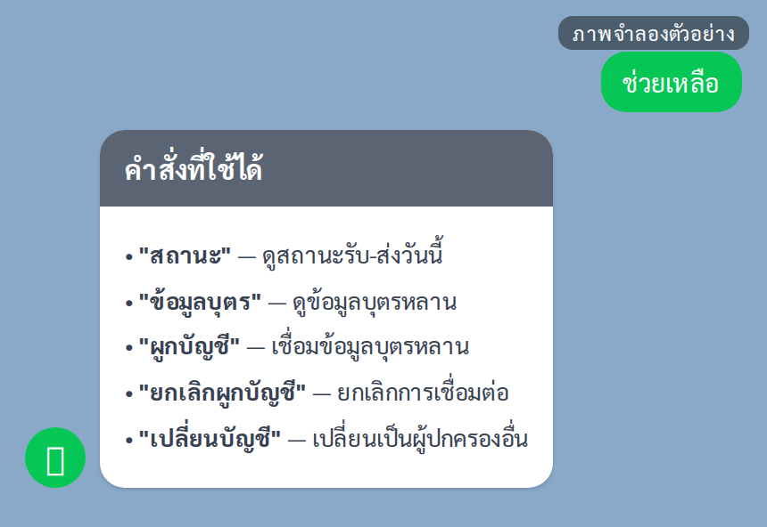

# คู่มือปฏิบัติงาน — ผู้ปกครอง (LINE)

> **Historical snapshot (ติดป้าย 6 ก.ย. 2569):** ร่าง Markdown ฉบับ 2026-06-24 — ไม่ใช่ฉบับที่เผยแพร่ และไม่ตรงกับระบบปัจจุบัน (ปุ่มและข้อความบนหน้าจอผู้ปกครองเปลี่ยนหลัง 26 ส.ค. 2569 · ETA และ QR ยังไม่เปิดใช้งานบนระบบจริง) ห้ามใช้อบรมหรืออ้างอิง
> ฉบับที่ใช้จริง: `docs/manual-html/user-guide-parent.html` (https://schoolbuslampang.com/manual/) · ชุดอบรม: `docs/manual-training-2026-08/README.md`

> ระบบรถรับส่งนักเรียนจังหวัดลำปาง — https://schoolbuslampang.com
> เวอร์ชัน Phase 10.13C • อัปเดต 2026-06-24 (เลิกใช้แล้ว)

> 📷 **หมายเหตุภาพหน้าจอ:** ข้อมูลส่วนบุคคล (ชื่อ/เบอร์) ในภาพถูกเบลอเพื่อความเป็นส่วนตัว — เมื่อใช้งานจริงจะแสดงข้อมูลตามปกติ

## ภาพรวม 30 วินาที
- บทบาทนี้ทำอะไรได้:
  - ผูกบัญชี LINE เข้ากับข้อมูลบุตรหลาน (ด้วยเบอร์โทร + รหัสนักเรียน)
  - ดูสถานะการรับ-ส่งวันนี้ของบุตรหลาน (รอบเช้า / รอบเย็น)
  - ดูข้อมูลบุตรหลาน (ชั้น/ห้อง, โรงเรียน, ทะเบียนรถ, ชื่อผู้ขับ)
  - ดูประวัติย้อนหลัง 7 วัน (ในหน้า LIFF)
  - รับการแจ้งเตือนทาง LINE อัตโนมัติเมื่อคนขับเช็กชื่อบุตรหลาน
  - ยกเลิกการผูกบัญชี / เปลี่ยนบัญชีผู้ปกครอง
- เข้าระบบด้วย: **บัญชี LINE ของคุณ** — ไม่มีชื่อผู้ใช้/รหัสผ่าน ระบบยืนยันตัวตนจากบัญชี LINE อัตโนมัติ ทุกอย่างทำผ่านแชต LINE OA และหน้า LIFF (หน้าเว็บที่เปิดจากลิงก์ใน LINE)
- อุปกรณ์ที่แนะนำ: **มือถือที่ติดตั้งแอป LINE** — เปิดทุกหน้าจากลิงก์ใน LINE OA เท่านั้น (ห้ามเปิดในเบราว์เซอร์ภายนอก จะยืนยันตัวตนไม่ได้)

> 💡 เพิ่มบัญชี LINE OA ของระบบรถรับส่งเป็นเพื่อนไว้ แล้วปักหมุดแชตไว้ด้านบน เพื่อเข้าถึงได้รวดเร็ว

## สารบัญงาน
| # | งาน | ใช้เมื่อ |
|---|-----|---------|
| 1 | เข้าใช้งาน (ผูกบัญชี) | ครั้งแรกที่เริ่มใช้งาน |
| 2 | ดูสถานะรับ-ส่งวันนี้ | งานประจำวัน ใช้บ่อยสุด |
| 3 | รับการแจ้งเตือนทาง LINE | ทุกวันโดยอัตโนมัติ |
| 4 | ดูข้อมูลบุตรหลาน | ตรวจรถ/ชั้น/คนขับ |
| 5 | ดูประวัติย้อนหลัง 7 วัน | ตรวจย้อนหลัง |
| 6 | ดู ETA เวลาถึงโดยประมาณ | (⚠️ ฟีเจอร์ยังปิด) |
| 7 | ดูข้อมูลรถจาก QR + ความยินยอม PDPA | (⚠️ ฟีเจอร์ยังปิด) |
| 8 | ยกเลิกผูกบัญชี | เลิกใช้/เปลี่ยนเครื่อง |
| 9 | เปลี่ยนบัญชี (สลับผู้ปกครอง) | เปลี่ยนผู้ปกครอง/เบอร์ |
| 10 | ใช้เมนูคำสั่งในแชต | อ้างอิงคำสั่งทั้งหมด |

> ℹ️ **ผู้ปกครองไม่มีรายงาน/ส่งออกไฟล์** — ไม่มีรายงานรายวัน/รายเดือน/สรุป และไม่มีไฟล์ CSV/Excel/PDF (เป็นสิทธิ์ของโรงเรียน/เขต/ส่วนกลาง/admin) สิ่งที่ทำได้คือ "ดู" สถานะ ข้อมูลบุตรหลาน และประวัติย้อนหลังของบุตรหลานตัวเองเท่านั้น

---

## งานที่ 1 — เข้าใช้งาน (ผูกบัญชี)
**ใช้เมื่อ:** ครั้งแรกที่เริ่มใช้งาน — ต้องผูกบัญชีก่อนจึงจะดูสถานะและรับการแจ้งเตือนได้ (ระบบตรวจจาก **เบอร์โทรผู้ปกครอง + รหัสนักเรียน**)

### ทาง A — ผ่านฟอร์มในหน้า LIFF (แนะนำ)
**ขั้นตอน:**
1. เปิดหน้า **"🔗 ผูกบัญชีผู้ปกครอง"** จากลิงก์ใน LINE
2. กรอก **เบอร์โทรศัพท์ (10 หลัก)** และ **รหัสนักเรียน**
3. กดปุ่ม **"ค้นหาข้อมูลบุตรหลาน"**
4. ตรวจหน้า **"ตรวจสอบข้อมูล"** — ชื่อนักเรียน / ชั้น / โรงเรียน และเบอร์โทรที่ถูกปิดบางส่วน (เช่น `090****567`)
5. กด **"ยืนยันผูกบัญชี"** ถ้าถูกต้อง (หรือ **"ย้อนกลับ"** เพื่อแก้)
6. เมื่อขึ้น **"✅ ผูกบัญชีสำเร็จ"** กลับไปที่แชต แล้วพิมพ์ **"สถานะ"** เพื่อทดสอบ

*ภาพ: ผูกบัญชีผู้ปกครอง (เปิดผ่าน LINE / LIFF)*

> ⚠️ ฟอร์มในหน้า LIFF **บังคับรหัสนักเรียนเป็นตัวเลขเท่านั้น** — ถ้ารหัสนักเรียนมีตัวอักษรปน ให้ผูกผ่านแชต (ทาง B) แทน

### ทาง B — ผ่านแชต LINE
**ขั้นตอน:**
1. พิมพ์ **"ผูกบัญชี"** ในแชต
2. พิมพ์ **เบอร์โทรผู้ปกครอง (10 หลัก)** เมื่อระบบขอ
3. พิมพ์ **รหัสนักเรียน** เมื่อระบบขอ
4. รอระบบผูกอัตโนมัติ แล้วส่งการ์ด **"ผูกบัญชีสำเร็จ"**

> ℹ️ ขั้นตอนผูกผ่านแชตหมดอายุภายใน **30 นาที** — ถ้าทำค้างนานเกินไปต้องพิมพ์ "ผูกบัญชี" เริ่มใหม่ • พิมพ์ "ยกเลิก" เพื่อเริ่มต้นใหม่ได้ทุกเมื่อ

**✅ ผลลัพธ์ที่ถูกต้อง:** ขึ้นหน้า/การ์ด "ผูกบัญชีสำเร็จ" และพิมพ์ "สถานะ" แล้วเห็นข้อมูลบุตรหลาน

**⚠️ ถ้าติดปัญหา:**
- "ไม่พบข้อมูลที่ตรงกัน" → ตรวจ (ก) เบอร์โทรตรงกับที่ลงทะเบียนกับโรงเรียน (ข) รหัสนักเรียนถูกต้อง (ค) **โรงเรียนอนุมัติคุณเป็นผู้ปกครองแล้วหรือยัง** (ถ้ายังไม่อนุมัติจะผูกไม่ได้ ติดต่อโรงเรียน)
- "บัญชี LINE นี้ผูกอยู่กับผู้ปกครองท่านอื่นแล้ว..." → พิมพ์ "ยกเลิกผูกบัญชี" ก่อน (งานที่ 8)
- "เบอร์นี้ผูก LINE อื่นไว้แล้ว" → เบอร์นี้ถูกใช้กับ LINE อื่น ใช้คำสั่ง "เปลี่ยนบัญชี" (งานที่ 9) หรือยกเลิกที่เครื่องเดิม
- "พยายามหลายครั้งเกินไป กรุณารอสักครู่..." → กรอกผิดหลายครั้ง ระบบล็อกชั่วคราว รอประมาณ 30 นาที แล้วลองใหม่
- ไม่ทราบรหัสนักเรียน → สอบถามครูประจำชั้นหรือเจ้าหน้าที่โรงเรียน

> ⚠️ ใช้ **เบอร์โทรผู้ปกครอง + รหัสนักเรียน** เท่านั้นในการผูกบัญชี • เบอร์โทรต้องเป็นเลข 10 หลัก

---

## งานที่ 2 — ดูสถานะรับ-ส่งวันนี้
**ใช้เมื่อ:** ต้องการรู้ว่าบุตรหลานขึ้นรถ/ถึงจุดรับแล้วหรือยัง (งานที่ใช้บ่อยที่สุด)

### ในแชต LINE
**ขั้นตอน:**
1. พิมพ์ **"สถานะ"**
2. อ่านการ์ด **"สถานะรับ-ส่งวันนี้"** ต่อบุตรหลานแต่ละคน — แสดง:
   - ชื่อนักเรียน, ชั้น/ห้อง · โรงเรียน
   - **รอบเช้า:** "ขึ้นรถแล้ว HH:MM" หรือ "ยังไม่ขึ้นรถ"
   - **รอบเย็น:** "ส่งถึงจุดรับแล้ว HH:MM" หรือ "ยังไม่ส่งถึงจุดรับ"
   - 🚌 ทะเบียนรถ และ 👤 ชื่อผู้ขับ

### ในหน้า LIFF
**ขั้นตอน:**
1. เปิดหน้า LIFF จากลิงก์ใน LINE → เลือกบุตรหลาน
2. กด **"📋 สถานะวันนี้"** → ดูการ์ด "ส่งเช้า" / "รับเย็น" พร้อม ✅ (เสร็จแล้ว) หรือ ⏳ (ยังไม่เสร็จ) และเวลา

*ภาพ: หน้าสถานะบุตรหลาน (เปิดผ่าน LINE / LIFF)*

**✅ ผลลัพธ์ที่ถูกต้อง:** เห็นสถานะรอบเช้า/รอบเย็นของบุตรหลานพร้อมเวลา และข้อมูลรถ/คนขับ

**⚠️ ถ้าติดปัญหา:**
- การ์ดในแชตแสดงสูงสุด **3 คน** — ถ้ามีมากกว่านั้นจะขึ้น "แสดง 3 จาก N คน..." → เปิด **หน้า LIFF** เพื่อดูครบทุกคน (ไม่จำกัดจำนวน)
- หน้า LIFF ขึ้น "ไม่พบข้อมูลบุตรหลาน" → มักเพราะยังไม่ได้รับอนุมัติครบทุกคน หรือเพิ่งผูกพี่น้องไปคนเดียว — รอโรงเรียนอนุมัติ แล้วกด **"🔄 รีเฟรช"**

---

## งานที่ 3 — รับการแจ้งเตือนทาง LINE
**ใช้เมื่อ:** อัตโนมัติทุกครั้งที่คนขับเช็กชื่อบุตรหลาน (ส่งเช้า / รับเย็น) — ไม่ต้องตั้งค่าอะไร

**ขั้นตอน:**
1. ผูกบัญชีและได้รับอนุมัติจากโรงเรียนเรียบร้อย (งานที่ 1)
2. รอรับข้อความ **"📢 แจ้งเตือน: ..."** เข้า LINE — มีชื่อนักเรียน, สถานะ, รอบ (เช้า/เย็น) และเวลา

**✅ ผลลัพธ์ที่ถูกต้อง:** ได้รับข้อความแจ้งเตือนเข้า LINE เมื่อบุตรหลานถูกเช็กชื่อ (เฉพาะบุตรหลานที่ผูกบัญชี + โรงเรียนอนุมัติแล้ว)

**⚠️ ถ้าติดปัญหา:**
- การแจ้งเตือนมาช้า/ไม่มาในบางช่วง (กระบวนการส่งเบื้องหลังไม่ทำงาน) → พิมพ์ **"สถานะ"** เพื่อดูสถานะล่าสุดด้วยตัวเองได้เสมอ • ถ้าเป็นบ่อยให้แจ้งโรงเรียน/ผู้ดูแลระบบ
- ℹ️ ข้อความที่ค้างนานเกิน 3 ชั่วโมง ระบบจะไม่ส่งย้อนหลัง (ป้องกันข้อความเก่าถูกส่งพร้อมกันจำนวนมาก)

*ภาพ: ตัวอย่างข้อความแจ้งเตือนรับ-ส่งใน LINE (ภาพจำลอง)*

---

## งานที่ 4 — ดูข้อมูลบุตรหลาน
**ใช้เมื่อ:** ต้องการตรวจชั้น/ห้อง, โรงเรียน, ทะเบียนรถ, ชื่อคนขับของบุตรหลาน

**ขั้นตอน:**
1. พิมพ์ **"ข้อมูลบุตร"** ในแชต
2. อ่านการ์ด **"ข้อมูลบุตรหลาน"** — แสดง ชื่อนักเรียน, ชั้น/ห้อง · โรงเรียน, 🚌 ทะเบียนรถ, 👤 ชื่อผู้ขับ (สูงสุด 3 คน)

**✅ ผลลัพธ์ที่ถูกต้อง:** เห็นข้อมูลบุตรหลานทุกคนที่ผูกบัญชีและได้รับอนุมัติแล้ว (รวมพี่น้องที่ใช้เบอร์โทรเดียวกัน)

*ภาพ: ตัวอย่างการ์ด "ข้อมูลบุตรหลาน" ในแชต LINE (ภาพจำลอง)*

---

## งานที่ 5 — ดูประวัติย้อนหลัง 7 วัน
**ใช้เมื่อ:** ต้องการตรวจสถานะรับ-ส่งย้อนหลัง (หน้า LIFF เท่านั้น)

**ขั้นตอน:**
1. เปิดหน้า LIFF จากลิงก์ใน LINE → เลือกบุตรหลาน
2. กด **"📅 ย้อนหลัง"** → อ่าน **"ประวัติ 7 วันล่าสุด"** — แสดง วันที่ / รอบเช้า-เย็น / สถานะ (รับแล้ว, ส่งแล้ว, ไม่มา, ยกเลิก) พร้อมเวลา

**✅ ผลลัพธ์ที่ถูกต้อง:** เห็นรายการประวัติ 7 วันล่าสุดของบุตรหลาน

*ภาพ: ตัวอย่างประวัติย้อนหลัง 7 วัน (ภาพจำลอง)*

---

## งานที่ 6 — ดู ETA เวลาถึงโดยประมาณ
**ใช้เมื่อ:** ต้องการรู้เวลารถถึงโดยประมาณ (หน้า LIFF เท่านั้น)

> ⚠️ **ฟีเจอร์นี้เปิดเมื่อ enable (feature flag `FEATURE_ETA`) — ปัจจุบันยังปิดอยู่ในการใช้งานจริง** ปุ่ม "📍 ETA" จะยังแสดงบนหน้าจอ แต่เมื่อปิด/ยังไม่มีข้อมูล จะยังไม่มีตัวเลขเวลาถึงให้ดู (รถอาจออฟไลน์ หรือยังไม่เริ่มรอบ) — ใช้ปุ่ม **"📋 สถานะวันนี้"** ดูสถานะรับ-ส่งได้ตามปกติ

**ขั้นตอน:**
1. เปิดหน้า LIFF → เลือกบุตรหลาน
2. กด **"📍 ETA"** → ถ้าเปิดใช้งานแล้วและรถกำลังวิ่ง จะเห็นเวลาถึงโดยประมาณ (นาที), ระยะทาง (กม.), ระดับความมั่นใจ (สูง/ปานกลาง/ต่ำ), เวลาอัปเดต และปุ่ม **"🔄 รีเฟรช ETA"**

**✅ ผลลัพธ์ที่ถูกต้อง (เมื่อเปิดใช้งาน):** เห็นเวลาถึงโดยประมาณและระยะทาง

**⚠️ ถ้าติดปัญหา:** หน้าจอขึ้น "ยังไม่มีข้อมูล ETA — รถอาจออฟไลน์ หรือยังไม่เริ่มรอบ" → ฟีเจอร์ยังปิดหรือยังไม่มีข้อมูล ใช้ "📋 สถานะวันนี้" แทน

> 📷 **ไม่มีภาพหน้าจอ** — ฟีเจอร์ ETA ถูกปิดด้วย feature flag (`FEATURE_ETA`) ยังไม่เปิดใช้งานจริง

---

## งานที่ 7 — ดูข้อมูลรถจาก QR + ความยินยอม PDPA
**ใช้เมื่อ:** ต้องการดูข้อมูลรถจากการสแกน QR ที่ติดบนตัวรถ

> ⚠️ **ฟีเจอร์นี้เปิดเมื่อ enable (feature flag `FEATURE_VEHICLE_QR`) — ปัจจุบันยังปิดอยู่ในการใช้งานจริง** เมื่อยังปิด การสแกน QR จะเปิดหน้าไม่ได้ (พบ "ไม่พบหน้า / 404")

**ขั้นตอน (เมื่อเปิดใช้งานแล้ว):**
1. สแกน QR ที่ติดบนตัวรถ
2. ดูข้อมูลรถตามระดับสิทธิ์:
   - **ระดับ 1 (ใครก็ดูได้):** ทะเบียนรถ, ประเภทรถ, สถานะการรับรอง, สถานะตรวจสภาพ (+วันหมดอายุ), สถานะประกันภัย, สถานะคนขับ, สถานะเอกสาร — **ไม่มีชื่อ/เบอร์คนขับ**
   - **ระดับ 2 (เฉพาะผู้ปกครองของนักเรียนบนรถคันนั้น ที่เปิดผ่าน LINE และให้ความยินยอมแล้ว):** เพิ่ม **ชื่อคนขับ** และ **ช่องทางติดต่อฉุกเฉิน** (กดโทรได้)
3. ถ้าระบบขอความยินยอม (หัวข้อ "แจ้งการเก็บและใช้ข้อมูลส่วนบุคคล สำหรับผู้ปกครอง") ให้ **ติ๊กช่องยินยอมด้วยตัวเอง** แล้วกดยืนยัน (ปุ่มยืนยันกดไม่ได้จนกว่าจะติ๊ก ระบบไม่ติ๊กให้ล่วงหน้า)

**✅ ผลลัพธ์ที่ถูกต้อง (เมื่อเปิดใช้งาน):** เห็นข้อมูลรถระดับ 2 สำหรับรถที่บุตรหลานนั่งจริง และระดับ 1 สำหรับรถคันอื่น

**⚠️ ถ้าติดปัญหา:**
- สแกน QR แล้วขึ้น 404 → ฟีเจอร์ยังปิดในการใช้งานจริง ยังใช้ไม่ได้ในตอนนี้
- ℹ️ เห็นข้อมูลระดับ 2 ได้เฉพาะ **รถคันที่บุตรหลานนั่งจริง** และต้องให้ความยินยอมก่อน รถคันอื่นเห็นได้แค่ระดับ 1
- ℹ️ ถอนความยินยอมได้ภายหลัง — เมื่อถอนแล้ว สิทธิ์การดู QR จะกลับเป็นระดับ 1 ทันที

> 📷 **ไม่มีภาพหน้าจอ** — ฟีเจอร์ QR + ความยินยอม PDPA ถูกปิดด้วย feature flag (`FEATURE_VEHICLE_QR`) ยังไม่เปิดใช้งานจริง

---

## งานที่ 8 — ยกเลิกผูกบัญชี
**ใช้เมื่อ:** ต้องการเลิกผูกบัญชี LINE นี้กับบุตรหลาน (หลังยกเลิกจะไม่ได้รับการแจ้งเตือนอีก)

**ขั้นตอน:**
1. พิมพ์ **"ยกเลิกผูกบัญชี"** ในแชต
2. อ่านการ์ดยืนยัน (แสดงบุตรหลานที่ผูกอยู่ + คำเตือน)
3. กดปุ่ม **"ยืนยันยกเลิกบัญชี"** (หรือพิมพ์ "ยืนยันยกเลิก") — หรือกด **"ไม่ยกเลิก"** เพื่อยกเลิกคำสั่ง
4. รอการ์ด **"ยกเลิกผูกบัญชีสำเร็จ"**

**✅ ผลลัพธ์ที่ถูกต้อง:** ขึ้นการ์ด "ยกเลิกผูกบัญชีสำเร็จ"

**⚠️ ถ้าติดปัญหา:** ถ้ายังไม่เคยผูกบัญชี ระบบจะแจ้งว่า "ยังไม่ได้ผูกบัญชี"

*ภาพ: ตัวอย่างการ์ดยืนยันยกเลิกผูกบัญชีในแชต LINE (ภาพจำลอง)*

---

## งานที่ 9 — เปลี่ยนบัญชี (สลับผู้ปกครอง)
**ใช้เมื่อ:** ต้องการให้บัญชี LINE นี้ผูกกับผู้ปกครอง/เบอร์โทรอื่น

**ขั้นตอน:**
1. พิมพ์ **"เปลี่ยนบัญชี"** ในแชต
2. อ่านการ์ดยืนยัน (แสดงบัญชีปัจจุบัน + เบอร์ที่ถูกปิดบางส่วน)
3. พิมพ์ **"ยืนยันเปลี่ยนบัญชี"**
4. ระบบยกเลิกการผูกเดิมแล้วเริ่มขั้นตอนผูกใหม่ทันที (กลับไปขั้นตอนขอเบอร์โทร) — ทำต่อตามงานที่ 1 ทาง B

**✅ ผลลัพธ์ที่ถูกต้อง:** ระบบเริ่มขั้นตอนผูกใหม่ (ขอเบอร์โทร) ทำต่อจนผูกสำเร็จ

*ภาพ: ตัวอย่างการ์ดยืนยันเปลี่ยนบัญชีในแชต LINE (ภาพจำลอง)*

---

## งานที่ 10 — ใช้เมนูคำสั่งในแชต
**ใช้เมื่อ:** ต้องการเรียกเมนูหรืออ้างอิงคำสั่งทั้งหมด

**ขั้นตอน:**
1. พิมพ์ **"ช่วยเหลือ"** (หรือ เมนู / menu / help) เพื่อแสดงเมนูคำสั่งทั้งหมด
2. เลือกคำสั่งที่ต้องการจากตารางด้านล่าง (พิมพ์ไทยหรืออังกฤษก็ได้ ไม่สนตัวพิมพ์เล็ก-ใหญ่)

| พิมพ์คำสั่ง | คำพ้องที่ใช้ได้ | ทำอะไร |
|---|---|---|
| **ผูกบัญชี** | ลงทะเบียน / ผูก / link | เริ่มผูกบัญชีผู้ปกครอง |
| **สถานะ** | status | ดูสถานะรับ-ส่งวันนี้ |
| **ข้อมูลบุตร** | ลูก / ข้อมูลลูก / children | ดูข้อมูลบุตรหลานที่ผูกไว้ |
| **ยกเลิกผูกบัญชี** | ยกเลิกบัญชี / ยกเลิกผูก / unlink | ยกเลิกการเชื่อมต่อ |
| **เปลี่ยนบัญชี** | เปลี่ยนผู้ใช้ / เปลี่ยนผู้ปกครอง / rebind | สลับเป็นผู้ปกครองคนอื่น |
| **ช่วยเหลือ** | เมนู / menu / help | แสดงเมนูคำสั่งทั้งหมด |
| **ยกเลิก** | cancel | ยกเลิกขั้นตอนที่ค้างอยู่ |

**✅ ผลลัพธ์ที่ถูกต้อง:** เห็นเมนูคำสั่ง — เนื้อหาเมนูจะต่างกันตามสถานะ (ยังไม่ผูกบัญชี = เน้น "ผูกบัญชี"; ผูกแล้ว = เพิ่ม "ยกเลิกผูกบัญชี" และ "เปลี่ยนบัญชี")

> ℹ️ ระบบยังไม่มี **Rich Menu** (เมนูปุ่มด้านล่างแชต) — ใช้วิธี "พิมพ์คำสั่ง" และกดปุ่มในการ์ดข้อความ (Flex card) ที่ระบบส่งมา
> ⚠️ หน้า LIFF ต้องเปิดจาก **ลิงก์ใน LINE OA เท่านั้น** — ถ้าขึ้น "กรุณาเปิดผ่านลิงก์ใน LINE OA เท่านั้น" / "ไม่สามารถยืนยันบัญชี LINE ได้..." ให้ปิดหน้านั้นแล้วกลับไปเปิดลิงก์จากแชต LINE ใหม่

*ภาพ: ตัวอย่างเมนูคำสั่ง ("ช่วยเหลือ") ในแชต LINE (ภาพจำลอง)*

---

## ตารางขอบเขตสิทธิ์ (อ้างอิงด่วน)

### คุณเห็นข้อมูลได้แค่ไหน
| ข้อมูล | ขอบเขต |
|---|---|
| บุตรหลาน | เฉพาะคนที่ **ผูกบัญชี + โรงเรียนอนุมัติแล้ว** (รวมพี่น้องที่ใช้เบอร์โทรเดียวกัน) |
| สถานะรับ-ส่ง | เฉพาะบุตรหลานของคุณ (รอบเช้า/เย็นวันนี้) |
| ประวัติย้อนหลัง | เฉพาะบุตรหลานของคุณ (7 วันในหน้า LIFF) |
| ข้อมูลรถ | ทะเบียนรถ + ชื่อผู้ขับ ของรถที่บุตรหลานนั่ง |
| ข้อมูลรถจาก QR | รถคันที่บุตรหลานนั่ง = ระดับ 2, รถคันอื่น = ระดับ 1 (เมื่อเปิดใช้งาน QR) |

> ℹ️ เพื่อความเป็นส่วนตัว ระบบจะ **ปิดบังเบอร์โทรบางส่วน** (เช่น `090****567`)

### สิ่งที่ทำไม่ได้ (และใครทำแทน)
| ทำไม่ได้ | ใครทำแทน |
|---|---|
| อนุมัติการผูกบุตรหลานเอง | **โรงเรียน** (ต้องอนุมัติก่อน คุณจึงผูกบัญชีได้) |
| แก้ไขข้อมูลนักเรียน / เบอร์โทร / รถ | **โรงเรียน** |
| เช็กอิน / เช็กเอาท์ (รับ-ส่ง) | **คนขับ** (หรือครูยืนยันแทน) |
| ดูข้อมูลรถคันอื่น / นักเรียนคนอื่น | — (ทำไม่ได้) |
| ดูรายงาน / ส่งออกไฟล์ / audit log | บทบาทอื่น (โรงเรียน/เขต/ส่วนกลาง/admin) |

> ℹ️ ถ้าพยายามเข้าดูข้อมูลที่ไม่ใช่ของบุตรหลานตัวเอง ระบบจะปฏิเสธ (เช่น "Student not linked to this account")

**ขอความช่วยเหลือ:**
- ผูกบัญชีไม่ได้ / ข้อมูลนักเรียนหรือเบอร์โทรไม่ถูกต้อง / ยังไม่ได้รับการอนุมัติ → ติดต่อ **โรงเรียน**
- ไม่ได้รับการแจ้งเตือนทาง LINE เป็นเวลานาน → ตรวจว่าผูกบัญชีและได้รับอนุมัติแล้ว ถ้ายังเป็น แจ้งโรงเรียน/ผู้ดูแลระบบ
- ต้องการแก้สถานะรับ-ส่ง / ข้อมูลที่ผิด → ติดต่อ **โรงเรียน**
- เตรียมข้อมูลให้พร้อมเมื่อแจ้งปัญหา: ชื่อ-นามสกุลนักเรียน + โรงเรียน, เบอร์โทรที่ใช้ผูกบัญชี, ภาพหน้าจอข้อความผิดพลาด, เวลาที่เกิดปัญหา

---

## สรุปปัญหาที่พบบ่อย
| อาการ | วิธีแก้ |
|---|---|
| ผูกบัญชีไม่สำเร็จ "ไม่พบข้อมูลที่ตรงกัน" | ตรวจเบอร์โทรตรงกับที่ลงทะเบียนกับโรงเรียน + รหัสนักเรียนถูกต้อง + **โรงเรียนอนุมัติแล้วหรือยัง** (ยังไม่อนุมัติจะผูกไม่ได้ ติดต่อโรงเรียน) |
| ไม่ทราบรหัสนักเรียน | สอบถามครูประจำชั้น/เจ้าหน้าที่โรงเรียน (ใช้คู่กับเบอร์โทรที่ลงทะเบียนไว้) |
| ฟอร์มบอก "รหัสนักเรียนต้องเป็นตัวเลข" แต่รหัสมีตัวอักษร | ผูกผ่าน **แชต LINE** แทน (พิมพ์ "ผูกบัญชี") |
| "พยายามหลายครั้งเกินไป กรุณารอสักครู่" | กรอกผิดหลายครั้ง ระบบล็อกชั่วคราว — รอประมาณ 30 นาทีแล้วลองใหม่ ตรวจข้อมูลให้ถูกก่อน |
| ผูกสำเร็จแต่ไม่ได้รับการแจ้งเตือน | กระบวนการส่งเบื้องหลังบางช่วงอาจไม่ทำงาน และข้อความเก่าเกิน 3 ชม.ไม่ส่งย้อนหลัง — พิมพ์ "สถานะ" ดูเองได้เสมอ ถ้าเป็นบ่อยแจ้งโรงเรียน/ผู้ดูแลระบบ |
| "บัญชี LINE นี้ผูกอยู่กับผู้ปกครองท่านอื่นแล้ว" / "เบอร์นี้ผูก LINE อื่นไว้แล้ว" | พิมพ์ "ยกเลิกผูกบัญชี" ก่อนแล้วผูกใหม่ หรือใช้คำสั่ง "เปลี่ยนบัญชี" |
| เปิดหน้า LIFF ขึ้น "กรุณาเปิดผ่านลิงก์ใน LINE OA" | เปิดจากเบราว์เซอร์ภายนอก/ยังไม่ล็อกอิน LINE — ต้องเปิดจากลิงก์ในแชต LINE OA เท่านั้น |
| ผูกแล้วแต่หน้า LIFF ขึ้น "ไม่พบข้อมูลบุตรหลาน" | ยังไม่ได้รับอนุมัติครบทุกคน หรือเพิ่งผูกพี่น้องไปคนเดียว — รอโรงเรียนอนุมัติ แล้วกด "🔄 รีเฟรช" |
| สถานะในแชตแสดงแค่ 3 คน | การ์ดในแชตจำกัด 3 คน ("แสดง 3 จาก N คน") — เปิดหน้า LIFF เพื่อดูครบทุกคน |
| สแกน QR ที่รถแล้วเปิดไม่ได้ / ขึ้น 404 | ฟีเจอร์ QR ยังปิดในการใช้งานจริง (feature flag) — ยังใช้ไม่ได้ในตอนนี้ |

---

**สิ้นสุดคู่มือปฏิบัติงานสำหรับผู้ปกครอง — ติดตามการเดินทางของบุตรหลานได้อย่างอุ่นใจ**
