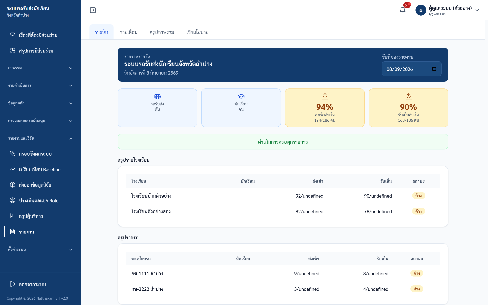

# คู่มือปฏิบัติงาน — ส่วนกลาง/จังหวัด
> ระบบรถรับส่งนักเรียนจังหวัดลำปาง — https://schoolbuslampang.com
> เวอร์ชัน Phase 10.13C • อัปเดต 2026-08-14

> 📷 **หมายเหตุภาพหน้าจอ:** ข้อมูลส่วนบุคคล (ชื่อ/เบอร์) ในภาพถูกเบลอเพื่อความเป็นส่วนตัว — เมื่อใช้งานจริงจะแสดงข้อมูลตามปกติ

## ภาพรวม 30 วินาที
- **บทบาทนี้ทำอะไรได้** (ดูอย่างเดียวเป็นหลัก ครอบคลุมทั้งจังหวัด):
  - ดู **ภาพรวมจังหวัด (Dashboard)** — KPI การรับ-ส่ง, รถ, เหตุฉุกเฉิน, โรงเรียนเสี่ยง
  - ดูข้อมูล **สังกัด / โรงเรียน / นักเรียน / รถรับส่ง** ทั้งจังหวัด
  - ดู **ตำแหน่งรถแบบ live** และ **แผนที่จุดรับส่ง** (ภาพรวม)
  - ดู **ความพร้อมเปิดใช้งาน** (Deployment Readiness) และ **เหตุฉุกเฉิน** ทั้งจังหวัด
  - ดู **ประวัติการแก้ไข (Audit Log)** — สิทธิ์พิเศษของบทบาทนี้
  - ดู/ส่งออก **รายงาน** รายวัน/รายเดือน/สรุป/**เชิงนโยบาย** (CSV / Excel / PDF)
- **เข้าระบบด้วย:** ชื่อผู้ใช้ของบัญชีส่วนกลาง (ผู้ดูแลระบบตั้งให้ — ไม่ใช่ค่าตายตัว) + รหัสผ่าน
- **อุปกรณ์ที่แนะนำ:** คอมพิวเตอร์ (desktop) เป็นหลัก เหมาะกับตาราง KPI/แผนที่/รายงาน • มือถือใช้ได้ มีแถบล่าง 4 แท็บ
  - 💡 ใช้คอมพิวเตอร์เมื่อต้องดูรายงานเชิงลึกหรือส่งออกไฟล์ เพราะตารางและการดาวน์โหลดสะดวกกว่า
  - บัญชีนี้เหมาะกับหน่วยงานส่วนกลางระดับจังหวัด เช่น สภาองค์กรของผู้บริโภคจังหวัดลำปาง หรือ อบจ.

## สารบัญงาน
| # | งาน | ใช้เมื่อ |
|---|-----|---------|
| 1 | เข้าสู่ระบบ | ทุกครั้งที่เริ่มใช้งาน |
| 2 | ดูภาพรวมจังหวัด (Dashboard) | งานประจำวัน ดูสถานการณ์รวม |
| 3 | ดูสถานะวันนี้ (เข้าทาง URL ตรง) | เจาะดูความคืบหน้าเช้า-เย็นถึงรายคน |
| 4 | ดูตำแหน่งรถปัจจุบัน (live) | ติดตามตำแหน่งรถระหว่างวิ่ง |
| 5 | ดูเหตุฉุกเฉินทั้งจังหวัด | เฝ้าระวังเหตุการณ์ |
| 6 | ดูสังกัด (5 เขต) | เปรียบเทียบ KPI รายเขต |
| 7 | ดูโรงเรียนทั้งจังหวัด | ตรวจรายชื่อโรงเรียน |
| 8 | ค้นหานักเรียน | หานักเรียนรายคน |
| 9 | ดูรถรับส่งทั้งจังหวัด | ตรวจข้อมูลรถ/ความปลอดภัย |
| 10 | ดูแผนที่จุดรับส่ง | ดูภาพรวมจุดรับ-ส่ง |
| 11 | ดูความพร้อมเปิดใช้งาน | ก่อนเปลี่ยนโหมดความปลอดภัย |
| 12 | ดูประวัติการแก้ไข (Audit Log) | ตรวจสอบการกระทำในระบบ |
| 13 | ดูการเบี่ยงเส้นทาง ⚠️ | เมื่อ feature flag เปิดเท่านั้น |
| 14 | ดู/ส่งออกรายงาน | สรุปและดาวน์โหลดข้อมูล |
| 15 | เปลี่ยนรหัสผ่าน / ออกจากระบบ | ดูแลบัญชี |

---

## งานที่ 1 — เข้าสู่ระบบ
**ใช้เมื่อ:** เริ่มใช้งานระบบทุกครั้ง

**ขั้นตอน:**
1. เปิดเบราว์เซอร์ไปที่ **https://schoolbuslampang.com** → ระบบพาไปหน้าเข้าสู่ระบบ
2. กรอก **ชื่อผู้ใช้ของบัญชีส่วนกลาง** ที่ช่อง **"ชื่อผู้ใช้ / ทะเบียนรถ"**
3. กรอก **รหัสผ่าน**
4. กด **เข้าสู่ระบบ**

*ภาพ: หน้าเข้าสู่ระบบ (เดสก์ท็อป)*

*ภาพ: หน้าเข้าสู่ระบบ (มือถือ)*

**✅ ผลลัพธ์ที่ถูกต้อง:** เข้าได้แล้วระบบพาไปหน้า **"ภาพรวมจังหวัด"** อัตโนมัติ

**ข้อควรรู้เรื่องรหัสผ่าน:**
- บัญชีที่ย้ายมาจากระบบเดิม รหัสเริ่มต้น (ถ้าไม่ได้กำหนดอื่น) คือ **`1234`** — ใช้ได้ครั้งแรกเท่านั้น แล้วระบบบังคับเปลี่ยน
- ถ้าบัญชีต้องเปลี่ยนรหัส (must_change_password) ระบบพาไปหน้า **เปลี่ยนรหัสผ่าน** ทันที และ **ใช้เมนูอื่นไม่ได้** จนเปลี่ยนสำเร็จ (เข้าหน้าอื่นจะขึ้น "กรุณาเปลี่ยนรหัสผ่านก่อนใช้งานระบบ")
- กฎรหัสผ่านใหม่: ยาว **8–128 ตัว**, ห้ามตรงกับชื่อผู้ใช้, ห้ามคาดเดาง่าย (`12345678`, `password`), ห้ามอักขระเดียวซ้ำ (`aaaaaaaa`)

*ภาพ: หน้าเปลี่ยนรหัสผ่าน (บังคับเปลี่ยนครั้งแรก)*

**⚠️ ถ้าติดปัญหา:**
- ขึ้น "ชื่อผู้ใช้หรือรหัสผ่านไม่ถูกต้อง" → ชื่อผู้ใช้/รหัสผ่านผิด (หรือบัญชีถูกปิด)
- ขึ้น "มีการพยายามเข้าสู่ระบบหลายครั้งจากเครือข่ายนี้" → พยายามถี่เกินไป รอ ~15 นาที (ล็อกชั่วคราว ไม่ใช่ปิดถาวร)
- ตั้งรหัสไม่ผ่าน → อ่านข้อความเตือน เช่น "รหัสผ่านต้องมีอย่างน้อย 8 ตัวอักษร" หรือ "รหัสผ่านนี้คาดเดาง่ายเกินไป"
- **ลืมรหัสผ่าน:** ไม่มีปุ่ม "ลืมรหัสผ่าน" และบัญชีส่วนกลางรีเซ็ตตัวเองไม่ได้ → ติดต่อผู้ดูแลระบบ (admin) ให้รีเซ็ต หลังรีเซ็ตระบบบังคับให้ตั้งรหัสใหม่ก่อนใช้ (เปลี่ยนรหัสเองได้ถ้ารู้รหัสเดิม)

---

## งานที่ 2 — ดูภาพรวมจังหวัด (Dashboard)
**ใช้เมื่อ:** ดูสถานการณ์ทั้งจังหวัดในที่เดียว (งานประจำวัน)

**ขั้นตอน:**
1. เข้าสู่ระบบ → ระบบพาไปหน้า **"ภาพรวมจังหวัด"** อัตโนมัติ
2. อ่านการ์ดและ KPI ภาพรวม (หน้านี้อัปเดตอัตโนมัติทุก 30 วินาที มีป้ายเวลาอัปเดตล่าสุด + ปุ่มรีเฟรชด้วยมือ)
3. กดการ์ดเตือนเพื่อเลื่อนไปดูรายละเอียด หรือใช้ปุ่มลัด **"ตำแหน่งปัจจุบัน" / "เหตุฉุกเฉิน" / "รายงาน"**

**สิ่งที่เห็นบนหน้าจอ:**
- **การ์ดผู้บริหาร 5 ใบ:** (1) "รถทั้งหมด / รถที่ติดตามได้" (2) "สถานะสัญญาณรถ" (ออนไลน์/สัญญาณเก่า/ออฟไลน์/หยุดส่ง) (3) "การรับ-ส่งวันนี้" (ส่งเช้า/รับเย็น ทำแล้ว/ทั้งหมด) (4) "โรงเรียนยังไม่เริ่มใช้ระบบ" (ไม่มีการใช้งานใน 14 วันล่าสุด) (5) "โรงเรียนเสี่ยงวันนี้"
- **แผงเตือนผู้บริหาร (Executive Attention Panel)** — ปรากฏเมื่อมีปัญหา มีการ์ด "โรงเรียนเสี่ยง", "เหตุฉุกเฉินล่าสุด", "รถสำคัญ" กดแล้วเลื่อนไปยังส่วนที่เกี่ยวข้อง
- **ภาพรวมระบบ** — ยอดรวม นักเรียน / โรงเรียน / สังกัด / รถบริการนักเรียน
- **ผลการดำเนินการวันนี้** — แถบความคืบหน้ารอบเช้า/เย็น (ทำแล้ว/ทั้งหมด/รอ/ลา + KPI %)
- **โรงเรียนเสี่ยง** — รายชื่อโรงเรียนที่ยังเช็กไม่ครบ
- **สรุปรายสังกัด** — KPI เช้า/เย็น + จำนวนเหตุฉุกเฉินต่อสังกัด
- **เหตุฉุกเฉินล่าสุด** — 5 รายการล่าสุด
- **รถสำคัญต้องติดตาม** — 10 อันดับแรกเรียงตามคะแนนความเสี่ยง
- **สรุปผู้บริหาร** — สรุปเป็นข้อ ๆ

*ภาพ: แดชบอร์ดภาพรวมจังหวัด*

**✅ ผลลัพธ์ที่ถูกต้อง:** เห็นการ์ด KPI ครบ และตัวเลขอัปเดตล่าสุดภายใน 30 วินาที

**⚠️ ข้อควรระวัง:**
- "รถสำคัญต้องติดตาม" คำนวณจากคะแนนความเสี่ยง: ไม่ผ่านตรวจ +100, ยังไม่ตรวจ +80, ต้องแก้ไข +60, ประกันหมด +50, ไม่มีข้อมูลประกัน +40, ประกันใกล้หมด (<30 วัน) +20 — นับเฉพาะรถที่มีนักเรียน ≥1 คน และ **ไม่แสดงเบอร์โทร**
- "โรงเรียนยังไม่เริ่มใช้ระบบ" = ไม่มีการบันทึกสถานะเลยใน 14 วันล่าสุด
- ตัวเลขรถมี 2 ความหมาย: **"รถทั้งหมด"** (ทุกคันในระบบ) vs **"รถบริการนักเรียน"** (นับจากรายชื่อในรถ) — เป็นคนละตัวเลขโดยตั้งใจ

---

## งานที่ 3 — ดูสถานะวันนี้ (เข้าทาง URL ตรง)
**ใช้เมื่อ:** ต้องการเจาะดูความคืบหน้าเช้า-เย็นถึงรายคน

**ขั้นตอน:**
1. พิมพ์ URL **`https://schoolbuslampang.com/province/status`** (หน้านี้ **ไม่มีลิงก์ในเมนู**)
2. กดขยายแต่ละระดับเพื่อเจาะลึก: **สังกัด → โรงเรียน → รถ → นักเรียน**
3. ใช้ช่องค้นทะเบียนรถเพื่อหาเร็วขึ้น

**สิ่งที่เห็น:** โครงสร้างต้นไม้ขยายได้ 3 ระดับ บอก "ทำแล้ว/ทั้งหมด" รอบเช้า-เย็นในแต่ละระดับ และเวลาที่เช็ก (✓ เวลา) ของนักเรียนรายคน

*ภาพ: สถานะขึ้น-ลงรถวันนี้*

**✅ ผลลัพธ์ที่ถูกต้อง:** เห็นต้นไม้ขยายได้ครบ 3 ระดับ ครอบคลุมทั้งจังหวัด (ดูอย่างเดียว)

---

## งานที่ 4 — ดูตำแหน่งรถปัจจุบัน (live)
**ใช้เมื่อ:** ติดตามตำแหน่งรถระหว่างวิ่ง

**ขั้นตอน:**
1. เปิดเมนู **"ตำแหน่งปัจจุบัน"**
2. กดเลือกรถคันใดคันหนึ่งเพื่อโฟกัสบนแผนที่
3. สังเกตการแจ้งเตือนเมื่ออุปกรณ์ offline หรือข้อมูลเก่าเกิน 45 วินาที

**สิ่งที่เห็น:** แผนที่ + รายการรถพร้อมสถานะสัญญาณ **ออนไลน์ / สัญญาณเก่า / หยุดส่ง / ออฟไลน์** ทั้งจังหวัด (อัปเดตทุก ~15 วินาที) + KPI: รถทั้งหมด, นักเรียนที่เกี่ยวข้อง, ออนไลน์, สัญญาณเก่า, หยุดส่ง, ออฟไลน์, กำลังมีพิกัดจริง, ยังไม่เคยส่งตำแหน่ง

*ภาพ: ตำแหน่งรถปัจจุบัน (live)*

**✅ ผลลัพธ์ที่ถูกต้อง:** เห็นแผนที่และรายการรถพร้อมสถานะสัญญาณ

**⚠️ ข้อควรระวัง:**
- รถปรากฏบนแผนที่ **เฉพาะตอนคนขับเปิด "เริ่มส่งตำแหน่ง"** — รถที่ไม่เคยส่งจะอยู่กลุ่ม "ยังไม่เคยส่งตำแหน่ง"
- การเข้าหน้านี้ **ถูกบันทึกในประวัติการแก้ไข (audit)**

---

## งานที่ 5 — ดูเหตุฉุกเฉินทั้งจังหวัด
**ใช้เมื่อ:** เฝ้าระวังเหตุการณ์ทั้งจังหวัด

**ขั้นตอน:**
1. เปิดเมนู **"เหตุฉุกเฉิน"**
2. เลื่อนดูรายการ / เปลี่ยนหน้า

**สิ่งที่เห็น:** รายการเหตุฉุกเฉินทั้งจังหวัด เรียงใหม่→เก่า แต่ละแถวแสดง **ทะเบียนรถ / ช่องทาง (LINE หรือเว็บ) / เวลา / รายละเอียด / หมายเหตุ / ผลลัพธ์ / รายงานโดย**

*ภาพ: เหตุฉุกเฉินทั้งจังหวัด*

**✅ ผลลัพธ์ที่ถูกต้อง:** เห็นรายการเหตุฉุกเฉินเรียงตามเวลา

**⚠️ ถ้าติดปัญหา:** บทบาทส่วนกลาง **ดูได้อย่างเดียว — แก้ไขหรือปิดเคสไม่ได้**

---

## งานที่ 6 — ดูสังกัด (5 เขต)
**ใช้เมื่อ:** เปรียบเทียบ KPI รายเขต

**ขั้นตอน:**
1. เปิดเมนู **"สังกัด"**
2. อ่านตาราง/การ์ดเปรียบเทียบรายเขต (เรียงตาม KPI)

**สิ่งที่เห็น:** KPI รายสังกัดทั้ง 5 เขต แต่ละแถวแสดง **สังกัด / โรงเรียน / นักเรียน / รถ / KPI ส่งเช้า / KPI รับเย็น / ฉุกเฉิน / ระดับ**

*ภาพ: รายการสังกัด*

**✅ ผลลัพธ์ที่ถูกต้อง:** เห็นตาราง/การ์ดเปรียบเทียบครบทุกสังกัด (ดูอย่างเดียว)

---

## งานที่ 7 — ดูโรงเรียนทั้งจังหวัด
**ใช้เมื่อ:** ตรวจรายชื่อโรงเรียน

**ขั้นตอน:**
1. เปิดเมนู **"โรงเรียน"**
2. เลือก **"ทุกสังกัด"** หรือเลือกสังกัดที่ต้องการเพื่อกรอง
3. เลื่อนดู / เปลี่ยนหน้า (แสดงสูงสุด 200 รายการต่อหน้า ค่าเริ่มต้น 50)

**สิ่งที่เห็น:** รายชื่อโรงเรียนทั้งจังหวัด แต่ละแถวแสดง **โรงเรียน / สังกัด / จำนวนนักเรียน / จำนวนรถ**

*ภาพ: โรงเรียนทั้งจังหวัด*

**✅ ผลลัพธ์ที่ถูกต้อง:** เห็นรายชื่อโรงเรียน (ดูอย่างเดียว)

---

## งานที่ 8 — ค้นหานักเรียน
**ใช้เมื่อ:** หานักเรียนรายคนทั้งจังหวัด

**ขั้นตอน:**
1. เปิดเมนู **"ข้อมูลนักเรียน"**
2. พิมพ์คำค้นในช่องค้นหา (ค้นได้ตามชื่อ / นามสกุล / รหัสนักเรียน — ระบบรอพิมพ์เสร็จ ~0.4 วินาทีจึงค้น)
3. ใช้ตัวกรอง **"ทุกชั้น" / "ทุกสังกัด" / "ทุกโรงเรียน"** เพื่อจำกัดผลลัพธ์
4. คลิก **ทะเบียนรถ** ในแถวเพื่อข้ามไปดูรถคันนั้น

**สิ่งที่เห็น:** แต่ละแถวแสดง **รหัส / ชื่อ-นามสกุล / ชั้น-ห้อง / โรงเรียน / สังกัด / ทะเบียนรถ / เช้า / เย็น**

*ภาพ: ข้อมูลนักเรียนทั้งจังหวัด*

**✅ ผลลัพธ์ที่ถูกต้อง:** เห็นผลค้นหาตรงกับคำค้น/ตัวกรอง

**⚠️ ข้อควรระวัง:**
- หน้านี้ **ไม่แสดงชื่อผู้ปกครองและเบอร์ผู้ปกครอง** โดยตั้งใจ (นโยบายลดการเปิดเผยข้อมูลส่วนบุคคล/PDPA) — ถ้าต้องการข้อมูลผู้ปกครองต้องใช้บัญชีบทบาทโรงเรียน
- การค้นด้วยรหัสคือค้นจาก "รหัสนักเรียน"

---

## งานที่ 9 — ดูรถรับส่งทั้งจังหวัด
**ใช้เมื่อ:** ตรวจข้อมูลรถและความปลอดภัย

**ขั้นตอน:**
1. เปิดเมนู **"รถรับส่ง"**
2. ค้นหาด้วยทะเบียนรถ
3. กด **"▼ แสดงรายชื่อนักเรียน"** เพื่อขยายดูรายชื่อนักเรียนในรถคันนั้น

**สิ่งที่เห็น:** การ์ดรถแต่ละคันแสดง **ทะเบียน / ประเภทรถ / โรงเรียนที่ให้บริการ / จำนวนนักเรียน / คนขับ / ผู้ดูแลรถ / เจ้าของรถ** + ส่วนความปลอดภัย (ผลตรวจล่าสุด / ประกัน)

*ภาพ: รถรับส่งทั้งจังหวัด*

**✅ ผลลัพธ์ที่ถูกต้อง:** เห็นการ์ดรถพร้อมข้อมูลความปลอดภัย และขยายดูรายชื่อนักเรียนได้

**⚠️ ข้อควรระวัง:**
- **เบอร์โทรทั้งหมดถูกตัดออก** (เบอร์คนขับ / ผู้ดูแล / เจ้าของ) — แสดงเฉพาะชื่อ เพราะเป็นมุมมองภาพรวม
- ในตารางรายชื่อนักเรียนแบบขยาย คอลัมน์ **"ผู้ปกครอง"** และ **"เบอร์โทร"** แสดง **"-"** เสมอ (มุมมองส่วนกลางไม่คืนข้อมูลผู้ปกครอง)

---

## งานที่ 10 — ดูแผนที่จุดรับส่ง
**ใช้เมื่อ:** ดูภาพรวมจุดรับ-ส่งระดับจังหวัด

**ขั้นตอน:**
1. เปิดเมนู **"แผนที่จุดรับส่ง"**
2. ใช้ตัวกรองเพื่อจำกัดขอบเขต: ค้นหา / รอบ (เช้า / เย็น / เช้าและเย็น) / ระดับชั้น / สังกัด / โรงเรียน / รถ

**สิ่งที่เห็น:** แผนที่ภาพรวมจุดรับ-ส่ง + KPI (จุดรับส่งทั้งหมด, นักเรียนในขอบเขต, โรงเรียนที่เกี่ยวข้อง, รถที่เกี่ยวข้อง)

*ภาพ: แผนที่จุดรับ-ส่ง*

**✅ ผลลัพธ์ที่ถูกต้อง:** เห็นแผนที่ภาพรวมและ KPI ตามตัวกรอง

**⚠️ ข้อควรระวัง:**
- แผนที่นี้เป็น **ภาพรวมเชิงตัวเลข ไม่มีข้อมูลส่วนบุคคล** (ไม่มีชื่อ / เบอร์ / ที่อยู่นักเรียนรายคน)
- การเข้าหน้านี้ **ถูกบันทึกในประวัติการแก้ไข (audit)**

---

## งานที่ 11 — ดูความพร้อมเปิดใช้งาน
**ใช้เมื่อ:** ตรวจความพร้อมก่อนเปลี่ยนโหมด **สังเกตการณ์ (OBSERVE) → บังคับใช้ (ENFORCE)**

**ขั้นตอน:**
1. เปิดเมนู **"ความพร้อมเปิดใช้งาน"**
2. อ่านโหมดปัจจุบันและถังสรุป
3. ดูตารางรายการที่ต้องดำเนินการเพื่อประสานหน่วยงานที่รับผิดชอบ

**สิ่งที่เห็น:**
- **โหมดความปลอดภัยปัจจุบัน** (สังเกตการณ์ / บังคับใช้)
- **4 ถังสรุป** — พร้อมใช้งาน / ต้องเติมข้อมูล / มีข้อมูลเสี่ยง / ถูกระงับ
- **ความครบถ้วน 3 หมวด (เป็น %)** — รถพร้อมใช้งาน / คนขับมีใบอนุญาตรับรอง / รถมีคนขับที่อนุญาต
- **ตาราง "รายการที่ต้องดำเนินการ"** — ระบุผู้รับผิดชอบ (โรงเรียน / ขนส่ง / จังหวัด) + การกระทำต่อไป + ป้าย **"บังคับ" / "คำเตือน"**

*ภาพ: ความพร้อมเปิดใช้งาน*

**✅ ผลลัพธ์ที่ถูกต้อง:** เห็นโหมดปัจจุบัน, ถังสรุป, % ความครบถ้วน และตารางรายการที่ต้องทำ

**⚠️ ข้อควรระวัง:**
- เป็นตัวเลขภาพรวมล้วน **ไม่มีรายชื่อ / เบอร์ / ข้อมูลส่วนบุคคล**
- ระบบใช้หลัก **"ไม่รู้ = ไม่ปลอดภัย"** — ข้อมูลที่ยังไม่ได้รับการรับรองจะนับเป็น "ยังไม่พร้อม" ไม่ใช่ "ผ่าน" (เช่น ต้องมีผลตรวจ PASSED ที่ยังไม่หมดอายุ และใบอนุญาตที่ยืนยันแล้ว)
- การเปลี่ยนเป็นโหมดบังคับใช้ **ไม่เกิดอัตโนมัติตามวันที่** — ต้องให้ผู้ดูแลระบบตั้งค่าด้วยมือเท่านั้น (บทบาทส่วนกลางเปลี่ยนโหมดเองไม่ได้)

---

## งานที่ 12 — ดูประวัติการแก้ไข (Audit Log)
**ใช้เมื่อ:** ตรวจสอบการกระทำในระบบ (สิทธิ์พิเศษของบทบาทนี้)

**ขั้นตอน:**
1. เปิดเมนู **"ประวัติการแก้ไข"**
2. กรองตาม **การกระทำ** และ **ช่วงวันที่** (date_from / date_to)
3. กดปุ่ม **"Export CSV"** เพื่อดาวน์โหลดเป็นไฟล์ CSV (มี BOM เปิดในภาษาไทยได้)

**สิ่งที่เห็น:** ประวัติการกระทำทั้งระบบ — **CREATE / UPDATE / DELETE / IMPORT / APPROVE / EXPORT / LOGIN**

*ภาพ: ประวัติการแก้ไข (Audit log)*

**✅ ผลลัพธ์ที่ถูกต้อง:** เห็นรายการการกระทำตามตัวกรอง และดาวน์โหลด CSV ได้

**⚠️ ข้อควรระวัง:**
- บทบาทส่วนกลาง (และ admin) เป็นบทบาทเดียวที่ดู Audit Log ได้
- ค่าเดิม/ค่าใหม่ในบันทึกถูก **ปกปิดข้อมูลส่วนบุคคล** (เบอร์ผู้ปกครอง / เบอร์คนขับ / รหัสผู้ใช้ LINE) ทั้งในหน้าจอและในไฟล์ CSV
- Export CSV จำกัดสูงสุด **5,000 แถวล่าสุด** (ถ้าเกินจะตัดและแจ้งในไฟล์) — ใช้ตัวกรองวันที่/การกระทำเพื่อจำกัดผลลัพธ์
- การ Export CSV ของหน้านี้จะถูกบันทึกเป็น audit เองด้วย

---

## งานที่ 13 — ดูการเบี่ยงเส้นทาง (Route Deviations) ⚠️
**ใช้เมื่อ:** ดูรายงานการออกนอกเส้นทาง/ความล่าช้าของรถ — **เฉพาะเมื่อ feature flag เปิดเท่านั้น**

> ⚠️ **ฟีเจอร์นี้ปิดอยู่เป็นค่าเริ่มต้น (dark) — ควบคุมด้วย feature flag `FEATURE_ROUTE_DEVIATION` ฝั่งเซิร์ฟเวอร์ ซึ่งตอนนี้ยังไม่ได้เปิด** เมื่อ flag ปิด เมนู **"การเบี่ยงเส้นทาง"** จะถูกซ่อนจากแถบเมนูอัตโนมัติ ถ้าเข้าหน้าโดยตรงจะเปิดได้แต่ **โหลดข้อมูลไม่สำเร็จ** (ขึ้น "โหลดข้อมูลไม่สำเร็จ") เพราะ API ยังไม่ถูกเปิด — ต้องให้ผู้ดูแลระบบเปิด flag ก่อน

**ขั้นตอน (เมื่อ flag เปิดแล้ว):**
1. เปิดเมนู **"การเบี่ยงเส้นทาง"** (หรือเข้า URL `/admin/route-deviations`)
2. ดูรายการประเภท **เบี่ยงเส้นทาง / ล่าช้า / หยุดนิ่งนาน** พร้อมระดับความรุนแรง (INFO / WARN / CRITICAL)
3. กรองตามความรุนแรง และเลือกเฉพาะรายการที่ "ยังไม่ resolved"

**สิ่งที่เห็น:** หัวข้อหน้า **"การเบี่ยงเส้นทาง / ความล่าช้า"** — รายการพร้อมระดับความรุนแรงและสถานะ resolved

**✅ ผลลัพธ์ที่ถูกต้อง:** เห็นรายการการเบี่ยงเส้นทาง (เมื่อ flag เปิด)

**⚠️ ข้อควรระวัง:**
- บทบาทที่เข้าได้คือ **ส่วนกลาง (province)** และ **admin** เท่านั้น
- หน้านี้ใช้ร่วมกับฝั่ง admin จึงเข้าผ่าน URL `/admin/route-deviations` (ไม่ใช่ `/province/...`) แต่บทบาทส่วนกลางมีสิทธิ์เข้าได้ และมีลิงก์ในแถบเมนูของส่วนกลางอยู่แล้ว (เมื่อ flag เปิด)

> 📷 **ไม่มีภาพหน้าจอ** — ฟีเจอร์ "การเบี่ยงเส้นทาง" ถูกปิดด้วย feature flag (`FEATURE_ROUTE_DEVIATION`) ยังไม่เปิดใช้งานจริง จึงยังไม่มีหน้าจอให้แสดง

---

## งานที่ 14 — ดู/ส่งออกรายงาน
**ใช้เมื่อ:** สรุปและดาวน์โหลดข้อมูลทั้งจังหวัด (เข้าได้เต็มทั้งจังหวัด ไม่ถูกจำกัดขอบเขต)

**ขั้นตอน:**
1. เปิดเมนู **"รายงาน"** → เลือกประเภท (แท็บด้านบน): **รายวัน** (เริ่มต้น) / **รายเดือน** / **สรุปภาพรวม** / **เชิงนโยบาย**
2. ตั้งค่าตัวกรองตามต้องการ: วันที่ (ปี-เดือน-วัน) / เดือน (ปี-เดือน) / โรงเรียน / สังกัด / ทะเบียนรถ
3. กดปุ่มดาวน์โหลด **CSV / Excel / PDF**

**แท็บ "เชิงนโยบาย" (สำหรับผู้บริหาร — เห็นเฉพาะบทบาทส่วนกลาง/admin):** สรุปภาพรวมทั้งจังหวัดในหน้าเดียว เหมาะสำหรับนำเสนอ ประกอบด้วย
- **ยอดรวมทั้งจังหวัด** — เขตพื้นที่ / โรงเรียน / นักเรียน / รถรับส่ง / คนขับ
- **การรับ-ส่งวันนี้** — ส่งเช้า % · รับเย็น % (ทำแล้ว/ที่ติดตาม)
- **เหตุฉุกเฉินย้อนหลัง 30 วัน**
- **ตารางสรุปรายสังกัด** — โรงเรียน / นักเรียน / รถ ต่อเขต + กล่อง **"สรุปผู้บริหาร"** เป็นข้อ ๆ

**รูปแบบไฟล์:**
| รูปแบบ | หมายเหตุ |
|---|---|
| **CSV** | มี BOM เปิดในภาษาไทยได้ ป้องกันการแทรกสูตรอันตราย |
| **Excel (.xlsx)** | มีหัวตารางจัดรูปแบบ ชีต "รายงานประจำวัน" |
| **PDF** | ฟอนต์ไทย มีสรุปภาพรวม + รายโรงเรียน + รายคัน |

**✅ ผลลัพธ์ที่ถูกต้อง:** ได้ไฟล์รายงานตามประเภทและตัวกรองที่เลือก ครอบคลุมทั้งจังหวัด

**⚠️ ข้อควรระวัง:**
- **เฉพาะ Export PDF:** ระบบเปิดหน้าต่างให้บันทึก **"การตัดสินใจ" (Decision Log)** ก่อน (ระบุประเภทและบันทึกการตัดสินใจ) — กด **"ข้าม"** ได้ หรือ **"ยกเลิก"** เพื่อไม่ส่งออก • CSV และ Excel ไม่ต้องผ่านหน้าต่างนี้
- การเปิดดูและส่งออกรายงาน **นับรวมกัน จำกัด 40 ครั้ง/5 นาที** ต่อหนึ่งเครือข่าย (ครอบคลุมทุก endpoint ใต้ `/api/reports/*`) — ถ้าเกินขึ้น "ขอรายงานถี่เกินไป กรุณารอสักครู่"
- การส่งออกทุกครั้งถูกบันทึกในประวัติการแก้ไข

*ภาพ: หน้ารายงาน — แท็บ รายวัน/รายเดือน/สรุปภาพรวม พร้อมปุ่มส่งออก*

---

## งานที่ 15 — เปลี่ยนรหัสผ่าน / ออกจากระบบ
**ใช้เมื่อ:** ดูแลความปลอดภัยของบัญชี

**ขั้นตอน (เปลี่ยนรหัสผ่าน):**
1. เข้าหน้าเปลี่ยนรหัสผ่าน
2. กรอกรหัสเดิม แล้วตั้งรหัสใหม่ตามกฎ (8–128 ตัว, ห้ามตรงชื่อผู้ใช้, ห้ามคาดเดาง่าย, ห้ามอักขระเดียวซ้ำ)
3. บันทึก

**ขั้นตอน (ออกจากระบบ):**
1. กดออกจากระบบเมื่อเลิกใช้งาน

**✅ ผลลัพธ์ที่ถูกต้อง:** เปลี่ยนรหัสสำเร็จ / กลับสู่หน้าเข้าสู่ระบบ

**⚠️ ถ้าติดปัญหา:** ลืมรหัสเดิม → ติดต่อผู้ดูแลระบบ (admin) ให้รีเซ็ต (บัญชีส่วนกลางรีเซ็ตตัวเองไม่ได้)

*ภาพ: เมนูบัญชี (มุมขวาบน) — "เปลี่ยนรหัสผ่าน" / "ออกจากระบบ"*

---

## ตารางขอบเขตสิทธิ์ (อ้างอิงด่วน)

### คุณเห็นข้อมูลได้แค่ไหน
| ข้อมูล | ขอบเขต |
|---|---|
| สังกัด / โรงเรียน / นักเรียน / รถ | **ทั้งจังหวัด** (ทุกสังกัด ทุกโรงเรียน ทุกคัน) |
| สถานะรับ-ส่ง / ตำแหน่งรถ / แผนที่จุดรับส่ง | ทั้งจังหวัด |
| เหตุฉุกเฉิน | ทั้งจังหวัด (ดูอย่างเดียว) |
| ประวัติการแก้ไข (Audit Log) | ทั้งระบบ — สิทธิ์พิเศษของบทบาทนี้ |
| รายงาน / ส่งออก | ทั้งจังหวัด |

### ข้อมูลส่วนบุคคลที่ถูกปิดในมุมมองส่วนกลาง (โดยตั้งใจ)
| มุมมอง | สิ่งที่ถูกปิด |
|---|---|
| รถรับส่ง | เบอร์คนขับ / ผู้ดูแล / เจ้าของ (แสดงแต่ชื่อ) |
| ข้อมูลนักเรียน | ชื่อ/เบอร์ผู้ปกครอง (แสดงเป็น "-") |
| ประวัติการแก้ไข | เบอร์โทร / รหัสผู้ใช้ LINE ถูกปกปิด |
| แผนที่จุดรับส่ง / ความพร้อมเปิดใช้งาน | ภาพรวมเชิงตัวเลข ไม่มีข้อมูลส่วนบุคคล |

### สิ่งที่ทำไม่ได้ (และใครทำแทน)
| ทำไม่ได้ | ใครทำแทน |
|---|---|
| เช็กอิน/เช็กเอาท์นักเรียน | **คนขับ** |
| เพิ่ม/แก้ไข/ลบนักเรียน, นำเข้าข้อมูล, จัดการบัญชีครู | **โรงเรียน** |
| สร้าง/รีเซ็ตบัญชีโรงเรียน, เพิ่มโรงเรียนใหม่ | **สังกัด (affiliation)** หรือ admin |
| ตรวจสภาพ/รับรองรถ, บันทึกผลตรวจ | **ขนส่ง (transport)** |
| แก้ไข/ปิดเคสเหตุฉุกเฉิน | ดูได้อย่างเดียว (ไม่มีบทบาทแก้ผ่านหน้านี้) |
| จัดการผู้ใช้ทั้งระบบ, geofences, จัดการจุดรับส่ง, ตั้งค่าระบบ | **admin** |
| เปลี่ยนโหมดความปลอดภัย (OBSERVE → ENFORCE) | **admin** (ตั้งค่าด้วยมือ) |
| รีเซ็ตรหัสตัวเอง (ลืมรหัส) | **admin** รีเซ็ตให้ |

### สิ่งที่บทบาทส่วนกลาง "เขียน" ได้
- บันทึกการตัดสินใจ (Decision Log) ตอนส่งออก PDF
- เปลี่ยนรหัสผ่านตัวเอง และออกจากระบบ
- (โดยอ้อม) การเข้าดูตำแหน่งรถ/แผนที่จุดรับส่ง และการส่งออก จะถูกบันทึกในประวัติการแก้ไขเอง

> ℹ️ **รายงานเชิงนโยบาย มีให้ใช้แล้ว** (อัปเดต 2026-08-14) — เข้าผ่านแท็บ **"เชิงนโยบาย"** ในเมนูรายงาน (ดูงานที่ 14) แสดงสรุปภาพรวมทั้งจังหวัดสำหรับผู้บริหาร เห็นเฉพาะบทบาทส่วนกลางและ admin

---

## สรุปปัญหาที่พบบ่อย
| อาการ | วิธีแก้ |
|---|---|
| เบอร์โทรในหน้ารถ/นักเรียนเป็น "-" หมด | มุมมองภาพรวมระดับจังหวัดตัดเบอร์โทรและไม่แสดงข้อมูลผู้ปกครองโดยตั้งใจ (PDPA) ถ้าต้องการเบอร์ต้องใช้บัญชีบทบาทโรงเรียน |
| หาเมนู "การเบี่ยงเส้นทาง" ไม่เจอ | เมนูถูกซ่อนเมื่อ `FEATURE_ROUTE_DEVIATION` ปิด เข้าตรง (`/admin/route-deviations`) จะเปิดได้แต่โหลดข้อมูลไม่สำเร็จ — ให้ admin เปิด flag ก่อน |
| เมนูไม่มี "สถานะวันนี้" | หน้านี้มีจริงแต่ไม่ได้ลิงก์ในเมนู — เข้าทาง URL ตรง `/province/status` |
| ลืมรหัสผ่าน | ไม่มีปุ่มลืมรหัส ติดต่อ admin ให้รีเซ็ต หลังรีเซ็ตระบบบังคับตั้งรหัสใหม่ก่อนใช้ ("กรุณาเปลี่ยนรหัสผ่านก่อนใช้งานระบบ") |
| ตั้งรหัสใหม่ไม่ผ่าน | ต้องยาว ≥8 ตัว ไม่ตรงชื่อผู้ใช้ ไม่คาดเดาง่าย (`12345678`, `password`) ไม่ใช่อักขระเดียวซ้ำ (`aaaaaaaa`) |
| เข้าระบบไม่ได้ ขึ้นให้รอ 15 นาที | พยายามผิดหลายครั้ง ระบบล็อกชั่วคราว 15 นาที (ไม่ใช่ปิดถาวร) รอแล้วลองใหม่ |
| กด Export PDF แล้วเด้งหน้าต่างให้กรอก | เฉพาะ PDF ต้องผ่านหน้าต่าง Decision Log ก่อน — กด "ข้าม" ได้ ส่วน CSV/Excel ไม่ต้อง |
| Export CSV ประวัติการแก้ไขได้ไม่ครบ | ระบบตัดที่ 5,000 แถวล่าสุดและแจ้งในไฟล์ ใช้ตัวกรองวันที่/การกระทำให้แคบลง |
| กดส่งออก/เปิดรายงานรัว ๆ แล้วถูกบล็อก | เปิดดู+ส่งออกนับรวมกัน จำกัด 40 ครั้ง/5 นาที ("ขอรายงานถี่เกินไป กรุณารอสักครู่") รอแล้วลองใหม่ |
| รถบนแผนที่ไม่ขึ้น | รถมีพิกัดเมื่อคนขับเปิด "เริ่มส่งตำแหน่ง" เท่านั้น รถที่ไม่เคยส่งอยู่กลุ่ม "ยังไม่เคยส่งตำแหน่ง" |
| เปิดหน้าตำแหน่งรถ/แผนที่จุดรับส่งแล้วถูกบันทึก log | ใช่ การเข้าดูทั้งสองหน้าถูกบันทึกในประวัติการแก้ไข (audit) ตามนโยบายตรวจสอบ |
| จำนวนรถใน Dashboard ดูไม่ตรงกัน | "รถทั้งหมด" = ทุกคันในระบบ • "รถบริการนักเรียน" = นับจากรายชื่อนักเรียนในรถ — คนละตัวเลขโดยตั้งใจ |
| "ความพร้อม" ขึ้นว่ายังไม่พร้อม ทั้งที่กรอกข้อมูลแล้ว | หลัก "ไม่รู้ = ไม่ปลอดภัย" — ต้องได้รับการ "รับรอง" จริง (ผลตรวจ PASSED ที่ยังไม่หมดอายุ, ใบอนุญาตที่ยืนยันแล้ว) ผู้รับผิดชอบแก้คือโรงเรียน/ขนส่ง |
| โหมดบังคับใช้ (ENFORCE) จะเปิดเองตามวันที่ไหม | ไม่ — ต้องให้ admin ตั้งค่าด้วยมือเท่านั้น ระบบไม่เปลี่ยนโหมดอัตโนมัติตามวันที่ |

### การขอความช่วยเหลือ
- **ลืมรหัสผ่าน / บัญชีมีปัญหา** → ติดต่อผู้ดูแลระบบ (admin)
- **ต้องการเปิดฟีเจอร์ที่ถูกซ่อน (เช่น "การเบี่ยงเส้นทาง") หรือเปลี่ยนโหมดความปลอดภัย** → ติดต่อ admin
- **ข้อมูลรถ/การตรวจสภาพไม่ถูกต้อง** → ประสานบทบาทขนส่ง (transport)
- **ข้อมูลนักเรียน/บัญชีโรงเรียนไม่ถูกต้อง** → ประสานสังกัด (affiliation) หรือโรงเรียน

เวลาแจ้งปัญหา โปรดส่ง: ชื่อผู้ใช้บัญชีส่วนกลาง, หน้า/เมนูที่เกิดปัญหา (เช่น "ภาพรวมจังหวัด", "รายงาน"), เวลาที่เกิดปัญหา, ภาพหน้าจอ (screenshot)

---

**สิ้นสุดคู่มือปฏิบัติงานสำหรับส่วนกลาง/จังหวัด — กำกับดูแลภาพรวมเพื่อความปลอดภัยของนักเรียนทั้งจังหวัด**
