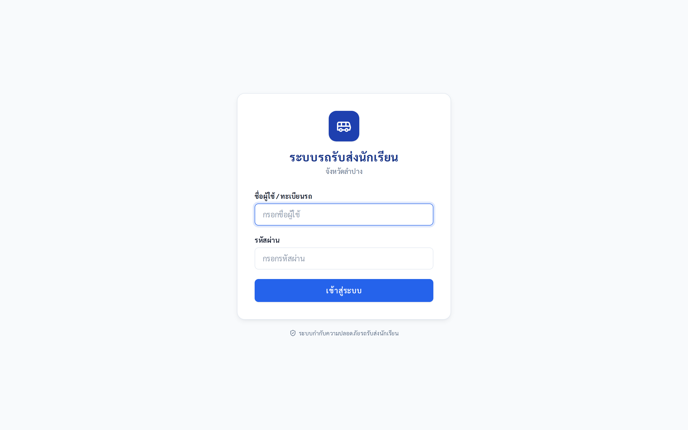
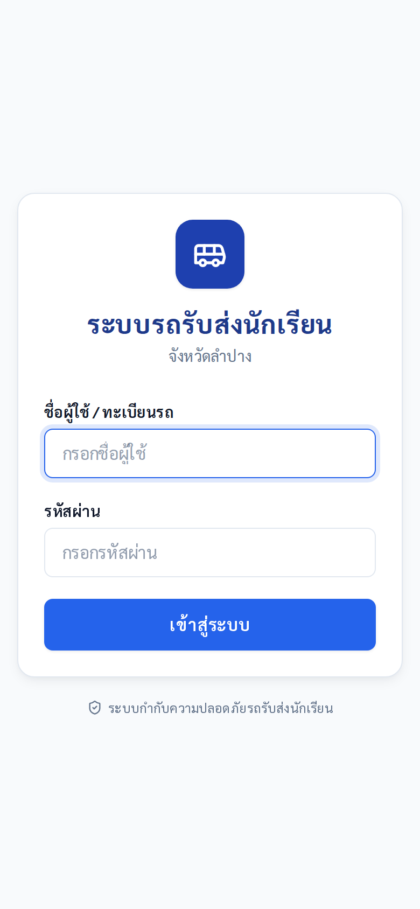
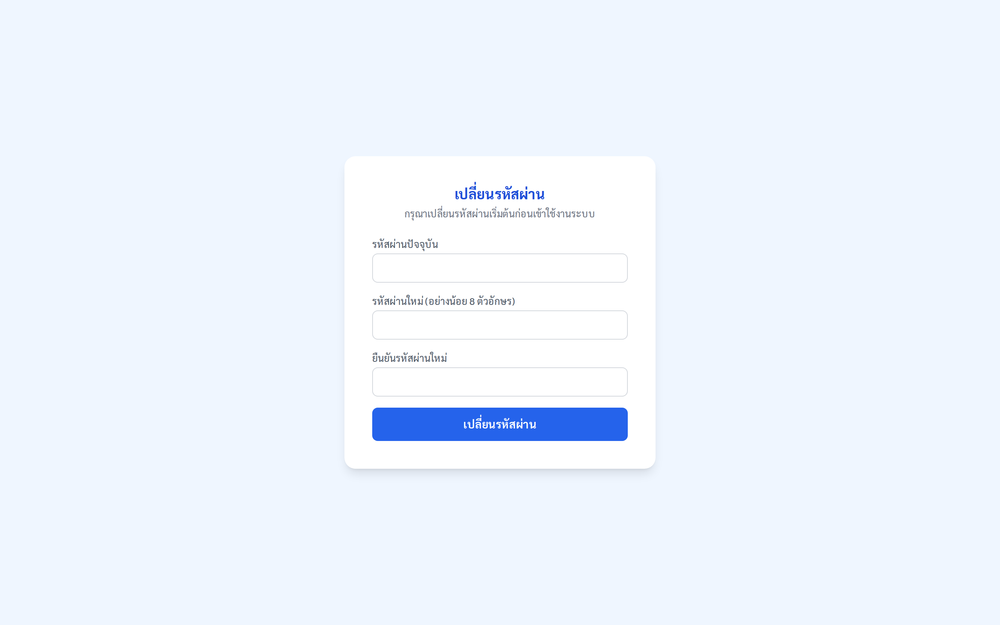
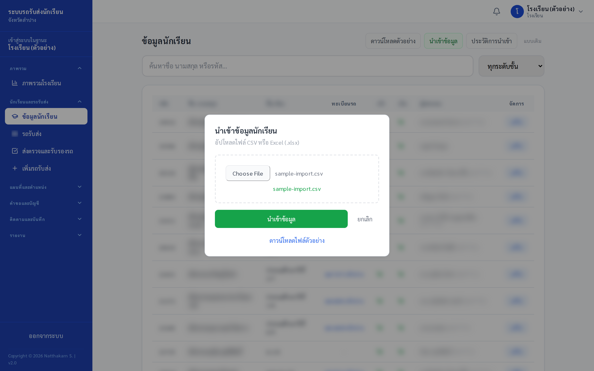
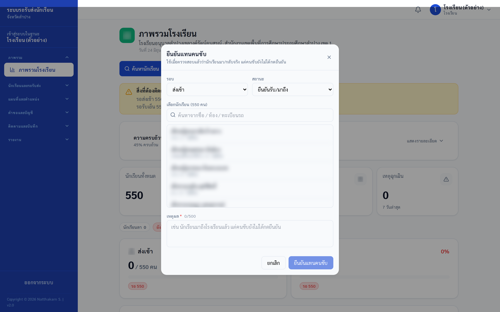
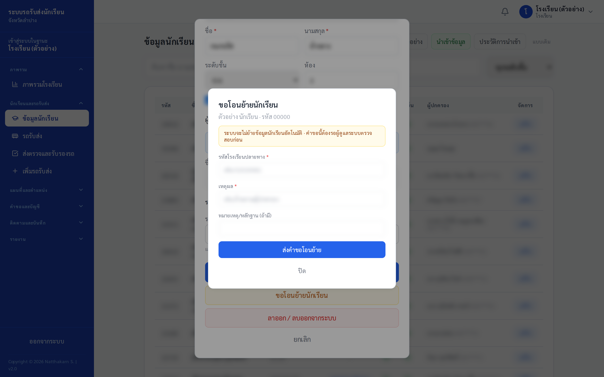
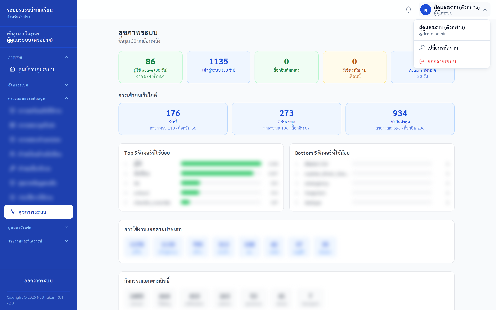

# คู่มือปฏิบัติงาน — โรงเรียน

> ระบบรถรับส่งนักเรียนจังหวัดลำปาง — https://schoolbuslampang.com
> เวอร์ชัน Phase 10.13C • อัปเดต 2026-06-24

> 📷 **หมายเหตุภาพหน้าจอ:** ข้อมูลส่วนบุคคล (ชื่อนักเรียน/ผู้ปกครอง เบอร์โทร) ในภาพถูกเบลอเพื่อความเป็นส่วนตัว — เมื่อใช้งานจริงจะแสดงข้อมูลตามปกติ

## ภาพรวม 30 วินาที

- **บทบาทนี้ทำอะไรได้ (บัญชีหลัก):**
  - ดูแดชบอร์ดประจำวัน (สถานะรับ-ส่ง รายรอบ/รายคันรถ)
  - จัดการข้อมูลนักเรียน (ค้นหา/เพิ่ม/แก้ไข/ย้ายรถ/ลบ) + นำเข้าจาก Excel/CSV + ย้อนกลับ
  - เพิ่มรถรับส่ง (สร้างบัญชีคนขับอัตโนมัติ) + ส่งตรวจและรับรองรถ
  - ดู/สร้างจุดรับส่ง + ดูตำแหน่งรถ live + อนุมัติคำขอจากคนขับ + ยืนยันแทนคนขับ
  - จัดการบัญชีครูประจำสายชั้น + ดูเหตุฉุกเฉิน + ประวัติการแก้ไข
  - ดูรายงานรายวัน/รายเดือน/สรุป และส่งออก CSV/Excel/PDF
- **บัญชีนี้มี 2 ระดับ:** **บัญชีหลักของโรงเรียน** (จัดการเต็มรูปแบบ) และ **บัญชีครูประจำสายชั้น** (ดูข้อมูลได้อย่างเดียว เฉพาะระดับชั้นที่รับผิดชอบ — สร้างโดยบัญชีหลัก)
- **เข้าระบบด้วย:** ชื่อผู้ใช้ (username) + รหัสผ่าน — บัญชีหลักได้จากเขตพื้นที่/admin, ครูสายชั้นได้จากบัญชีหลัก (รูปแบบเช่น `SCH0001-P4`)
- **อุปกรณ์ที่แนะนำ:** คอมพิวเตอร์เป็นหลัก (งานจัดการ/นำเข้า/รายงานสะดวกบนจอใหญ่ เห็นเมนูครบในแถบข้าง) — มือถือใช้ดูภาพรวม/ค้นหา/ตำแหน่ง/รายงาน (แถบล่าง 4 แท็บ)

> 💡 แนะนำบันทึก URL ไว้ที่หน้าจอหลัก (Add to Home Screen) เพื่อเปิดใช้งานเหมือนแอป
> 🔒 หัวข้อที่มีป้าย **(บัญชีหลักเท่านั้น)** บัญชีครูประจำสายชั้นทำไม่ได้ — ถ้าหลุดเข้าไปได้ ระบบจะตอบ "บัญชีครูประจำสายชั้นเข้าถึงได้เฉพาะข้อมูลในการดูเท่านั้น"

## สารบัญงาน

| # | งาน | ใช้เมื่อ |
|---|-----|---------|
| 1 | เข้าสู่ระบบ (+ เปลี่ยนรหัสครั้งแรก) | ทุกครั้งที่เริ่มใช้งาน |
| 2 | ดูแดชบอร์ดประจำวัน | ดูภาพรวมสถานะรับ-ส่งวันนี้ |
| 3 | ค้นหา/แก้ไขข้อมูลนักเรียน | จัดการข้อมูลนักเรียนรายคน |
| 4 | นำเข้านักเรียน (ตรวจสอบก่อน/ยืนยัน) | เพิ่มนักเรียนทีละหลายคนจากไฟล์ |
| 5 | ดูประวัติการนำเข้า + ย้อนกลับ | ตรวจสอบ/ยกเลิกชุดนำเข้าที่ทำไปแล้ว |
| 6 | นำเข้าแบบเดิม (สำรอง) | นำเข้าแบบทันทีครั้งเดียว |
| 7 | ดูรถรับส่ง | ดูรถ/คนขับ/ความปลอดภัย/นักเรียนในรถ |
| 8 | เพิ่มรถรับส่ง | เพิ่มรถใหม่ + สร้างบัญชีคนขับ |
| 9 | ส่งตรวจและรับรองรถ | ส่งใบตรวจสภาพรถให้ขนส่ง |
| 10 | แผนที่จุดรับส่ง | สร้าง/แก้จุดรับส่ง + กำหนดนักเรียน |
| 11 | ดูตำแหน่งรถ live | ติดตามตำแหน่งรถปัจจุบัน |
| 12 | อนุมัติคำขอรายชื่อ | คนขับขอเพิ่ม/ถอนนักเรียน |
| 13 | ยืนยันรับ-ส่งแทนคนขับ | คนขับลืมเช็กชื่อ |
| 14 | จัดการบัญชีครูประจำสายชั้น | สร้าง/รีเซ็ต/ลบบัญชีครู |
| 15 | ดูเหตุฉุกเฉิน | ตรวจเหตุจากรถที่ให้บริการ |
| 16 | ดูประวัติการแก้ไข (Audit Log) | สอบทานการกระทำในโรงเรียน |
| 17 | ขอโอนย้ายนักเรียน / กู้คืนรถ | ย้ายนักเรียนข้ามโรงเรียน / กู้รถถูกปิด |
| 18 | รายงานและส่งออก | ดู/ดาวน์โหลดรายงาน |
| 19 | ออกจากระบบ / ลืมรหัสผ่าน | สิ้นสุดการใช้งาน / กู้รหัส |

---

## งานที่ 1 — เข้าสู่ระบบ (+ เปลี่ยนรหัสครั้งแรก)

**ใช้เมื่อ:** เริ่มใช้งานระบบ

**ขั้นตอน:**
1. เปิดเบราว์เซอร์ไปที่ **https://schoolbuslampang.com**
2. กรอก **ชื่อผู้ใช้ (username)** ที่ช่อง **"ชื่อผู้ใช้ / ทะเบียนรถ"** (บัญชีหลัก = ชื่อที่เขต/admin สร้างให้; ครูสายชั้น = ชื่อที่บัญชีหลักตั้งให้ เช่น `SCH0001-P4`)
3. กรอก **รหัสผ่าน**
4. กด **เข้าสู่ระบบ**

*ภาพ: หน้าเข้าสู่ระบบ (เดสก์ท็อป)*

*ภาพ: หน้าเข้าสู่ระบบ (มือถือ)*

**ขั้นตอน (เปลี่ยนรหัสครั้งแรก — เฉพาะบัญชีที่ยังต้องเปลี่ยน):**
1. เมื่อเข้าระบบ ระบบจะพาไปหน้า **"เปลี่ยนรหัสผ่าน"** พร้อมข้อความ **"กรุณาเปลี่ยนรหัสผ่านเริ่มต้น"** (ใช้เมนูอื่นไม่ได้จนกว่าจะเปลี่ยนสำเร็จ)
2. กรอก **รหัสผ่านปัจจุบัน** / **รหัสผ่านใหม่** / **ยืนยันรหัสผ่านใหม่** (รหัสใหม่อย่างน้อย 8 ตัวอักษร, ไม่ซ้ำรหัสเดิม, ยืนยันต้องตรงกัน)
3. กดยืนยัน → ขึ้น **"เปลี่ยนรหัสผ่านสำเร็จ กรุณาเข้าสู่ระบบใหม่"** → เข้าสู่ระบบใหม่อีกครั้ง

*ภาพ: หน้าเปลี่ยนรหัสผ่าน (บังคับเปลี่ยนครั้งแรก)*

**✅ ผลลัพธ์ที่ถูกต้อง:** เข้าถึงแดชบอร์ดโรงเรียนได้ (token อายุ 24 ชั่วโมง — ปิดเครื่องแล้วเปิดมาใหม่ยังอยู่ในเซสชันเดิม)

**⚠️ ถ้าติดปัญหา:**
- หลังเปลี่ยนรหัส token เก่าใช้ไม่ได้ทันที → ต้องเข้าสู่ระบบใหม่
- "ชื่อผู้ใช้หรือรหัสผ่านไม่ถูกต้อง" → ชื่อผู้ใช้/รหัสผิด
- "บัญชีนี้ถูกปิดการใช้งาน / กรุณาติดต่อผู้ดูแลระบบ" → บัญชีถูกระงับ ติดต่อ admin/เขต
- "มีการพยายามเข้าสู่ระบบหลายครั้ง… ลองใหม่อีกประมาณ 15 นาที" → พยายามถี่เกินไป (บัญชีไม่ถูกปิดถาวร)
- "ไม่สามารถเชื่อมต่อระบบได้" → ไม่มีอินเทอร์เน็ต

---

## งานที่ 2 — ดูแดชบอร์ดประจำวัน

**ใช้เมื่อ:** ต้องการดูภาพรวมสถานะรับ-ส่งของวันนี้ (หน้าแรกหลังเข้าสู่ระบบ)

**ขั้นตอน:**
1. เปิดเมนู **แดชบอร์ดโรงเรียน** (มือถือ = แท็บ **หน้าแรก**)
2. ดู **แถบแจ้งเตือนด้านบน** — "ยังไม่เริ่มดำเนินการวันนี้" / "สิ่งที่ต้องติดตามวันนี้" (รอส่งเช้า, รอรับเย็น, เหตุฉุกเฉิน 7 วัน) / "ดำเนินการครบแล้ว ไม่มีรายการค้าง"
3. กางหัวข้อ **"ความครบถ้วนข้อมูล"** ดู % นักเรียนมีรถ / ผู้ปกครองครบ / รถผ่านตรวจ / ประกันครบ (มีลิงก์ "ดูรายชื่อ" / "ดูรถ")
4. ดู **KPI 4 ตัว** (นักเรียนทั้งหมด / รถรับส่ง / นักเรียนลา เช้า-เย็น / เหตุฉุกเฉิน 7 วัน) และ **ชิปสรุป 4 อัน** (นักเรียนลา / ยังไม่ยืนยัน / สำเร็จแล้ว / เหตุฉุกเฉิน 7 วัน)
5. ดู **การ์ดรอบ 2 ใบ** ("ส่งเช้า" และ "รับเย็น" — เสร็จ/ทั้งหมด, %, รอ, ลา) และกาง **"วิเคราะห์ภาพรวม"** (กราฟวงกลมเช้า/เย็น + กราฟแท่งรถที่มีรายการค้างมากสุด)
6. ดู **"สถานะรายคัน"** — กดขยายแต่ละแถวรถดูนักเรียนรายคน (ส่งเช้า/รับเย็น/เวลา/ลา) มีช่องค้นหาทะเบียน
7. ใช้ **ปุ่มลัด (Action Row)** ได้แก่ **"ค้นหานักเรียน"** (ทุกบัญชี) · **"จัดการรถ"** _(บัญชีหลักเท่านั้น)_ · **"รายงานวันนี้"** (ทุกบัญชี) · **"ยืนยันแทนคนขับ"** _(บัญชีหลักเท่านั้น)_

*ภาพ: แดชบอร์ดโรงเรียน*

**✅ ผลลัพธ์ที่ถูกต้อง:** เห็นภาพรวมสถานะรับ-ส่งวันนี้ครบทุกการ์ด

> ℹ️ บัญชีครูสายชั้นจะเห็นแดชบอร์ดเฉพาะตัวเลขของระดับชั้นที่รับผิดชอบเท่านั้น

---

## งานที่ 3 — ค้นหา/แก้ไขข้อมูลนักเรียน

**ใช้เมื่อ:** ค้นหา/เพิ่ม/แก้ไข/ย้ายรถ/ลบ นักเรียนรายคน

**ขั้นตอน (ค้นหา — ทุกบัญชี):**
1. เปิดเมนู **ข้อมูลนักเรียน** (มือถือ = แท็บ **ค้นหา**)
2. พิมพ์ในช่อง **"ค้นหาชื่อ นามสกุล หรือรหัส…"** (ค้นจากชื่อ/นามสกุล/รหัสนักเรียน)
3. กรองด้วยตัวกรอง **"ทุกระดับชั้น"** (อ.1 – ม.6) ตามต้องการ

**ขั้นตอน (แก้ไขนักเรียน — บัญชีหลักเท่านั้น):**
1. กดเลือกนักเรียน → เปิดหน้าต่าง **"แก้ไขข้อมูลนักเรียน"** (มี 3 ส่วน)
2. แก้ **ข้อมูลนักเรียน:** คำนำหน้า, ชื่อ\*, นามสกุล\*, ระดับชั้น, ห้อง, ใช้บริการรอบเช้า/เย็น
3. แก้ **ผู้ปกครอง:** ชื่อ + เบอร์
4. แก้ **รถรับส่ง:** เลือกรถจากช่องค้นหา (combobox)
5. กด **"บันทึกข้อมูลนักเรียน"** — หรือใช้ **"เปลี่ยนรถ / เพิ่มเข้ารถ / ลบออกจากรถ"** (โผล่เมื่อเปลี่ยนรถ), **"ขอโอนย้ายนักเรียน"**, **"ลาออก / ลบออกจากระบบ"**

*ภาพ: ข้อมูลนักเรียน (ค้นหา/จัดการ/นำเข้า)*

**✅ ผลลัพธ์ที่ถูกต้อง:** บันทึกแล้วข้อมูลนักเรียนอัปเดต / รถเปลี่ยนตามที่ตั้ง

**⚠️ ถ้าติดปัญหา:**
- เปลี่ยนชื่อ/เบอร์ผู้ปกครอง = สร้างผู้ปกครองใหม่เฉพาะนักเรียนคนนี้ (ไม่กระทบพี่น้องที่ใช้ผู้ปกครองร่วมกัน) และผู้ปกครองใหม่ยังไม่ผูกบัญชี LINE → ต้องให้ผู้ปกครองผูกใหม่เองทาง LINE OA (มีคำเตือนสีฟ้าในหน้าต่าง)
- เบอร์ผู้ปกครองต้องเป็นตัวเลข 9–10 หลัก (ระบบลบขีดและเติม 0 นำหน้าให้เบอร์มือถือ 9 หลักอัตโนมัติ)
- ลบนักเรียน = soft delete → ซ่อนจากรายการแต่ประวัติยังอยู่ (ค้นหาไม่เจอเพราะถูกกรองออก)

> 🔒 ปุ่มด้านบน ("ดาวน์โหลดตัวอย่าง" / "นำเข้าข้อมูล" / "ประวัติการนำเข้า" / "แบบเดิม") และการแก้ไขทั้งหมด เป็น **บัญชีหลักเท่านั้น** — ครูสายชั้นดูรายชื่อได้อย่างเดียว, เบอร์ผู้ปกครองถูกปกปิดเป็น `081****67` และไม่เห็นที่อยู่จุดลงรถ

---

## งานที่ 4 — นำเข้านักเรียน (ตรวจสอบก่อน/ยืนยัน) — _(บัญชีหลักเท่านั้น)_

**ใช้เมื่อ:** เพิ่มนักเรียนทีละหลายคนจาก Excel/CSV แบบปลอดภัย (ตรวจทีละแถวก่อนเขียนจริง)

**ขั้นตอน:**
1. ที่หน้าข้อมูลนักเรียน กด **"ดาวน์โหลดตัวอย่าง"** เพื่อได้ไฟล์ template (ดาวน์โหลดเป็น `แบบฟอร์มนำเข้านักเรียน.csv` มีหัวคอลัมน์ + แถวตัวอย่าง 2 แถว) แล้วกรอกข้อมูลทับแถวตัวอย่าง บันทึกเป็น .csv หรือ .xlsx
2. กด **"นำเข้าข้อมูล"** → อัปโหลดไฟล์ → ระบบ **"ตรวจสอบไฟล์ก่อนนำเข้า"** (ยังไม่บันทึก)
3. ดูตารางผลรายแถว + การ์ดสรุป (ทั้งหมด / พร้อมนำเข้า / ซ้ำในโรงเรียน / คำเตือน / ข้อผิดพลาด / รถมีปัญหา) + ตัวกรอง
4. ติ๊กเลือกรายการที่ต้องยืนยัน (เช่น อัปเดตผู้ปกครอง, กู้คืนนักเรียนที่เคยลบ)
5. กด **"ยืนยันนำเข้า"**

**คอลัมน์ไฟล์ที่รับ:** รหัสนักเรียน\*, คำนำหน้า, ชื่อ\*, นามสกุล\*, ชั้น, ห้อง, ชื่อผู้ปกครอง, เบอร์โทรผู้ปกครอง, ทะเบียนรถ

**สถานะรายแถวที่อาจพบ:** พร้อมนำเข้า / รหัสซ้ำต่างโรงเรียน (นำเข้าได้) / มีอยู่แล้วในโรงเรียนนี้ (ข้าม) / ผู้ปกครองไม่ตรง (ยืนยันได้) / เคยถูกลบ ต้องยืนยันกู้คืน / ไม่พบรถ / ขาดจังหวัดทะเบียน / รถถูกปิดใช้งาน / รหัสนักเรียนผิด / ข้อมูลไม่ครบ / เบอร์ผู้ปกครองผิด / พบรหัสซ้ำในไฟล์เดียวกัน (นำเข้าไม่ได้)

**ปุ่มเสริมในแถว:** **"ขอกู้คืนรถ"** (กรณีรถถูกปิดใช้งาน) · **"ดาวน์โหลดรายงาน (CSV)"**

**✅ ผลลัพธ์ที่ถูกต้อง:** นักเรียนที่เลือกถูกเพิ่มเข้าระบบ และมีชุดนำเข้าให้ตรวจสอบย้อนหลังได้ (เก็บ 14 วัน)

**⚠️ ถ้าติดปัญหา:**
- ไฟล์ต้องเป็น .xlsx หรือ .csv เท่านั้น (ไฟล์ .xls Excel เก่านำเข้าไม่ได้) · ขนาด ≤ 5MB · ≤ 5000 แถว
- "ไม่พบรถ" → ระบบไม่สร้างรถอัตโนมัติ ต้องไปเพิ่มรถที่เมนู **"เพิ่มรถรับส่ง"** ก่อน แล้วตรวจไฟล์ใหม่ (ข้อความในหน้าตรวจสอบอาจเขียนว่า "เพิ่มรถได้ที่เมนูจัดการรถ" — หมายถึงเมนูเดียวกัน)
- ทะเบียนต้องระบุจังหวัด (กทม/กรุงเทพมหานคร ถือเป็นทะเบียนเดียวกัน)
- รหัสนักเรียนซ้ำในโรงเรียนเดียวกัน = ข้าม; รหัสเดียวกันต่างโรงเรียน = นำเข้าเป็นคนละคนได้

> ℹ️ ขั้นตอน Preview ไม่เขียนข้อมูลนักเรียน/รถ/ผู้ปกครอง — เก็บเฉพาะข้อมูลชุดนำเข้าไว้ตรวจสอบ

*ภาพ: นำเข้านักเรียน: เลือกไฟล์ CSV/Excel แล้วกด "ตรวจสอบไฟล์ก่อนนำเข้า"*

---

## งานที่ 5 — ดูประวัติการนำเข้า + ย้อนกลับ — _(บัญชีหลักเท่านั้น)_

**ใช้เมื่อ:** ตรวจสอบชุดนำเข้าย้อนหลัง หรือต้องการยกเลิก (rollback) ชุดที่ทำผิด

**ขั้นตอน:**
1. กด **"ประวัติการนำเข้า"** → เลือกชุดที่ต้องการ (เปิดรายละเอียดรายแถว, ดาวน์โหลดรายงาน, นำเข้าต่อได้)
2. (ย้อนกลับ) เลือกแถวที่ต้องย้อนกลับ + ใส่เหตุผล → ยืนยัน

**✅ ผลลัพธ์ที่ถูกต้อง:** นักเรียนที่ชุดนั้นเพิ่มเข้ามาเองถูกย้อนกลับ (soft delete)

> ℹ️ rollback ปลอดภัยจำกัด — ย้อนได้เฉพาะนักเรียนที่ชุดนั้นเพิ่มเข้ามาเอง ไม่แตะนักเรียนเดิม, นักเรียนต่างโรงเรียน หรือการอัปเดตผู้ปกครอง/กู้คืน

*ภาพ: ประวัติการนำเข้า — รายการชุดนำเข้าที่ผ่านมา*

---

## งานที่ 6 — นำเข้าแบบเดิม (สำรอง) — _(บัญชีหลักเท่านั้น)_

**ใช้เมื่อ:** ต้องการนำเข้าทันทีในครั้งเดียว (ไม่ผ่านขั้นตอน Preview)

**ขั้นตอน:**
1. ที่หน้าข้อมูลนักเรียน กดปุ่มเล็กสีจาง **"แบบเดิม"** (tooltip "นำเข้าแบบเดิม (สำรอง)")
2. อัปโหลดไฟล์ (ดาวน์โหลด template ได้จากปุ่ม "ดาวน์โหลดตัวอย่าง")
3. ดูผลและข้อผิดพลาดรายแถวในผลลัพธ์

**✅ ผลลัพธ์ที่ถูกต้อง:** นำเข้าทันที (มีการกันข้อมูลซ้ำ, กู้คืนนักเรียนที่เคยลบ, รวมผู้ปกครองตามเบอร์)

> 💡 แนะนำใช้ **"นำเข้าข้อมูล"** (Preview, งานที่ 4) เป็นหลัก เพราะปลอดภัยกว่าและตรวจสอบก่อนได้

*ภาพ: นำเข้าแบบเดิม (สำรอง)*

---

## งานที่ 7 — ดูรถรับส่ง

**ใช้เมื่อ:** ดูรถที่ให้บริการนักเรียนของโรงเรียน + คนขับ/ผู้ดูแล/เจ้าของ + ความปลอดภัย + รายชื่อนักเรียนในรถ

**ขั้นตอน:**
1. เปิดเมนู **รถรับส่ง**
2. ดูรายการรถ + ข้อมูลคนขับ/ผู้ดูแล/เจ้าของ + ความปลอดภัย (ตรวจสภาพ + ประกัน)
3. กดขยายแต่ละรถดูรายชื่อนักเรียนในรถ

*ภาพ: รถรับส่ง*

**✅ ผลลัพธ์ที่ถูกต้อง:** เห็นเฉพาะรถที่มีนักเรียนของโรงเรียนคุณใช้

> ℹ️ หน้านี้เป็นมุมมองอ่านอย่างเดียว — การเพิ่มรถจริงอยู่ที่เมนู "เพิ่มรถรับส่ง" (งานที่ 8)
> 🔒 บัญชีครูสายชั้น: เบอร์โทรเจ้าของ/คนขับ/ผู้ดูแลถูกปกปิด และจำนวนนักเรียนนับเฉพาะชั้นของตน

---

## งานที่ 8 — เพิ่มรถรับส่ง — _(บัญชีหลักเท่านั้น)_

**ใช้เมื่อ:** เพิ่มรถใหม่ (สูงสุด 10 คันต่อครั้ง) + สร้างบัญชีคนขับให้อัตโนมัติ

**ขั้นตอน:**
1. เปิดเมนู **เพิ่มรถรับส่ง**
2. (ทางเลือก) ค้นหารถที่มีอยู่ก่อน
3. กรอกทะเบียนแบบ 3 ช่อง: **หมวดอักษร / เลขทะเบียน / จังหวัด** (ค่าเริ่มต้น ลำปาง)
4. เลือก **ประเภทรถ** (รถตู้ / รถสองแถว / รถบัส / อื่นๆ)
5. กรอก **ชื่อคนขับ + เบอร์โทรคนขับ** และ **ชื่อผู้ครอบครองรถ (เจ้าของรถ)** — เว้นว่างได้ถ้าเป็นคนเดียวกับคนขับ
6. กด **"บันทึก N คัน"**

*ภาพ: เพิ่มรถรับส่ง*

**✅ ผลลัพธ์ที่ถูกต้อง:** รถถูกเพิ่ม และระบบสร้างบัญชีคนขับให้อัตโนมัติ

**⚠️ ถ้าติดปัญหา:**
- ชื่อผู้ใช้และรหัสตั้งต้นของคนขับ = ทะเบียนรถ (รูปแบบล็อกอินแสดงใต้ช่องกรอกว่า "ชื่อเข้าระบบ: …") คนขับถูกบังคับเปลี่ยนรหัสครั้งแรก
- หน้าจอไม่แสดงรหัสผ่านคนขับแยกต่างหาก → จดทะเบียนรถไว้แจ้งคนขับ เพราะทะเบียนรถคือทั้งชื่อผู้ใช้และรหัสผ่านเริ่มต้น
- ทะเบียนซ้ำกับที่มีอยู่ → ระบบใช้รถเดิมหรือแจ้ง "ทะเบียนรถนี้มีอยู่ในระบบแล้ว"
- รถถูกปิดใช้งานอยู่ → ระบบไม่กู้คืนอัตโนมัติ มีปุ่ม **"ส่งคำขอกู้คืนรถนี้"** ให้ admin อนุมัติ
- เกิน 10 คัน → ขึ้น "สูงสุด 10 คันต่อครั้ง"

---

## งานที่ 9 — ส่งตรวจและรับรองรถ

**ใช้เมื่อ:** สร้างใบส่งตรวจรวมออนไลน์ (รวมจำนวนผู้โดยสารจากทุกโรงเรียนที่ใช้รถคันเดียวกัน) ส่งให้ขนส่งจังหวัดตรวจ + พิมพ์ + มี QR

**ขั้นตอน _(บัญชีหลักเท่านั้น)_:**
1. เปิดเมนู **ส่งตรวจและรับรองรถ**
2. เลือกรถ → กด **"สร้างใบส่งตรวจ"**
3. กด **"ยืนยันข้อมูลพร้อมพิมพ์"**
4. กด **"พิมพ์ใบส่งตรวจ"** (มี QR ให้ขนส่งสแกน)
5. ติดตามสถานะ

*ภาพ: ส่งตรวจและรับรองรถ*

**✅ ผลลัพธ์ที่ถูกต้อง:** มีใบส่งตรวจสถานะหนึ่งใน: ฉบับร่าง / พร้อมพิมพ์ / ยื่นแล้ว / กำลังตรวจ / ต้องแก้ไข / ผ่าน / ไม่ผ่าน / ยกเลิก / หมดอายุ / มีฉบับใหม่

> ℹ️ 1 รถมีคำขอที่ใช้งานอยู่ได้ชุดเดียวต่อภาคเรียน
> ℹ️ เอกสารที่ส่งให้ขนส่งไม่มีข้อมูลส่วนบุคคล (ไม่มีรายชื่อนักเรียน/ผู้ปกครอง/เบอร์) — แสดงเฉพาะจำนวนแยกโรงเรียน + พื้นที่รับส่งสรุป
> 🔒 บัญชีครูสายชั้นดูสถานะได้เท่านั้น สร้าง/ยืนยันไม่ได้ (มีแถบแจ้ง "บัญชีครูประจำสายชั้นดูสถานะได้เท่านั้น")

---

## งานที่ 10 — แผนที่จุดรับส่ง

**ใช้เมื่อ:** ดู/สร้าง/แก้ไขจุดรับส่งของรถที่ให้บริการโรงเรียน + กำหนดนักเรียนเข้าจุด

**ขั้นตอน (สร้างจุด — บัญชีหลักเท่านั้น):**
1. เปิดเมนู **แผนที่จุดรับส่ง**
2. กด **"เพิ่มจุดรับส่ง"** → กรอก **ป้ายชื่อจุด** (ไม่เกิน 100 ตัวอักษร) + พิกัด (lat/lng หรือคลิกบนแผนที่)
3. เลือกรอบ: เช้า / เย็น / ทั้งวัน
4. เลือกนักเรียนเข้าจุด → บันทึก

*ภาพ: แผนที่จุดรับ-ส่ง*

**✅ ผลลัพธ์ที่ถูกต้อง:** จุดถูกสร้างพร้อมนักเรียนที่กำหนด

**⚠️ ถ้าติดปัญหา:**
- เลือกได้เฉพาะนักเรียนในโรงเรียนคุณที่อยู่ในรถคันนั้น และห้ามให้นักเรียนคนเดิมมีจุดซ้ำในรอบเดียวกัน
- จุดที่ใช้ร่วมข้ามโรงเรียน เมื่อคุณลบนักเรียนของตน ระบบจะคงนักเรียนของโรงเรียนอื่นไว้

> 🔒 บัญชีครูสายชั้นดูได้อย่างเดียว สร้าง/แก้ไขไม่ได้

---

## งานที่ 11 — ดูตำแหน่งรถ live

**ใช้เมื่อ:** ติดตามตำแหน่งรถปัจจุบันของรถที่ให้บริการโรงเรียน (อัปเดตทุก ~15 วินาที)

**ขั้นตอน:**
1. เปิดเมนู **ตำแหน่งปัจจุบัน** (มือถือ = แท็บ **ตำแหน่ง**)
2. ดูแผนที่ + รายการตำแหน่งรถ พร้อม KPI: ออนไลน์ / สัญญาณเก่า / หยุดส่ง / ออฟไลน์

*ภาพ: ตำแหน่งรถปัจจุบัน (live)*

**✅ ผลลัพธ์ที่ถูกต้อง:** เห็นตำแหน่งรถที่กำลังส่งสัญญาณ

> ℹ️ รถจะปรากฏบนแผนที่เฉพาะตอนที่คนขับเปิดส่งตำแหน่งเท่านั้น
> 🔒 บัญชีครูสายชั้นเห็นเฉพาะรถที่เกี่ยวกับชั้นของตน

---

## งานที่ 12 — อนุมัติคำขอรายชื่อ — _(บัญชีหลักเท่านั้น)_

**ใช้เมื่อ:** คนขับส่งคำขอเพิ่ม-ถอนนักเรียนในรถ (เมนู "คำขอรายชื่อ"; หัวข้อบนหน้าจอ "คำขอเปลี่ยนแปลงรายชื่อ")

**ขั้นตอน:**
1. เปิดเมนู **คำขอรายชื่อ**
2. กรองตามสถานะ: **รออนุมัติ / อนุมัติแล้ว / ปฏิเสธแล้ว**
3. ตรวจคำขอแต่ละรายการ (ชนิด "เพิ่มนักเรียน" หรือ "ถอนนักเรียน" + ชื่อนักเรียน + ทะเบียนรถ + ผู้ขอ)
4. กด **"อนุมัติ"** หรือ **"ปฏิเสธ"** (กรณีปฏิเสธ ระบบจะถามเหตุผลผ่านกล่องข้อความ)

*ภาพ: คำขอเปลี่ยนรายชื่อ*

**✅ ผลลัพธ์ที่ถูกต้อง:** นักเรียนปรากฏใน roster จริงของรถเมื่อโรงเรียนอนุมัติแล้ว

> 🔒 บัญชีครูสายชั้นดูได้อย่างเดียว อนุมัติ/ปฏิเสธไม่ได้

---

## งานที่ 13 — ยืนยันรับ-ส่งแทนคนขับ (School Override) — _(บัญชีหลักเท่านั้น)_

**ใช้เมื่อ:** คนขับลืมเช็กชื่อ ต้องบันทึกสถานะรับ/ส่งแทน

**ขั้นตอน:**
1. ที่แดชบอร์ด กด **"ยืนยันแทนคนขับ"**
2. เลือก **นักเรียน** + **รอบ** (ส่งเช้า / รับเย็น) + **สถานะ** — ตัวเลือกคือ **"ยืนยันรับ/มาถึง"** (รับเข้ารถ) และ **"ยืนยันส่ง/ออก"** (ส่งถึงปลายทาง) ระบบเลือกให้อัตโนมัติตามรอบ (เช้า = ยืนยันรับ, เย็น = ยืนยันส่ง) แก้เองได้
3. กรอก **เหตุผล** (จำเป็น ไม่เกิน 500 ตัวอักษร) → กดยืนยัน

**✅ ผลลัพธ์ที่ถูกต้อง:** สถานะถูกบันทึก และส่งแจ้งเตือน LINE ถึงผู้ปกครอง

**⚠️ ถ้าติดปัญหา:**
- ไม่กรอกเหตุผล → ขึ้น "กรุณาระบุเหตุผลการยืนยันแทน"
- การยืนยันแทนส่งแจ้งเตือน LINE ถึงผู้ปกครองทันที — อย่ากดเล่น
- กลับคำตรง ๆ ไม่ได้ ถ้าผิดต้องลงสถานะใหม่ (คนขับยังกดเช็กชื่อซ้ำได้ปกติ — override ไม่ล็อก)

*ภาพ: ยืนยันรับ-ส่งแทนคนขับ: เลือกรอบ/สถานะ + เลือกนักเรียน + เหตุผล*

---

## งานที่ 14 — จัดการบัญชีครูประจำสายชั้น — _(บัญชีหลักเท่านั้น)_

**ใช้เมื่อ:** สร้าง/รีเซ็ตรหัส/ลบ บัญชีครูที่ดูข้อมูลได้เฉพาะระดับชั้น (read-only) ของโรงเรียนตน

**ขั้นตอน (สร้างบัญชี):**
1. เปิดเมนู **บัญชีครูประจำสายชั้น**
2. กด **"+ เพิ่มบัญชีครู"**
3. กรอก **ชื่อผู้ใช้** (แนะนำรูปแบบ `SCH0001-P4`) + **ชื่อแสดง** + **ระดับชั้น** (อ.1 – ม.6) + **รหัสผ่าน** (อย่างน้อย 6 ตัว) + **ยืนยันรหัสผ่าน**
4. บันทึก — ครูจะถูกบังคับเปลี่ยนรหัสตอนเข้าครั้งแรก

**ขั้นตอน (รีเซ็ต/ลบ):**
1. ที่รายการครูแต่ละคน กด **"รีเซ็ตรหัสผ่าน"** หรือ **"ลบ"**

*ภาพ: บัญชีครูประจำสายชั้น*

**✅ ผลลัพธ์ที่ถูกต้อง:** บัญชีครูถูกสร้าง/รีเซ็ต/ลบตามที่ทำ

**⚠️ ถ้าติดปัญหา:**
- รีเซ็ตรหัส → ครูถูกบังคับเปลี่ยนรหัสครั้งถัดไป และเซสชันเดิมของครูถูกตัดทันที
- ชื่อผู้ใช้ห้ามซ้ำ (ขึ้นข้อความถ้าซ้ำ) · ลบบัญชีตัวเองไม่ได้
- ลบ = soft delete + ตัดเซสชันครูทันที

---

## งานที่ 15 — ดูเหตุฉุกเฉิน

**ใช้เมื่อ:** ตรวจรายงานเหตุฉุกเฉินจากรถที่ให้บริการโรงเรียน

**ขั้นตอน:**
1. เปิดเมนู **เหตุฉุกเฉิน**
2. ดูรายการ (ทะเบียน, ช่องทาง LINE/เว็บ, รายละเอียด, หมายเหตุ, ผลลัพธ์, ผู้รายงาน)

*ภาพ: เหตุฉุกเฉิน*

**✅ ผลลัพธ์ที่ถูกต้อง:** เห็นเหตุฉุกเฉินของรถที่ให้บริการโรงเรียน

> ℹ️ หน้านี้อ่านอย่างเดียว — โรงเรียนรายงานเหตุเองไม่ได้ ผู้รายงานคือคนขับ
> 🔒 บัญชีครูสายชั้นเห็นเฉพาะเหตุของรถที่เกี่ยวกับชั้นของตน

---

## งานที่ 16 — ดูประวัติการแก้ไข (Audit Log) — _(บัญชีหลักเท่านั้น)_

**ใช้เมื่อ:** สอบทานบันทึกการกระทำในโรงเรียน (สร้าง/แก้ไข/ลบ/นำเข้า/อนุมัติ) + ส่งออก CSV

**ขั้นตอน:**
1. เปิดเมนู **ประวัติการแก้ไข**
2. กรองด้วย **ประเภทการกระทำ (action)** และ **ช่วงวันที่** (date_from / date_to)
3. (ทางเลือก) ส่งออกเป็น CSV

*ภาพ: ประวัติการแก้ไข*

**✅ ผลลัพธ์ที่ถูกต้อง:** เห็นรายการ audit ตามตัวกรอง / ได้ไฟล์ CSV (มี BOM, ปกปิดข้อมูลอ่อนไหว, จำกัด 5000 แถว)

> 🔒 บัญชีครูสายชั้นเข้าไม่ได้ (หน้าแสดงการ์ด "ไม่สามารถเข้าถึงหน้านี้ได้")

---

## งานที่ 17 — ขอโอนย้ายนักเรียน / กู้คืนรถ — _(บัญชีหลักเท่านั้น)_

**ใช้เมื่อ:** ย้ายนักเรียนข้ามโรงเรียน หรือกู้คืนรถที่ถูกปิดใช้งาน (ทั้งคู่เป็นคำขอที่รอ admin อนุมัติ ไม่เกิดทันที)

**ขั้นตอน (โอนย้ายนักเรียน):**
1. เปิดหน้าต่างแก้ไขนักเรียน → กด **"ขอโอนย้ายนักเรียน"**
2. กรอก **รหัสโรงเรียนปลายทาง\*** + **เหตุผล\*** + หลักฐาน → ส่งคำขอ
3. ติดตามสถานะ / ยกเลิกคำขอที่ยังรออนุมัติได้

**ขั้นตอน (กู้คืนรถที่ถูกปิดใช้งาน):**
1. กดปุ่ม **"ขอกู้คืนรถ"** (ในหน้าต่างตรวจสอบการนำเข้า) หรือ **"ส่งคำขอกู้คืนรถนี้"** (ในหน้าเพิ่มรถ)
2. ส่งคำขอให้ admin อนุมัติ

**✅ ผลลัพธ์ที่ถูกต้อง:** มีคำขอสถานะหนึ่งใน: รออนุมัติ / โอนย้ายแล้ว / ไม่อนุมัติ / ยกเลิกแล้ว

**⚠️ ถ้าติดปัญหา:** การโอนย้ายและการกู้คืนรถไม่เกิดทันที — ต้องรอ admin อนุมัติ

> ℹ️ ระบบมีฟังก์ชัน "การลา" ของนักเรียนอยู่เบื้องหลัง (จำนวนคนลาแสดงบนแดชบอร์ดและในตารางสถานะ) แต่ปัจจุบันยังไม่มีปุ่ม/หน้าจอสำหรับบันทึกการลาด้วยตนเองในบทบาทโรงเรียน — การลาถูกบันทึกผ่านช่องทางอื่น (เช่น ผู้ปกครอง/คนขับ)

*ภาพ: ขอโอนย้ายนักเรียน (เปิดจากแก้ไขนักเรียน → ปุ่ม "ขอโอนย้ายนักเรียน")*

---

## งานที่ 18 — รายงานและส่งออก

**ใช้เมื่อ:** ดู/ดาวน์โหลดรายงาน (ทั้งบัญชีหลักและครูสายชั้น แต่ครูสายชั้นเห็นเฉพาะข้อมูลในขอบเขตของตน)

**ขั้นตอน:**
1. เปิดเมนู **รายงาน** (มือถือ = แท็บ **รายงาน**)
2. เลือกแท็บ: **รายวัน** (เลือกวันที่ที่หัวรายงาน) / **รายเดือน** (เลือกเดือน) / **สรุปภาพรวม**
3. (รายวัน) ดู KPI 4 ใบ (รถรับส่ง / นักเรียน / ส่งเช้าสำเร็จ % / รับเย็นสำเร็จ %) + แถบ "จุดที่ต้องติดตาม" + ตาราง "สรุปรายโรงเรียน" และ "สรุปรายรถ"
4. ที่ท้ายหน้า แถบ **"ดาวน์โหลด:"** เลือกปุ่ม **CSV** / **Excel** / **PDF**

*ภาพ: รายงานรายวัน*

*ภาพ: รายงานรายเดือน*

*ภาพ: รายงานสรุปภาพรวม*

**รูปแบบไฟล์ส่งออก:**

| ปุ่ม | รายละเอียด |
|---|---|
| **CSV** | มี BOM (เปิดด้วย Excel แสดงไทยถูก) · คอลัมน์: รหัสนักเรียน, ชื่อ-นามสกุล, ระดับชั้น, ห้อง, โรงเรียน, เขตพื้นที่, ทะเบียนรถ, บริการเช้า/เย็น, สถานะ+เวลาเช้า/เย็น |
| **Excel** | ไฟล์ .xlsx มีการจัดรูปแบบ (styling) |
| **PDF** | ฟอนต์ไทย Sarabun · สรุป + ตารางรายโรงเรียน + รายคัน |

**✅ ผลลัพธ์ที่ถูกต้อง:** ได้ไฟล์รายงานตามรูปแบบที่เลือก (ข้อมูลจำกัดตามขอบเขตของคุณ — โรงเรียนเห็นเฉพาะข้อมูลของตนเอง)

**⚠️ ถ้าติดปัญหา:**
- กดส่งออกแล้วไฟล์ไม่เปิด มักเป็นเพราะเบราว์เซอร์บล็อกป๊อปอัป → อนุญาตป๊อปอัปสำหรับ schoolbuslampang.com
- เบื้องหลัง API รองรับ `school_id`, `vehicle_id` ด้วย แต่ขอบเขตถูกบังคับตาม role ของบัญชีอยู่แล้ว

> ℹ️ กล่อง "บันทึกการตัดสินใจ" ก่อนดาวน์โหลด PDF เป็นของบทบาทส่วนกลาง (province) เท่านั้น — บัญชีโรงเรียนดาวน์โหลดได้ทันทีโดยไม่มีกล่องนี้

---

## งานที่ 19 — ออกจากระบบ / ลืมรหัสผ่าน

**ใช้เมื่อ:** สิ้นสุดการใช้งาน หรือต้องการกู้รหัสผ่าน

**ขั้นตอน (ออกจากระบบ):**
1. ปิดเบราว์เซอร์ หรือกดออกจากระบบในเมนูบัญชี (เซสชันอยู่ได้ 24 ชั่วโมง หากไม่ออกเอง)

**ขั้นตอน (ลืมรหัสผ่าน):**
1. **ระบบไม่มีปุ่ม "ลืมรหัสผ่าน"** และตั้งรหัสใหม่เองไม่ได้
2. **ครูสายชั้น** ลืมรหัส → ให้บัญชีหลักรีเซ็ตให้ (เมนู "บัญชีครูประจำสายชั้น" → "รีเซ็ตรหัสผ่าน")
3. **บัญชีหลัก** ลืมรหัส → ติดต่อเขตพื้นที่ (affiliation) หรือผู้ดูแลระบบ (admin) ให้รีเซ็ต

**✅ ผลลัพธ์ที่ถูกต้อง:** ออกจากระบบเรียบร้อย / ได้รหัสใหม่จากผู้มีสิทธิ์รีเซ็ต

**⚠️ ถ้าติดปัญหา:** หลังเปลี่ยนหรือถูกรีเซ็ตรหัส เซสชันเดิมใช้ไม่ได้ ("เซสชันหมดอายุจากการเปลี่ยนรหัสผ่าน") → เข้าสู่ระบบใหม่

*ภาพ: เมนูบัญชี (มุมขวาบน) — "เปลี่ยนรหัสผ่าน" / "ออกจากระบบ"*

---

## ตารางขอบเขตสิทธิ์ (อ้างอิงด่วน)

### บัญชีหลักของโรงเรียน

| ด้าน | ขอบเขต |
|---|---|
| ข้อมูลที่เห็น | เฉพาะข้อมูลของ **โรงเรียนตนเอง** ทั้งหมด (นักเรียน, รถที่ใช้, สถานะ, เหตุฉุกเฉิน, audit, รายงาน) |
| จัดการนักเรียน | เพิ่ม/แก้ไข/ย้ายรถ/ลบ/นำเข้า/ย้อนกลับ ได้ |
| รถ | เพิ่มรถ + สร้างบัญชีคนขับ, ส่งตรวจรถ, จุดรับส่ง |
| คำขอ/บัญชี | อนุมัติ roster request, ยืนยันแทนคนขับ, จัดการบัญชีครู, ขอโอนย้าย/กู้คืนรถ |
| รายงาน | ดู + ส่งออก CSV/Excel/PDF |

### บัญชีครูประจำสายชั้น

| ด้าน | ขอบเขต |
|---|---|
| ข้อมูลที่เห็น | **ดูอย่างเดียว** เฉพาะนักเรียนในระดับชั้นที่ผูกไว้ |
| ถูกปกปิด (PDPA) | เบอร์ผู้ปกครอง, ที่อยู่จุดลงรถ, เบอร์เจ้าของ/คนขับ/ผู้ดูแล |
| ทำไม่ได้ | แก้/ย้าย/ลบนักเรียน, นำเข้า/ย้อนกลับ, เพิ่มรถ, ยืนยันแทนคนขับ, จัดการบัญชีครู, อนุมัติคำขอ, audit log, จุดรับส่ง(แก้ไข), โอนย้าย/คำขอรถ, สร้าง/ยืนยันใบส่งตรวจรถ |
| เมนูที่ถูกซ่อน | ประวัติการแก้ไข, เพิ่มรถรับส่ง, บัญชีครูประจำสายชั้น |

> ℹ️ บัญชีครูสายชั้นจะเห็นป้ายขอบเขต เช่น "ขอบเขตข้อมูล: ป.X · บัญชีครูประจำสายชั้น — ดูข้อมูลได้อย่างเดียว"

### สิ่งที่บทบาทโรงเรียนทำไม่ได้ (และใครทำแทน)

| ทำไม่ได้ | ใครทำแทน |
|---|---|
| เช็กชื่อรับ-ส่งตามปกติ | **คนขับ** (โรงเรียนทำได้แค่ "ยืนยันแทนคนขับ" พร้อมเหตุผล) |
| รายงานเหตุฉุกเฉิน | **คนขับ** (โรงเรียนดูอย่างเดียว) |
| โอนย้ายนักเรียนข้ามโรงเรียน / กู้คืนรถถูกปิด | ส่งคำขอ → **admin อนุมัติ** (ไม่เกิดทันที) |
| ตรวจสภาพรถ / ลงผลตรวจ | **เจ้าหน้าที่ขนส่ง (transport)** |
| สร้างบัญชีโรงเรียน / เพิ่มโรงเรียนใหม่ | **เขตพื้นที่ (affiliation)** หรือ admin |
| จัดการ user ข้ามโรงเรียน / ตั้งค่าระบบ | **admin** |
| เห็นข้อมูลโรงเรียนอื่น | **ไม่ได้** (จะขึ้นไม่มีสิทธิ์/ไม่พบข้อมูล) |

---

## สรุปปัญหาที่พบบ่อย

| อาการ | วิธีแก้ |
|---|---|
| นำเข้าไฟล์ไม่ได้ ขึ้นว่าไฟล์ไม่รองรับ | รับเฉพาะ .xlsx หรือ .csv (.xls Excel เก่าไม่ได้ — ตรวจชนิดไฟล์จริง) · ขนาด ≤ 5MB · ≤ 5000 แถว |
| นำเข้าแล้วขึ้น "ไม่พบรถ" | ระบบไม่สร้างรถอัตโนมัติ → ไปเพิ่มรถที่เมนู "เพิ่มรถรับส่ง" ก่อน แล้วตรวจไฟล์ใหม่ · ทะเบียนต้องระบุจังหวัดเสมอ |
| แก้เบอร์ผู้ปกครองแล้วผู้ปกครองไม่ได้รับแจ้งเตือน LINE | การเปลี่ยนชื่อ/เบอร์ = สร้างผู้ปกครองใหม่เฉพาะนักเรียนคนนี้ ซึ่งยังไม่ผูก LINE → ให้ผู้ปกครองผูก LINE ใหม่เองทาง LINE OA |
| ค้นหานักเรียนไม่เจอทั้งที่เคยมี | การลบเป็น soft delete (ซ่อนจากรายการ ประวัติยังอยู่) → นำเข้าใหม่หรือกู้คืนผ่านการนำเข้า |
| รหัสนักเรียนซ้ำตอนนำเข้า | ซ้ำในโรงเรียนเดียวกัน = ข้าม/บล็อก · ซ้ำในไฟล์เดียวกัน = ต้องแก้ไฟล์ก่อน · ซ้ำต่างโรงเรียน = คนละคน นำเข้าได้ |
| ครูประจำชั้นกดปุ่มแก้ไขไม่ได้ / "ไม่มีสิทธิ์" | บัญชีครูสายชั้นดูอย่างเดียว — แก้ไข/นำเข้า/อนุมัติ/เพิ่มรถทำไม่ได้ (บางเมนูถูกซ่อน) → ให้บัญชีหลักทำ |
| ครูสายชั้นลืมรหัสผ่าน | ไม่มีระบบรีเซ็ตด้วยตัวเอง → บัญชีหลักไปเมนู "บัญชีครูประจำสายชั้น" → "รีเซ็ตรหัสผ่าน" |
| ส่งออก PDF/ไฟล์ไม่ทำงาน | เบราว์เซอร์บล็อกป๊อปอัป → อนุญาตป๊อปอัปสำหรับ schoolbuslampang.com แล้วลองใหม่ |
| โอนย้ายนักเรียน/กู้คืนรถแล้วยังไม่เกิดอะไร | เป็นคำขอที่รอ admin อนุมัติ (ไม่ทันที) → ติดตามสถานะ (รออนุมัติ/โอนย้ายแล้ว/ไม่อนุมัติ/ยกเลิกแล้ว) ยกเลิกคำขอที่ยังรอได้ |
| เปลี่ยน/ถูกรีเซ็ตรหัสแล้วถูกเด้งออก | token เดิมใช้ไม่ได้ ("เซสชันหมดอายุจากการเปลี่ยนรหัสผ่าน") → เข้าสู่ระบบใหม่ |

**เมื่อแจ้งปัญหากับทีม** ส่งข้อมูลนี้เพื่อช่วยได้เร็วขึ้น: ชื่อผู้ใช้ + รหัสโรงเรียน (เช่น SCH0001) · เมนู/หน้าที่เกิดปัญหา · เวลาที่เกิด · ภาพหน้าจอ + ข้อความ error

**ติดต่อขอความช่วยเหลือ:**
- บัญชีหลักลืมรหัส / บัญชีถูกปิด → เขตพื้นที่ (affiliation) หรือผู้ดูแลระบบ (admin)
- ครูสายชั้นลืมรหัส → บัญชีหลักของโรงเรียนรีเซ็ตให้
- โอนย้ายนักเรียน / เพิ่มโรงเรียน / กู้คืนรถ → ส่งคำขอในระบบ รอ admin/เขต อนุมัติ
- ตรวจสภาพรถ → เจ้าหน้าที่ขนส่ง (transport)

---

**สิ้นสุดคู่มือปฏิบัติงานสำหรับโรงเรียน — ขอบคุณที่ดูแลความปลอดภัยของนักเรียนทุกคน**
