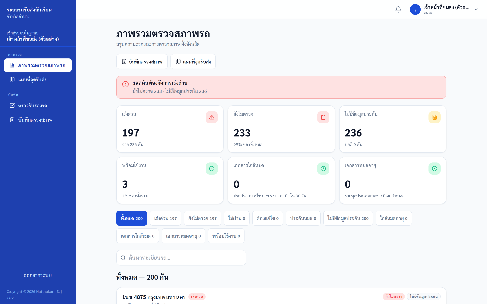
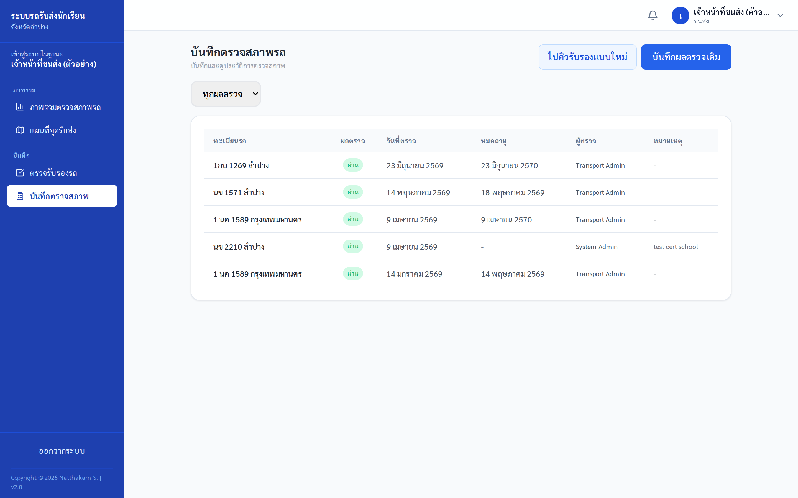
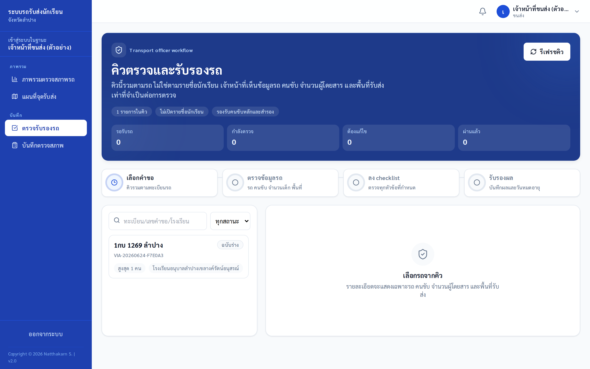
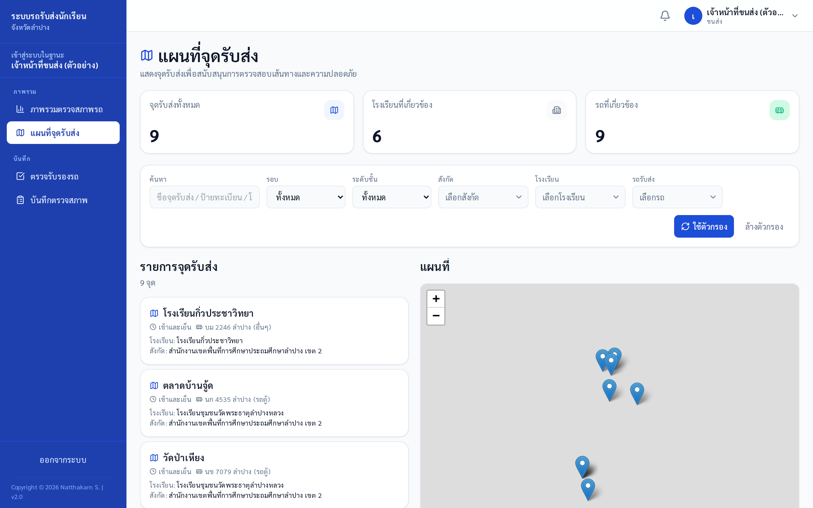

# คู่มือปฏิบัติงาน — เจ้าหน้าที่ขนส่ง

> ระบบรถรับส่งนักเรียนจังหวัดลำปาง — https://schoolbuslampang.com
> เวอร์ชัน Phase 10.13C • อัปเดต 2026-06-24

> 📷 **หมายเหตุภาพหน้าจอ:** ข้อมูลส่วนบุคคล (ชื่อ/เบอร์) ในภาพถูกเบลอเพื่อความเป็นส่วนตัว — เมื่อใช้งานจริงจะแสดงข้อมูลตามปกติ

## ภาพรวม 30 วินาที
- **บทบาทนี้ทำอะไรได้:**
  - ดูภาพรวมตรวจสภาพรถทั้งจังหวัด (รถเสี่ยง / ยังไม่ตรวจ / ประกัน-เอกสารใกล้หมด)
  - บันทึกผลตรวจสภาพรถ (ผลสรุปครั้งเดียว: ผ่าน/ไม่ผ่าน/ต้องแก้ไข/รอตรวจ)
  - ทำงานในคิวตรวจรับรองรถแบบใหม่ — ลง checklist + รับรองใบอนุญาตคนขับ (หลัก/สำรอง)
  - ดูแผนที่จุดรับส่ง (ข้อมูลรวม ไม่มีรายชื่อนักเรียน) และรายการรถทั้งหมด (อ่านอย่างเดียว)
  - เปลี่ยนรหัสผ่านของตัวเอง
- **เข้าระบบด้วย:** ชื่อผู้ใช้ของเจ้าหน้าที่ขนส่ง (ไม่ใช่ทะเบียนรถ — ทะเบียนรถใช้เฉพาะคนขับ) admin เป็นผู้สร้างให้
- **อุปกรณ์ที่แนะนำ:** คอมพิวเตอร์ / แท็บเล็ต เป็นหลัก (ฟอร์มและตารางเยอะ) มือถือใช้ได้ผ่านเมนูลิ้นชัก (ปุ่มขีดสามขีด) แต่บทบาทนี้ไม่มีแถบเมนูล่างบนมือถือ
- บัญชีนี้ดูข้อมูลรถได้ทั้งจังหวัด ไม่ผูกกับโรงเรียน/เขตใด และ **ไม่เห็นรายชื่อ/รหัส/ผู้ปกครองนักเรียน** ตามนโยบาย PDPA (เห็นได้แค่ตัวเลขจำนวนผู้โดยสารแบบรวม)

## สารบัญงาน
| # | งาน | ใช้เมื่อ |
|---|-----|---------|
| 1 | เข้าสู่ระบบ | ทุกครั้งที่เริ่มใช้งาน |
| 2 | เปลี่ยนรหัสผ่านครั้งแรก (บังคับ) | ครั้งแรกที่ใช้รหัสตั้งต้น |
| 3 | ดูภาพรวมตรวจสภาพรถ (หน้าหลัก) | เริ่มงานประจำวัน จับรถที่ต้องตรวจ |
| 4 | บันทึกผลตรวจสภาพรถ (ฟอร์มเดิม) | บันทึกผลตรวจแบบผลสรุปครั้งเดียว |
| 5 | ตรวจรับรองรถ (คิว checklist แบบใหม่) | รับรองรถ-คนขับจากคำขอของโรงเรียน |
| 6 | ดูแผนที่จุดรับส่ง | ตรวจสอบเส้นทาง/จุดรับส่งแบบรวม |
| 7 | ดูรายการรถทั้งหมด | ดูสถานะรถทั้งจังหวัดแบบอ่านอย่างเดียว |
| 8 | รายงาน/ส่งออก | (บทบาทนี้ไม่มีสิทธิ์ — ดูในงาน) |
| 9 | ออกจากระบบ | เลิกใช้งาน |

---

## งานที่ 1 — เข้าสู่ระบบ
**ใช้เมื่อ:** เริ่มใช้งานระบบทุกครั้ง

**ขั้นตอน:**
1. เปิดเบราว์เซอร์ไปที่ **https://schoolbuslampang.com**
2. กรอก **ชื่อผู้ใช้ของเจ้าหน้าที่ขนส่ง** ที่ช่อง **"ชื่อผู้ใช้ / ทะเบียนรถ"** (ไม่ใช่ทะเบียนรถ)
3. กรอก **รหัสผ่าน**
4. กด **เข้าสู่ระบบ**

*ภาพ: หน้าเข้าสู่ระบบ (เดสก์ท็อป)*

*ภาพ: หน้าเข้าสู่ระบบ (มือถือ)*

**รหัสผ่านตั้งต้น:**
- บัญชีที่ admin สร้างให้ผ่าน "จัดการผู้ใช้งาน" → admin กำหนดรหัสเริ่มต้นและแจ้งให้ทราบ
- บัญชีที่นำเข้าจากระบบเดิม (migrate) ถ้าไม่ได้ระบุรหัส → รหัสตั้งต้นคือ **`1234`**
- รหัสตั้งต้นใช้ได้ครั้งแรกเท่านั้น จากนั้นถูกบังคับให้เปลี่ยน (ดูงานที่ 2)

**✅ ผลลัพธ์ที่ถูกต้อง:** เข้าหน้าภาพรวมตรวจสภาพรถได้ (หรือถูกพาไปเปลี่ยนรหัสถ้ายังใช้รหัสตั้งต้น)

**⚠️ ถ้าติดปัญหา:**
- "ชื่อผู้ใช้หรือรหัสผ่านไม่ถูกต้อง" → ชื่อผู้ใช้หรือรหัสผ่านผิด
- "บัญชีนี้ถูกปิดการใช้งาน / กรุณาติดต่อผู้ดูแลระบบ" → บัญชีถูกระงับ ติดต่อ admin
- "มีการพยายามเข้าสู่ระบบหลายครั้งจากเครือข่ายนี้…" → พยายามถี่เกินไป รอประมาณ 15 นาที
- "ไม่สามารถเชื่อมต่อระบบได้" → อินเทอร์เน็ต/เซิร์ฟเวอร์มีปัญหา
- ไม่ทราบชื่อผู้ใช้ → ติดต่อ admin
- **ลืมรหัสผ่าน:** ไม่มีปุ่ม "ลืมรหัสผ่าน" และตั้งรหัสใหม่เองไม่ได้ → ติดต่อ admin ให้รีเซ็ต จากนั้นต้องเปลี่ยนรหัสใหม่อีกครั้งตอนเข้าสู่ระบบ

---

## งานที่ 2 — เปลี่ยนรหัสผ่านครั้งแรก (บังคับ)
**ใช้เมื่อ:** เข้าสู่ระบบครั้งแรกด้วยรหัสตั้งต้น ระบบขึ้น "กรุณาเปลี่ยนรหัสผ่านเริ่มต้น"

**ขั้นตอน:**
1. ระบบพาไปหน้า **เปลี่ยนรหัสผ่าน** อัตโนมัติ (ใช้เมนูอื่นไม่ได้จนกว่าจะเปลี่ยนสำเร็จ)
2. ตั้ง **รหัสผ่านใหม่**
3. กรอก **ยืนยันรหัสผ่าน** ให้ตรงกัน
4. บันทึก → เปลี่ยนรหัสผ่านสำเร็จ

*ภาพ: หน้าเปลี่ยนรหัสผ่าน (บังคับเปลี่ยนครั้งแรก)*

**✅ ผลลัพธ์ที่ถูกต้อง:** เปลี่ยนรหัสสำเร็จ และใช้งานเมนูอื่นได้ตามปกติ

**⚠️ ถ้าติดปัญหา:**
- หลังเปลี่ยนรหัส อาจขึ้น "เซสชันหมดอายุจากการเปลี่ยนรหัสผ่าน กรุณาเข้าสู่ระบบใหม่" → เข้าสู่ระบบใหม่ด้วยรหัสใหม่ (token เก่าใช้ไม่ได้แล้ว)
- เปิดหน้าภาพรวม/หน้าตรวจรถแล้วถูกเด้งกลับ → ยังเปลี่ยนรหัสไม่สำเร็จ ทำให้เสร็จก่อน (ระบบยอมให้เฉพาะหน้าเปลี่ยนรหัสและออกจากระบบ)

---

## งานที่ 3 — ดูภาพรวมตรวจสภาพรถ (หน้าหลัก)
**ใช้เมื่อ:** เริ่มงานประจำวัน เพื่อจับรถที่ต้องตรวจ/ต้องจัดการเร่งด่วน (เมนู **"ภาพรวมตรวจสภาพรถ"**)

**สิ่งที่เห็นบนหน้าจอ:**
- **ปุ่มลัด 2 ปุ่ม** ใต้หัวข้อ: **"บันทึกตรวจสภาพ"** และ **"แผนที่จุดรับส่ง"**
- **แบนเนอร์สรุป (Hero)** เปลี่ยนสีตามความเสี่ยง: แดง = "X คัน ต้องจัดการเร่งด่วน" / น้ำเงิน = "ยังไม่มีรถในระบบ" / เขียว = "รถทุกคันพร้อมใช้งาน"
- **การ์ด KPI 6 ใบ:** เร่งด่วน / ยังไม่ตรวจ / ไม่มีข้อมูลประกัน / พร้อมใช้งาน / **เอกสารใกล้หมด** (กดได้ → กรอง) / **เอกสารหมดอายุ** (กดได้ → กรอง)
- **ปุ่มกรองด่วน 11 ปุ่ม** (มีตัวเลขนับแต่ละปุ่ม): ทั้งหมด / เร่งด่วน / ยังไม่ตรวจ / ไม่ผ่าน / ต้องแก้ไข / ประกันหมด / ไม่มีข้อมูลประกัน / ใกล้หมดอายุ / เอกสารใกล้หมด / เอกสารหมดอายุ / พร้อมใช้งาน
- **ช่องค้นหาทะเบียนรถ**
- **รายการรถเรียงตามความเสี่ยง** (สูงสุด 20 คัน): ทะเบียน, ป้ายความสำคัญ, ชื่อคนขับ, ป้ายสถานะ, วันตรวจ/วันประกัน, **ป้าย SLA** (เหลือ X วัน / เกิน SLA X วัน — SLA ตั้งไว้ 7 วัน), คำแนะนำ, ปุ่ม **"บันทึกตรวจ"** และ **"โทรคนขับ"**
- **กราฟ 2 ใบ:** วงกลม (donut) "ผลตรวจสภาพรถ" และแท่ง (bar) "สถานะประกันภัย"

*ภาพ: ภาพรวมการตรวจสภาพรถ*

**ขั้นตอน:**
1. เปิดเมนู **"ภาพรวมตรวจสภาพรถ"**
2. ดูแบนเนอร์และการ์ด KPI เพื่อจับรถที่เสี่ยง/ต้องตรวจ
3. กดปุ่มกรองด่วน หรือพิมพ์ค้นหาทะเบียนรถ เพื่อกรองรายการ
4. ที่แถวรถที่ต้องการ กด **"บันทึกตรวจ"** เพื่อไปฟอร์มบันทึกผลตรวจ (ระบบเลือกรถคันนั้นให้อัตโนมัติ) หรือกด **"โทรคนขับ"** (ถ้ามีเบอร์)

**✅ ผลลัพธ์ที่ถูกต้อง:** เห็นรายการรถเรียงตามความเสี่ยง และกดไปบันทึกผลตรวจรถที่ต้องการได้

**หมายเหตุสำคัญ:**
- "เอกสาร" หมายรวม 4 อย่าง: **ประกัน · ทะเบียน · พ.ร.บ. · ภาษี** — "เอกสารใกล้หมด/หมดอายุ" คิดในกรอบ 30 วัน
- การ์ด **"พร้อมใช้งาน"** บน KPI นับเฉพาะรถที่ผลตรวจล่าสุดเป็น "ผ่าน" ส่วนป้ายความเสี่ยงในรายการใช้เกณฑ์รวม (ผลตรวจ + ประกัน) จึงอาจเป็นคนละตัวเลข ไม่ใช่ข้อผิดพลาด
- dashboard นับเฉพาะรถที่ยังไม่ถูกลบ และ **ไม่แสดงข้อมูลนักเรียนใด ๆ** (ตัด roster ออกตาม PDPA)
- 💡 เมื่อบันทึกผลตรวจเสร็จแล้วกลับมาหน้านี้ ระบบจะเลื่อนไปไฮไลต์รถคันนั้น พร้อมแถบเขียว "บันทึกผลตรวจของรถ X เรียบร้อยแล้ว"

---

## งานที่ 4 — บันทึกผลตรวจสภาพรถ (ฟอร์มเดิม)
**ใช้เมื่อ:** บันทึกผลตรวจแบบ "ผลสรุปครั้งเดียว" (ระบบเดิม ไม่ใช่ checklist) และดูประวัติการตรวจ (เมนู **"บันทึกตรวจสภาพ"**)

**ปุ่มมุมขวาบน:**
- **"ไปคิวรับรองแบบใหม่"** → ไปหน้าคิวตรวจรับรอง (งานที่ 5)
- **"บันทึกผลตรวจเดิม"** → เปิดฟอร์ม (เปิดแล้วปุ่มเปลี่ยนเป็น **"ปิดฟอร์ม"**)

**ฟิลด์ในฟอร์ม (ช่องมี \* = บังคับ):**
- **เลือกรถ \*** — ค้นหาทะเบียนได้; มีตัวเลือก **"อื่นๆ (เพิ่มทะเบียนรถใหม่)"** → กรอกแบบมีโครงสร้าง (เลขนำหน้า / หมวดอักษร / หมายเลข / จังหวัด)
- **ผลตรวจ \*** — ผ่าน / ไม่ผ่าน / ต้องแก้ไข / รอตรวจ
- **วันที่ตรวจ \*** — ค่าเริ่มต้นเป็นวันนี้ (รูปแบบ ปี-เดือน-วัน)
- **วันหมดอายุผลตรวจ** (ไม่บังคับ)
- **โรงเรียนที่ออกใบรับรอง** — ค้นหาได้; มี "อื่นๆ (ระบุเอง)"
- **หมายเหตุ**

ส่วนล่างคือ **ประวัติการตรวจ** (กรองตามผลตรวจได้) แสดงเป็นตาราง (จอใหญ่) หรือการ์ด (มือถือ): ทะเบียน, ผลตรวจ, วันที่ตรวจ, วันหมดอายุ, ผู้ตรวจ, หมายเหตุ — หน้าละ 20 รายการ

*ภาพ: บันทึกตรวจสภาพ*

**ขั้นตอน:**
1. เปิดเมนู **"บันทึกตรวจสภาพ"** แล้วกด **"บันทึกผลตรวจเดิม"** เพื่อเปิดฟอร์ม (ถ้าเข้ามาจากปุ่ม "บันทึกตรวจ" ในหน้าภาพรวม ฟอร์มจะเปิดให้อัตโนมัติ พร้อมแถบ "กำลังบันทึกผลตรวจสำหรับรถ: <ทะเบียน>")
2. เลือก **รถ**, เลือก **ผลตรวจ**, ตรวจสอบ **วันที่ตรวจ**
3. (ถ้าผลเป็น "ผ่าน") ใส่ **วันหมดอายุผลตรวจ** ด้วย — ไม่บังคับ แต่ถ้าไม่ใส่ รถจะยังไม่ถูกนับว่า "พร้อมใช้งาน"
4. กด **"บันทึกผลตรวจ"** → ระบบแจ้ง "บันทึกผลตรวจสำเร็จ" (ถ้ามาจากหน้าภาพรวม ระบบจะพากลับไปไฮไลต์รถคันนั้น)

**✅ ผลลัพธ์ที่ถูกต้อง:** ขึ้น "บันทึกผลตรวจสำเร็จ" และผลปรากฏในประวัติการตรวจ

**⚠️ ถ้าติดปัญหา:**
- ฟอร์มเดิมบังคับเฉพาะ **รถ**, **วันที่ตรวจ**, **ผลตรวจ** (วันหมดอายุไม่บังคับแม้ผลเป็น "ผ่าน") — วันที่ต้องเป็นรูปแบบ ปี-เดือน-วัน
- เพิ่มรถใหม่แล้วขึ้น "รถ X มีในระบบแล้ว — ใช้ข้อมูลเดิม" → เป็นพฤติกรรมตั้งใจ ระบบจับทะเบียนซ้ำแม้เขียนเว้นวรรค/ขีด/ชื่อจังหวัดต่างกัน แล้วใช้รถเดิมให้บันทึกต่อได้
- กรอกทะเบียนใหม่ไม่ผ่าน → หมวดอักษรต้องเป็นอักษรไทย 2 ตัว, หมายเลข 1-4 หลัก, เลขนำหน้าเป็นตัวเลขตัวเดียว และต้องเลือกจังหวัด
- ประวัติการตรวจเป็น **อ่านอย่างเดียว** หน้านี้ไม่มีปุ่มแก้ไขในตัว (แก้ไขผลตรวจได้เฉพาะของตัวเอง — ดูตารางขอบเขตสิทธิ์)

---

## งานที่ 5 — ตรวจรับรองรถ (คิว checklist แบบใหม่)
**ใช้เมื่อ:** รับรองรถรับส่งร่วม (shared-vehicle) จากคำขอที่โรงเรียนเปิดเข้ามา — ลง checklist รับรองรถ + รับรองใบอนุญาตคนขับ (เมนู **"ตรวจรับรองรถ"**)

หัวข้อ **"คิวตรวจและรับรองรถ"** มีปุ่ม **"รีเฟรชคิว"** และแถบขั้นตอน 4 ขั้น: เลือกคำขอ → ตรวจข้อมูลรถ → ลง checklist → รับรองผล

**หน้าจอแบ่งเป็น 3 ส่วน:**

**(1) คิวด้านซ้าย** — ช่องค้นหา (ทะเบียน / เลขคำขอ / โรงเรียน) + ตัวกรองสถานะ + ตัวเลขสรุป (รอรับรถ / กำลังตรวจ / ต้องแก้ไข / ผ่านแล้ว); แต่ละการ์ดแสดง ทะเบียน, เลขคำขอ, สถานะ, "สูงสุด X คน", ชื่อโรงเรียนผู้ออกเอกสาร. สถานะภาษาไทย: ฉบับร่าง / รอรับรถ / ยื่นแล้ว / กำลังตรวจ / ต้องแก้ไข / ผ่าน / ไม่ผ่าน / ยกเลิก

**(2) รายละเอียดรถ + จัดการคนขับ** (เปิดเมื่อเลือกคำขอ) — แสดง ทะเบียน, ประเภทรถ, ความจุที่รับรอง, ผู้โดยสารสูงสุด, **โรงเรียนและจำนวนผู้โดยสาร (เช้า/เย็น) แยกตามโรงเรียน**, **คนขับที่ได้รับอนุญาต (หลัก/สำรอง)** และ **พื้นที่รับส่ง**
- ปุ่ม **"เริ่มการตรวจครั้งใหม่"** (กดได้เมื่อสถานะเป็น รอรับรถ / ยื่นแล้ว / ต้องแก้ไข / กำลังตรวจ)
- กล่อง **"จัดการคนขับหลักและคนขับสำรอง"** มี 2 ฟอร์ม:
  - **"เพิ่มสิทธิ์ขับรถคันนี้"** — เลือกคนขับ + บทบาท (คนขับหลัก/คนขับสำรอง) + วันสิ้นสุดสิทธิ์ → ปุ่ม **"เพิ่มเข้ากลุ่มรถ"**
  - **"รับรองใบอนุญาตคนขับ"** — เลือกคนขับ + เลขใบอนุญาต + ประเภท (เช่น ท.2) + วันหมดอายุใบอนุญาต + เลขอ้างอิงขนส่ง → ปุ่ม **"บันทึกรับรองคนขับ"**

**(3) แบบตรวจ (checklist)** (แสดงหลังกด "เริ่มการตรวจครั้งใหม่") — หัวข้อ "แบบตรวจ <ชื่อ> รุ่น <version>"; แต่ละหัวข้อเลือก **ผ่าน / ไม่ผ่าน / ไม่เกี่ยวข้อง** (เลือก "ไม่เกี่ยวข้อง" ได้เฉพาะหัวข้อที่อนุญาต); หัวข้อที่เลือก "ไม่ผ่าน" ต้องกรอก **"ระบุสิ่งที่ต้องแก้ไข"**; ท้ายฟอร์มเลือกผลรวม (ผ่าน/ต้องแก้ไข/ไม่ผ่าน/รอข้อมูลเพิ่ม) + วันหมดอายุ + เลขอ้างอิงขนส่ง + หมายเหตุ → ปุ่ม **"ยืนยันและลงผลรับรอง"**

*ภาพ: ตรวจรับรองรถ (คิวใบส่งตรวจ)*

**ขั้นตอน:**
1. เลือกคำขอจากคิวด้านซ้าย
2. ตรวจรายละเอียดรถและคนขับ — ถ้าจำเป็น เพิ่มสิทธิ์คนขับ และ/หรือ รับรองใบอนุญาตคนขับ
3. กด **"เริ่มการตรวจครั้งใหม่"**
4. ลงผลให้ครบทุกหัวข้อใน checklist (หัวข้อที่ไม่ผ่าน ต้องระบุรายละเอียด)
5. เลือกผลรวม และใส่วันหมดอายุ → กด **"ยืนยันและลงผลรับรอง"**

**✅ ผลลัพธ์ที่ถูกต้อง:** ลงผลรับรองสำเร็จ และระบบคำนวณความพร้อมใช้งานของรถ (eligibility) ใหม่ ซึ่งมีผลต่อการที่คนขับจะเริ่มรอบได้หรือไม่

**⚠️ ถ้าติดปัญหา:**
- **คำขอ (application) ถูกสร้างโดยโรงเรียน ไม่ใช่ขนส่ง** — ขนส่งทำได้แค่ตรวจ/รับรองคำขอที่โรงเรียนเปิดเข้ามา ถ้าไม่เห็นคำขอ/คำขอผิด ติดต่อโรงเรียน
- กด "เริ่มการตรวจครั้งใหม่" ไม่ได้ → คำขอต้องเป็นสถานะ รอรับรถ / ยื่นแล้ว / ต้องแก้ไข / กำลังตรวจ (ฉบับร่าง/ยกเลิก/ผ่านแล้ว เริ่มไม่ได้)
- เพื่อนเริ่มตรวจไว้ แต่เราสรุปผลไม่ได้ → **เฉพาะเจ้าหน้าที่ผู้เริ่มตรวจเท่านั้นที่สรุปผล (finalize) ได้**
- จะรับรองผลรวม "ผ่าน" แต่มีหัวข้อ "ไม่ผ่าน" → ระบบปฏิเสธ "ไม่สามารถรับรองว่าผ่านเมื่อมีหัวข้อตรวจไม่ผ่าน" ให้เปลี่ยนผลรวมเป็น "ต้องแก้ไข" หรือ "ไม่ผ่าน"
- ผลรวม "ผ่าน" บันทึกไม่ได้ → ผลรวม "ผ่าน" ต้องระบุ **วันหมดอายุ** เสมอ
- ปุ่ม "ยืนยันและลงผลรับรอง" เป็นสีจาง → ต้องลงผลครบทุกหัวข้อก่อน และหัวข้อ "ไม่ผ่าน" ต้องกรอกรายละเอียด

---

## งานที่ 6 — ดูแผนที่จุดรับส่ง
**ใช้เมื่อ:** ตรวจสอบเส้นทาง/จุดรับส่งแบบรวม เพื่อสนับสนุนความปลอดภัย (เมนู **"แผนที่จุดรับส่ง"**) — เป็นข้อมูล **รวม (aggregate)** ไม่มีรายชื่อ/เบอร์/ที่อยู่นักเรียน

**สิ่งที่เห็นบนหน้าจอ:**
- การ์ดตัวเลข 3 ใบ: "จุดรับส่งทั้งหมด" / "โรงเรียนที่เกี่ยวข้อง" / "รถที่เกี่ยวข้อง"
- ตัวกรอง: ค้นหา / รอบ (เช้า/เย็น/ทั้งคู่) / ระดับชั้น / สังกัด / โรงเรียน / รถ
- ปุ่ม **"ใช้ตัวกรอง"** และ **"ล้างตัวกรอง"**

*ภาพ: แผนที่จุดรับ-ส่ง*

**ขั้นตอน:**
1. เปิดเมนู **"แผนที่จุดรับส่ง"**
2. เลือกตัวกรองที่ต้องการ
3. กด **"ใช้ตัวกรอง"**
4. คลิกหมุด (pin) บนแผนที่เพื่อดูรายละเอียดจุด

**✅ ผลลัพธ์ที่ถูกต้อง:** เห็นจุดรับส่งบนแผนที่แบบรวม (ไม่มีจำนวนนักเรียนรายจุด/รายชื่อ ตาม PDPA)

**⚠️ ถ้าติดปัญหา:** ขึ้น "ไม่มีสิทธิ์เข้าถึงข้อมูลนี้" → บัญชีไม่มีสิทธิ์เข้าถึงข้อมูลนี้

---

## งานที่ 7 — ดูรายการรถทั้งหมด
**ใช้เมื่อ:** ดูสถานะรถทั้งจังหวัดแบบ **อ่านอย่างเดียว** (หน้า `/transport/vehicles` — **ไม่มีลิงก์ในเมนูซ้าย**)

> ℹ️ เมนูซ้ายมีแค่ 4 รายการ (ภาพรวมตรวจสภาพรถ / แผนที่จุดรับส่ง / ตรวจรับรองรถ / บันทึกตรวจสภาพ) หน้ารายการรถทั้งหมดต้องเข้าผ่าน URL `/transport/vehicles` เอง หรือดูรถผ่านหน้า "ภาพรวมตรวจสภาพรถ" แทน

**สิ่งที่เห็นบนหน้าจอ:**
- ช่องค้นหาทะเบียน + ตัวเลือกสถานะ: ทุกสถานะ / ประกันใกล้หมด (30 วัน) / ประกันหมดแล้ว / เอกสารใกล้หมด (30 วัน) / เอกสารหมดอายุ
- ตารางรถ (หน้าละ 50 คัน): ทะเบียน, ประเภท, คนขับ, ผลตรวจล่าสุด (ป้ายสี ผ่าน/ไม่ผ่าน/ต้องแก้ไข/รอตรวจ/ยังไม่ตรวจ), วันตรวจ, ประกันหมดอายุ (แดงถ้าหมด), เอกสาร (รวม 4 อย่าง — แสดงวันที่ใกล้สุด พร้อมป้าย หมดอายุ/ใกล้หมด)

**ขั้นตอน:**
1. เปิด URL `/transport/vehicles`
2. พิมพ์ค้นหาทะเบียน หรือเลือกตัวกรองสถานะ
3. ดูสถานะรวมของรถแต่ละคัน

**✅ ผลลัพธ์ที่ถูกต้อง:** เห็นตารางรถทั้งจังหวัดพร้อมสถานะตรวจ/ประกัน/เอกสาร

**⚠️ ถ้าติดปัญหา:**
- ค้นหาทะเบียนรองรับการพิมพ์แบบไม่เว้นวรรค (พิมพ์ "นข4031" ก็เจอ "นข 4031")
- หน้านี้ **ไม่มีปุ่มสร้าง/แก้ไขรถ** — ถ้าต้องการบันทึกผลตรวจ ไปที่หน้า "บันทึกตรวจสภาพ" (งานที่ 4)

*ภาพ: รายการรถทั้งหมด + ตัวกรองสถานะ (อยู่บนหน้าภาพรวมตรวจสภาพรถ)*

---

## งานที่ 8 — รายงาน/ส่งออก
**ใช้เมื่อ:** ต้องการรายงานหรือส่งออกข้อมูล

> ❌ **บทบาทขนส่งไม่มีสิทธิ์เข้าถึงรายงานหรือการส่งออก (export) ใด ๆ** — ไม่มีเมนู "รายงาน" และไม่มีปุ่มดาวน์โหลด CSV/Excel/PDF ในทุกหน้าของบทบาทนี้

**ข้อเท็จจริง:**
- ระบบรายงานส่วนกลาง (`/api/reports/*`) อนุญาตเฉพาะบทบาท **โรงเรียน / เขตพื้นที่ / ส่วนกลาง / admin** — ขนส่งจะถูกปฏิเสธ
- **รายงานเชิงปฏิบัติของขนส่ง** คือ **"ประวัติการตรวจ"** ในหน้า **"บันทึกตรวจสภาพ"** (ดูบนจอ + กรองตามผลตรวจได้) เท่านั้น — ไม่มีปุ่มดาวน์โหลดเป็นไฟล์
- หากคู่มือรุ่นเก่าระบุว่าขนส่ง "ส่งออกรายงานตรวจสภาพได้" — ปัจจุบัน **ทำไม่ได้** ให้ยึดตามคู่มือฉบับนี้

> 📷 **ไม่มีภาพหน้าจอ** — บทบาทขนส่งไม่มีสิทธิ์เข้าหน้ารายงาน/ส่งออก (เป็นสิทธิ์ของโรงเรียน/เขต/จังหวัด/admin)

---

## งานที่ 9 — ออกจากระบบ
**ใช้เมื่อ:** เลิกใช้งาน

**ขั้นตอน:**
1. เปิดแถบเมนูด้านข้าง (บนมือถือกดปุ่มขีดสามขีดเพื่อเปิดเมนูลิ้นชัก)
2. กด **"ออกจากระบบ"** ที่ก้นแถบเมนู

**✅ ผลลัพธ์ที่ถูกต้อง:** กลับสู่หน้าเข้าสู่ระบบ

> ℹ️ มุมบนของแถบเมนูแสดง "ระบบรถรับส่งนักเรียน / จังหวัดลำปาง" และกล่อง "เข้าสู่ระบบในฐานะ <ชื่อผู้ใช้>"

*ภาพ: เมนูบัญชี (มุมขวาบน) — "เปลี่ยนรหัสผ่าน" / "ออกจากระบบ"*

---

## ฟีเจอร์ที่อาจยังไม่เปิดใช้งาน (Feature Flag)

ฟีเจอร์หลักของบทบาทขนส่ง (ภาพรวม, บันทึกตรวจสภาพ, คิวตรวจรับรอง, แผนที่จุดรับส่ง, รายการรถ) **เปิดใช้งานจริงทั้งหมด** ส่วนต่อไปนี้ขึ้นกับ feature flag ซึ่งปัจจุบัน **ยังไม่เปิดใช้จริง**:

- **QR ประจำรถ / QR บนหนังสือส่งตรวจ** (หน้า `/admin/vehicle-qr`)

> ⚠️ ฟีเจอร์ QR เปิดใช้เมื่อระบบเปิดใช้งาน (feature flag `FEATURE_VEHICLE_QR`) — **อาจยังไม่พร้อมในการใช้งานจริง** หากเปิดหน้านี้ขณะ flag ปิดอยู่ ระบบจะเรียกข้อมูลไม่สำเร็จ (404) ตอนนี้ยังไม่ต้องใช้ฟีเจอร์ QR (ใช้ไม่ได้/ขึ้น 404 → ติดต่อ admin เพื่อสอบถามสถานะ)

---

## ตารางขอบเขตสิทธิ์ (อ้างอิงด่วน)

บทบาทขนส่งเห็นข้อมูล **ทั้งจังหวัด** (ไม่ผูกกับโรงเรียน/เขต) แต่จำกัดเฉพาะ **ข้อมูลรถ/การตรวจ** เท่านั้น

**เห็นข้อมูลได้แค่ไหน:**

| ข้อมูล | ขอบเขต |
|---|---|
| รถทุกคันในระบบ | เห็นทั้งจังหวัด (ประเภท, เจ้าของ+เบอร์เจ้าของ, ประกัน, วันหมดอายุ ทะเบียน/พ.ร.บ./ภาษี/ประกัน, ความจุที่รับรอง, สถานะรับรอง) |
| คนขับ | เห็นชื่อ + เบอร์คนขับที่ active ของรถแต่ละคัน |
| การตรวจสภาพ | เห็นประวัติการตรวจ + ผลตรวจ + ผู้ตรวจ ทั้งหมด |
| คิวคำขอตรวจ | เห็นจำนวนผู้โดยสาร (เช้า/เย็น) แยกโรงเรียน + พื้นที่รับส่ง (แบบรวม ไม่ใช่รายคน) |
| แผนที่จุดรับส่ง | เห็นแบบรวม (ไม่มีรายชื่อ/เบอร์/ที่อยู่) |
| ข้อมูลนักเรียน | ❌ **ไม่เห็นเลย** — ไม่มีชื่อ/รหัส/จำนวนต่อรถ/ผู้ปกครอง/ประวัติเช็กชื่อรายคน |

**สิ่งที่ทำไม่ได้ (และใครทำแทน):**

| ทำไม่ได้ | ใครทำแทน |
|---|---|
| ดูข้อมูลนักเรียน (ชื่อ/รหัส/จำนวน/ผู้ปกครอง) | ไม่มีบทบาทใดให้ขนส่งเข้าถึงได้ (ตาม PDPA) |
| สร้างคำขอส่งตรวจ (application) | **โรงเรียน** (ผู้สร้าง/พิมพ์คำขอ) |
| แก้ไขผลตรวจของเจ้าหน้าที่คนอื่น | เจ้าหน้าที่ผู้บันทึกผลนั้นเอง (แก้ได้เฉพาะของตัวเอง) |
| สรุปผล (finalize) การตรวจที่คนอื่นเริ่ม | เจ้าหน้าที่ผู้เริ่มตรวจครั้งนั้นเอง |
| ดูรายงาน/ส่งออก (export) ส่วนกลาง | **โรงเรียน / เขต / ส่วนกลาง / admin** |
| จัดการผู้ใช้ / รีเซ็ตรหัสคนอื่น | **admin** |
| ดู dashboard เขต/จังหวัด/โรงเรียน, audit log บทบาทอื่น | บทบาทที่เกี่ยวข้อง (เขต/ส่วนกลาง/admin) |

> ℹ️ ถ้าพยายามเข้าหน้าของบทบาทอื่น (เช่น โรงเรียนหรือเขต) จะขึ้น "ไม่มีสิทธิ์เข้าถึง" — admin ทำงานของขนส่งแทนได้ทุกอย่าง

**ขอความช่วยเหลือเมื่อแก้เองไม่ได้:** ลืมรหัส/บัญชีถูกปิด/เปลี่ยนชื่อผู้ใช้ → admin · ไม่เห็นคำขอในคิว/คำขอผิด → โรงเรียนผู้สร้างคำขอ · แก้ผลตรวจของคนอื่น → ให้ผู้บันทึกผลนั้นแก้ หรือ admin · QR ใช้ไม่ได้/404 → admin
เวลาแจ้งปัญหาให้ส่ง: ชื่อผู้ใช้, ทะเบียนรถ/เลขคำขอที่เกี่ยวข้อง, เวลาที่เกิดปัญหา, ภาพหน้าจอพร้อมข้อความผิดพลาด

---

## สรุปปัญหาที่พบบ่อย

| อาการ | วิธีแก้ |
|---|---|
| เปิดหน้าไหนก็โดนเด้งไปหน้าเปลี่ยนรหัสผ่าน / ใช้เมนูไม่ได้ | บัญชียังใช้รหัสตั้งต้น — ตั้งรหัสใหม่ที่หน้า "เปลี่ยนรหัสผ่าน" ให้สำเร็จก่อน จึงใช้เมนูอื่นได้ |
| ลืมรหัสผ่าน | ไม่มีปุ่ม "ลืมรหัสผ่าน" และตั้งเองไม่ได้ — ติดต่อ admin ให้รีเซ็ต จากนั้นเปลี่ยนรหัสใหม่ตอนเข้าสู่ระบบ |
| หาเมนู "รถทั้งหมด" ไม่เจอ | เมนูซ้ายมีแค่ 4 รายการ — เข้าหน้ารายการรถผ่าน URL `/transport/vehicles` หรือดูผ่าน "ภาพรวมตรวจสภาพรถ" |
| เพิ่มรถใหม่แล้วขึ้น "รถคันนี้มีในระบบแล้ว" | พฤติกรรมตั้งใจ ระบบจับทะเบียนซ้ำแม้เขียนเว้นวรรค/ขีด/จังหวัดต่างกัน และใช้รถเดิมให้บันทึกผลตรวจต่อได้ |
| กรอกทะเบียนรถใหม่ไม่ผ่าน | หมวดอักษรอักษรไทย 2 ตัว, หมายเลข 1-4 หลัก, เลขนำหน้าเป็นตัวเลขตัวเดียว, ต้องเลือกจังหวัด |
| เลือกผล "ผ่าน" ในคิวรับรองแบบใหม่ แล้วบันทึกไม่ได้ | คิวรับรองแบบใหม่ ถ้าผลรวม "ผ่าน" ต้องระบุวันหมดอายุเสมอ (ฟอร์มเดิมไม่บังคับ แต่แนะนำให้ใส่ทุกครั้ง) |
| กด "ยืนยันและลงผลรับรอง" ไม่ได้ / ปุ่มสีจาง | ลงผลครบทุกหัวข้อก่อน และหัวข้อ "ไม่ผ่าน" ต้องกรอกรายละเอียด |
| จะรับรอง "ผ่าน" แต่มีบางหัวข้อไม่ผ่าน | ทำไม่ได้ ระบบปฏิเสธ — เปลี่ยนผลรวมเป็น "ต้องแก้ไข" หรือ "ไม่ผ่าน" |
| เพื่อนเริ่มตรวจไว้ แต่เราสรุปผลไม่ได้ | เฉพาะผู้เริ่มตรวจครั้งนั้นเท่านั้นที่สรุปผลได้ — ให้ผู้เริ่มตรวจเป็นผู้สรุปเอง |
| กด "เริ่มการตรวจครั้งใหม่" ไม่ได้ | คำขอต้องเป็นสถานะ รอรับรถ / ยื่นแล้ว / ต้องแก้ไข / กำลังตรวจ (ฉบับร่าง/ยกเลิก/ผ่านแล้ว เริ่มไม่ได้) |
| ไม่เห็นรายชื่อนักเรียนในรถ | นโยบาย PDPA โดยเจตนา — ขนส่งเห็นได้แค่ตัวเลขผู้โดยสารแบบรวม (สูงสุด + เช้า/เย็นแยกโรงเรียน) ไม่มีรายชื่อรายคน |
| รถผ่านตรวจแล้วยังขึ้น "ยังไม่พร้อม" / คนขับเริ่มรอบไม่ได้ | eligibility คิดรวม: ผลตรวจล่าสุดผ่านและยังไม่หมดอายุ + เอกสารบังคับ 4 อย่างยังมีผล + ความจุ ≥ ผู้โดยสารสูงสุด + มีคนขับที่รับรองใบอนุญาตแล้วอย่างน้อย 1 คน — ถ้าขาด ให้รับรองใบอนุญาตคนขับ/อัปเดตเอกสารก่อน |

---

**สิ้นสุดคู่มือปฏิบัติงานสำหรับเจ้าหน้าที่ขนส่ง — ตรวจรถให้พร้อม เพื่อความปลอดภัยของนักเรียนทุกคน**
